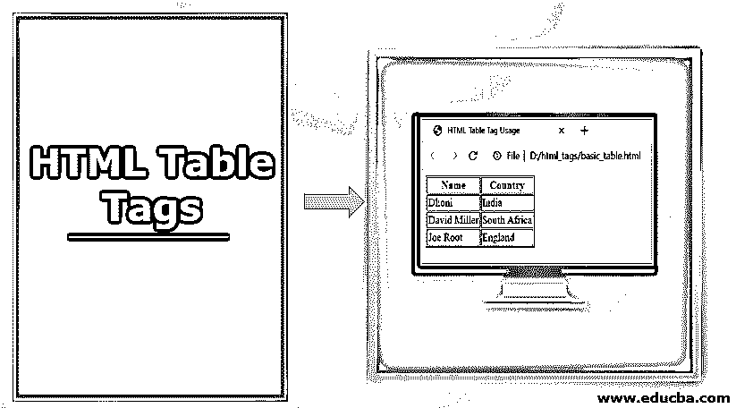
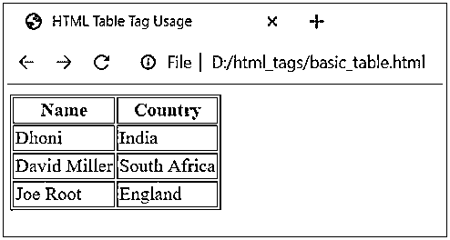
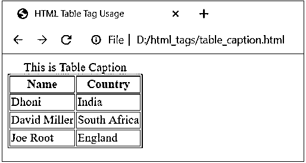
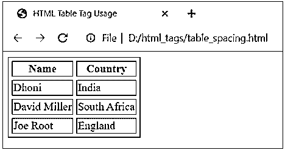
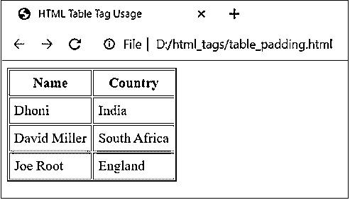
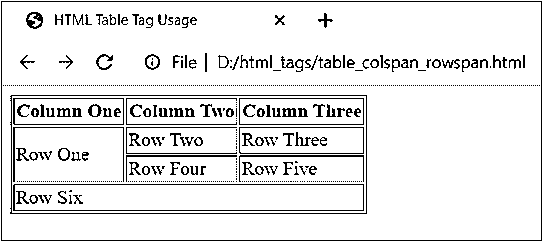
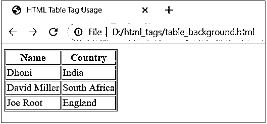
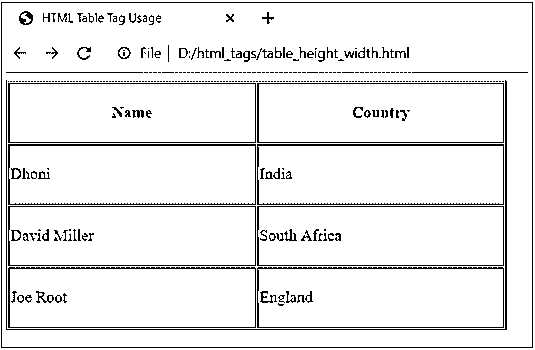
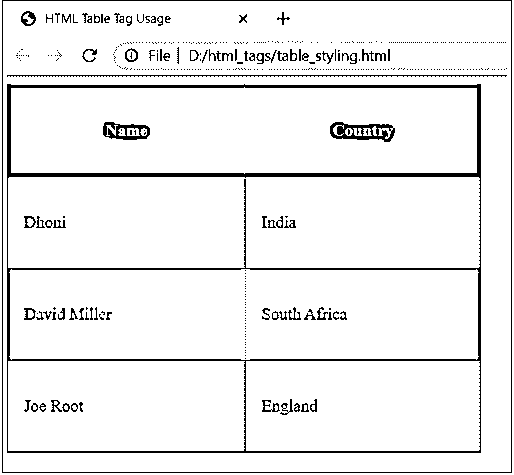
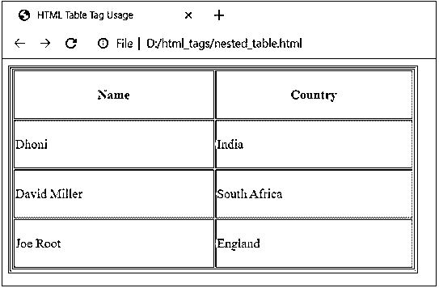

# HTML 表格标签

> 原文：<https://www.educba.com/html-table-tags/>




## Html 表格标签简介

HTML 表格提供了一种导出或定义文本、图像、链接等数据的方式。就单元格的行和列而言。HTML 表格可以通过使用标签来创建。默认情况下，表格数据左对齐。在这个主题中，我们将学习 HTML 表格标签。

可以使用、and标签创建表格。

<small>网页开发、编程语言、软件测试&其他</small>

*   标签定义了表格的标题。
*   标签指定了用于生成列的表格数据单元格。
*   标签指定了用来生成一行的表格行。

表格数据可以在具有大量表格元素的表格的内容内构建。

**语法**

```
<table>
<tr>
<th>Table Heading 1</th>
<th>Table Heading 2</th>
</tr>
<tr>
<td>Data Cell 1</td>
<td>Data Cell 2</td>
</tr>
<tr>
<td>Data Cell 3</td>
<td>Data Cell 4</td>
</tr>
</table>
```

### HTML 表格标签的例子

下面是 HTML 表格标签的例子

#### 1.基本表格用法

```
<!DOCTYPE html>
<html>
<head>
<title>HTML Table Tag Usage</title>
</head>
<body>
<table border = "1">
<tr>
<th>Name</th>
<th>Country</th>
</tr>
<tr>
<td>Dhoni</td>
<td>India</td>
</tr>
<tr>
<td>David Miller</td>
<td>South Africa</td>
</tr>
<tr>
<td>Joe Root</td>
<td>England</td>
</tr>
</table>
</body> Save the code with a .html extension and open it in the browser. It will display the following output: 
```

#### 2.表格标题

表格的标题可以通过使用 **<** 标题 **>** 标签来指定。**举例**

```
<!DOCTYPE html>
<html>
<head>
<title>HTML Table Tag Usage</title>
</head>
<body>
<table border = "1">
<caption>This is Table Caption</caption>
<tr>
<th>Name</th>
<th>Country</th>
</tr>
<tr>
<td>Dhoni</td>
<td>India</td>
</tr>
<tr>
<td>David Miller</td>
<td>South Africa</td>
</tr>
<tr>
<td>Joe Root</td>
<td>England</td>
</tr>
</table>
</body>
```

上述代码将显示以下输出:




#### 3.表格单元格间距

表格单元格的间距可以通过使用 cellspacing 属性来定义。cellspacing 属性指定表格单元格之间的间距。

**例子**

```
<!DOCTYPE html>
<html>
<head>
<title>HTML Table Tag Usage</title>
</head>
<body>
<table border = "1" cellspacing = "5">
<tr>
<th>Name</th>
<th>Country</th>
</tr>
<tr>
<td>Dhoni</td>
<td>India</td>
</tr>
<tr>
<td>David Miller</td>
<td>South Africa</td>
</tr>
<tr>
<td>Joe Root</td>
<td>England</td>
</tr>
</table>
</body>
```

上述代码将显示以下输出:




#### 4.表格单元格填充

表格单元格的填充可以通过使用 cellpadding 属性来定义。表格单元格边框和数据之间的 cellpadding 属性距离。

**例子**

```
<!DOCTYPE html>
<html>
<head>
<title>HTML Table Tag Usage</title>
</head>
<body>
<table border = "1" cellpadding = "5">
<tr>
<th>Name</th>
<th>Country</th>
</tr>
<tr>
<td>Dhoni</td>
<td>India</td>
</tr>
<tr>
<td>David Miller</td>
<td>South Africa</td>
</tr>
<tr>
<td>Joe Root</td>
<td>England</td>
</tr>
</table>
</body>
```

上述代码将显示以下输出:




#### 5.列和行跨度属性

使用 rowspan 属性可以将两个或多个表行合并成一行，使用 colspan 属性可以将表列合并成一列。

**例子**

```
<!DOCTYPE html>
<html>
<head>
<title>HTML Table Tag Usage</title>
</head>
<body>
<table border = "1">
<tr>
<th>Column One</th>
<th>Column Two</th>
<th>Column Three</th>
</tr>
<tr>
<td rowspan = "2">Row One</td>
<td>Row Two</td>
<td>Row Three</td>
</tr>
<tr>
<td>Row Four</td>
<td>Row Five</td>
</tr>
<tr>
<td colspan = "3">Row Six</td>
</tr>
</table>
</body>
```

代码将显示以下输出:




#### 6.表格的背景

可以使用 bgcolor 属性创建表格的背景。表格单元格边框可以通过使用边框颜色属性来指定。

**例子**

```
<!DOCTYPE html>
<html>
<head>
<title>HTML Table Tag Usage</title>
</head>
<body>
<table border = "1" bordercolor = "red" bgcolor = "lightblue">
<tr>
<th>Name</th>
<th>Country</th>
</tr>
<tr>
<td>Dhoni</td>
<td>India</td>
</tr>
<tr>
<td>David Miller</td>
<td>South Africa</td>
</tr>
<tr>
<td>Joe Root</td>
<td>England</td>
</tr>
</table>
</body>
```

执行上面的代码，它将显示下面的输出:




#### 7.桌子的高度和宽度

可以使用 width 和 height 属性设置表格的高度和宽度。

**例子**

```
<!DOCTYPE html>
<html>
<head>
<title>HTML Table Tag Usage</title>
</head>
<body>
<table border = "1" width = "500" height = "250" bgcolor = "lightblue">
<tr>
<th>Name</th>
<th>Country</th>
</tr>
<tr>
<td>Dhoni</td>
<td>India</td>
</tr>
<tr>
<td>David Miller</td>
<td>South Africa</td>
</tr>
<tr>
<td>Joe Root</td>
<td>England</td>
</tr>
</table>
</body>
```

上述代码将显示以下输出:




#### 8.样式化表格单元格

**例子**

```
<!DOCTYPE html>
<html>
<head>
<title>HTML Table Tag Usage</title>
</head>
<style>
table, th, td {
border: 1px solid red;
border-collapse: collapse;
}
th, td {
padding: 15px;
}
table#mytable tr:nth-child(even) {
background-color: #FAD7A0;
}
table#mytable tr:nth-child(odd) {
background-color: #E67E22;
}
table#mytable th {
color: white;
background-color: teal;
}
</style>
<body>
<table id="mytable" border = "1" width = "450" height = "350">
<tr>
<th>Name</th>
<th>Country</th>
</tr>
<tr>
<td>Dhoni</td>
<td>India</td>
</tr>
<tr>
<td>David Miller</td>
<td>South Africa</td>
</tr>
<tr>
<td>Joe Root</td>
<td>England</td>
</tr>
</table>
</body>
```

执行上面的代码；您将得到以下输出:




#### 8.嵌套表格

你可以在另一个[表中使用一个表，这个表叫做嵌套表](https://www.educba.com/nested-table-in-html/)。

让我们考虑下面嵌套表的例子:

**例子**

```
<!DOCTYPE html>
<html>
<head>
<title>HTML Table Tag Usage</title>
</head>
<body>
<table border = "1" width = "500" height = "250">
<tr>
<td>
<table border = "1" width = "500" height = "250" bgcolor = "lightblue">
<tr>
<th>Name</th>
<th>Country</th>
</tr>
<tr>
<td>Dhoni</td>
<td>India</td>
</tr>
<tr>
<td>David Miller</td>
<td>South Africa</td>
</tr>
<tr>
<td>Joe Root</td>
<td>England</td>
</tr>
</table>
</td>
</tr>
</table>
</body>
```

上述代码将显示以下输出:




### 表格的属性

*   **align:** 这个属性提供了元素内部内容的对齐方式。
*   **bgcolor:** 这个属性指定了表格的背景颜色。
*   **边框:**该属性指定了表格单元格的[边框。](https://www.educba.com/table-without-border-in-html/)
*   **cellpadding:** 该属性显示表格单元格和表格内容之间的填充。
*   **单元格间距:**该属性显示表格单元格之间的间距。
*   **frame:** 指定外部边框的哪些部分可见。
*   **规则:**这指定了内部边框的哪些部分是可见的。
*   **可排序:**该属性通知表格是可排序的。
*   **summary:** 提供呈现什么类型的表格内容。
*   **width:** 这个属性告诉你表格的宽度。
*   **height:** 这个属性指定了表格的高度。

### 结论

到目前为止，我们已经研究了 HTML 中不同类型的表格标签。这些示例展示了表格样式的用法，在另一个表格中嵌套一个表格，设置表格的高度和宽度，为表格单元格添加间距和填充，为表格应用背景色等等。

### 推荐文章

这是一个 HTML 表格标签的指南。这里我们讨论 HTML 表格标签的例子以及表格的语法和属性。您也可以看看以下文章，了解更多信息–

1.  [什么是 HTML](https://www.educba.com/what-is-html/)
2.  [HTML 框架](https://www.educba.com/html-frames/)
3.  [HTML 块](https://www.educba.com/html-blocks/)
4.  [HTML 中的表格边框](https://www.educba.com/table-border-in-html/)


