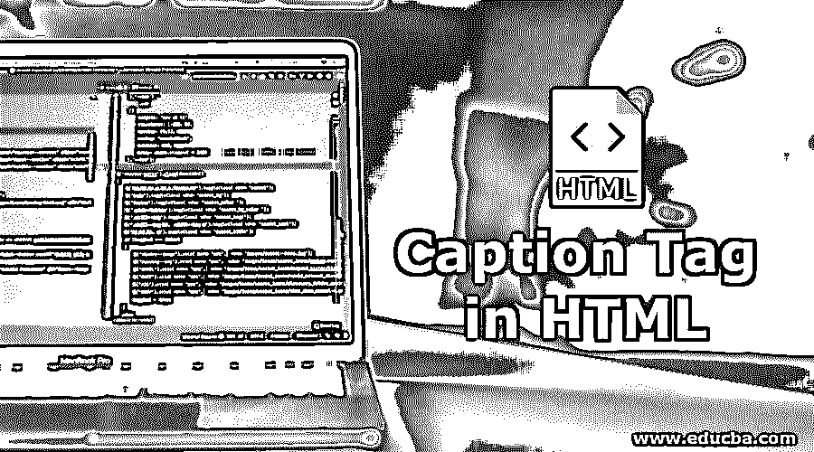
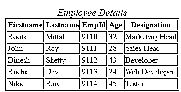
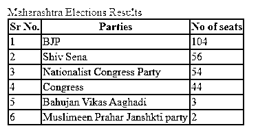
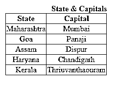

# HTML 中的标题标签

> 原文：<https://www.educba.com/caption-tag-in-html/>




## HTML 中标题标签的介绍

HTML 中的标题标记用于表格。它用于表示表格的标题。标签正好用在标签之后。一次只能使用一个标题标签。在 CSS 的帮助下，人们可以用响应式网页设计格式的表格来适应

<caption>。</caption>

表体中使用了标签。它被用作标签之后的第一个标签。

是不同标签的组合，就像用于创建表格行，

|  |
| 。 among | Labels are important when creating tables, and are used to create headers. |
| Used to create table columns. |

<small>网页开发、编程语言、软件测试&其他</small>

**语法:**

*   让我们看看在 HTML 代码中定义标题标签的实际语法:

```
<caption>title text</caption>
```

*   如上图所示，代码标签包含在标签中。它将为您的表提供标题。之后，整个表格数据将显示在该标题下。

### HTML 中的标题标签列表

*   :给表格加标题
*   :

    <caption>标签用标签括起来</caption> 

*   :创建表头、列和行
*   :设置字幕对齐。

### 为什么我们在 HTML 中使用标题标签？

*   每当我们要使用表格将一些数据定义成表格格式时。
*   因此，在一个有独特标题的表格中显示这些数据是用户的主要座右铭。这种标题是借助 HTML 中的标签显示的。
*   这包含在的开始和结束标签之间，它位于标签之后。一个表的表体中必须有一个标题标签。

### HTML 中标题标签的使用

如前所述，我们讨论了标题标签与表格标签一起使用。它与不同的属性一起使用，如公共属性、全局属性和事件属性。

现在我们将看到这些属性是如何帮助标题标签工作的:

**1。Align** :这个属性与一些值一起使用，用于将标题与表的引用对齐。其中包含的值有:左、右、上、下。

**2。全局属性**:HTML 中的全局属性由<标题>标签支持。

*   **accesskey:** 该元素用作激活或聚焦某些特定元素的快捷方式。
*   **dir:** 用于给元素内容中的文本适当的方向。
*   **class:**class name 用于将 CSS 定义到 HTML 中的特定元素。人们可以为一个特定的元素使用一个或两个类名，并赋予它们 CSS 属性。
*   **contenteditable:** 该属性用于定义一个给定的内容元素是否可以编辑。
*   **可拖动:**用于定义给定元素是否可被用户拖动。
*   **dropzone:** 该属性与 draggable 属性相关。当它被放到一个特定的位置时，它被用来复制或移动元素。
*   **id:** id to 元素用于定义特定元素的唯一标识名。
*   **lang:**<caption>标签中的这个属性用来定义内容所用的语言。语法拼写或
*   **拼写检查:**该属性声明对元素进行拼写和语法检查。
*   **style:** 这是在标题标签中使用的一个非常重要的属性，用于向元素提供内联 CSS 属性。
*   **translate:** 给出元素细节的最重要的属性，比如它是否可以被翻译。

**3。事件属性:** HTML < caption >标签也处理各种事件属性，如下所示:

*   **onafterprint:** 单据打印成功后，成功触发此事件。
*   **onbeforeprint:** 这种脚本在实际打印文档之前执行。
*   **onbeforeunload:** 当我们的文档将要被卸载时，这个脚本被执行。
*   **onerror:** 该事件属性在文档发生错误时执行。
*   **onload:** 这个脚本在页面的实际加载完成时生成。
*   **onmessage** :每当一个消息被触发，这个事件就发生。

### HTML 中标题标签的例子

下面是一些例子:

#### 示例#1

下面是一个例子，展示了如何在 HTML 中使用标签:

**代码:**

```
<head>
<style>
table,
th,
td {
border: 1px solid blue;
}
#emp_details {
font-size:20px;
color:crimson;
font-style:italic;
}
</style>
</head>
<body>
<table>
<caption id="emp_details">Employee Details</caption>
<tr>
<th>Firstname</th>
<th>Lastname</th>
<th>EmpId</th>
<th>Age</th>
<th>Designation</th>
</tr>
<tr>
<td>Roota</td>
<td>Mittal</td>
<td>9110</td>
<td>32</td>
<td>Marketing Head</td>
</tr>
<tr>
<td>John</td>
<td>Roy</td>
<td>9111</td>
<td>28</td>
<td>Sales Head</td>
</tr>
<tr>
<td>Dinesh</td>
<td>Shetty</td>
<td>9112</td>
<td>43</td>
<td>Developer</td>
</tr>
<tr>
<td>Rucha</td>
<td>Dev</td>
<td>9113</td>
<td>24</td>
<td>Web Developer</td>
</tr>
<tr>
<td>Niks</td>
<td>Raw</td>
<td>9114</td>
<td>45</td>
<td>Tester</td>
</tr>
</table>
</body>
```

**输出:**




#### 实施例 2

下面是另一个例子，展示了如何将标签与内联 CSS 的 align 属性一起使用，将标题向左对齐:

**代码:**

```
<head>
<style>
table, th, td {
border: 2px solid red;
border-collapse: collapse;
}
</style>
</head>
<body>
<table>
<caption style="text-align: left; color:dodgerblue;" >
Maharashtra Elections Results</caption>
<tr>
<th>Sr No.</th>
<th>Parties</th>
<th>No of seats</th>
</tr>
<tr>
<td>1</td>
<td>BJP</td>
<td>104</td>
</tr>
<tr>
<td>2</td>
<td>Shiv Sena</td>
<td>56</td>
</tr>
<tr>
<td>3</td>
<td>Nationalist Congress Party</td>
<td>54</td>
</tr>
<tr>
<td>4</td>
<td>Congress</td>
<td>44</td>
</tr>
<tr>
<td>5</td>
<td>Bahujan Vikas Aaghadi</td>
<td>3</td>
</tr>
<tr>
<td>6</td>
<td>Muslimeen Prahar Janshkti party</td>
<td>2</td>
</tr>
</table>
</body>
```

**输出:**




#### 实施例 3

这是使用一个示例标签将表格右侧的标题与内部 CSS 代码对齐:

**代码:**

```
<head>
<style>
table,
th,
td {
border: 1px solid black;
border-collapse: collapse;
text-align: center;
}
.india{
text-align: right;
color: blue;
font-weight: bold;
}
</style>
</head>
<body>
<table>
<caption class="india" >State & Capitals</caption>
<tr>
<th>State</th>
<th>Capital</th>
</tr>
<tr>
<td>Maharashtra</td>
<td>Mumbai</td>
</tr>
<tr>
<td>Goa</td>
<td>Panaji</td>
</tr>
<tr>
<td>Assam</td>
<td>Dispur</td>
</tr>
<tr>
<td>Haryana</td>
<td>Chandigarh</td>
</tr>
<tr>
<td>Kerala</td>
<td>Thriuvanthaouram</td>
</tr>
</table>
</body>
```

**输出:**




### HTML 中的结论标题标签

从上面所有关于标题的细节来看，标签解释了术语；这用于为表格提供标题。标题被括在表体的标签之间。它作用于不同的属性，如对齐属性、全局属性以及一些事件属性，以触发标题标签上的事件。

### 推荐文章

这是 HTML 中标题标签的指南。在这里，我们也讨论他们的介绍，标题标签列表和工作。您也可以看看以下文章，了解更多信息–

1.  [HTML 表格标签](https://www.educba.com/html-table-tags/)
2.  [Html 版本](https://www.educba.com/versions-of-html/)
3.  [HTML 表单元素](https://www.educba.com/html-form-elements/)
4.  [HTML 中标签的类型](https://www.educba.com/types-of-tags-in-html/)


