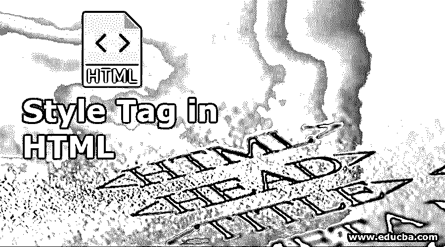
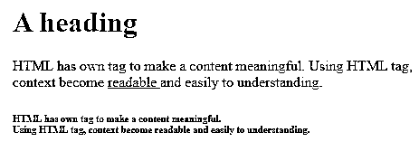
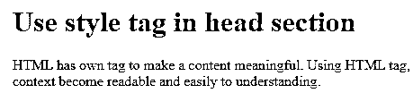
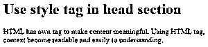
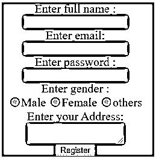
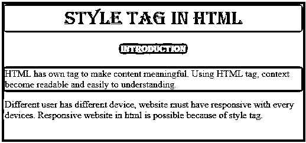
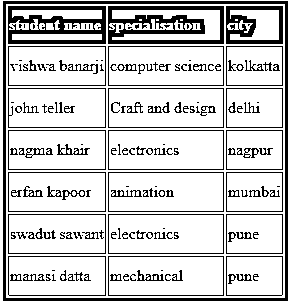

# HTML 中的样式标签

> 原文：<https://www.educba.com/style-tag-in-html/>




## HTML 中样式标签概述

*   以下文章概述了 HTML 中的样式标签。风格是一个专业网站的重要因素。字体，颜色，动画，大小都是网站所必需的。网站是一种交流方式，向受众传递信息。因此，网站必须有吸引力。
*   HTML 有自己的标签，例如:

    、

    # 到

    ###### 、
    、<u>等都是标签。这些标签用于段落、字体大小、下一行和下划线。</u>

*   样式标签用于颜色、图像、大小、背景变化和动画。
*   不同用户有不同的设备；网站肯定对每个设备都有反应。因为有了 style 标签，HTML 中的响应式网站是可能的。
*   样式标签[使用了 HTML 中的 CSS 属性](https://www.educba.com/css-font-properties/)。

### HTML 中样式标签的必要性

*   HTML 有自己的标签来使内容有意义。使用 HTML 标签，上下文变得可读和易于理解。

**例子**

```
<html>
<head>
<title> HTML TAG </title>
</head>
<body>
<h1>A heading</h1>
<p> HTML has own tag to make a content meaningful. Using HTML tag, context become <u> readable </u> and easily to understanding. </p>
<h6> HTML has own tag to make a content meaningful. <br> Using HTML tag, context become readable and easily to understanding. </h6>
</body>
</html>
```

**输出:**

<small>网页开发、编程语言、软件测试&其他</small>




*   HTML 标签可以修改文字，但是网站需要动画和效果来表现内容。
*   用户可以创建一个段落，改变标题大小，加下划线或换行，但不能给单词上色。
*   我们可以使用它来改变字体、大小、颜色、文本对齐和背景。
*   要使内容给人留下印象并易于理解，风格是必要的。

### Html 中不同类型的样式标签

有两种方法可以使用样式标签:

#### 1.标题部分中的样式标签

*   使用属性的 HTML 头部分中使用的样式标签。
*   样式属性中使用的 CSS 属性。

**语法:**

```
<style> html-tag { property: value; } </style>
```

**例子**

```
<html>
<head>
<title> Style tag in HTML 1</title>
<style>
p{
font-family: Harlow Solid Italic;
color: red;
}
</style>
</head>
<body>
<h1> Use style tag in head section </h1>
<p> HTML has own tag to make a content meaningful. Using HTML tag, context become readable and easily to understanding. </p>
</body>
</html>
```

**输出:**




#### 2.正文部分中的样式标记

*   HTML 正文部分中使用的样式标记。
*   使用样式标记在 HTML 标记内使用 CSS 属性。

**语法:**

```
<html-tag style= ”property-name: value-name;” >
```

**例子**

```
<html>
<head>
<title> Style tag in HTML 2</title>
</head>
<body>
<h1 style="color: red ;"> Use style tag in head section </h1>
<p style="font-family: Harlow Solid Italic ;"> HTML has own tag to make content meaningful. Using HTML tag, context become readable and easily to understanding. </p>
</body>
</html>
```




### HTML 中的样式标签示例

下面给出了一些样式标签的例子:

#### 示例# 1:head 部分中的样式标签

**代码:**

```
<html>
<head>
<title> Style tag in HTML </title>
<style>
form{
background-color: grey;
font-size:20px;
text-align: center;
</style>
</head>
<body>
<form>
Enter full name :<br>
<input type="text" name="fullname"><br>
Enter email:<br>
<input type="email" name="email"><br>
Enter password :<br>
<input type="password" name="password"><br>
Enter gender :<br>
<input type="radio" name="gender" value="male"/>Male
<input type="radio" name="gender" value="female"/>Female
<input type="radio" name="gender" value="others"/>others
<br>Enter your Address:<br>
<textarea></textarea><br>
<input type="submit" value="Register">
</form>
</body>
</html>
```

**输出:**




**描述**

*   上面的例子是一个使用 HTML 和 style 标签的[注册表单。](https://www.educba.com/registration-form-in-html/)
*   HTML 文件的头部分使用了 Style 标签。
*   style 标签中使用的许多属性，如背景颜色、字体大小和文本对齐。
*   使用 background-color 属性可以更改内容的背景色。
*   在网站上，文本大小必须根据上下文变化。字体大小有助于获得所需的字体大小。字体可以是像素(20px，30px)或百分比，如 10%，5%。
*   字体也用绝对大小值(小、中、大)、全局值(初始、未设置)和相对大小值(更小、更大)来度量。
*   用于对齐文本或文本位置的 Text-align 属性。放置在页面左侧、右侧或中间位置的内容文本。

#### 示例 2:正文部分中的样式标签

**代码:**

```
<html>
<head>
<title>Background Color</title>
</head>
<body style="background-color:#616A6B;">
<h1 style="font-family:algerian;
background-color:cyan;
text-align:center;"> style tag in html </h1>
<h4 style="font-family:algerian; color:yellow;
text-align:center;"> Introduction </h4>
<p style="color:red;
background-color:white;"> HTML has own tag to make content meaningful. Using HTML tag, context become readable and easily to understanding. </p>
<p> Different user has different device, website must have responsive with every devices. Responsive website in html is possible because of style tag. </p>
</body>
</html>
```

**输出:**




**描述**

*   上面的例子是关于 body 部分的样式标签。
*   属性分别放在 HTML 标记中。我们可以看到每条线都有不同的风格。
*   每段的背景色、字体颜色、文字对齐方式可以单独制定。
*   如果最小风格可以应用于标签，那么这种类型的例子合适。
*   这种风格习惯于在一个地方忘记所有的标签和内容。程序很容易理解它。

#### 示例 3:用于表格的样式标签

**代码:**

```
<!DOCTYPE html>
<html>
<head>
<style>
tr, td{
border: 1px solid grey;
padding-top: 10px;
padding-bottom: 10px;
}
tr:nth-child(odd){ background-color: #f2f2f2; }
th {
padding-top: 10px;
padding-bottom: 10px;
text-align: left;
background-color: black;
color: white;
}
</style>
</head>
<body>
<table style="border:3px solid black;">
<tr>
<th>student name</th>
<th>specialisation</th>
<th>city</th>
</tr>
<tr>
<td>vishwa banarji</td>
<td>computer science</td>
<td>kolkatta</td>
</tr>
<tr>
<td>john teller</td>
<td>Craft and design</td>
<td>delhi</td>
</tr>
<tr>
<td>nagma khair</td>
<td>electronics</td>
<td>nagpur</td>
</tr>
<tr>
<td>erfan kapoor</td>
<td>animation</td>
<td>mumbai</td>
</tr>
<tr>
<td> swadut sawant</td>
<td> electronics</td>
<td> pune</td>
</tr>
<tr>
<td> manasi datta</td>
<td> mechanical</td>
<td> pune</td>
</tr>
</table>
</body>
</html>
```

**输出:**




**描述**

*   这个例子在 head 部分和 body 部分使用了 style 标签。
*   用于内容边框的 Border 属性。我们可以实现所需的边框大小和颜色。
*   在标题部分使用

### 结论

要表示一个网页有吸引力和有意义的风格标签是必要的。因为有了 style 标签，很多内容和图片都变得有意义，容易理解。

### 推荐文章

这是 HTML 中样式标签的指南。这里我们讨论一下介绍，不同的类型，以及样式标签的必要性。您也可以看看以下文章，了解更多信息–

1.  [HTML 中的 Iframes】](https://www.educba.com/iframes-in-html/)
2.  [HTML 事件属性](https://www.educba.com/html-event-attributes/)
3.  [在 HTML 中嵌入标签](https://www.educba.com/embed-tag-in-html/)
4.  [HTML 中的画布标签](https://www.educba.com/canvas-tag-in-html/)


