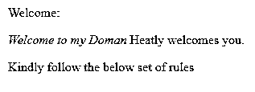
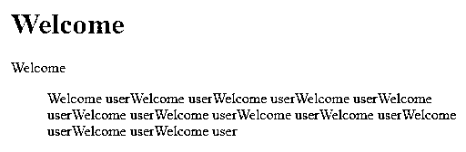
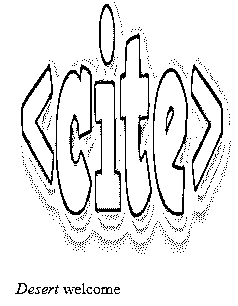
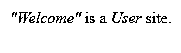

# 在 HTML 中引用标签

> 原文：<https://www.educba.com/cite-tag-in-html/>


## HTML 中引用标签的介绍

下面的文章概述了 HTML 中的 Cite 标签。在 HTML 中，不同的标签集用于不同的目的。其中一个标签元素是标识报价来源的<cite>标签。这是一个未被充分利用的元素，它提供了很少的东西，没有任何表示价值，只是增加了关于使用标签</cite>

> And semantic information of <q>element tags. <cite>Tags are used to identify creative works and names cited by creative works. Tags are also used for standard formats followed by customized formats such as HTML verification. It has the following standards to follow the rules for verifying users' needs. We will see the purpose, purpose and usage of <cite>tag below.</cite></cite></q>

### HTML 中的 Cite 标签是什么？

两个标签主要用于突出显示将提供给用户端的文本。一般来说，我们有一组引号来突出句子，如“将引用的第一个字母大写，在完整的引号前放一个逗号，使用一些引号来强调单词或短语，即使我们在引号内使用了标点符号”，这些是突出句子必须遵循的一些规则。

<small>网页开发、编程语言、软件测试&其他</small>

这里我们使用了<cite>标签来突出显示 html 中的单词。</cite>

**语法:**

```
<blockquote cite="words or any URLs">
Examples words
</blockquote>
```

此外，我们还使用了下面的语法，也使用了

标签

```
<p>
<cite>
---Examples words-------- </cite>
</p>
```

在上面的两个语法中，我们使用了两个标签，在

中是一个段落标签，如果我们使用这些标签，它将给出输入并有一个段落格式列表，此时我们将标记任何要突出显示的单词，这意味着我们只使用了<cite>标签中的单词，它将自动突出显示引号。</cite>

同样的，当我们使用

> When labeling itself, we use <cite>. Assuming that we have prevented a specific URL or sentence or any sample words from being viewed in the end user's time, this tag will be very useful for this scenario, that is, the words in cite tag in blockquote will not be displayed on the viewer's side.</cite>

### HTML 中引用标签的示例

让我们看看一些需要更加清楚的例子:

#### 示例#1

```
<html>
<head>
<style>
cite {
font-style: italic;
}
</style>
</head>
<body>
<p>Welcome:</p>
<p><cite>Welcome to my Doman</cite> Heatly welcomes you.</p>
<p>Kindly follow the below set of rules</p>
</body>
</html>
```

**输出:**




在上面的例子中，我们将在 css 样式文件中使用<cite>标签；我们将字体设置为斜体，这样当你在<cite>标签中显示文本时，就会是斜体格式，如果我们使用不同的字体、颜色和任何与 css 样式相关的设置，我们也会使用它们。</cite></cite>

#### 实施例 2

```
<html>
<body>
<h1>Welcome</h1>
<p>Welcome<p>
<blockquote cite="www.welcometomydomain.com">
Welcome userWelcome userWelcome userWelcome userWelcome userWelcome userWelcome userWelcome userWelcome userWelcome userWelcome userWelcome user
</body>
</html>
```

**输出:**




在上面的例子中，我们在

> The tag <cite>is used in the tag; When we use cite tag in blockquotes, the specific URL that is not displayed in the browser will be automatically disabled.</cite>

#### 实施例 3

```
<html>
<body>

<p><cite>Desert</cite> welcome</p>
</body>
</html>
```

**输出:**




在上面的例子中，我们在 cite 标签中使用了 jpg 格式的图片。我们已经设置了定制图像的高度和宽度。我们还在其他一些库中使用 cite 标签，比如 jquery、Angular、React JS、Vue。尽管[我们在<引用>标签中使用 HTML 5](https://www.educba.com/what-is-html5/) ，我们也使用视频、音乐等实用工具。HTML 属性包含一个或多个用于添加标签的属性，以在浏览器页面内提供更多信息，以及标签在用户信息上应该如何出现或表现。

**用于添加 HTML 标签的三种属性:**

*   特定于 elemont
*   全球的
*   事件处理程序

上面三个通常用于 html 内部执行的功能，如标签。标签支持全局和事件处理属性。它也属于流动内容、可触知内容和短语内容类别。

### 浏览器兼容性

一般来说，当我们在 html 中使用一些操作时，我们会面临浏览器兼容性问题，一个浏览器工作正常，而另一个浏览器不工作，因为我们曾经在 Internet Explorer 中处理过这种问题；我们也在添加插件，比如 flash 等等。这有助于在浏览器中运行应用程序。

同样，当我们使用< cite 标签时，它也支持浏览器，如 Chrome(web 和移动)、Firefox(web 和移动)、Internet Explorer(IE)、Edge Mobile、Opera(web 和移动的 mini)、Safari(移动和 web 以及 WebKit)。有时应用程序在移动界面中不受支持，比如我们使用的“UC 浏览器(网络和移动以及 UC Mini)”。当我们需要在开发模式下解决问题时，并不是每次都需要更改浏览器来运行应用程序。

### HTML 4 和 HTML 5 的区别

一旦我们将 HTML 4 更新到 HTML 5，我们就有了一组使用用户规范的功能。如果我们使用 HTML 5 版本，但在 HTML 4 中没有动画功能，则包括图像、音频和一些动画是附加功能。这里，HTML 4 和 HTML 5 的< Cite >标签有一些基本的区别。

**HTML 4 中的 Cite 标签:**在 HTML 4 中，它只定义引用。

**在 HTML 5 中引用标签:**在 HTML 4 中，它只定义作品的标题。

#### HTML 5 中的示例

```
<html >
<body>
<cite> "Welcome"</cite> is a
<cite> User</cite> site.
</body>
</html>
```

**输出:**




在上面的例子中，我们看到 cite 标签只是任务的标题，如果你在 HTML4 版本中使用相同的编码，它就是任务的引用。

### 结论–在 HTML 中引用标签

当我们使用一组不同的标签(例如预定义的和唯一的标签)来根据用户需求手动和自动执行操作时，html 的基本原则。因此，如果我们必须评估用户说明书及其规范是否成熟，那么它将用于潜在的发展或当前的趋势。

### 推荐文章

这是一个在 HTML 中引用标签的指南。在这里，我们讨论介绍，语法，例子和三种用于添加 HTML 标签的属性。您也可以看看以下文章，了解更多信息–

1.  [在 HTML 中拖放](https://www.educba.com/drag-and-drop-in-html/)
2.  [HTML URL 编码](https://www.educba.com/html-url-encoding/)
3.  [基本 HTML 标签](https://www.educba.com/basic-html-tags/)
4.  [在 HTML 中嵌入标签](https://www.educba.com/embed-tag-in-html/)


