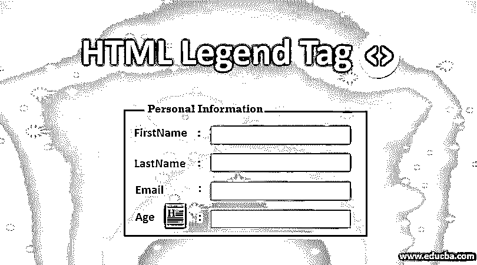
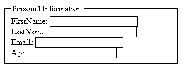
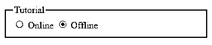
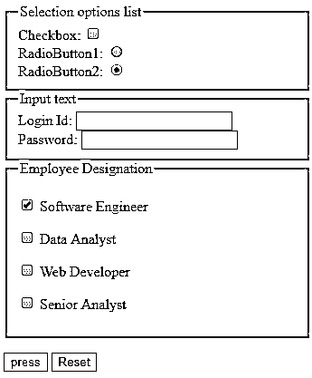
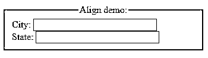
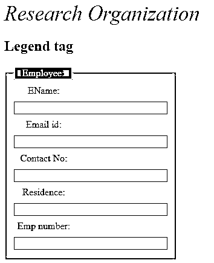

# HTML 图例标记

> 原文：<https://www.educba.com/html-legend-tag/>




## HTML 图例标签简介

Legend 标签用于定义<field set="">标签的标题，它被认为是这个元素的第一个子元素。作为标题，它通常放在框架的顶部。<field tag="">的目的是在特定元素的内容上创建一个包围框。主要目的是用字段集的[帮助包装表单、图像和内容，字段集的](https://www.educba.com/fieldset-tag-in-html/)也用于描述信息的上下文。在以下部分，我们将深入讨论<图例>标签上的信息以及一个示例。这篇文章的主旨是展示 HTML 元素标签在演示中是如何简单而富有创造性地使用的。</field></field>

**语法**

<small>网页开发、编程语言、软件测试&其他</small>

```
<legend>
……
</legend>
```

HTML

<fieldset>元素放在元素内，周围用黑色边框标记；而如果你想要一个时尚的或者改变行为的框架，那么 [CSS 就用在这里](https://www.educba.com/what-is-css/)。这个标签和< div >标签完全不同。这个标签支持所有的浏览器，比如 Chrome，android，firefox，Opera，Internet Explorer。所有这些元素在所有浏览器中都是统一的。</fieldset>

**代码:**

```
<fieldset>
<legend>
Text
</legend>
… Content
<fieldset>
```

必须提供开始和结束标签。

### 属性

一般来说，HTML 标签有一个或多个属性，这些属性提供了 HTML 元素的一个重要方面。图例标记支持所有已定义的全局属性。某些属性不支持现代 web 浏览器。下表给出了标签属性及其描述。

#### 1.特定于标签的属性

**align:** 定义表单中给出的标题或题注相对于父<字段集>的对齐方式。

**代码:**

```
<fieldset>
<legend align="center">Align
demo:</legend>
```

**注意:**为了清晰的对齐，最好对一个元素的变体使用 CSS-Align。

#### 2.标准属性

在前一篇文章中已经讨论了这些属性的描述。

*   访问键
*   班级
*   目录
*   身份证明（identification）
*   风格
*   语言
*   身份证明（identification）
*   标签索引
*   标题

#### 3.全局属性

legend 标签也接受前面讨论过的全局属性，这是所有 HTML5 元素的标准。下面列出了一些:

| **语境** | **定义上下文** |
| 目录 | 这些值给出了文本的路径。 |
| 身份 | 它的标识符必须与名称的值相匹配。 |
| 风格 | 指定内联和外部样式。 |
| 朗格 | 确定文本中使用的语言。 |

#### 4.事件属性

| 奥纳博特 | 当一个特定的事件被中止时，它被调用。例如，网络浏览器会在视频完全下载之前立即播放。 |
| onblur | 定义元素的焦点。 |
| oncancel | 停止已处理的事件处理程序。 |
| Onclick | 点击完成时触发 |
| 昂哥 | 当某处点击完成时。 |
| 专注 | 当焦点在给定元素上时触发 |

#### 5.其他属性包括

鼠标向下、鼠标向上、鼠标越过、鼠标移动、鼠标向外、聚焦、模糊、按键按下、按键向下、按键向上。<legend>标签附带的标签如下:</legend>

<big>*   <iframe></li> <li><textarea/></li> <li><select/></li> <li><script/></li> <li><del/></li> <li><dfn/></li> <li><i/></li> <li><button/></li> </ul> <h3>在 HTML 中实现区域标签的例子</h3> <p>以下是在 HTML 中实现区域标签的示例:</p> <h4>示例#1</h4> <p>本节重点介绍表单和字段集。将图例标记与字段集相关联，并更倾向于与表单一起使用，这是最好的选择。</p> <p><strong>代码:</strong></p> <pre><code class="language-html">&lt;!DOCTYPE html&gt;&#13; &lt;html&gt;&#13; &lt;body&gt;&#13; &lt;form&gt;&#13; &lt;fieldset&gt;&#13; &lt;legend&gt;Personal Information:&lt;/legend&gt;&#13; FirstName:  &lt;input type="text"&gt;&lt;br&gt;&#13; LastName:  &lt;input type="text"&gt;&lt;br&gt;&#13; Email: &lt;input type="text"&gt;&lt;br&gt;&#13; Age: &lt;input type="text"&gt;&#13; &lt;/fieldset&gt;&#13; &lt;/form&gt;&#13; &lt;/body&gt;&#13; &lt;/html&gt;</code></pre> <p><strong>输出:</strong></p> <p></p> <h4>实施例 2</h4> <p>以下示例显示了 fieldset 元素如何将标签、单选按钮和检查表组合在一起。同时，应该为组的标题提供图例标记。可以用其他控件实现类似的方法。</p> <p><strong>代码:</strong></p> <pre><code class="language-html">&lt;!DOCTYPE html&gt;&#13; &lt;html&gt;&#13; &lt;body&gt;&#13; &lt;form action="http://www.educba.com/" method="post"&gt;&#13; &lt;fieldset&gt;&#13; &lt;legend&gt;Tutorial&lt;/legend&gt;&#13; &lt;input type="radio" name="tutorial class" value="online" id="online"&gt;&#13; &lt;label for="online"&gt;Online&lt;/label&gt;&#13; &lt;input type="radio" name="tutorial class" value="offline" id="offline"&gt;&#13; &lt;label for="offline"&gt;Offline&lt;/label&gt;&#13; &lt;/fieldset&gt;&#13; &lt;/form&gt;&#13; &lt;/body&gt;&#13; &lt;/html&gt;</code></pre> <p><strong>输出:</strong></p> <p></p> <h4>实施例 3</h4> <p>在下面的例子中，我们将信息分组在 HTML 标签<form>下。并且每个控件都在<field set="">元素下被声明为它的第一个子元素。</field></form></p> <p><strong>代码:</strong></p> <pre><code class="language-html">&lt;!DOCTYPE HTML &gt;&#13; &lt;html&gt;&#13; &lt;head&gt;&#13; &lt;title&gt;HTML Test with buttons&lt;/title&gt;&#13; &lt;meta http-equiv="Content-Type" content="text/html; charset=utf-8"&gt;&#13; &lt;/head&gt;&#13; &lt;body&gt;&#13; &lt;form action="example demo" method="post"&gt;&#13; &lt;fieldset&gt;&#13; &lt;legend&gt;Selection options list&lt;/legend&gt;&#13; Checkbox: &lt;input type="checkbox" name="checkex" value="on"&gt;&lt;br&gt;&#13; RadioButton1: &lt;input type="radio" name="radbtest" value="one"&gt;&lt;br&gt;&#13; RadioButton2: &lt;input type="radio" name="radb1test" value="two"&#13; checked="checked"&gt;&lt;br&gt;&#13; &lt;/fieldset&gt;&#13; &lt;fieldset&gt;&#13; &lt;legend&gt;Input Text&lt;/legend&gt;&#13; Login Id: &lt;input type="text" name="text ex"&gt;&lt;br&gt;&#13; Password: &lt;input type="password" name="pwd test"&gt;&lt;br&gt;&#13; &lt;/fieldset&gt;&#13; &lt;fieldset&gt;&#13; &lt;legend&gt;Employee Designation&lt;/legend&gt;&#13; &lt;p&gt;&lt;input type="checkbox" name=" Software Engineer"&gt; Software Engineer&lt;/p&gt;&#13; &lt;p&gt;&lt;input type="checkbox" name="Data Analyst"&gt; Data Analyst&lt;/p&gt;&#13; &lt;p&gt;&lt;input type="checkbox" name="Web Developer"&gt; Web Developer&lt;/p&gt;&#13; &lt;p&gt;&lt;input type="checkbox" name=" Senior Analyst"&gt; Senior Analyst&lt;/p&gt;&#13; &lt;/fieldset&gt;&#13; &lt;p&gt;&lt;input type="submit" value="press"&gt; &lt;input type="reset"&gt;&lt;/p&gt;&#13; &lt;/form&gt;&#13; &lt;/body&gt;&#13; &lt;/html&gt;</code></pre> <p><strong>输出:</strong></p><div class="ai-viewports ai-viewport-2 ai-viewport-3 ai-insert-24-65941499" style="margin: 8px 0; clear: both;" data-insertion="prepend" data-selector=".ai-insert-24-65941499" data-insertion-no-dbg="" data-code="PGRpdiBjbGFzcz0nY29kZS1ibG9jayBjb2RlLWJsb2NrLTI0JyBzdHlsZT0nbWFyZ2luOiA4cHggMDsgY2xlYXI6IGJvdGg7Jz4KPGlucyBjbGFzcz0iYWRzYnlnb29nbGUiCiAgICAgc3R5bGU9ImRpc3BsYXk6YmxvY2s7IHRleHQtYWxpZ246Y2VudGVyOyIKICAgICBkYXRhLWFkLWxheW91dD0iaW4tYXJ0aWNsZSIKICAgICBkYXRhLWFkLWZvcm1hdD0iZmx1aWQiCiAgICAgZGF0YS1hZC1jbGllbnQ9ImNhLXB1Yi04MzQ5MDgzMjc2ODM5Nzg5IgogICAgIGRhdGEtYWQtc2xvdD0iNzcxMjkyMTg3NSI+PC9pbnM+CjxzY3JpcHQ+CiAgICAgKGFkc2J5Z29vZ2xlID0gd2luZG93LmFkc2J5Z29vZ2xlIHx8IFtdKS5wdXNoKHt9KTsKPC9zY3JpcHQ+PC9kaXY+Cg==" data-block="24"/> <p></p> <h4>实施例 4</h4> <p>使用对齐属性演示。对齐属性有三个值</p> <ul> <li>align= "center "，</li> <li>align= "right "</li> <li>align= "left "</li> </ul> <p><strong>代码:</strong></p> <pre><code class="language-html">&lt;!DOCTYPE html&gt;&#13; &lt;html&gt;&#13; &lt;body&gt;&#13; &lt;form&gt;&#13; &lt;fieldset&gt;&#13; &lt;legend align="center"&gt;Align demo:&lt;/legend&gt;&#13; City: &lt;input type="text" size="25"&gt;&lt;br&gt;&#13; State: &lt;input type="text" size="25"&gt;&lt;br&gt;&#13; &lt;/fieldset&gt;&#13; &lt;/form&gt;&#13; &lt;/body&gt;&#13; &lt;/html&gt;</code></pre> <p><strong>输出:</strong></p> <p></p> <h4>实施例 5</h4> <p>使用 CSS 样式。使用 CSS，通过将颜色属性声明为各种颜色来改变图例说明/标题颜色。</p> <p><strong>代码:</strong></p> <pre><code class="language-html">&lt;!DOCTYPE html&gt;&#13; &lt;html&gt;&#13; &lt;head&gt;&#13; &lt;title&gt;Legend Tag Implementation&lt;/title&gt;&#13; &lt;style&gt;&#13; form{&#13; width: 45%;&#13; }&#13; legend {&#13; display: block;&#13; padding-left: 12px;&#13; padding-right: 12px;&#13; border: 2px solid pink;&#13; background-color:green;&#13; color:white;;&#13; }&#13; label {&#13; display: inline-block;&#13; float: left;&#13; clear: left;&#13; width: 91px;&#13; margin:4px;&#13; text-align: center;&#13; }&#13; input[type="text"] {&#13; width:250px;&#13; margin:4.5px 0px;&#13; }&#13; .cba {&#13; font-size:35px;&#13; color:blue;&#13; font-weight:500;&#13; font-style :italic;&#13; }&#13; &lt;/style&gt;&#13; &lt;/head&gt;&#13; &lt;body&gt;&#13; &lt;div class = "cba"&gt; Research Organization&lt;/div&gt;&#13; &lt;h2&gt;Legend tag&lt;/h2&gt;&#13; &lt;form&gt;&#13; &lt;fieldset&gt;&#13; &lt;legend&gt;Employee:&lt;/legend&gt;&#13; &lt;label&gt; EName:&lt;/label&gt;&lt;input type="text"&gt;&#13; &lt;br&gt;&#13; &lt;label&gt;Email id:&lt;/label&gt;&lt;input type="text"&gt;&#13; &lt;br&gt;&#13; &lt;label&gt;Contact No:&lt;/label&gt;&lt;input type="text"&gt;&#13; &lt;br&gt;&#13; &lt;label&gt;Residence:&lt;/label&gt;&lt;input type="text"&gt;&#13; &lt;br&gt;&#13; &lt;label&gt;Emp number:&lt;/label&gt;&lt;input type="text"&gt;&#13; &lt;/fieldset&gt;&#13; &lt;/form&gt;&#13; &lt;/body&gt;&#13; &lt;/html&gt;</code></pre> <p><strong>输出:</strong></p> <p></p> <h3>结论–HTML 图例标签</h3> <p>最后，我们已经看到了 legend 标签是如何被用作 group 元素的标题的。本文的使用对 HTML 组件有益。此外，当字段集为空时，图例提高了良好的可访问性。它被认为是 HTML5 中最好的设计相关组标签。这些标签在使用适当的 CSS 代码和适当的设计技术的 web 开发中非常有用。</p> <h3>推荐文章</h3> <p>这是一个 HTML 图例标签的指南。在这里，我们讨论在 HTML 中实现区域标签的属性和不同的例子。您也可以浏览我们的其他相关文章，了解更多信息——</p> <ol> <li><a href="https://www.educba.com/html-colors/"> HTML5 标签</a></li> <li><a href="https://www.educba.com/html-table-tags/"> HTML 表格标签</a></li> <li><a href="https://www.educba.com/html-onclick-button/"> HTML onclick 按钮</a></li> <li><a href="https://www.educba.com/area-tag-in-html/">HTML 中的区域标签</a></li> </ol> <style>.othr-cour a{color:#4a4a4a!important;border-bottom:none}.othr-cour a:hover{border-bottom:1px solid!important}.box-div .fa-book:before{content:"\f14e"}.box-div .fa-book{background-image:linear-gradient(to top,#0ba360 0,#3cba92 100%);padding:15px;border-radius:5px;color:#f0f8ff;font-size:50px}.box-div .fa-flash:before,.fa-bolt:before{content:"\f1fa"}.box-div .box-btn{width:max-content;cursor:pointer;transition:.2s;padding:10px 30px;line-height:1.33;border-radius:4px;color:#fff;background:#ff8c00;border:thin solid #ff8c00;margin-bottom:0;font-weight:700;text-align:center;vertical-align:middle;font-size:15px;display:block;letter-spacing:1px;background-image:linear-gradient(to top,#e93f33,#ea4b32,#eb5632,#ec6032,#ec6a33)}.box-div{border:1px solid #bfbfbf;margin:10px 0 25px;padding:24px;width:100%}.box-div .course-title{font-weight:700;font-size:1.3em;letter-spacing:1px;display:block}.box-div .fa-star{font-size:15px;color:#f5af12;margin-right:4px}.box-div .price-box{text-align:-webkit-center}@media (min-device-width :320px) and (max-device-width :520px){.box-div .banr-image{display:none}.box-div .price-box{text-align:-webkit-left;margin:15px 0}}@media (min-device-width :320px) and (max-device-width :767px){.sale-bf{position:absolute;width:80px;margin-top:-5.4em;right:0}}.box-div .othr-cour{border-radius:4px;border:1px solid #4a4a4a;margin-right:12px;padding:5px 10px;font-size:14px;font-weight:400;display:inline-block;margin-bottom:5px;cursor:pointer;line-height:1.4}.box-div .rel-cour{font-size:16px;padding-bottom:5px}@media (min-device-width :768px){.centertext{text-align:center}.sale-bf{position:absolute;width:120px;margin-top:-6.1em;right:2.5em}}.blg-price{font-size:1.5em;font-weight:700;}.blg-str-price strike{font-size:1.2em;color:grey;font-weight:700;}.box-div hr{margin:0 0 .5em;padding:.5em 0 0}.box-div .course-title{line-height:25px}.box-div .banr-image{text-align:center;margin-top:20px}.box-div .bundle_link{text-decoration:none;color:#fff!important;border:0}.box-div .bullets{font-weight:400;font-size:.9em}#banner_1_rb .three-sixths{margin-top:15px}#banner_1_rb .five-sixths{width:100%;margin:0}#banner_1_rb .course-price{font-size:1em}#banner_1_rb:hover{-webkit-box-shadow:0 9px 5px -6px rgba(0,0,0,.75);-moz-box-shadow:0 9px 5px -6px rgba(0,0,0,.75);box-shadow:0 9px 5px -6px rgba(0,0,0,.75)}#banner_1_rb{background-image:url('https://cdn.educba.com/academy/wp-content/uploads/2022/11/Popular-Courses.jpeg');padding:30px 14px;background-size:cover;background-position:top center;position:relative;width:100%;font-family:Montserrat,sans-serif!important}.bf_badge{position:absolute;right:-2px;top:-12px;width:90px;}@media only screen and (max-width:896px) and (min-width:320px){.three-sixths{width:100%!important}#banner_1_rb{width:100%!important}.uk-grid&amp;gt;*{padding-left:0!important}.bf_badge{position:absolute;right:-1px;top:-9px!important;width:70px!important;}}&amp;#13; </style>&#13; &#13; &#13; &#13; <div style="clear: both;"/>&#13; &#13; <div style="margin:35px 0 50px 0;">&#13; <!-- Ad Unit 9 - Footer -->&#13; &#13; <!-- AI CONTENT END 1 --> </div>Primary Sidebar<div class="widget-wrap"> <div class="textwidget"><style type="text/css">table td,th{border-left:2px solid #d2d2d2;vertical-align:text-top}#list2::-webkit-scrollbar,#sticky::-webkit-scrollbar,#ullist::-webkit-scrollbar{width:5px}#list2::-webkit-scrollbar-track,#ullist::-webkit-scrollbar-track{background:#f1f1f1}#list2::-webkit-scrollbar-thumb,#ullist::-webkit-scrollbar-thumb{background:#f1f1f1}#list2::-webkit-scrollbar-thumb:hover,#ullist::-webkit-scrollbar-thumb:hover{background:#888}#list2:hover::-webkit-scrollbar-thumb,#ullist:hover::-webkit-scrollbar-thumb{background:#888}.entry-content pre{background-color:#f6f7f8;display:block;padding:10px 20px;padding:1rem 2rem;border:2px solid #f0f1f2;margin-top:1em;border-radius:4px;border-left:3px solid #6ce26c!important}@media (max-device-width:480px) and (min-device-width:320px){.entry-content code{width:300px;overflow:scroll}.entry-content pre{width:300px;overflow:scroll}.entry-content .wp-video{width:auto!important}}@media (max-device-width:767px) and (min-device-width:481px){.entry-content code{width:470px;overflow:scroll}}@media (max-device-width:890px) and (min-device-width:768px){.entry-content code{width:750px;overflow:scroll}}@media only screen and (min-device-width:891px){.entry-content code{width:auto}}.breadcrumb a{color:#e93f33;text-decoration:underline;font-family:'Nunito Sans',-apple-system,blinkmacsystemfont,'Segoe UI',roboto,helvetica,arial,sans-serif}.entry-content a{color:#e93f33;border-bottom:1px solid;text-decoration:none}.entry-content a:focus,.entry-content a:hover{border-bottom:transparent}@media (min-width:768px){h1{font-size:3em}h2{font-size:2em}h3{font-size:1.8em}h4{font-size:1.5em}h5{font-size:1.4em}h6{font-size:1.3em}}h2{font-size:2em}h3{font-size:1.8em}h4{font-size:1.5em}h5{font-size:1.4em}h6{font-size:1.3em}body&amp;gt;div{font-size:18px;font-size:1.6rem}b,h1,h2,h3,h4,h5,h6,strong{font-family:'Nunito Sans',-apple-system,blinkmacsystemfont,'Segoe UI',roboto,helvetica,arial,sans-serif;font-weight:700!important}@media (min-width:768px){body&amp;gt;div{font-size:1.8rem}}.entry-content ol,.entry-content ul{margin-bottom:1.618em;margin-left:4rem}.entry-content li,.entry-content ol,.entry-content p,.entry-content table,.entry-content ul{color:#4d5968;line-height:2;font-family:'Nunito Sans',-apple-system,blinkmacsystemfont,'Segoe UI',roboto,helvetica,arial,sans-serif}@media (min-width:896px){.content-sidebar-wrap{padding:3rem 0!important}}.leftshift{left:70%!important}.content-sidebar-wrap-bg{background: #0a635fab;}.inline-pp-banner-bg {background: #faffbd82;}.img-op{opacity: 0.5;} .contentinner h4 {font-size: 1em; font-weight:200 !important; line-height:1.3;} .contentinner h4 a{text-decoration:none;font-weight: 600;} .contentinner h4 a:before {content: "\f18e"!important;color: #5d5c5c;font-size: 2.2rem;font-weight: 500;font-family: FontAwesome;margin-right: 0.2em;} .subcat-name{font-size: 1.2em;line-height: 2;color: #d87d07;border-bottom: 1px solid;margin-bottom: 0.5em !important;} </style>&#13; &#13; <div style="margin:0px 0 50px 0;">&#13; <!-- Ad Unit 1 -->&#13; &#13; &#13; </div>&#13; &#13; <div style="margin:150px 0 50px 0;">&#13; <!-- Ad Unit 2 -->&#13; &#13; &#13; </div>&#13; &#13; <div style="margin:150px 0 50px 0;">&#13; <!-- Ad Unit 3 -->&#13; &#13; &#13; </div>&#13; &#13; <div style="margin:150px 0 50px 0;">&#13; <!-- Ad Unit 4 -->&#13; &#13; &#13; </div>&#13; &#13; <div style="margin:150px 0 50px 0;">&#13; <!-- Ad Unit 5 -->&#13; &#13; &#13; </div>&#13; &#13; <div style="margin:150px 0 50px 0;">&#13; <!-- Ad Unit 6 -->&#13; &#13; &#13; </div>&#13; &#13; <div style="margin:150px 0 50px 0;">&#13; <!-- Ad Unit 7 -->&#13; &#13; &#13; </div>&#13; <div style="margin:150px 0 50px 0;">&#13; <!-- Ad Unit 10 -->&#13; &#13; &#13; </div>&#13; </div> </div>  </body> </html></iframe></big>