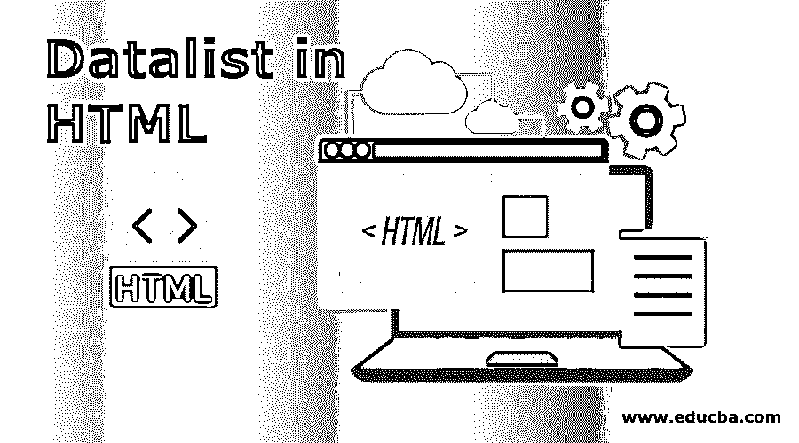
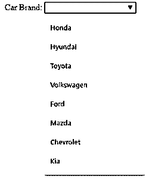
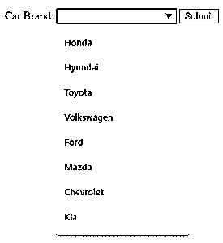
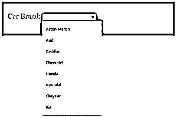
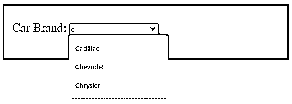

# HTML 格式的数据列表

> 原文：<https://www.educba.com/datalist-in-html/>




## HTML 中的数据列表介绍

这篇文章提供了 HTML 中数据列表的概要。Datalist 是 HTML5 中可用的标签[，用于向用户自动建议输入值。这个标签是 HTML5 的特性，它使输入元素更具交互性，用户界面更直观。<数据列表>标签与输入元素标签一起使用。它用于显示值，这些值可以在输入框中输入。用户可以自由地在输入框中输入任何值；只有 datalist 标签会提供自动建议值。因此，用户可以更灵活、更轻松地输入值。](https://www.educba.com/what-is-html5/)

**语法:**

<small>网页开发、编程语言、软件测试&其他</small>

```
<input list = "xyz" name = "input name" >
<datalist id = "xyz" >
<option value = " . . . " >
<option value = " . . . " >
<option value = " . . . " >
<option value = " . . . " >
</datalist>
```

这里，我们有两个主要的标签；一个是<input>标签，第二个是<datalist>标签。datalist 标签以开始标签<datalist>开始，以结束标签</datalist>结束。所有选项都包含在 datalist 标记之间。我们已经为 datalist 标记分配了一个 id(这里是 xyz ),这个相同的 id 值被传递给 input 标记中的 list 属性。因此，两个标签由相同的 id 链接。既然它们已经链接，我们希望显示或自动建议值列表。然后使用<option>标签将这些值相加。这里我们有四个选项列表，值用点表示。该列表可以根据需要包含任意数量的选项。</option></datalist>

[选项标签与选择标签使用的](https://www.educba.com/option-tag-in-html/)相同。请注意 select 标记和 datalist 标记之间的区别。[选择标签允许](https://www.educba.com/select-tag-in-html/)只从可用选项中选择一个值，而数据列表标签只从列表中建议值。name 属性仅用于标识示例中的 input 元素。

**属性:**

<datalist>标签没有这样的特殊属性可用；默认情况下，它支持全局可用的事件和 [HTML 属性](https://www.educba.com/html-attributes/)。</datalist>

### HTML 中的 Datalist 标记示例

下面是一些例子:

#### 示例#1

让我们设计一个带有自动建议选项的简单输入字段，如下所示:

**代码**:

```
<! DOCTYPE html>
<html>
<body>
<label> Car Brand: </label>
<input list = "car_brands" name = "car brand" >
<datalist id = "car_brands" >
<option value = "Honda " >
<option value = "Hyundai " >
<option value = "Toyota " >
<option value = "Volkswagen " >
<option value = "Ford " >
<option value = "Mazda " >
<option value = "Chevrolet " >
<option value = "Kia " >
</datalist>
</body>
</html>
```

这里，我们有一个作为汽车品牌的输入元素。在要显示的自动建议中，我们在选项标签中列出了。对于 datalist 标记，我们将 id 指定为 car_brands，并将其传递给 input 元素。当用户在用户框中点击或者用户开始输入时，HTML 将自动弹出上面自动建议的值。

**输出**:




在输出中，单击输入框，汽车品牌列表将如上所示显示。

#### 实施例 2

datalist 标签主要用于表单提交的情况。让我们看一个嵌入了表单的例子。

**代码**:

```
<!DOCTYPE html>
<html>
<body>
<form action = "#" method = "get" >
<label> Car Brand: </label>
<input list = "car_brands" name = "car brand" >
<datalist id = "car_brands" >
<option value = "Honda " >
<option value = "Hyundai " >
<option value = "Toyota " >
<option value = "Volkswagen " >
<option value = "Ford " >
<option value = "Mazda " >
<option value = "Chevrolet " >
<option value = "Kia " >
</datalist>
<input type = "submit" >
</form>
</body>
</html>
```

**输出**:




这里，在输出注释中，我们将 input 元素移到了 form 元素中，并添加了 submit 按钮。

#### 实施例 3

数据列表自动建议将尝试尽可能多地显示最佳匹配。当用户开始键入时，将根据用户输入的值过滤掉建议。让我们修改第一个例子来显示这个特性以及输入元素的一些样式。

**代码**:

```
<!DOCTYPE html>
<html>
<head>
<style>
.cars {
height: 110px;
background-color: cadetblue;
width: 100%;
}
</style>
</head>
<body>
<div class = "cars" >
<label style = "font-size: x-large; font-weight: 500; margin-left: 20px " > Car Brand: </label >
<input list = "car_brands" name = "car brand" style = "margin-top: 40px; " >
<datalist id = "car_brands" >
<option value = "Aston Martin " >
<option value = "Audi " >
<option value = "Cadillac " >
<option value = "Chevrolet " >
<option value = "Honda " >
<option value = "Hyundai " >
<option value = "Chrysler " >
<option value = "Kia " >
</datalist>
</div>
</body>
</html>
```

**无需用户输入的输出:**




**用户开始输入时的输出:**




这里，当用户在输入框中输入值‘c’时，HTML 显示从字符‘c’开始的所有自动建议值。我们还修改了选项元素来显示该特性，它将根据字母自动建议。

**Note**: Almost all the browsers support the data list tag except the Internet Explorer 9 and Safari 12.0 and earlier versions of both. Keep this in mind while using the datalist tag.

### 结论

从用户那里获得输入时的自动建议是 HTML5 中提供的特性。datalist 标记用于实现这一功能。datalist 标记通常与 input 标记一起使用。

### 推荐文章

这是一个 HTML 格式的数据列表指南？这里我们讨论 HTML 中 datalist 的简介、属性和各种例子。您也可以看看以下文章，了解更多信息–

1.  [HTML 表单元素](https://www.educba.com/html-form-elements/)
2.  [HTML 中的符号](https://www.educba.com/symbols-in-html/)
3.  [备忘单 HTML](https://www.educba.com/cheat-sheet-html/)
4.  [HTML5 标签](https://www.educba.com/html5-tags/)


