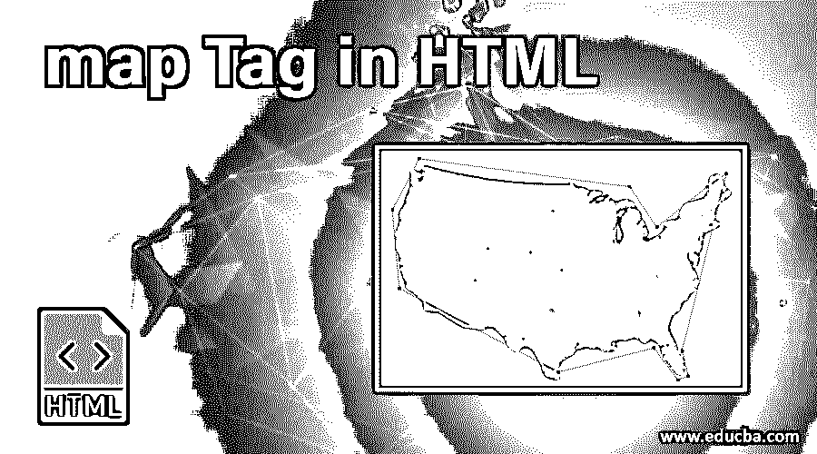
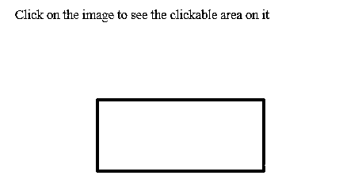
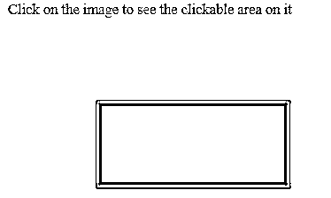
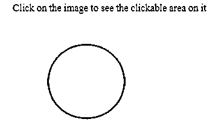
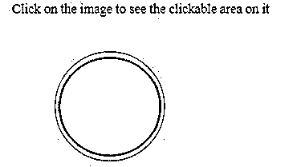
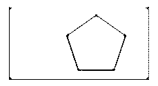
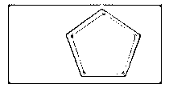

# HTML 中的地图标签

> 原文：<https://www.educba.com/map-tag-in-html/>




## HTML 中地图标签介绍

HTML 为使网站更具交互性提供了强大的支持。HTML 允许用最少的代码进行直观的设计。当我们想让图像更具交互性时，HTML 提供了图像映射的特性。使用图像映射，我们可以与图像进行交互，并在同一帧中从一个图像跳到另一个图像。当我们想要在网站上实现像放大图像这样的功能时，这个功能非常有用。图像上有一个可点击的区域；我们可以配置 URL 或其他图像，以便在用户点击该区域时进行重定向。

### 句法

```

<map name = "new-map" >
. . . .
. . . .
</map>
```

上面的例子显示了 map 标记的语法。我们有两个标签，img 和 map。在地图标签中，我们将其命名为“new-map”。img 标签将有 src，它将显示图像并注意它有一个名为 usemap 的属性。我们已经通过使用 usemap 属性将地图的名称传递给了这个 img 标记。在地图标记之间的空白区域，我们将为该区域及其在图像上的链接定义配置。

<small>网页开发、编程语言、软件测试&其他</small>

HTML 提供了“map”标签来实现图像映射的功能。这是一个非常简单的标签，通常与“img”标签一起使用。img 标签将用于定义要显示的主图像或第一个图像。然后，地图标签将用于定义区域和链接。这两个标记 img 和 map 将通过使用 name 参数链接在一起。

### HTML 中地图标记的属性

以下是 HTML 中地图标签的五大属性:

#### 1.名字

地图标签主要与“名称”属性相关联。name 属性用于为特定的已定义映射命名。然后在 img 元素中使用这个名称，这样它们就可以链接在一起。有了这个名称属性映射，标签之间将包含另一个元素。代码将如下所示。

**代码:**

```
<map name = "new-map" >
. . . .
<area shape = " " coords = " " href = " " alt = " " >
. . . .
</map>
```

area 元素定义了图像中可点击的区域。通常，一个地图标签会包含不止一个元素。区域元素将具有诸如形状、线条、href 等属性。，这在定义图像映射时很有用。我们可以使用这些属性来定义区域和相关的图像。area 元素通常与 map 标记一起使用，并且总是嵌套在 map 标记中。area 元素具有以下属性，这些属性在定义图像映射时非常重要和有用。

#### 2.形状

该属性用于指定图像上可点击区域的形状。我们总共有四个值与可以使用的形状相关联。

*   **默认:**将定义整个区域
*   **圆形:**指定圆形
*   **rect:** 指定矩形形状
*   **多边形:**指定多边形的形状

#### 3\. coords

该属性与 shape 属性一起用于指定该区域在图像上的位置。该属性的值将根据指定的形状而变化。

#### 4.href

此属性用作 URL 将被重定向到的 URL。仅在由坐标定义的特定区域中点击时，URL 将被重定向。

#### 5.中高音

此属性用于指定图像不可用时要显示的替代文本。还有更多与区域标记相关的属性，但这些是理解使用地图标记所需的基本属性。

### 在 HTML 中实现地图标签的例子

下面是 HTML 中详细解释的 map 标签的例子。

#### 示例#1

让我们看一个使用图像映射的矩形的简单例子。

**代码:**

```
<!DOCTYPE html>
<html>
<head>
<title> Image map Example </title>
</head>
<body>
<p> Click on the image to see the clickable area on it </p>

<map name = "new-map" >
<area shape = "rect" coords = "91,70,290,160" alt = "Rectangle" href = "#" >
</map>
</body>
</html>
```

**输出:**




如果我们点击矩形区域，它会显示如下的可点击区域边界。




请注意，由于我们没有在 href 属性中提供有效的 URL，该 URL 现在不会被重定向。

#### 实施例 2

让我们用 Circle 试试同样的例子。

**代码:**

```
<!DOCTYPE html>
<html>
<head>
<title> Image map Example </title>
</head>
<body>
<p> Click on the image to see the clickable area on it </p>

<map name = "new-map" >
<area shape = "circle" coords = "111,87,62" alt = "Circle" href = "#" >
</map>
</body>
</html>
```

**输出:**




点击图像时:




请注意，形状的类型已更改为圆形，并相应地提供了坐标值。

#### 实施例 3

让我们用一个多边形作为另一个图像的子部分来设计这个例子。

**代码:**

```
<!DOCTYPE html>
<html>
<head>
<title> Image map Example </title>
</head>
<body>
<p> Click on the image to see the clickable area on it </p>

<map name = "new-map" >
<area shape = "poly" coords = "166,45,217,80,197,134,139,134,119,79" alt = "Polygon" href = "#" >
</map>
</body>
</html>
```

**输出:**




所以，我们把五边形的子部分放在矩形的原始图像上。注意，我们可以通过调整坐标值来实现任何类型的可点击区域。

可点击区域:




### 结论

所以，我们已经看到了什么是地图标签以及如何使用它。map 标记用于客户端图像映射。我们可以通过使用 map 标签将图像的特定区域定义为可点击的。我们可以通过提供所需的有效坐标来实现任何形状。

### 推荐文章

这是一个在 HTML 中映射标签的指南。这里我们讨论语法、属性和各种在 html 中实现 map 标签的例子。您也可以阅读以下文章，了解更多信息——

1.  [HTML 画布](https://www.educba.com/html-canvas/)
2.  [HTML 块](https://www.educba.com/html-blocks/)
3.  [在 HTML 中嵌入标签](https://www.educba.com/embed-tag-in-html/)
4.  [HTML 中的画布标签](https://www.educba.com/canvas-tag-in-html/)


