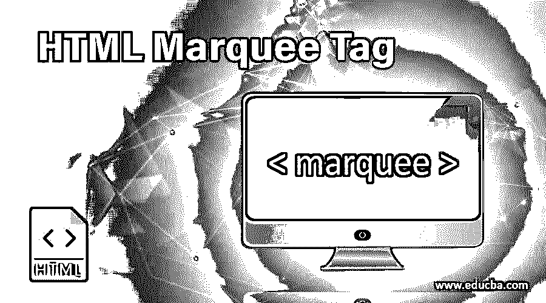
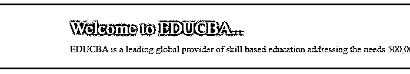
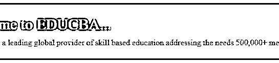
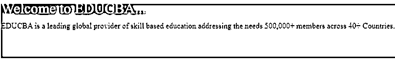
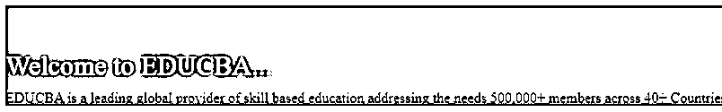
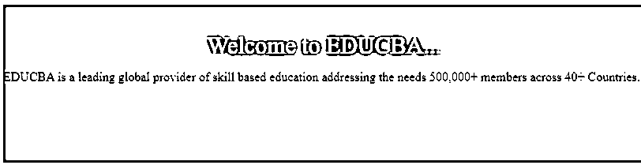
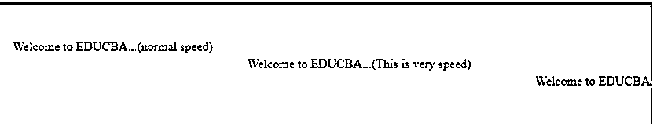
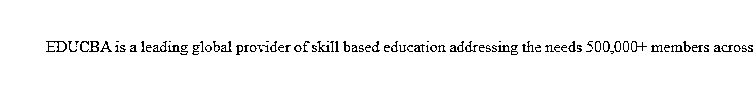

# HTML 字幕标签

> 原文：<https://www.educba.com/html-marquee-tag/>




## HTML Marquee 标签简介

HTML 中的 Marquee 标记用于在网页中的文本或图像上创建滚动，它允许所有类型的滚动，如从左到右、从右到左、从上到下和从下到上。这个标签在 HTML 中的语法是 <marquee direction="”up”" height="”150″" width="”250″" bgcolor="“white”">这是文本的滚动…</marquee> ，其中“marquee”标签用于描述所需滚动的属性。其他一些常用的字幕属性有 behaviour、hspace、scrollamount、scrolldelay、truespeed、vspace 等。

**语法:**

<small>网页开发、编程语言、软件测试&其他</small>

可以通过使用<marquee>元素来使用选框。语法可以写成如下所示:</marquee>

```
<html>
<body>
<marquee direction="up" height="150" width="250" bgcolor="white">This is scrolling of the text...</marquee>
</body>
</html>
```

### HTML 字幕标签的属性

以下是<marquee>标签支持的属性。</marquee>

1.  **行为:**滚动文本的动作，可以是值之一，包括交替、滚动、滑动。
2.  **bgcolor:** 它给出背景色。
3.  **方向:**用左、右、上、下值指定文本滚动的方向。默认方向值为左。
4.  **高度:**定义了字幕的高度。
5.  这个属性在 marquee 元素周围提供水平空间。
6.  **循环:**定义文本可以滚动多少次。如果默认值为-1，字幕将连续循环。
7.  **scrollamount:** 指定每个区间的滚动量。如果没有定义 scrollamount，则默认值为 6。
8.  **scrolldelay:** 以毫秒为单位给出滚动延迟。如果没有定义 scrollamount，则默认值为 6。
9.  **truespeed:** 用于表示 scrolldelay 值为 60。
10.  vspace: 这个属性提供了 marquee 元素周围的垂直空间。
11.  **宽度:**定义了字幕的宽度。

### HTML Marquee 标签的示例

以下是 HTML marquee 标签的示例，解释如下:

#### 示例# 1–左侧字幕

这种类型的字幕可用于从左侧移动内容。

**代码:**

```
<!DOCTYPE html>
<html>
<head>
<title>Left Marquee</title>
<style>
.mrq_class {
text-align:center;
}
.marq_class1 {
padding-top:25px;
padding-bottom:25px;
}
.txt {
font-size:30px;
font-weight:italic;
color:white;
padding-bottom:10px;
}
</style>
</head>
<body>
<div class = "mrq_class">
<marquee class="marq_class1" bgcolor = "grey" direction = "left" loop="" >
<div class="txt">Welcome to EDUCBA...</div>
<div>EDUCBA is a leading global provider of skill based education addressing the needs 500,000+ members across 40+ Countries.</div>
</marquee>
</div>
</body>
</html>
```

**输出:**

*   将上述代码保存在扩展名为. html 的文件中
*   在浏览器中运行 HTML 文件，您将得到如下图所示的输出




#### 示例 2–右字幕

这种类型的字幕可用于将内容移动到右侧。

**代码:**

```
<!DOCTYPE html>
<html>
<head>
<title>Right Marquee</title>
<style>
.mrq_class {
text-align:center;
}
.marq_class1 {
padding-top:25px;
padding-bottom:25px;
}
.txt {
font-size:30px;
font-weight:italic;
color:white;
padding-bottom:10px;
}
</style>
</head>
<body>
<div class = "mrq_class">
<marquee class="marq_class1" bgcolor = "grey" direction = "right" loop="" >
<div class="txt">Welcome to EDUCBA...</div>
<div>EDUCBA is a leading global provider of skill based education addressing the needs 500,000+ members across 40+ Countries.</div>
</marquee>
</div>
</body>
</html>
```

**输出:**




#### 示例 3–选框向上

这种类型的字幕可用于将内容向上移动。

**代码:**

```
<!DOCTYPE html>
<html>
<head>
<title>Up Marquee</title>
<style>
.mrq_class {
text-align:center;
}
.marq_class1 {
padding-top:25px;
padding-bottom:25px;
}
.txt {
font-size:30px;
font-weight:italic;
color:white;
padding-bottom:10px;
}
</style>
</head>
<body>
<div class = "mrq_class">
<marquee class="marq_class1" bgcolor = "grey" direction = "up" loop="" >
<div class="txt">Welcome to EDUCBA...</div>
<div>EDUCBA is a leading global provider of skill based education addressing the needs 500,000+ members across 40+ Countries.</div>
</marquee>
</div>
</body>
</html>
```

**输出:**




#### 示例 4–向下选取框

这种类型的字幕可用于将内容向下移动。

**代码:**

```
<!DOCTYPE html>
<html>
<head>
<title>Down Marquee</title>
<style>
.mrq_class {
text-align:center;
}
.marq_class1 {
padding-top:25px;
padding-bottom:25px;
}
.txt {
font-size:30px;
font-weight:italic;
color:white;
padding-bottom:10px;
}
</style>
</head>
<body>
<div class = "mrq_class">
<marquee class="marq_class1" bgcolor = "grey" direction = "down" loop="" >
<div class="txt">Welcome to EDUCBA...</div>
<div>EDUCBA is a leading global provider of skill based education addressing the needs 500,000+ members across 40+ Countries.</div>
</marquee>
</div>
</body>
</html>
```

**输出:**




#### 示例 5–嵌套字幕

这种类型的字幕可用于嵌套内容。

**代码:**

```
<!DOCTYPE html>
<html>
<head>
<title>Nested Marquee</title>
<style>
.mrq_class {
text-align:center;
}
.marq_class1 {
padding-top:25px;
padding-bottom:25px;
}
.txt {
font-size:30px;
font-weight:italic;
color:white;
padding-bottom:10px;
}
</style>
</head>
<body>
<div class = "mrq_class">
<marquee class="marq_class1" bgcolor = "grey" direction = "down" behavior="alternate" height="150" >
<marquee behavior="alternate"><div class="txt">Welcome to EDUCBA...</div></marquee>
<div>EDUCBA is a leading global provider of skill based education addressing the needs 500,000+ members across 40+ Countries.</div>
</marquee>
</div>
</body>
</html>
```

**输出:**




#### 示例 6–字幕的速度比较

marquee 元素的速度可以通过使用 scrolldelay 属性来指定。

**代码:**

```
<!DOCTYPE html>
<html>
<head>
<title>Nested Marquee</title>
<style>
.marq_class1 {
padding-top:25px;
padding-bottom:25px;
}
</style>
</head>
<body>
<marquee class="marq_class1" bgcolor = "grey" direction = "down" behavior="alternate" height="150" >
<marquee scrolldelay="80" scrollamount="7">Welcome to EDUCBA...(normal speed)</marquee>
<marquee scrolldelay="60" scrollamount="12" truespeed>Welcome to EDUCBA...(This is very speed)</marquee>
<marquee scrolldelay="250" scrollamount="4">Welcome to EDUCBA...(This is very slow)</marquee>
</marquee>
</body>
</html>
```

**输出:**




#### 示例 7–品牌背景颜色和空间

这种类型的字幕可用于设置字幕元素的背景颜色和间距。

**代码:**

```
<!DOCTYPE html>
<html>
<head>
<title>Marquee Background and Space</title>
<style>
.mrq_class {
text-align:center;
}
.marq_class1 {
padding-top:25px;
padding-bottom:25px;
}
</style>
</head>
<body>
<div class = "mrq_class">
<marquee class="marq_class1"  bgcolor="#d9d9ff" hspace="50" vspace="20">
<div>EDUCBA is a leading global provider of skill based education addressing the needs 500,000+ members across 40+ Countries.</div>
</marquee>
</div>
</body>
</html>
```

**输出:**




### 结论

到目前为止，我们已经学习了如何使用 marquee 标签在网页上创建滚动文本。用户可以很容易地在网站上创建水平或垂直滚动文本。此元素已被否决，将不再使用。为了产生滚动效果，将使用 CSS 或 JavaScript。

### 推荐文章

这是一个 HTML 字幕标签的指南。这里我们讨论 HTML Marquee 标签的基本概念、属性和各种代码实现示例。您也可以阅读以下文章，了解更多信息——

1.  [在 HTML 中嵌入标签](https://www.educba.com/embed-tag-in-html/)
2.  [HTML 中的画布标签](https://www.educba.com/canvas-tag-in-html/)
3.  [HTML 图标签](https://www.educba.com/html-figure-tag/)
4.  [HTML 中的框架标签](https://www.educba.com/frame-tag-in-html/)


