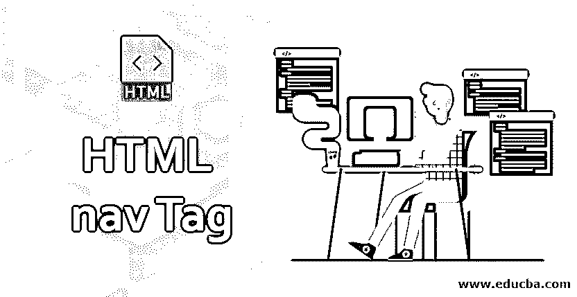
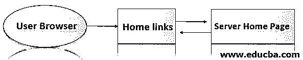
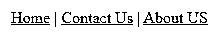
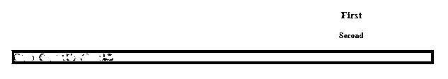
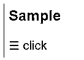
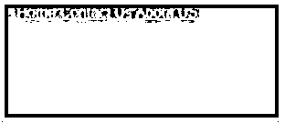

# HTML 导航标签

> 原文：<https://www.educba.com/html-nav-tag/>




## HTML 导航标签简介

HTML 有许多突出前端技术的特性，因为导航标签是 HTML5 版本的特性之一。在之前的版本中，Html 有不同的特性，但是在 Html 5 中，导航支持全局属性和事件属性。html 中的

<nav>标签是文档中的一组导航链接；并不是所有的链接都在

<nav>元素标签中，只是在导航链接中指定了标签的主要块。一般来说，网页都有关于导航链接的部分，供用户导航网站；这些链接是在导航标签中指定的。</nav>

</nav>

**语法:**

<small>网页开发、编程语言、软件测试&其他</small>

每个 Html 标签都有一个单独的语法，如下面的代码:导航标签的基本语法。我们也在 Html 和 CSS 样式中使用了

<nav>标签。</nav>

**HTML**

```
<nav>
< a href="/"   />
-------------------
</nav>
```

**CSS**

```
nav{
--some codes—
}
```

### HTML 中的导航标签是如何工作的？

用户在点击网页上的标签或菜单后发送请求。它将移动到另一个页面，以便服务器的响应将结果网页显示给用户。就像在 html 中一样，它会在一些 HTML 元素如<导航>标签的帮助下，从用户的角度分离 GUI 中的菜单或标签。

基于网页菜单/标签，一个 HTML 页面文档可以包含多个链接。在 HTML 中，导航一般包含两种类型，即水平导航和垂直导航。默认情况下，水平导航是基于用户需求加载的，它将转换为垂直或其他用户需求类型。




上图是通过导航链接对用户屏幕的基本理解。用户通过浏览器点击主页链接。网页链接只是 Html 标签，即:)[它将通过特定的网页。它将是客户端页面或服务器端页面，取决于项目。它将在用户浏览器屏幕中显示主页。](”/home”)

### HTML 导航标签的示例

下面是 HTML 导航标签的例子:

#### 示例#1

```
<html>
<body>
<nav>
<a href="/home/">Home</a> |
<a href="/contactus/">Contact Us</a> |
<a href="/about us/">About US</a>
</nav>
</body>
</html>
```

**输出:**




#### 实施例 2

```
<html>
<head>
<style>
nav {
border:2px;
background-color:#090;
color:green;
padding:5px;
}
n {
color:white;
font-size:10px;
}
.n1{
font-size:20px;
color:#090;
font-weight:bold;
text-align:center;
}
.n2 {
text-align:center;
color:#090;
margin:20px;
font-weight:bold;
}
</style>
</head>
<body>
<div class="n1">First</div>
<div class="n2">Second</div>
<nav>
<a href="/home/">Home</a> |
<a href="/contactus/">Contact Us</a> |
<a href="/about us/">About US</a>
</nav>
</body>
</html>
```

**输出:**




#### 实施例 3

```
<html>
<head>
<style>
body {
font-family: "Lato", sans-serif;
}
.sidenav {
height: 50%;
width: 3;
position: fixed;
z-index: 1;
top: 0;
left: 0;
background-color: #111;
overflow-x: hidden;
transition: 0.6s;
}
.sidenav n {
padding: 5px 8px 7px 22px;
font-size: 23px;
color: #818181;
transition: 0.6s;
}
.sidenav n:hover {
color: #f1f1f1;
}
.sidenav .close{
position: absolute;
top: 0;
right: 20px;
font-size: 18px;
margin-left: 40px;
}
@media screen and (max-height: 450px) {
.sidenav {padding-top: 15px;}
.sidenav n {font-size: 18px;}
}
</style>
</head>
<body>
<div id="first" class="sidenav">
<a href="javascript:void(0)" class="close" onclick="cN()">&times;</a>
<a href="#">Home</a>
<a href="#">Contact Us</a>
<a href="#">About US</a>
</div>
<h2>Sample</h2>
☰ click
<script>
function oN() {
document.getElementById("first").style.width = "300px";
}
function cN() {
document.getElementById("first").style.width = "1";
}
</script>
</body>
</html>
```

**输出:**







与前面的例子相比，我们使用了一些动画来吸引用户。

### 不同类型的导航菜单

一般来说，我们在 HTML 标签中有几种不同类型的菜单和习惯用法要考虑，比如<link>和

基于列表的导航菜单如下:

*   页面内导航菜单
*   网站导航菜单
*   上下文-上下文导航菜单
*   站点地图导航菜单
*   页码

#### 1.页面内导航菜单

指向网页上其他不同部分的单页链接的表格或内容。

**例子**

```
<nav>
<a href="/home/">Home</a> |
</nav>
```

#### 2.网站导航菜单

这是网页中最常见的菜单类型。它是站点或子集的自定义或用户定义的菜单类型，显示从站点层次结构中选择的选项。

**例子**

```
<nav>
<ul>
<li><a href="/home/">Home</a> </li>
<li><a href="/about us/">About Us</a> </li>
<li><a href="/contact us/">Contact Us</a> </li>
</nav>
```

#### 3.上下文导航菜单

这是一个构建文档内容的链接，它提供了与 html 文档的当前页面相关的更多信息。这种菜单的例子是一些新闻文章、银行网站；我们在网页应用程序中看到的任何东西都包含一个导航面板，我们将鼠标光标放在标签或菜单中。它会显示类似菜单的工具提示内容。

#### 4.网站地图导航菜单

这是一个菜单，看起来像弹出块无论用户点击页面的菜单或标签配置，或者他们需要一些额外的插件来配置新的窗口或页面的所有内容将与同一网站的地图。网站地图和网站搜索都有不同的特性，并在 Html 中提供。

#### 5.页码

在分页中，有时我们会看到网页会配置后端，以便在用户点击菜单或标签后在前端屏幕中加载大量文件。使用此选项分割成单独的页面。与导航相比，它是不同的，因为它通常与同一文档的后端链接，这导致在同一网页上显示更多的选项或进一步的信息。

### 结论

最后，我们有一个总结部分，通常每个版本的 html 都有不同的特性。HTML 4 不支持

<nav>标签，它将使用导航菜单，但 [HTML 5 支持](https://www.educba.com/what-is-html5/)导航菜单，还额外增加了<导航>标签。让它在未来的 HTML 版本中更加先进。</nav>

### 推荐文章

这是一个 HTML 导航标签的指南。这里我们讨论一下入门，HTML 中导航标签是如何工作的？不同类型的导航菜单和例子。您也可以看看以下文章，了解更多信息–

1.  [HTML 中的页脚标签](https://www.educba.com/footer-tag-in-html/)
2.  [HTML 有序列表](https://www.educba.com/html-ordered-list/)
3.  [跨度与分区](https://www.educba.com/span-vs-div/)
4.  [在 HTML 中嵌入标签](https://www.educba.com/embed-tag-in-html/)


