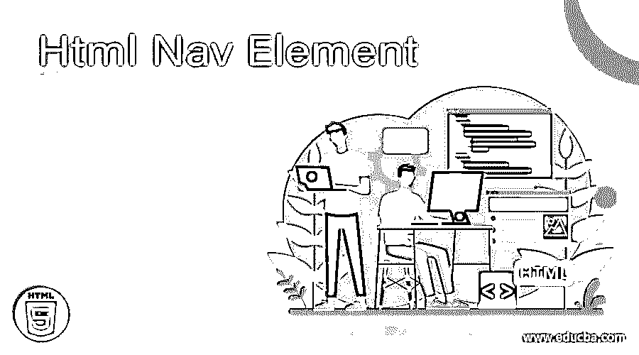
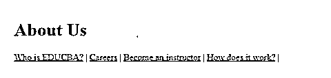
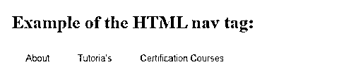
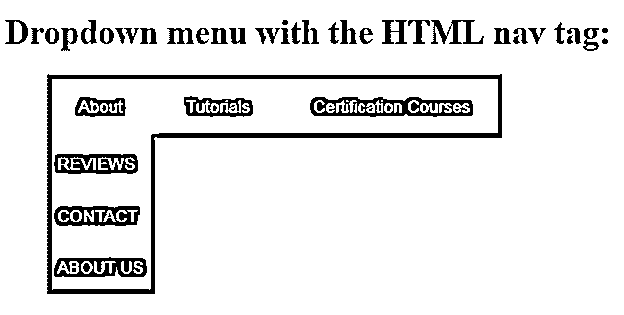
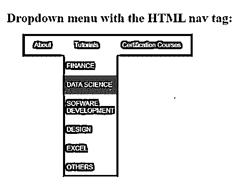
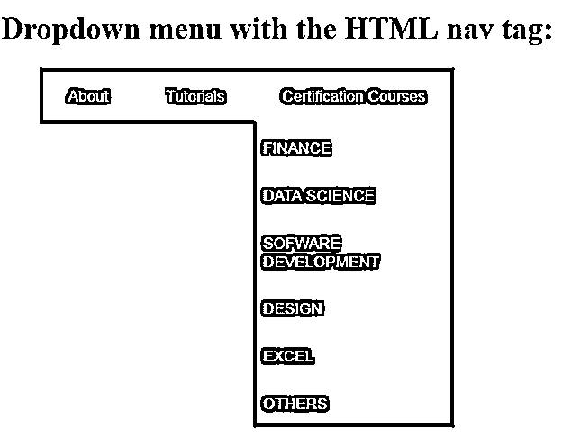

# Html 导航元素

> 原文：<https://www.educba.com/html-nav-element/>




## Html 导航元素简介

HTML 文档中的导航元素

<nav>标签用于指定包含在同一文档或任何其他文档中的导航链接块。展示导航块的例子有索引、目录、菜单等。一个 HTML 文档可以包含任意多的标签，比如站点导航、页面内导航等等。

<nav>标签也用于声明 HTML 文档中的导航部分。大多数网站通常更喜欢有专门的导航链接，允许用户在网站上导航。这些链接可以放在导航标签中。在这个主题中，我们将学习 Html 导航元素。</nav>

</nav>

**注:**

<small>网页开发、编程语言、软件测试&其他</small>

*   HTML 文档中提到的所有链接都没有放在

    <nav>元素中；它只包括主要的导航块。它也可以用来定义网站页脚的链接，但是

    标签通常用在这种情况下。

    </nav>

*   不允许将

    <nav>HTML 元素嵌套在

    <address>元素中。</address>

    </nav>

*   HTML5 中的导航标签需要开始和结束标签，即

    <nav>……..</nav>

**语法:**

**HTML/XHTML**

```
<body>
<nav> ... </nav>
<body>
```

**CSS**

```
nav{
--your css code—
}
```

### 使用

<nav>标签</nav>

标签用于主要的导航区域，比如页面顶部的主菜单。一个文档可以有许多

<nav>元素，即一个用于站点导航，一个用于页面内导航，等等。

<nav>标签中的链接可以是 ul 列表中的代码，也可以简单地编码为没有 ul 元素的独立链接。这个标签有助于更容易地创建导航菜单、整洁的文本链接水平菜单或帮助屏幕阅读软件，以正确识别文档中的主要导航区域。</nav>

</nav>

**标签特定属性**

没有与

<nav>标签一起使用的特定属性。</nav>

**全局属性**

像所有其他 HTML 标签一样，

<nav>标签也支持 HTML5 中的全局属性。</nav>

以下是全局属性:

*   奥纳博特
*   在自动完成时，
*   onautocompleteerror，
*   onblur，
*   oncancel,
*   oncanplay，
*   在线播放，
*   onchange 先生，
*   onclick，
*   无绳，
*   oncontextmenu，
*   oncuechange，
*   翁布里克(ondblclick)，
*   无法忍受，
*   无法忍受，
*   ondragonter，
*   ondragexit，
*   软骨叶，
*   翁德拉戈弗，
*   ondragstart，
*   ondrop,
*   ondurationchange，
*   一次尝试，
*   有一天，
*   不规则，
*   专注，
*   oninput，
*   on 无效，
*   onkeydown，
*   onkeypress,
*   onkeyup,
*   加载时，
*   onloadeddata，
*   onloadedmetadata，
*   onloadstart，
*   onmousedown，
*   在 mouseenter，
*   onmouseleave，
*   onmousemove，
*   onmouseout，
*   onmouseover，
*   是 mouseup，
*   onmousewheel，
*   因为，
*   播放时，
*   播放时，
*   onprogress,
*   在最新变化中，
*   onreset,
*   onresize,
*   在滚动中，
*   被发现了，
*   在看的时候，
*   onselect,
*   昂秀，
*   onsort，
*   已安装，
*   onsubmit(美国麻省理工学院)，
*   暂停，
*   ontimeupdate，
*   ontoggle,
*   on volume exchange，
*   等待中

**事件属性**

没有与

<nav>标签一起使用的事件属性。</nav>

**CSS 文本格式属性在<导航>标签:**

*   文本颜色
*   文本对齐
*   文本装饰
*   文本转换
*   行高
*   文本方向
*   文本阴影
*   单词间距

**CSS 字体属性在<导航>标签**中

*   字体样式–正常|斜体|倾斜|首字母|继承
*   字体变体–正常|小型大写字母|首字母|继承
*   font-weight–normal | bold | bold | light | number | initial | inherit
*   font-size–medium | xx-small | x-small | small | large | x-large | xx-large | small | large | length | initial | inherit
*   字体系列–系列名称|通用系列|首字母|继承

**CSS 测试<导航>标签**的阴影属性

```
<style>
address{
text-shadow: 1px 1px #FF0000;
}
</style>
```

### **例题**

下面举几个例子

#### 示例#1

在 HTML 元素的帮助下，我们可以在单个语义元素中使用一组链接，这有助于创建有组织的网站。

```
<!DOCTYPE html>
<html>
<head>
<title>HTML Nav tag</title>
</head>
<body>

<h1>About Us</h1>

<nav>
<a href="https://www.educba.com/about-us/">Who is EDUCBA?</a> |
<a href="https://www.educba.com/careers/">Careers</a> |
<a href="https://www.educba.com/instructors/">Become an instructor</a> |
<a href="https://www.educba.com/how-it-works/">How does it work?</a> |
</nav>
</body>
</html>
```

**输出:**




#### 实施例 2

HTML 标签帮助用户导航到网站的主要部分。

```
<!DOCTYPE html>
<html>
<head>
<style>
nav{
display:flex;
flex-wrap:wrap;
}
nav a {
text-decoration: none;
display:block;
padding: 15px 25px;
text-align: center;
background-color: rgb(213, 216, 220);
color:#566573;
font-family:sans-serif;
}
nav a:hover {
background-color: #566573;
color:#ffffff;
}
</style>
</head>
<body>
<h1>Example of the HTML nav tag:</h1>
<nav>
<a href="https://www.educba.com/about-us/">About</a>
<a href="https://www.educba.com/tutorials/">Tutorials</a>
<a href="https://www.educba.com/courses/">Certification Courses</a>
</nav>
</body>
</html>
```

**输出:**




#### 实施例 3

目录和菜单是 HTML 元素的好例子。

```
<!DOCTYPE html>
<html>
<head>
<style>
nav ul ul {
display: none;
}
nav ul li:hover > ul {
display: block;
}
nav ul:after {
clear: both;
display: block;
}
nav ul li {
float: left;
position:relative;
list-style-type:none;
}
nav ul li:hover {
background: rgb(52, 73, 94);
}
nav ul li:hover a {
color: #fff;
}
nav ul li a {
display: block;
padding: 20px 30px;
color: #ffffff;
text-decoration: none;
background-color:rgb(40, 55, 71 );
font-family: sans-serif;
}
nav ul ul {
background: #5f6975;
padding: 0;
position: absolute;
top: 100%;
}
nav ul ul li {
float: none;
position: relative;
}
nav ul ul li a {
padding: 15px 10px;
color: #ffffff;
text-transform: uppercase;
}
nav ul ul li a:hover {
background: rgb(27, 38, 49);
}
</style>
</head>
<body>
<h1>Dropdown menu with the HTML nav tag:</h1>
<nav>
<ul>
<li>
<a href="https://www.educba.com/about-us/">About</a>
<ul>
<li>
<a href="#">Reviews</a>
</li>
<li>
<a href="#">Contact</a>
</li>
<li>
<a href="#">About Us</a>
</li>
</ul>
</li>
<li>
<a href="https://www.educba.com/tutorials/">Tutorials</a>
<ul>
<li>
<a href="#">Finance</a>
</li>
<li>
<a href="#">Data Science</a>
</li>
<li>
<a href="#">Sofware Development</a>
</li>
<li>
<a href=#">Design</a>
</li>
<li>
<a href="#">Excel</a>
</li>
<li>
<a href="#">Others</a>
</li>
</ul>
</li>
<li>
<a href="https://www.educba.com/courses/">Certification Courses</a>
<ul>
<li>
<a href="#">Finance</a>
</li>
<li>
<a href="#">Data Science</a>
</li>
<li>
<a href="#">Sofware Development</a>
</li>
<li>
<a href=#">Design</a>
</li>
<li>
<a href="#">Excel</a>
</li>
<li>
<a href="#">Others</a>
</li>
</ul>
</li>
</ul>
</nav>
</body>
</html>
```

**输出:**










**浏览器支持:**在 HTML5 中，section 标签是新增的，它在浏览器中也受到支持，如下所示:

*   谷歌浏览器 6.0
*   Internet Explorer 9.0
*   火狐 4.0
*   Opera 11.1
*   Safari 5.0

### 结论- Html 导航元素

下面是一些你应该记住的主题要点:

*   HTML5 中的

    <nav>元素表示页面的一部分，其全部目的是提供导航链接，无论是在同一个文档中还是在任何其他文档中。元素中的链接可以指向其他网页或同一网页的不同部分。导航元素的常见例子有表格、菜单、索引和目录。</nav>

*   HTML 元素可以用于结构的主要导航。
*   一些开发人员可能会使用

    <nav>HTML 元素进行导航和分页。</nav>

*   本质上，如何在 HTML 文档中使用

    <nav>元素是您自己的看法。</nav>

*   HTML 元素是一个块级元素。

### 推荐文章

这是一个 Html 导航元素的指南。这里我们讨论标签和属性的使用，以及例子和要点。您也可以看看以下文章，了解更多信息–

1.  [HTML 音频标签](https://www.educba.com/html-audio-tag/)
2.  [HTML 中的画布标签](https://www.educba.com/canvas-tag-in-html/)
3.  [HTML 中的滚动条](https://www.educba.com/scrollbar-in-html/)
4.  [HTML 中的光标](https://www.educba.com/cursor-in-html/)


