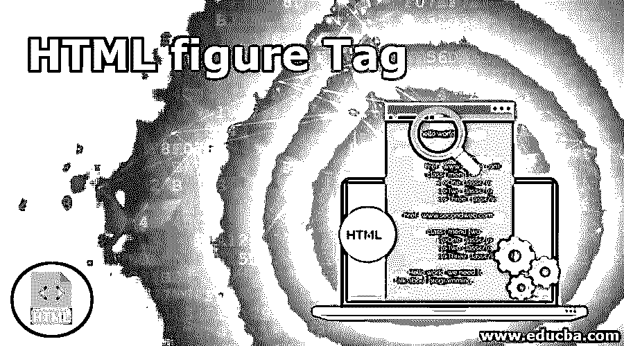
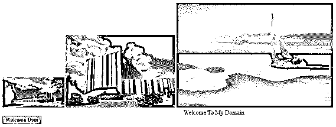

# HTML 图形标签

> 原文：<https://www.educba.com/html-figure-tag/>




## HTML 图形标签简介

Html 使用了许多标记来突出网站，每个标记都有自己的特性和 html 预定义元素的特点。

也是 html 标签中的一个，用来屏蔽 html 元素，它用来分隔网页上用户内容的空间区域，不受其他 html 导航网页的影响。它主要用于分隔网页上的空间，用于图像、视频和一些用户网页内容。它被用在大多数网站上，并被前端开发人员用来识别代码的问题。

**语法:**

<small>网页开发、编程语言、软件测试&其他</small>

标签

的语法与它将[使用的 html 预定义标签相同，比如自定义标签](https://www.educba.com/custom-tags-in-jsp/)。

```
<html>
<body>

----some presentation codes like image,videos and animations inserted-----

</body>
</html>
```

上面的代码显示，我们在 html 文档中使用了 figure 标签；我们将使用图像、视频或动画等。;根据用户的要求，我们将创建和设计网页。

### 如何使用 HTML 图形标签？

**1。**在 html 中，figure 标签主要代表独立 HTML 内容上的独立焦点，它将用于创建网站和更多潜在的焦点选项，如为网站中的图像、视频和动画内容添加标题。这些东西都是有焦点的，而且是用< figcaption > html 元素显示在网页上的。figcaption 用于捕获文本和图片等内容，视频格式是指网页文档的单个单元。

**2。**html 文档基于用户需求和我们使用的图片、视频等吸引人的特性。我们还可以使用插图、图表、流程图等一些网页中的代码片段；它还与 html 文档的主应用流程相关联，它将移动到网页中文档的另一部分，如索引、附录等。而不影响 html 导航的主流。在 figcaption 选项中，元素将用于在父子关系中插入节点；节点也使用文档的第一个和最后一个子节点插入。

**3。**该元素旨在为所有文档区域使用标记的所有连接词。html 内容不受文档主流的影响。html 流内容的位置独立于 html 主工作流。<图>标签将接受 html 文档的一些特定属性和 html 元素的默认行为。像“accesskey、class、contenteditable、contextmenu、dir、draggable、dropzone、hidden、id、itemid、itemprop、itemref、itemscope、itemtype、lang、spellcheck、style、tabindex、title、translate”这样的属性，当在 html 文档中的 figure 标记中使用每个属性时，这些属性的行为会有所不同。

**4。**图标签也将用于内容属性的事件处理机制；它接受特定事件处理程序的特定属性。特定属性和事件处理程序的名称是相同的。它通常用作 html 元素功能及其特性的范围。在特定事件属性内容的帮助下，它告诉用户浏览器运行的是 JavaScript 这样的特定脚本。通常，JavaScript 需要插入双引号中。

**5。**我们使用了与 HTML 中的<图>元素相同的<和>标签元素，但是这两个标签之间有一些区别。如果 html 内容显示在网页中是用来简单地与网页相关，但在网站中不是必不可少的我们可以使用<抛开>标签，但 html 内容是必不可少的它在网页中的位置不被认为是网站的主要用途我们可以使用<图>标签。所以根据用户的需求，我们可以同时使用这两个标签，从用户的角度来看，这样会更方便。

**6。**如果假设我们使用横幅广告之类的图片图标签没有帮助，我们可以使用< img >标签作为 html 预定义标签元素的替代来源。通常，< figcaption >会有选择地出现在 html 文档和网页中，它可能用在 html<fig>标签规范的前面或后面。只有一个< figcaption >元素会用在< figure >元素的内部；此外，它还嵌套了其他一些子标签元素，如< img >等。，将在<图的>元素中多次使用。

### 实现 HTML 图形标签的例子

下面是 HTML 图标签的例子:

#### 示例#1

**代码:**

```
<html>
<body>


</body>
</html>
```

**输出:**


#### 实施例 2

**代码:**

```
<html>
<body>


Welcoe To My Domain <a href="https://pixabay.cimg/search/nature/">Welcome User</a>

</body>
</html>
```

**输出:**


#### 实施例 3

**代码:**

```
<html>
<body>


<marquee>Welcome To My Domain</marquee>
<button type="buttton" onclick="alert('Good Day')">Welcome User</button>

</body>
</html>
```

**输出:**




上面的例子将看到 html 网页中的图形标签以不同的方式使用，我们可以看到第一个例子通常是在 html 主体中使用的图形标签元素，具有固定的宽度和长度，它将输出显示为固定格式的图像第二个例子与第一个相同，但另外使用了多个 img 标签及其属性。最后一个例子是我们点击按钮时使用的附加警报菜单，它完全隐藏了用户印象深刻的方法，但基于用户需求，我们可以添加附加功能，无论我们经常使用我们的网页对业务有何影响。不仅仅是 javascript，我们还可以使用一些其他的前端脚本；此外，它将支持 javascript 库，如 jqueries、Reactjs 等。

### 结论

我们可以在网页上使用大部分的 html 标签，为用户提供令人印象深刻和吸引人的商业模式。尽管我们在

标签元素中有许多可能性，但当我们将它与其他标签(如

元素)进行比较时，它通常与其他类似的标签相比，具有一些特性和优点。它还支持浏览器兼容模式和 html5 版本。


### 推荐文章

这是一个 HTML 图形标签的指南。在这里，我们讨论 HTML figure 标记的介绍及其示例，以及代码实现和输出。您也可以浏览我们推荐的文章，了解更多信息——

1.  [HTML 中的 Span 标签](https://www.educba.com/span-tag-in-html/)
2.  [HTML 中的 SUP 标签](https://www.educba.com/sup-tag-in-html/)
3.  [HTML 中的 div 标签](https://www.educba.com/div-tag-in-html/)
4.  [HTML 中的画布标签](https://www.educba.com/canvas-tag-in-html/)


