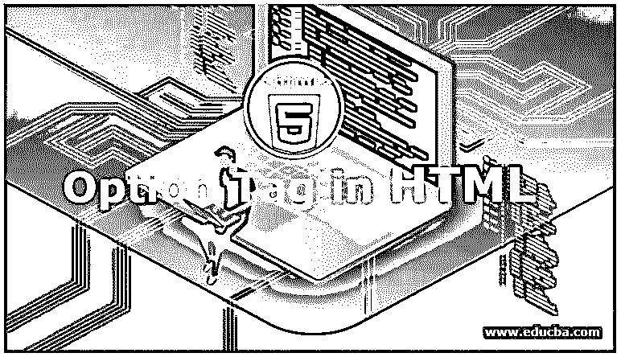
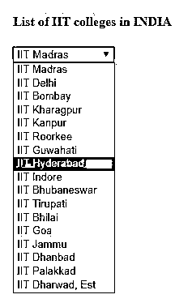
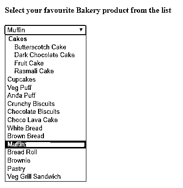
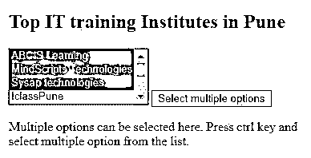

# HTML 中的选项标记

> 原文：<https://www.educba.com/option-tag-in-html/>




## HTML 中的选项标签介绍

选项标签是 HTML 中最有用的元素，它在下拉列表中用来从选择列表中选择特定的用户首选项。一次，一个用户可以从给定列表中选择一个或多个选项。这是 HTML 中选项标签的主要好处。<option>元素总是包含在标签内。或者标签 e =也被称为 <datalist>…</datalist> 。对于单个选项，可以使用</option><option>元素，而对于多个选项，我们可以使用 HTML 的一个名为</option><optgroup>的属性，只要用户打算通过脚本调用 datalist 或将数据发送到服务器，那么在</optgroup>

<form>标签中使用<select>标签。</select></form>

### 语法示例

下面是帮助我们确定选项标签在网页或 HTML 中的确切位置的语法。

<small>网页开发、编程语言、软件测试&其他</small>

**语法:**

```
<select>
<option value=""> option1 </option>
<option value=""> option2 </option>
<option value=""> option3 </option>
<option value=""> option4 </option>
</select>
```

如上语法所示，是一个用来创建 datalist 的标签。<option>标记括在选择标记中的是一个属性值或用于选择列表的属性，该值将用于显示选项是否被选中、禁用或带有任何其他属性。选项 1，2…将是名字。</option>

在 CSS 的帮助下，我们可以给我们的选择列表添加效果，能够设置相对、绝对等位置。，能够设置宽度和做许多其他功能。下拉列表的位置定义为两个值，position relative 用于在选择列表按钮的正下方显示列表内容。借助位置:绝对；

**举例:**

这将限制用户从选择列表中选择一个选项。

```
<select name="State">
<option value="MH">Maharashtra</option>
<option value="GJ"> Gujarat </option>
<option value="MP"> Madhya Pradesh </option>
<option value="RJ">Rajasthan </option>
<option value="AP">Andhra Pradesh </option>
</select>
```

同样，众所周知，我们也可以在选择列表中选择多个选项。

**语法:**

```
<select multiple>
<option value=""> option1 </option>
<option value=""> option2 </option>
<option value=""> option3 </option>
<option value=""> option4 </option>
</select>
```

**相同语法的一个例子如下:**

```
<select name="laptops" multiple>
<option value="hp">HP</option>
<option value="dell">Dell</option>
<option value="lv">Lenovo</option>
<option value="sony">Sony </option>
</select>
```

### HTML 中选项标记的属性

<option>标签支持的具体属性如下:</option>

*   **禁用:**该属性通过设置真、假形式的布尔值来使用。如果设置为真，那么列表中的选项将被禁用；否则就是假的。
*   **label:** 假设我们要给一些文本作为标签，那么就有可能变成 option 标签。它将认为是该元素的一个值。
*   **selected:** 在网页设计中，有些情况下我们希望在显示视图中显示已经选中的选项。因此，通过设置选项的属性，可以在列表中显示选择的选项。从列表中只能显示一个选定的项目。
*   **值:**用户也可以设置选择列表中选项的值。

### **HTML 中**选项**标签的例子**

以下是 HTML 中选项标签的不同示例:

#### 示例#1

这是包含<option>标签的选择列表的简单示例。</option>

**代码:**

```
<!DOCTYPE html>
<html>
<head>
<title>Option tag in HTML</title>
</head>
<body>
<h4>List of IIT colleges in INDIA</h4>
<form>
<select name = "dropdown">
<option value = "im" >IIT Madras</option>
<option value = "id" >IIT Delhi</option>
<option value = "ib" >IIT Bombay </option>
<option value = "ikh" >IIT  Kharagpur</option>
<option value = "ikn">IIT Kanpur</option>
<option value = "ir" >IIT Roorkee</option>
<option value = "ig" >IIT Guwahati</option>
<option value = "ih">IIT Hyderabad </option>
<option value = "ii">IIT Indore</option>
<option value = "ib">IIT Bhubaneswar</option>
<option value = "it" >IIT Tirupati</option>
<option value = "ib">IIT Bhilai</option>
<option value = "ig">IIT Goa</option>
<option value = "ij" >IIT Jammu</option>
<option value = "idb">IIT Dhanbad </option>
<option value = "ip">IIT Palakkad</option>
<option value = "idhe">IIT Dharwad, Est</option>
</select>
</form>
</body>
</html>
```

**输出:**




#### 实施例 2

显示<option>标签的示例，该标签使用诸如选择、禁用、</option><optgroup>等值</optgroup>

**代码:**

```
<!DOCTYPE html>
<html>
<head>
<title>Option tag in HTML</title>
</head>
<body>
<h4>Select your favourite Bakery product from the list</h4>
<form>
<select name = "dropdown">
<optgroup label="Cakes">
<option value = "BS" >Butterscotch Cake</option>
<option value = "DC" >Dark Chocolate Cake</option>
<option value = "FC" >Fruit Cake</option>
<option value = "RC" >Rasmali Cake</option>
</optgroup>
<option value = "cc">Cupcakes</option>
<option value = "vp" required>Veg Puff</option>
<option value = "ap" disabled>Anda Puff</option>
<option value = "cb">Crunchy Biscuits </option>
<option value = "cob">Chocolate Biscuits</option>
<option value = "clc">Choco Lava Cake</option>
<option value = "wb" >White Bread</option>
<option value = "bb">Brown Bread</option>
<option value = "mf" selected>Muffin</option>
<option value = "br" >Bread Roll</option>
<option value = "bw">Brownie </option>
<option value = "ps">Pastry</option>
<option value = "vgs">Veg Grill Sandwich</option>
</select>
</form>
</body>
</html>
```

**输出:**




#### 实施例 3

在本例中，我们将从数据列表中选择多个选项。

**代码:**

```
<!DOCTYPE html>
<html>
<body>
<h2>Top IT training Institutes in Pune </h2>
<form id="multidd">
<select id="multiselectopt">
<option> ABCIS Learning </option>
<option> MindScripts Technologies </option>
<option> Sysap technologies </option>
<option> IclassPune</option>
<option>  IIHT</option>
<option> Magneto Academy </option>
<option> Certification Guru </option>
<option> I Cert Global </option>
<option> Technogeeks </option>
</select>
<input type="button" onclick="multipleFunc()" value="Select multiple options">
</form>
<p>Multiple options can be selected here. Press ctrl key and select multiple option from the list.</p>
<script>
function multipleFunc() {
document.getElementById("multiselectopt").multiple = true;
}
</script>
</body>
</html>
```

**输出:**




### 结论

从以上所有信息中，我们知道选择列表或数据列表中的<option>标签负责根据用户的选择来选择选项。用户可以从下拉列表中选择一个或多个选项。如果我们有多个选项包含在列表中，我们可以把它分成</option><optgroup>元素。</optgroup>

### 推荐文章

这是 HTML 中选项标签的指南。这里我们讨论 HTML 中选项标签的基本概念、语法、属性和例子。您也可以看看以下文章，了解更多信息–

1.  [基本 HTML 标签](https://www.educba.com/basic-html-tags/)
2.  [HTML 中的画布标签](https://www.educba.com/canvas-tag-in-html/)
3.  [HTML 图标签](https://www.educba.com/html-figure-tag/)
4.  [HTML 中的框架标签](https://www.educba.com/frame-tag-in-html/)


