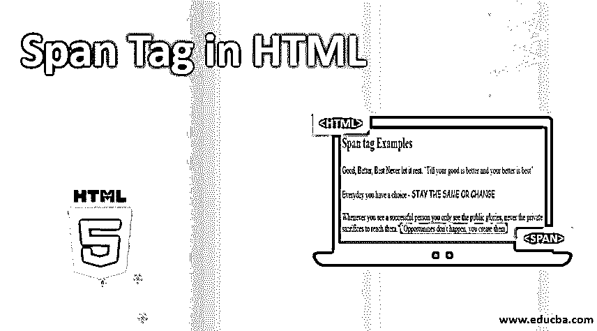
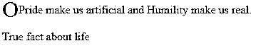
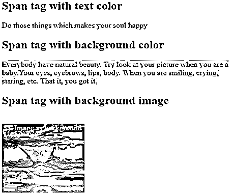
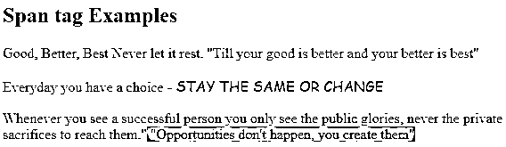
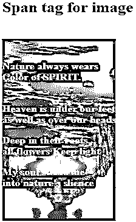

# HTML 中的 Span 标记

> 原文：<https://www.educba.com/span-tag-in-html/>




## HTML 中的 Span 标签介绍

HTML 中的 Span 标记被视为行内元素。它类似于 div 标记，但是 div 标记专门用于块级元素，而 span 用于内联元素。它主要用于用户想要将内联元素分组到他们的代码结构中的时候。HTML 中的 Span 标记用于通过使用 elements class 或 id 属性为特定内容提供样式。在 HTML 文档中使用 span 标签本身是不可能改变视觉效果的。它在 HTML 文档中作为一个内嵌标签。在代码中使用 span 标记有助于减少代码和 HTML 属性。

### 语法示例

定义 span 标签的语法如下:

<small>网页开发、编程语言、软件测试&其他</small>

**语法:**

```
 Contents 
```

*   如上所示，包含在开始标签和结束标签中的语法文本被认为是 span 属性。
*   这主要用于对行内元素进行分组。它有助于最小化 HTML 文档中的代码。
*   它的工作方式类似于 div 标记，但主要区别是 div 是作为块级元素工作的，而 span 标记是作为 HTML 中的内联标记工作的。
*   span 标签本身不能提供视觉变化。
*   它适用于标签，如*、**、<u>、<color>、<font family="">、<background-color>等等。</background-color></font></color></u>***
*   这个标签不能创建一个换行符，但是它给了用户一个机会来将事物与其他元素分开。因此，可以只对选定的文本进行修改，而不是对整个代码进行修改。
*   它只占用所需的宽度，而不是占用容器中的整个可用宽度。span 标签的最好例子是属性和图像。它为一些显示 span 标签用法的文本使用容器。
*   它不需要编码中的某些特定属性；借助一些常用的 CSS 和类，我们可以定义一个 span 标签。
*   我们可以突出显示一些特定的文本，对文本应用背景颜色，并使用 HTML 的 span 标签为文本添加背景图像。
*   也可以使用 span 标签改变文本的字体。它将帮助负责改变字体大小，颜色，背景颜色，字体风格等。

**举例:**

```
<!DOCTYPE html>
<html>
<head>
<title>Span tag in HTML </title>
<style>
.demo {
color: blue;
font-size: 200%;
position: relative;
top: 5px;
}
</style>
</head>
<body>
<p>ОPride make us artificial and Humility make us real.</p>
<p>True fact about life </p>
</body>
</html>
```

**输出:**




*   Span 标记没有任何特定的属性；和其他标签一样，它也支持全局属性和事件属性。

### HTML 中 Span 标记的属性

下面是一些用应用样式的属性。这些建议如下:

*   **CSS font-style:** 用于给定文本应用样式。文本应该是正常的，斜体，首字母，继承等。
*   CSS font-family: 用于将给定列表中的不同字体类型应用于特定文本。
*   **CSS font-size:** 给文本**设置字体大小很有帮助。**
*   CSS font-weight: 这个属性用来设置字体是加粗还是加粗。
*   **CSS text-transform:** 它会使文本大写。
*   **CSS text-decoration:** 该属性用于以文本装饰线条、文本装饰颜色等形式装饰文本。
*   **CSS color:**span 标签的这个属性用来给文本内容和[文本装饰](https://www.educba.com/text-decoration-css/) **上色。**
*   CSS 背景色:这是一个设置元素背景色的有用属性。
*   CSS 文本阴影:这个属性允许用户给文本添加阴影。
*   CSS text-align-last: 这将有助于文本的对齐。
*   **CSS word-spacing:**span 标签中的这个属性用来管理单词之间的间距。
*   CSS 空白字符:这个属性帮助我们处理指定元素中的空白字符。
*   **CSS line-height:** 在 HTML 代码中提供行的高度。
*   这个属性帮助我们定义实际的换行位置。
*   CSS text-overflow: 这是 span 标签最有用的属性，它帮助我们识别未显示的溢出内容，这些内容应该向用户发出信号。

### HTML 中的 Span 标签示例

html 中的 span 标签示例如下:

#### 示例#1

**代码:**

```
<!DOCTYPE html>
<html>
<head>
<title>HTML Span Tag</title>
</head>
<style>
.imgdemo {
padding-left:25px;
background:url(./Content/data/2.jpg) no-repeat top left;
display: inline-block;
height: 150px;
width: 150px;
}
</style>
<body>
<!-- span tags with inline style/css  -->
<h2>Span tag with text color</h2>

Do those things which makes your soul happy 
<br>
<h2> Span tag with background color</h2>

Everybody have natural beauty. Try look at your picture when you are a baby. Your     eyes, eyebrows, lips, body. When you are smiling, crying, staring, etc. That it, you got     it.
<br>
<h2> Span tag with background image</h2>
<br>

Image as background
</body>
</html>
```

**输出:**




#### 实施例 2

**代码:**

```
<!--Example 2-->
<!DOCTYPE html>
<html>
<head>
<title>HTML Span Tag</title>
</head>
<body>
<h2> Span tag Examples</h2>
<p>Good, Better, Best Never let it rest.
 "Till your good is better and your better is best" </p>
<p>Everyday you have a choice -
STAY THE SAME OR CHANGE    
</p>
<p>Whenever you see a successful person you only see the public glories, never the private sacrifices to reach them."
"Opportunities don't happen, you create them" </p>
</body>
</html>
```

**输出:**




#### 实施例 3

**代码:**

```
<!DOCTYPE html>
<html>
<style>
.spandemo {
background:url(./Content/data/3.jpg) no-repeat top left;
display: inline-block;
padding-top: 20px;
width: 1800px;
height: 500px;
}
</style>
<body>
<h2> Span tag for image</h2> <br>

<p> Nature always wears<br> Color of SPIRIT. </p> <br>
Heaven is under our feet <br>as well as over our heads <br>
<p> Deep in their roots,<br>all flowers Keep the light </p>
<p> My soul steers me<br> into nature's silence</p>

</body>
</html>
```

**输出:**




### 结论

从以上所有信息中，我们了解到 HTML 中的标签是用来为内联元素提供样式的。人们可以将这个样式属性分组，并以内联方式指定它们。Span 标签主要用于在内联 CSS 的帮助下在我们的网页上安排结构部分和适当的布局部分。

### 推荐文章

这是一个在 HTML 中使用 Span 标签的指南。这里我们讨论 span 标签的基本概念、属性，以及不同的例子及其代码实现。您也可以阅读以下文章，了解更多信息——

1.  [选择 HTML 中的标签](https://www.educba.com/select-tag-in-html/)
2.  [在 HTML 中嵌入标签](https://www.educba.com/embed-tag-in-html/)
3.  [HTML 内嵌块](https://www.educba.com/html-inline-block/)
4.  [HTML 中的画布标签](https://www.educba.com/canvas-tag-in-html/)


