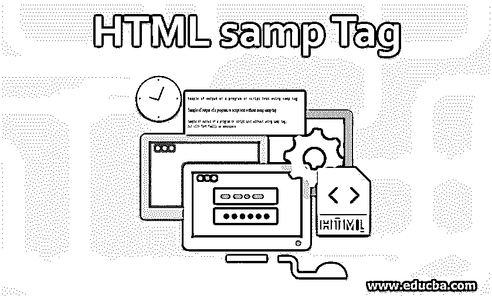
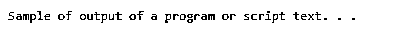
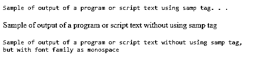
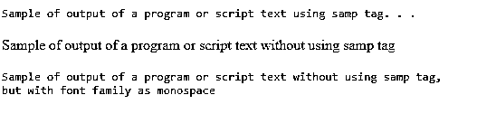
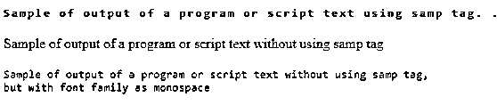

# HTML samp 标签

> 原文：<https://www.educba.com/html-samp-tag/>




## HTML samp 标签简介

通常需要在 web 页面上以适当的字体样式和格式显示程序或源代码的输出，这将正确地表示输出的样本。HTML 提供了短语标签来代表具有某种结构意义的文本块。samp 是 HTML 中提供的标签之一，用于以适当的格式表示程序或脚本输出的样本。使用这个标签，可以在不使用任何外部 CSS 或样式组件的情况下，将文本显示为程序的样本输出。

**语法:**

<small>网页开发、编程语言、软件测试&其他</small>

就像 Html 中的其他短语标记一样，samp 标记的语法非常简单。下面是 samp 标签的语法，

```
<samp> . . . . . </samp>
```

samp 标签的语法以开始标签<samp>开始，以结束标签</samp>结束。两个标签之间的空间将包含我们希望显示为程序或脚本输出的文本，如下所示，

```
<samp> Sample of output of a program or script text. . . </samp>
```

**属性:**

samp 标记没有任何可用的特定属性或特殊属性，但它支持 HTML 中现有的可用全局属性和事件属性。

### 实现 HTML samp 标记的示例

默认情况下，samp 标签将内容显示为内联，并且通常使用浏览器支持的等宽字体显示其中的文本。

#### 示例#1

让我们首先看看 samp 标签实现的简单例子。

**代码:**

```
<!DOCTYPE html>
<html>
<head>
<title> samp tag in HTML </title>
</head>
<body>
<samp> Sample of output of a program or script text. . . </samp>
</body>
</html>
```

**输出:**




这里，我们有一个简单的标签 samp，其中包含了示例文本。输出自动以等宽字体打印。

#### 实施例 2

让我们将使用 samp 标记产生的文本输出与普通文本进行比较。

**代码:**

```
<!DOCTYPE html>
<html>
<head>
<title> samp tag in HTML </title>
<style>
.sample {
font-family: monospace;
}
</style>
</head>
<body>
<samp> Sample of output of a program or script text using samp tag. . . </samp>
<br>
<br>
<div> Sample of output of a program or script text without using samp tag </div>
<br>
<div class = "sample"> Sample of output of a program or script text without using samp tag,
<br> but with font family as monospace </div>
</body>
</html>
```

**输出:**




这里，我们用三种不同的样式显示了输出。在 body 标签中，我们基本上有三行文本，它们将使用不同的样式打印。第一个输出是通过使用类似于第一个例子的 samp 标记。然后，我们将它的输出与正常文本进行了比较，这可以在第二行中看到。在第三行中，我们使用了样式元素来实现与 samp 元素相同的效果。我们已经使用样式作为字体系列作为 monospace，它将显示类似于 samp 标签的输出。

请注意我们是如何使用一些 CSS 样式实现类似 samp 标签的效果的。在网站开发中，不强制建议使用 samp 标签，因为使用现代 CSS 样式元素可以达到相同的效果。在现代网站开发中，我们可以使用它们来达到比 samp 标签更好的效果。这并不意味着不赞成使用 samp 标记，而是取决于网站开发人员的选择；它可以用在使用非常简单的标记而不使用任何复杂的样式就能达到效果的地方。

#### 实施例 3

还可以在 samp 标签上应用 CSS 效果，因为它已经支持全局属性，如前所述。让我们在示例中向现有的 samp 元素添加一些 CSS 样式。

**代号:**

```
<!DOCTYPE html>
<html>
<head>
<title> samp tag in HTML </title>
<style>
.sample {
font-family: monospace;
}
samp {
font-weight: bold;
}
</style>
</head>
<body>
<samp> Sample of output of a program or script text using samp tag. . . </samp>
<br>
<br>
<div> Sample of output of a program or script text without using samp tag </div>
<br>
<div class = "sample"> Sample of output of a program or script text without using samp tag,
<br> but with font family as monospace </div>
</body>
</html>
```

**输出**:




在这里，我们将粗体的字体粗细应用于 samp 标记的现有样式。还可以使用其他 CSS 样式元素(如字体样式、字体系列、颜色属性等)来修改 samp 标记的样式。

#### 实施例 4

让我们使用一些有趣的样式效果来展示如何实现程序输出的独特样式。

**代码:**

```
<!DOCTYPE html>
<html>
<head>
<title> samp tag in HTML </title>
<style>
.sample {
font-family: monospace;
}
samp {
font-weight: bold;
letter-spacing: 2px;
color: green;
}
</style>
</head>
<body>
<samp> Sample of output of a program or script text using samp tag. . . </samp>
<br>
<br>
<div> Sample of output of a program or script text without using samp tag </div>
<br>
<div class = "sample"> Sample of output of a program or script text without using samp tag,
<br> but with font family as monospace </div>
</body>
</html>
```

**输出:**




这里，我们改变了<samp>标签文本的颜色和字母间距。还有其他一些风格，如文字阴影，文字装饰等。，您可以尝试实现所需的不同风格和效果。</samp>

**Note:** The samp tag exists in all the versions of HTML up to version 5, and it supports almost all browsers.

### 结论

所以，我们已经看到了 HTML 中的 samp 标签。它是 HTML 中的短语标签，用于将文本显示为程序或脚本的输出。它使用等宽字体显示样本输出，并且支持全局属性。

### 推荐文章

这是一个 HTML samp 标签的指南。这里我们分别讨论 HTML samp 标签的基本概念、语法和不同的例子。您也可以浏览我们的其他相关文章，了解更多信息——

1.  [HTML 中标签的类型](https://www.educba.com/types-of-tags-in-html/)
2.  [在 HTML 中嵌入标签](https://www.educba.com/embed-tag-in-html/)
3.  [HTML 中的画布标签](https://www.educba.com/canvas-tag-in-html/)
4.  [HTML 图标签](https://www.educba.com/html-figure-tag/)


