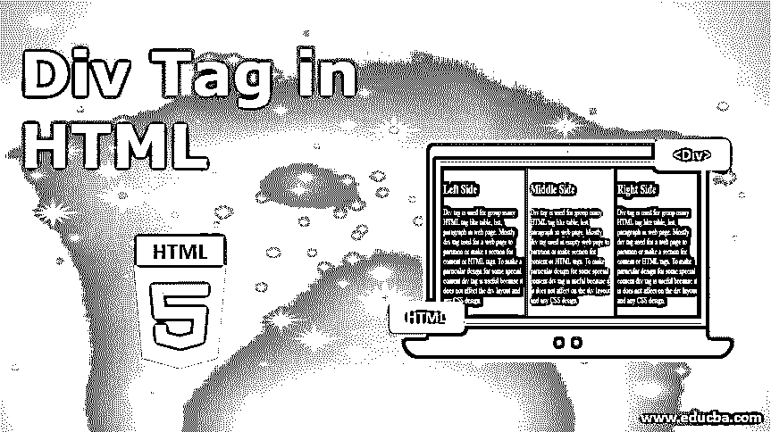
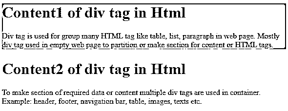
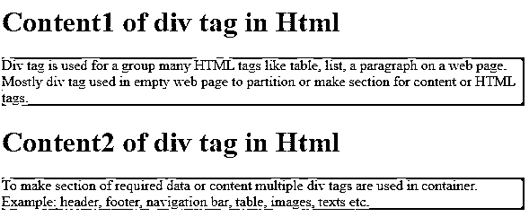
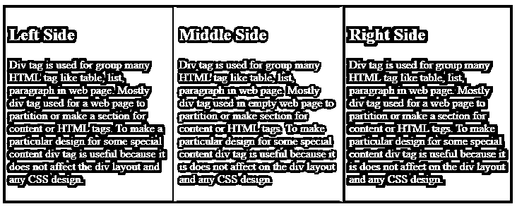
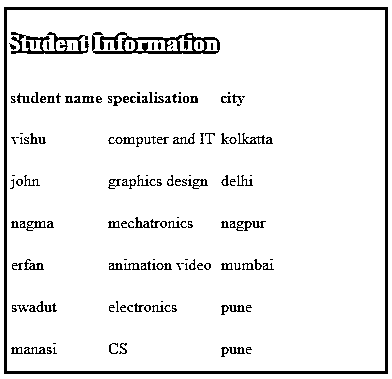
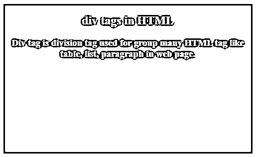

# HTML 中的 div 标签

> 原文：<https://www.educba.com/div-tag-in-html/>




## HTML 中 div 标签的介绍

在本文中，我们将了解 HTML 中的 div 标签。HTML 有两个重要的标签，用于一组其他 HTML 标签和内容，一个是

标签，另一个是标签。 [span 标签用于](https://www.educba.com/span-tag-in-html/)一行中的一组内容和标签。纵向分组与风格和不同的标签是由跨度标签。div 标签是一个 division 标签，用于许多 [HTML 标签](https://www.educba.com/basic-html-tags/)，比如网页上的表格、列表和段落。大多数 div 标签使用一个空的网页来划分内容或 HTML 标签。为一些特殊的内容 div 标签做一个特殊的设计是有用的，因为它不会影响 div 布局和任何 [CSS 设计](https://www.educba.com/css-text-formatting/)。

**语法:**

<small>网页开发、编程语言、软件测试&其他</small>

各种 HTML 标记有开始和结束标记，如:

div 标签必须打开

和关闭标签。所需的 HTML 标记和内容放在 div 标记内。

```
<div>
Content of Div tag in HTML
</div>
```

为了生成所需数据或内容的部分，在一个容器中使用了多个 div 标签。示例:页眉、页脚、导航栏、表格、图像、文本等。不同的 div 标签我们可以使用 CSS 进行不同的设计，并使用 JavaScript 轻松地应用条件。

### 标签在 HTML 中是如何工作的？

div 标签可以将各种 HTML 标签和文本放在一起。

您可以看到使用 div 标签和不使用 div 标签的示例。

#### 形容词（adjective 的缩写）在 HTML 中使用标签

**代码:**

```
<html>
<head>
<title>how to work div</title>
<style type=text/css>
.one{
background-color:orange;
}
.two{
background-color:yellow;
}
</style>
</head>
<body>
<div class="one" >
<h1> Content1 of div tag in Html </h1>
<p>   Div tag is used for group many HTML tag like table, list, paragraph in web page.
Mostly div tag used in empty web page to partition or make section for content or HTML tags. </p>
</div>
<div class="two">
<h1> Content2 of div tag in Html </h1>
<p>   To make section of required data or content multiple div tags are used in container.
Example: header, footer, navigation bar, table, images, texts etc. </p>
</div>
</body>
</html>
```

**输出:**




**说明:**

*   上面的考试使用了 HTML 中的 div 标签。第一个 div 是橙色的，第二个 div 是黄色的。
*   Div 包含标题标签和段落。两个 div 标签用不同的内容划分容器。

#### b.在 HTML 中不使用标签

**代码:**

```
<html>
<head>
<title>how to work div</title>
<style type=text/css>
p{
background-color:orange;
}
h1{
background-color:yellow;
}
</style>
</head>
<body>
<h1> Content1 of div tag in Html </h1>
<p>   Div tag is used for a group many HTML tags like table, list, a paragraph on a web page.
Mostly div tag used in empty web page to partition or make section for content or HTML tags. </p>
<h1> Content2 of div tag in Html </h1>
<p>   To make section of required data or content multiple div tags are used in container.
Example: header, footer, navigation bar, table, images, texts etc.</p>
</body>
</html>
```

**输出:**




**说明:**

*   上面的例子没有在 HTML 中使用 div 标签。页眉和段落在不同的部分。
*   标题是黄色的，段落是橙色的。所有标题及其内容段落都有不同的大小。

### div 标签的使用

下面是 div 标签的使用和需求:

*   div 标记主要用于标记和元素的分组，如图像及其描述。在网页中使用许多 HTML 标签来创建内容。所有的 HTML 标签都有不同的含义。div 标签结合了所有需要的 HTML 标签。
*   div 标签意味着 division 标签。在网页中，许多实体，如页眉、页脚、导航栏等。div 标签在一个容器中制作了许多部分，使得所有部分都很优雅。
*   它很容易用于 CSS 样式化和 JavaScript 操作。它不像布局那样影响上下文。使用 div 标签的稳定风格很简单。
*   div 标签有助于网页的外观吸引人，并让用户理解内容。
*   为 web 开发人员消除程序的复杂性；div 标签很有用。

### div 标签 HTML 示例

下面是提到的例子:

#### 示例#1

这个例子是一个带有类的 div 标签。比如左中右阶层。div 是垂直进入的容器。但是我们可以在一个部分中放置不同 div，如右侧、左侧或中间；这对于内容的位置管理很有用。

**代码:**

```
<html>
<head>
<title> Example1 </title>
<style type=text/css>
.leftdiv
{
float: left;
background-color:blue;
}
.middlediv
{
float: left;
background-color:green;
}
.rightdiv
{
float: left;
background-color:black;
}
div{
padding : 1%;
color: white;
background-color:grey;
width: 28%;
border: 1px solid black;
}
</style>
</head>
<body>
<div class="leftdiv">
<h2> Left Side </h2>
<p>Div tag is used for group many HTML tag like table, list, paragraph in web page.
Mostly div tag used for a web page to partition or make a section for content or HTML tags.
To make a particular design for some special content div tag is useful because it does not
affect the div layout and any CSS design.
</p>
</div>
<div class="middlediv">
<h2> Middle Side </h2>
<p>Div tag is used for group many HTML tag like table, list, paragraph in web page.
Mostly div tag used in empty web page to partition or make section for content or HTML tags.
To make particular design for some special content div tag is useful because it is does not
affect on the div layout and any CSS design.
</p>
</div>
<div class="rightdiv">
<h2> Right Side </h2>
<p>Div tag is used for group many HTML tag like table, list, paragraph in web page.
Mostly div tag used for a web page to partition or make a section for content or HTML tags.
To make particular design for some special content div tag is useful because it is does not
affect on the div layout and any CSS design.
</p>
</p>
</div>
</body>
</html>
```

**输出:**




#### 实施例 2

表的 div 标记。

在这个例子中，我们为表格使用了 div 标签。有时表格布局会改变，但是表格放入 div 标签后不会影响布局。

**代码:**

```
<html>
<head>
<title> Example2 </title>
<style type=text/css>
div{
color:white;
background-color:grey;
border:solid black;
}
tr, td{
border: 1px solid grey;
padding-top: 10px;
padding-bottom: 10px;
}
th {
padding-top: 10px;
padding-bottom: 10px;
text-align: left;
}
</style>
</head>
<body>
<div>
<h2> Student Information </h2>
<table>
<tr>
<th>student name</th>
<th>specialisation</th>
<th>city</th>
</tr>
<tr>
<td>vishu</td>
<td>computer and IT </td>
<td>kolkatta</td>
</tr>
<tr>
<td>john</td>
<td> graphics design</td>
<td> delhi</td>
</tr>
<tr>
<td>nagma</td>
<td> mechatronics</td>
<td>nagpur</td>
</tr>
<tr>
<td>erfan </td>
<td>animation video </td>
<td>mumbai</td>
</tr>
<tr>
<td> swadut </td>
<td> electronics</td>
<td> pune</td>
</tr>
<tr>
<td> manasi </td>
<td> CS </td>
<td> pune</td>
</tr>
</table>
</div>
</body>
</html>
```

**输出:**




#### 实施例 3

带样式的 div 示例。

这是一个使用 CSS 样式的简单例子。

**代码:**

```
<html>
<head>
<title> Example3 </title>
<style>
div{
height:300px;
width:500px;
color:white;
border:1px solid;
background-color:grey;
}
</style>
</head>
<body>
<center>
<div>
<caption>
<h2> div tags in HTML</h3>
</caption>
<h3>
Div tag is division tag used for group many HTML tag like table, list, paragraph in web page.
</h3>
</div>
</center>
</body>
</html>
```

**输出:**




### 结论

div 标签是一个 division 标签，用于在网页上创建一个分区。这是一个包含 HTML 标签和内容的空容器。使用 div 标签的 web 应用程序看起来整洁、干净、有吸引力。用户和开发人员更容易理解 web 应用程序。

### 推荐文章

这是一个 HTML 中 div 标签的指南。这里我们讨论一下简介，

标签在 HTML 中是如何工作的？用途和示例。您也可以浏览我们的其他相关文章，了解更多信息——

1.  [在 HTML 中嵌入标签](https://www.educba.com/embed-tag-in-html/)
2.  [HTML 中的画布标签](https://www.educba.com/canvas-tag-in-html/)
3.  [HTML 事件属性](https://www.educba.com/html-event-attributes/)
4.  [HTML 中标签的类型](https://www.educba.com/types-of-tags-in-html/)


