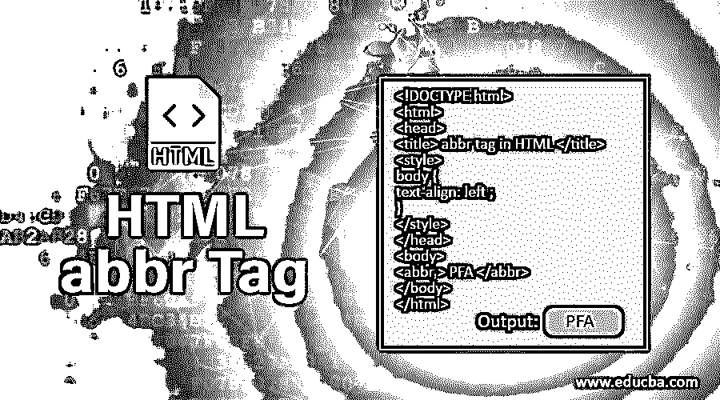
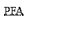
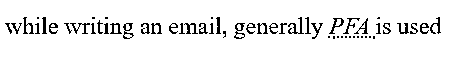
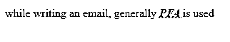
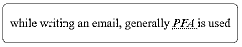

# HTML 缩写标签

> 原文：<https://www.educba.com/html-abbr-tag/>




## HTML 缩写标签简介

HTML 5 有一些有趣的特性，使得用最少的代码设计 HTML 网页变得更简单。它提供了一组丰富有趣的标签来设计 web 元素。一个这样的标签是有用的，它被称为<abbr>标签。这个<abbr>标签用于一次性定义和显示一个缩写。HTML abbr 标签将允许我们定义缩写或首字母缩略词的完整形式，浏览器通常会在网页上显示字母的缩写形式，但是当鼠标悬停在这些缩写上时，浏览器会自动显示该首字母缩略词的完整形式。</abbr></abbr>

### HTML 缩写标记的语法

<abbr>标签通常与<title>属性一起使用。由于 title 标签用于定义文档的标题，所以当标题与<abbr>标签一起使用时，它就变成了一个属性，具有特殊的含义。标题将包含人类可读的标题或缩写的完整形式。<abbr>标签在悬停时向用户显示完整的表单，并简化定义描述。这些信息对浏览器、搜索引擎和辅助系统(如翻译系统)更有用。下面是缩写标记的语法，</abbr></abbr></title></abbr>

<small>网页开发、编程语言、软件测试&其他</small>

*   **正常缩写标签:**

```
<abbr> PFA </abbr>
```

这只会显示没有任何意义的简单文本。假设我们想对上面的缩写使用 assign full form，即 PFA，那么就使用<title>属性，</title>

*   **带标题标签的缩写标签:**

```
<abbr title = "Please Find Attached" > PFA </abbr>
```

这里，我们将显示标题定义为简短形式，但同时，我们使用<abbr>标签和<title>标签定义了完整形式。<abbr>标签是成对出现的，所以总会有一个结束的</abbr>标签可用。</title></abbr>

**属性:**正如我们在语法中看到的，标题标签，当与<缩写>标签一起使用时，就变成了一个属性，并赋予它特殊的功能。否则，没有更多特定的标签可以与<缩写>标签一起使用，但是这个标签<缩写>支持 HTML 中默认可用的全局属性和事件属性。

### 实现 HTML 缩写标记的示例

以下是实现 HTML 缩写标记的示例:

#### 示例#1

在这个例子中，我们可以看到没有标题标签的简单缩写。

**代码:**

```
<!DOCTYPE html>
<html>
<head>
<title> abbr tag in HTML </title>
<style>
body {
text-align: left ;
}
</style>
</head>
<body>
<abbr > PFA </abbr>
</body>
</html>
```

**输出:**将是如下的简单文本，


#### 实施例 2

在这个例子中，我们可以看到带有标题标签的缩写。

**代码:**

```
<!DOCTYPE html>
<html>
<head>
<title> abbr tag in HTML </title>
<style>
body {
text-align: left ;
}
</style>
</head>
<body>
<abbr title = "Please Find Attached" > PFA </abbr>
</body>
</html>
```

**输出:**将是带虚线下划线的首字母缩写词。




如果我们将鼠标悬停在上面，它会以类似于工具提示的方式显示我们给出的标题。

#### 实施例 3

在这里，我们在<abbr>标签上使用了斜体的 CSS 样式元素字体样式。</abbr>

**代码:**

```
<!DOCTYPE html>
<html>
<head>
<title> abbr tag in HTML </title>
<style>
body {
text-align: left ;
}
p {
font-size: x-large ;
}
abbr {
font-style: italic ;
}
</style>
</head>
<body>
<p> while writing an email, generally <abbr title = "Please Find Attached" > PFA </abbr> is used </p>
</body>
</html>
```

**输出:**




#### 实施例 4

让我们在<abbr>标签上使用更多的 CSS 样式元素。</abbr>

**代码:**

```
<!DOCTYPE html>
<html>
<head>
<title> abbr tag in HTML </title>
<style>
body {
text-align: left ;
}
abbr {
font-style: italic ;
color: red ;
font-weight: bold ;
}
</style>
</head>
<body>
<p> while writing an email, generally <abbr title = "Please Find Attached" > PFA </abbr> is used </p>
</body>
</html>
```

**输出:**




这里，我们使用 CSS 样式元素将我们的首字母缩略词设为粗体和红色。

#### 实施例 5

让我们修改同一个例子，添加更多的样式和设计。

**代码:**

```
<!DOCTYPE html>
<html>
<head>
<title> abbr tag in HTML </title>
<style>
body {
text-align: left ;
}
p {
font-size: x-large ;
background-color: blanchedalmond ;
padding-top: 25px ;
padding-bottom: 25px ;
text-align: center ;
border: 1px solid cadetblue ;
border-radius: 10px ;
}
abbr {
font-style: italic ;
color: red ;
font-weight: bold ;
}
</style>
</head>
<body>
<p> while writing an email, generally <abbr title = "Please Find Attached" > PFA </abbr> is used </p>
</body>
</html>
```

**输出:**




在上面的每个例子中，试着将鼠标悬停在我们使用的缩写词 PFA 上，看看浏览器将如何显示我们为其指定的标题。

### 需要记住的要点

*   几乎所有浏览器都支持<abbr>标签，包括 Google Chrome、Internet Explorer、Safari、Firefox、Opera 等。在某些情况下，所有浏览器产生的输出可能不同，但结果是相同的。</abbr>
*   由于<abbr>标签没有特定的属性，我们将在接下来的例子中看到如何样式化属性(使用可用的全局属性)。显示此元素的默认样式是 display: inline，它可能因浏览器而异。</abbr>
*   <abbr>标签可用于向用户提供完整的表单，或者在特定内容中的 while 定义，或者在对文档进行样式化的情况下。总是使用<abbr>标签并不是强制性的。</abbr></abbr>
*   <title>属性用于在<abbr>标签中提供完整的信息或指定首字母缩略词的完整形式。<title>属性是可选的，它将用在<abbr>标签的起始标签中。</abbr></title>
*   在 HTML 5 之前曾经有一个<acronym>标签来定义缩写或首字母缩略词，但是它在 HTML 5 中被弃用，不应该被使用。</acronym>

### 结论

所以，我们已经看到了 HTML 5 中引入的<abbr>标签。这个标签提供了定义缩写或首字母缩略词的方法，并一次性显示它们的标题或详细信息。我们已经看到了多个<abbr>属性的例子。这个标签没有这样的特殊属性。</abbr></abbr>

### 推荐文章

这是一个 HTML 缩写标签的指南。这里我们讨论 HTML abbr 标签的介绍和属性，以及示例和代码实现。你也可以看看下面的文章来了解更多-

1.  [HTML 中的标题标签](https://www.educba.com/caption-tag-in-html/)
2.  [HTML 导航标签](https://www.educba.com/html-nav-tag/)
3.  [在 HTML 中嵌入标签](https://www.educba.com/embed-tag-in-html/)
4.  [HTML 中的画布标签](https://www.educba.com/canvas-tag-in-html/)


