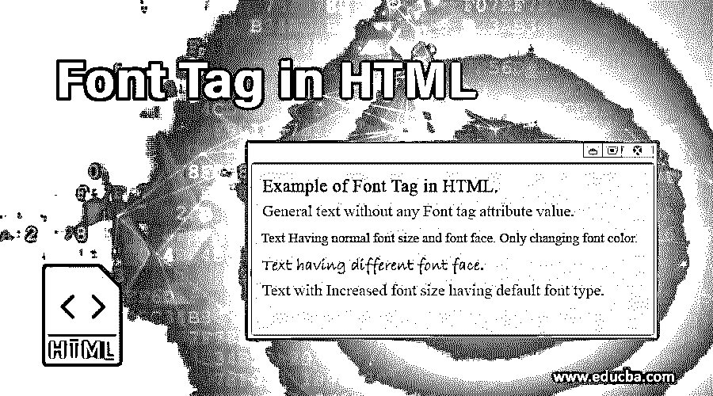
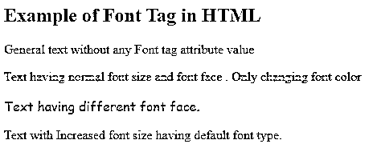
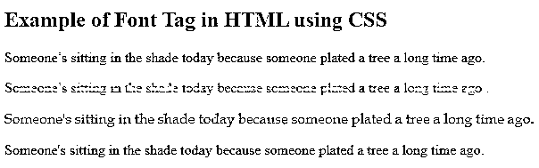
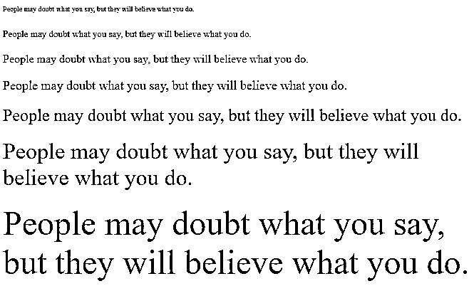
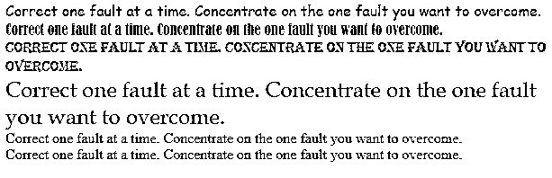
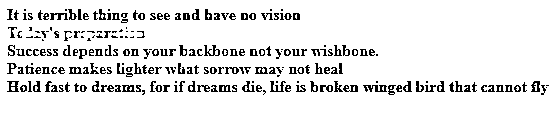

# HTML 中的字体标签

> 原文：<https://www.educba.com/font-tag-in-html/>




## HTML 中的字体标签介绍

HTML 中的字体标签是用来使网页或 HTML 文档更有吸引力的最重要的属性之一。它具有改变所包含文本的大小、颜色和样式的属性。在字体标签的帮助下，人们可以用相同的文本格式制作网页的大小、颜色和字体。这个标签主要作用于三个主要属性，如大小、脸型或类型和颜色。字体标签在 HTML 中作为一个内联元素来改变 HTML 文档中块文本的一些特性。包含在<font>标签中的文本用于定义其中包含的文本的样式。</font>

**语法:**

<small>网页开发、编程语言、软件测试&其他</small>

```
<font size =" " face =" " color=" ">
```

*   上面的语法状态说明，字体大小是语法中的属性，用来设置文本的具体大小。这个大小可以用 1 到 7 的数字来定义，其中 1 代表最小的文本，7 代表最大的文本。font 标签中的 face 属性用于定义 HTML 文档中的字体类型，而 color 属性用于定义包含文本的特定颜色。
*   在标签中使用的 HTML <font>标签。它是用<font>定义的..</font>HTML 中的标签。</font>

```
<body>
<p> <font size="2" color="blue" face="Calibri"> </font>
</p>
</body>
```

这个标签也支持全局属性和事件属性。此外，它还支持下面列出的一些其他属性:

| **属性名** | **详细描述** |
| 大小 | 该属性用于定义 1 到 7 之间的特定文本大小。 |
| 面孔或类型 | 该属性用于定义包含文本的字体类型。 |
| 颜色 | 此属性用于以不同的颜色显示包含的文本。 |
| 重量 | 这个属性定义了字体标签文本的粗细。 |

### HTML 中字体标签的例子

字体标签在 HTML 代码中有两种用法，第一种是通过 HTML 包含字体标签及其属性值，第二种是通过 CSS 代码定义属性值。两者将产生相同的输出。定义属性值的唯一区别。

#### 示例#1

定义字体标签及其属性值:

**代码:**

```
<!DOCTYPE html>
<html>
<head>
<title>Font Tag in HTML</title>
</head>
<body>
<h2>Example of  Font Tag in HTML </h2>
<p>General  text  without any Font tag attribute value</p>
<p>
<font color="orange">Text having normal font size and font face . Only changing
font   color  </font>
</p>
<p>
<font  face="cursive">Text having different font face.</font>
</p>
<p>
<font size="3">Text with Increased font size having default font type. </font>
</p>
</body>
</html>
```

**输出:**




#### 实施例 2

使用通过 CSS 定义的属性值定义字体标签:

**代码:**

```
<!DOCTYPE html>
<html>
<head>
<title>Font Tag in HTML</title>
</head>
<body>
<h2>Example of Font Tag in HTML using CSS </h2>
<p>Someone’s sitting in the shade today because someone plated a tree a long time ago. </p>
<p style="color : lightgreen;"> Someone’s sitting in the shade today because someone plated a tree a long time ago.
</p>
<p style="font-family : Book Antiqua; color: blue; " > Someone’s sitting in the shade today because someone plated a tree a long time ago.
</p>
<p style="font size:3px;"> Someone’s sitting in the shade today because
someone plated a tree a long time ago.
</p>
</body>
</html>
```

**输出:**




#### 实施例 3

在本例中，我们使用了一个带有属性值 size 的字体标签，它将从最小尺寸到最大尺寸定义文本，如下所示:

**HTML 代码:**

```
<!DOCTYPE html>
<html>
<head>
<title>HTML font tag</title>
</head>
<body>
<font size = "1">People may doubt what you say, but they will believe what you do.</font><br /> <br/>
<font size = "2">People may doubt what you say, but they will believe what you do.</font><br /> <br/>
<font size = "3">People may doubt what you say, but they will believe what you do.</font><br /> <br/>
<font size = "4">People may doubt what you say, but they will believe what you do.</font><br /> <br/>
<font size = "5">People may doubt what you say, but they will believe what you do.</font><br /> <br/>
<font size = "6">People may doubt what you say, but they will believe what you do.</font><br/><br/>
<font size = "7">People may doubt what you say, but they will believe what you do.</font>
</body>
</html>
```

**输出:**




#### 实施例 4

**HTML 代码:**

```
<!DOCTYPE html>
<html>
<head>
<title>HTML tag with Font Type attribute</title>
</head>
<body>
<font face = "Comic sans MS"> Correct one fault at a time. Concentrate on the one fault you want to overcome.</font><br/>
<font face = "Bernard MT Condensed" color="Red" >Correct one fault at a time. Concentrate on the one fault you want to overcome. </font><br/>
<font face = "Algerian">Correct one fault at a time. Concentrate on the one fault you want to overcome. </font><br/>
<font face = "Book Antiqua" size="5">Correct one fault at a time. Concentrate on the one fault you want to overcome. </font><br/>
<font face = "Aharoni"> Correct one fault at a time. Concentrate on the one fault you want to overcome.</font><br/>
<font face = "AR BERKLEY" >Correct one fault at a time. Concentrate on the one fault you want to overcome. </font><br/>
</body>
</html>
```

**输出:**




#### 实施例 5

**HTML 代码:**

```
<!DOCTYPE html>
<html>
<head>
<title>HTML Font tag-Color </title>
</head>
<body>
<font color = "#cc0066"><b>It is terrible thing to see and have no vision</b></font><br>
<font color = "#66ff33"><b>Today's preparation </b></font> <br>
<font color = "#0000cc"><strong>Success depends on your backbone not your wishbone.</strong></font><br />
<font color = "#cc3300"><b>Patience makes lighter what sorrow may not heal</b></font>  <br>
<font color = "#666600"><b>Hold fast to dreams, for if dreams die, life is broken winged bird that cannot fly </b></font> <br>
</body>
</html>
```

**输出:**




### 结论

*   它用于以相同的大小、颜色和字体格式显示文本。将使用<font>显示字体标签..</font>标签。
*   从以上所有信息中，我们知道字体的大小、字体类型、颜色是字体风格的关键属性。

### 推荐文章

这是 HTML 中字体标签的指南。这里我们讨论 HTML 中字体标签的介绍和属性，以及例子和代码实现。你也可以看看下面的文章来了解更多-

1.  [HTML 图例标签](https://www.educba.com/html-legend-tag/)
2.  [HTML 中的 Iframes 标签](https://www.educba.com/iframes-in-html/)
3.  [HTML 导航标签](https://www.educba.com/html-nav-tag/)
4.  [在 HTML 中嵌入标签](https://www.educba.com/embed-tag-in-html/)


