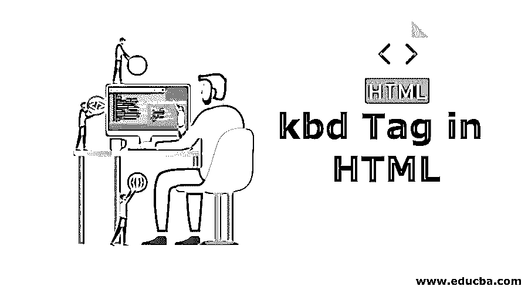
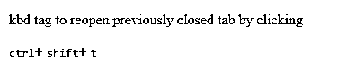

# HTML 中的 kbd 标签

> 原文：<https://www.educba.com/kbd-tag-in-html/>




## HTML 中的 Kbd 标签介绍

下面的文章概述了 HTML 中的 kbd 标签。HTML 中的`标签有助于识别由用户键盘输入定义的文本。它是用来从键盘输入的。它主要在需要显示用户通过键盘输入的文本时使用。它属于被称为短语标签的标签类别。这也称为行内元素。为该标签设置的默认字体是字体系列中的等宽字体。可以使用不同的样式代码来改善包含在`标签中的文本的外观。它总是包含可以通过键盘轻松输入的文本。``

### 句法

标签。

<small>网页开发、编程语言、软件测试&其他</small>

该标签中包含的文本如下:

```
<!DOCTYPE html>
<html>
<head>
<title>Title of the document</title>
</head>
<body>
<p>Kbd tag in HTML
< kbd> Text </kbd> <kbd> Text </kbd> <kbd> Text </kbd>
</body>
</html>
```

这个`标签被称为短语标签，它包括等宽类型的字体格式。用户可以使用[不同的 CSS 属性](https://www.educba.com/css-font-properties/)来改变包含在`标签中的文本的样式，如下所示:``

1.  要改变文本的字体样式，可以对文本使用 CSS-font-style 属性，这样文本就可以是普通的、斜体的、首字母的等等。
2.  基本上，`内括的文本是等宽格式，但是可以用 CSS-font-family So 来改变；它可以显示多个字体系列的列表，这样人们可以从中选择适合文本的字体。`
3.  也可以使用 CSS-font-size 来改变文本大小。
4.  可以通过使用 CSS-font-weight 属性来改变字体粗细，以粗体或厚格式显示文本。也可以通过 CSS-text-transform 使文本大写或控制文本大小写。
5.  出于文本装饰的目的，我们可以使用 CSS-text-decoration 这样的属性，它有助于给文本着色、用线条进行文本装饰、文本装饰样式等。简而言之，text-decoration-color 使用 2 个属性，比如 CSS-color 用于文本颜色，CSS-background-color 用于设置背景颜色。

对于设置文本布局样式到`标签，有不同的属性进入 CSS 如下:`

1.  要处理文本中的空白，可以使用 CSS-white space。
2.  要显示未向用户显示的溢出文本内容，可以使用 CSS-text-overflow。
3.  使用 CSS-word-break 可以在行内或单词间添加分隔符。
4.  使用 CSS-text-shadow 属性给文本添加阴影。
5.  可以使用 CSS-text-align-last 属性将文本对齐到行的最后一个位置。
6.  使用 CSS-letter-spacing 属性在字母或字符之间留出空格。
7.  要定义线条的高度，可以使用 CSS-line-height 属性。
8.  使用 CSS-word-spacing 可以定义单词之间的间距。

*   HTML 中的标签没有任何特殊属性。它将支持全局属性以及 HTML 中可用的事件[属性。](https://www.educba.com/html-attributes/)
*   该标签总是在部分使用。

### kbd 标签在 HTML 中是如何工作的？

标签是 HTML 中用于各种目的的最有用的标签之一。`标签的主要用途放入用户文档中。因为它有助于显示将要在键盘上键入的文本。这是 HTML 中一个奇妙而有用的元素。`标签也用来创建键盘快捷键。``

这将有助于创建新文档、保存文档、在新选项卡中打开文档等。它对各种 CSS 属性进行处理，以获得样式化的输出。假设我们要在 HTML 中使用`标签创建一个键盘快捷键。这里我们复制一些文本并粘贴它。`

所以我们将通过快捷方式使用`标签做这件事如下:
<p>
<kbd>ctrl</kbd>+<kbd>c</kbd>然后<kbd>ctrl</kbd>+<kbd>v</kbd>`

因此，这个例子将创建一个快捷方式，从 ctrl +c 复制文本，并使用 ctrl + v 粘贴它。

### HTML 中 kbd 标签的例子

以下是 HTML 中 kbd 标签的示例:

#### 示例 1–这是一个简单的`标签示例。`

```
<!DOCTYPE html>
<html>
<head>
<title>kbd tag</title>
<style>
kbd.key {
padding: 3px 3px 0;
border-radius: 2px;
border: 1px solid #666;
border-color: blueviolet;}
</style>
</head>
<body>
<p>Copy some code using <kbd><kbd>Ctrl</kbd>+<kbd>c</kbd></kbd>.</p>
<p>Paste copied code using <kbd><kbd>Ctrl</kbd>+<kbd>v</kbd></kbd>.</p>
<p>Save all the details of the data using <kbd ><kbd class="key" >Ctrl</kbd>+
<kbd   class="key">s</kbd></kbd>.</p>
<p>Create a new document by pressing <kbd><kbd class="key">Ctrl</kbd>+
<kbd  class="key">N</kbd></kbd>.</p>
</body>
</html>
```

**输出:**
T3】


#### 示例 2–使用 CSS 属性的`标签。`

```
<!DOCTYPE html>
<html>
<head>
<title>kbd tag</title>
<style>
kbd.font {
font-style: italic;
font-size: 20px;
}
kbd.cursive{
font-family: cursive;
}
kbd.fantasy{
font-family:fantasy;
color:darkmagenta;
}
kbd.inherit{
font-family:inherit;
}
kbd.sans-serif{
font-family:sans-serif;
background-color: aquamarine;
}
kbd.weight{
font-weight:bold;
}
</style>
</head>
<body>
<h4>kbd tag uses Font style</h4>
<p><kbd class="font">The Whole world steps aside for the man who knows where he is going</kbd><hr>
<h4>kbd tag uses Font Family</h4>
<p><kbd class="cursive">People rarely succeed unless they have fun in what they are doing</kbd>
<p><kbd class="fantasy">People rarely succeed unless they have fun in what they are doing</kbd>
<p><kbd class=" inherit">People rarely succeed unless they have fun in what they are doing</kbd>
<p><kbd class="sans-serif">People rarely succeed unless they have fun in what they are doing</kbd>
<hr>
<h4>kbd tag uses Font weight </h4>
<p><kbd class="weight"> Only those who dare to fail greatly can ever achieve greatly</kbd>
<hr>
</body>
</html>
```

**输出:**
T3】


#### 实施例 3

```
<!DOCTYPE html>
<html>
<head>
<title>HTML kbd Tag</title>
</head>
<body>
<p>kbd tag to reopen previously closed tab by clicking
<br>
<br>
<kbd>ctrl</kbd>+
<kbd>shift</kbd>+
<kbd>t</kbd>
</body>
</html>
```

**输出:**




在键盘上单击 ctrl+shift+t 键后，它将在浏览器中重新打开先前关闭的选项卡。

### 结论–HTML 中的 kbd 标签

HTML 中的标签用于显示键盘输入的文本。它是等宽字体。这个标签可以使用不同的 CSS 属性，如字体系列、字体粗细、字体颜色、背景颜色、字体大小、字体样式、文本装饰、空白、文本分隔符、文本阴影、文本对齐-最后、文本字母间距、文本溢出等。

### 推荐文章

这是 HTML 中 kbd 标签的指南。这里我们讨论语法，kbd 标签如何在 HTML 中工作？还有例子。您也可以看看以下文章，了解更多信息–

1.  [HTML 中的 Div 标签](https://www.educba.com/div-tag-in-html/)
2.  [HTML 表格中的滚动条](https://www.educba.com/scrollbar-in-html-table/)
3.  [HTML 表单属性](https://www.educba.com/html-form-attribute/)
4.  [HTML5 语义元素](https://www.educba.com/html5-semantic-elements/)


