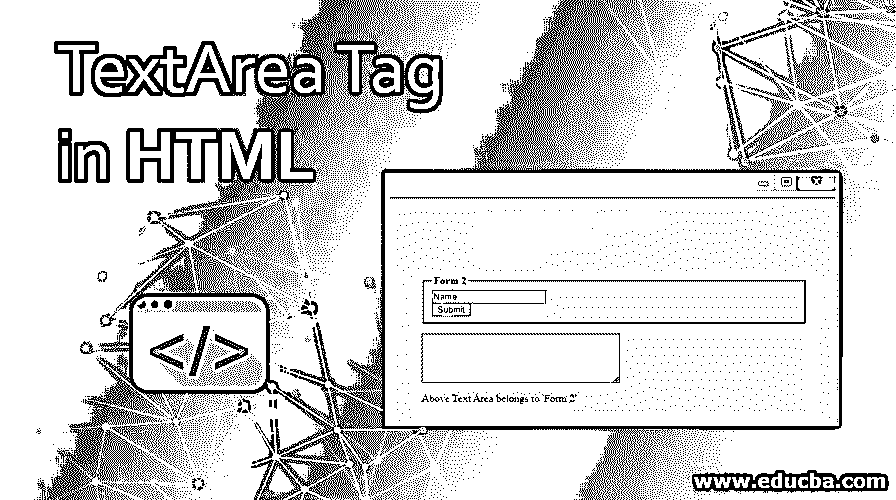
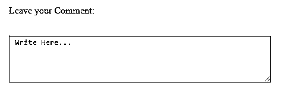
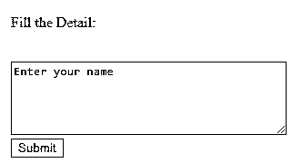
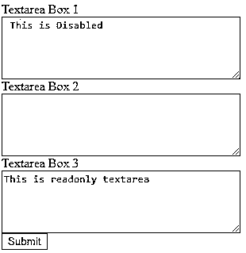
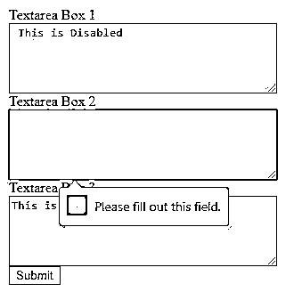
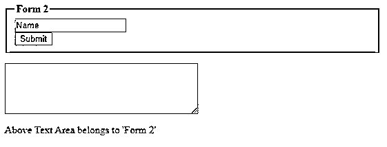

# HTML 中的 TextArea 标记

> 原文：<https://www.educba.com/textarea-tag-in-html/>




## HTML 中的 TextArea 标签介绍

标签<textarea>是 HTML 拥有的众多标签之一。<textarea>标签格式分为三个主要部分，开始标签(<textarea>)、内容和结束标签(</textarea>)。这个 HTML 标记也用在表单中，用于声明文本区域元素，用户可以在多行中添加文本。一个<textarea>标签创建了一个可以容纳很多字符的文本区域。</textarea>

### 标签在 HTML 中是如何工作的？

使用时，textarea 元素会创建一个区域或空间，该区域或空间是使用 cols 或 rows 等属性指定的。外观也可以使用 CSS 样式进行格式化，当然是使用高度和宽度属性。

<small>网页开发、编程语言、软件测试&其他</small>

**语法:**

```
<textarea rows="3" cols="20">
Enter your text here...
</textarea>
```

### 属性

与所有其他 HTML 标签一样，<textarea>标签接受许多其他属性，这些属性在<input/>表单元素中也很常见。它们列举如下:</textarea>

*   **自动聚焦**:自动聚焦属性确保页面加载时文本区域自动获得焦点。
*   **cols**:‘cols’属性指定文本区域的宽度。该值应为正整数。如果未指定，则“列”的默认值为 20。
*   **禁用**:这个特性只是禁用文本区域；也就是说，它冻结该区域，不接受任何用户输入的更改。禁用时，文本区域不会获得焦点，并且在使用跳转时会被跳过。
*   **表单**:‘form’属性指定文本区域所属的表单 id。
*   **name** :给文本控件分配一个名称。
*   **占位符**:该属性用于帮助用户，作为文本框中要写的内容，一个提示，一个示例文本。
*   **readonly** :该属性将文本区域设置为只读模式；也就是说，它不受用户输入的影响或者不能改变其内容。
*   **wrap** :这个特性指定了文本区域将如何换行。如果未指定，默认值为“软”。

### HTML 中的 TextArea 标签示例

为了更好地理解文本区域元素的工作，请看下面这个使用了<textarea>标签的例子，</textarea>

#### 示例#1

**代码:**

```
<form>
<p>Leave your Comment:</p>
<br />
<textarea id="ta" cols="60" rows="5"> Write Here...</textarea></form>
```

**输出:**




上面的例子很简单，演示了<textarea>元素的特性。例如,“id”属性用于辅助功能。本例中使用的另一个有趣的特性是 cols 和 rows 属性的使用。</textarea>

行和列允许程序员设置文本区域大小的边界值，即文本区域将获得的确切空间。使用这些属性有助于跨浏览器支持和格式一致性，因为浏览器默认设置可以不同。

#### 实施例 2

**代码:**

```
<!DOCTYPE html>
<html>
<head>
<title> Textarea HTML Tag Demo </title>
</head>
<body>
<form>
<p>Fill the Detail:</p>
<br />
<textarea rows="5" cols="40" name="demo" maxlength="60" minlength="10" required="required">Enter your name</textarea>
<br />
<input type="submit" name="Submit" value="Submit" />
</form>
</body>
</html>
```

**输出:**




上面的例子显示了另一组属性，与<textarea>标签、最大长度和最小长度一起使用。maxlength 指定用户可以在文本区域中输入的最大字符数。所以在这里，用户可以输入' 60 '个字符，包括特殊字符。</textarea>

HTML5 中增加了最大长度属性[；HTML 不支持此属性。类似地，minlength 是指定要插入文本区域的最小字符数的属性，这里是“10”。这里使用的另一个属性是“required ”,它指定文本区域不会被提交，如果它是空的则无效。这是对标签的简单验证。](https://www.educba.com/what-is-html5/)

#### 实施例 3

**代码:**

```
<form id="Form1">
<label>Textarea Box 1</label>
<br />
<textarea rows="5" cols="40" name="demo" maxlength="60" minlength="10" disabled="disabled"> This is Disabled</textarea>
<br />
<label>Textarea Box 2</label>
<br />
<textarea rows="5" cols="40" required="required"></textarea>
<br />
<label>Textarea Box 3</label>
<br />
<textarea rows="5" cols="40" placeholder="This is readonly textarea" readonly="readonly"></textarea>
<br />
<input type="submit" name="Submit" value="Submit" />
</form>
```

**输出:**

注意到“文本区域框 2”文本区域是必需的文本区域，而“文本区域框 1”是禁用的。







#### 实施例 4

**代码:**

```
<form id="label2" action="textareaDemo.html">
<fieldset>
<legend><b>Form 2</b></legend>
<input type="text" name="FN" value="Name" />
<br />
<input type="submit" name="Submit" value="Submit" />
<br />
</fieldset>
</form>
<textarea rows="5" cols="40" form="label2" required="required"></textarea>
<br />
<p>Above Text Area belongs to 'Form 2'</p>
```

**输出:**

请注意下面的输出。下面的文本框是一个“必填”字段，正如上面的代码中提到的，该字段与表单“Form 2”相关联。因此，当我们试图提交带有空白文本区域的表单时，它会显示一个警告。




### 结论

<textarea>元素可以是<form>标签中的嵌套元素，也可以存在于表单标签之外，但使用“form”属性将其自身与表单相关联。需要注意的一点是，这个元素没有“值”属性，所以如果你的文本区域需要一个默认文本，请在开始和结束的<textarea>标签之间输入该文本。</textarea>

### 推荐文章

这是一个 HTML 中文本区域标签的指南。这里我们讨论一下简介， <textarea>Tag 是如何工作的？属性和示例。您也可以看看以下文章，了解更多信息–</textarea>

1.  [HTML 图例标签](https://www.educba.com/html-legend-tag/)
2.  [HTML 块](https://www.educba.com/html-blocks/)
3.  [HTML 中的区域标签](https://www.educba.com/area-tag-in-html/)
4.  [HTML 中的 Fieldset 标签](https://www.educba.com/fieldset-tag-in-html/)


