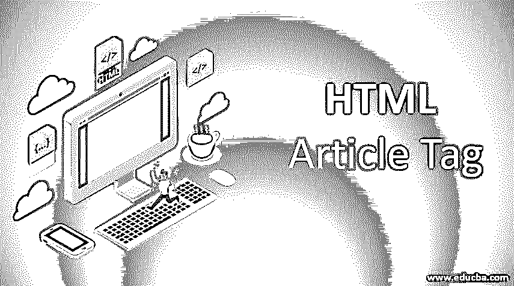
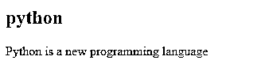
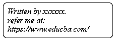
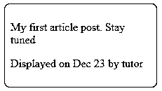
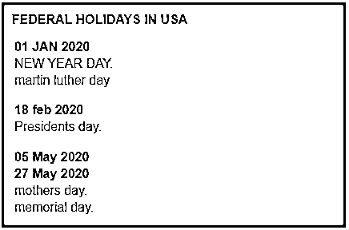
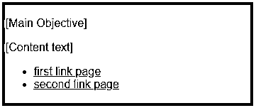
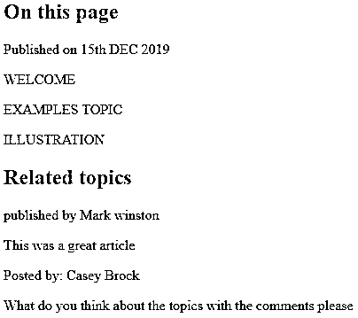
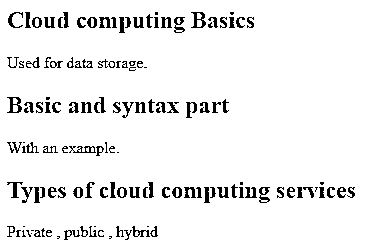

# HTML 文章标签

> 原文：<https://www.educba.com/html-article-tag/>




## HTML 文章标签介绍

HTML5 中引入了 HTML 文章标签作为新版本。更具体地说，它们被发现代表一篇文章。它被指定为独立数据，可能用于论坛帖子、杂志出版物、博客和用户评论。它由

标签表示。此外，在网页上定义一个时尚元素与元素非常相似。这个文章标签支持所有类型的浏览器:Google Chrome、opera、internet explorer 和 edge。它们是[，不像通用部分](https://www.educba.com/html-section-tag/)的部分标签，而是作为独立的内容部分。

**语法:**

<small>网页开发、编程语言、软件测试&其他</small>

这里让我们看看这些标签元素的直接语法。

```

<h1>…</h1>

```

该结构后面是开始标记。下一个前面的部分有

# 标签或

## ，它们形成一个子标题，共同给出内容的确切语义信息，并提供更丰富和更适当的有意义的信息。和其他标签一样，这个文章标签也支持 HTML 属性，比如事件属性和相应类的全局属性。

**示例<文章>标签:**

```

<h1>Introduction to  CSS demo</h1>
<p>CSS is a cascading Style Sheet helps to make a web page visually colored</p>

```

### 文章标签在 HTML 中是如何工作的？

本节将讨论一个简单的文章标签(文档中的自包含内容),并了解它如何在网页上工作。HTML 5 引入了新的语义内容来丰富搜索引擎的内容。它们支持内容的全局和事件属性。标签中指定的内容被视为独立于单个页面上其他内容部分的文档。它们可以用来定义或演示页面上的文章名称、作者信息和文章的发布日期。这个

标签可以用作单个元素和多个

元素。


具有单个文章元素的文档解释了文档的主要内容，并且具有单独唯一的单个内容，而在多个

标签的情况下，一个页面具有多个内容，换句话说，它们是等效的元素。

标签的主要目的是通过减少元素的工作来帮助 HTML 代码清理内容。


### 实现 HTML 标记的示例

以下是实现 HTML 标记的示例:

#### 示例#1

使用单个

标签的示例。

**代码:**

```
<!DOCTYPE html>
<html>
<head>
<title>HTML Article Tag demo</title>  </head>
<body>

<h2>python</h2>
<p>Python is a new programming language</p>

</body>
</html>
```

**输出:**




#### 实施例 2

一个演示 CSS 样式使用属性

<address>的例子。它利用 CSS 很好地在 web 浏览器中显示。</address>

**代码:**

```
<!DOCTYPE html>
<head>
<title>Demo of article</title>
</head>
<body>


<address>
Written by xxxxxx.<br>
refer me at: <br>
https://www.educba.com/ <br>
</address>

```

下面的输出向访问者显示了带有链接地址的网页。

**输出:**




#### 实施例 3

一个演示如何用

显示日期和时间的例子。

**代码:**

```
<!DOCTYPE html>
<head>
<title>Demo of article tag</title>
</head>
<body>


<p>My first article post. Stay tuned</p>

<p>
Displayed on <time datetime="2019-12-24 20:00"> Dec 23</time> by tutor
</p>


```

**输出:**




#### 实施例 4

使用多篇文章的示例。下面的代码使用语义元素

# 来指定 HTML 内容中最重要的头。

**代码:**

```
<style>
.JAN {
margin: 1;
padding: .2rem;
background-color: #D2691E;
font: 2rem 'Fira Sans', sans-serif;
}
.JAN > h1,
.day {
margin: .4rem;
padding: .2rem;
font-size: 1rem;
}
.day {
background: border-box no-repeat
gray;
}
.day > h2,
.day > p {
margin: .2rem;
font-size: 1rem;
}
</style>

<h1>FEDERAL HOLIDAYS IN USA</h1>

<h2>01 JAN 2020</h2>
<p>NEW YEAR DAY.</p>
<p> martin luther day </p>


<h2>18 feb 2020</h2>
<p>Presidents day.</p>


<h2>05 May 2020</h2>
<h2>27 May 2020</h2>
<p>mothers day.</p>
<p>memorial day.</p>


```

**输出:**




#### 实施例 5

我们将看到

标签是由几个

标签组成的。下面是一些带有输出的代码。


**代码:**

```
<style>
.art {
margin: 5;
padding: .3rem;
background-color: #DC143C;
font: 1rem 'italic', sans-serif;
}
</style>


<p>[Main Objective]</p>


<p>[Content text]</p>


<ul>
<li><a href="tt.html">first link page</a></li>
<li><a href="th.html">second link page</a></li>
</ul>


```

**输出:**




#### 实施例 6

**代码:**

```


<h1>On this page</h1>
<p>Published on 15th DEC 2019</p>

<p>WELCOME</p>
<p> EXAMPLES TOPIC</p>
<p>ILLUSTRATION</p>

<h2>Related topics</h2>


<p>published by Mark winston</p>

<p>This was a great article</p>


<p>Posted by: Casey Brock</p>

<p>What do you think about the topics with the comments please</p>


```

这里是一个全局标题，包含任何相关内容文档的网页标题。接下来是

标签，它有一些到特定网站页脚的链接，并通过在页脚部分提供公司详细信息而有利于 SEO。最后，使用

标签的真正方法是嵌入或分组页面的相关内容或以其他方式；我可以说它们是自治的部分结构。


**输出:**




#### 实施例 7

借助

<main>标签的文章标签。</main>

**代码:**

```
<!DOCTYPE html>
<head>
<title>Demo of article tag</title>
</head>
<main>

<h1>Cloud computing Basics</h1>
<p>Used for data storage.</p>

<h2>Basic and syntax part</h2>
<p>With an example.</p>


<h2>Types of cloud computing services</h2>
<p>Private , public , hybrid</p>


</main>
```

**输出:**




### 结论

最后，本文介绍了在网页上使用它们的几个指南。它们是在单个网页中包含一个文档(它们自己感觉)或内容的好选择，并且它们被认为是 HTML5 下的一个好的语义元素。作为一个自包含的上下文，它已经在 html5 中使用，因为尖端网站已经开始充分利用这个标签，在发布博客和杂志等内容时受到用户的好评。

### 推荐文章

这是一个 HTML 文章标签的指南。在这里，我们讨论了 HTML 文章标签的简要概述及其示例和代码实现。您也可以浏览我们推荐的其他文章，了解更多信息——

1.  [HTML 样式属性](https://www.educba.com/html-style-attribute/)
2.  [HTML 框架](https://www.educba.com/html-frames/)
3.  [HTML 向左浮动](https://www.educba.com/html-float-left/)
4.  [HTML 图片标签](https://www.educba.com/html-picture-tag/)


