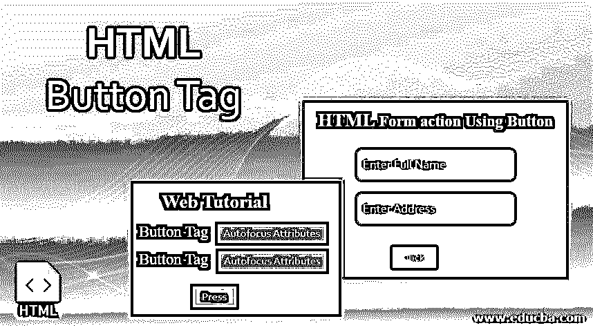
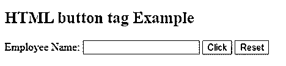
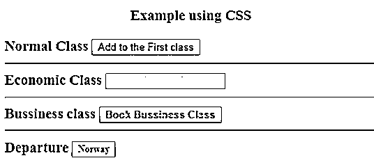
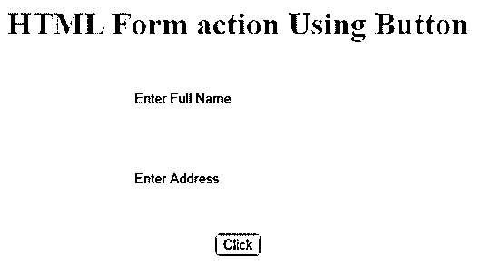
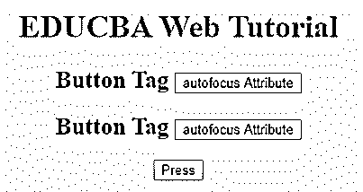
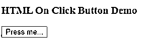
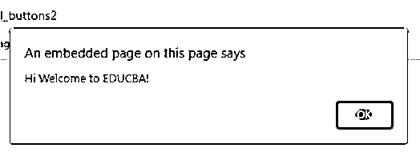
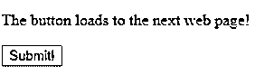

# HTML 按钮标签

> 原文：<https://www.educba.com/html-button-tag/>




## HTML 按钮标签简介

HTML 按钮标签允许使用 HTML 文档在网页上创建一个活动的按钮控件。这个<button>元素在 body 标签中声明。为什么我们需要一个按钮元素？通常，当用户访问一个网页时，他最常做的事情就是点击网站的某个地方，从而进入下一个 URL 页面。这样做按钮元素本身无法做到；它是由一个表单动作创建的，其中 web 表单有一个默认的提交按钮 click。</button>

按钮是使用<button>元素创建的；它们的功能类似于<input>元素，具有额外的可能性，如在按钮标签之间添加内容、图像。在开始和结束标记之间推送的内容文本被认为是按钮上的文本。按钮上的操作是通过 JavaScript 或表单来完成的。给按钮添加特殊样式可能是由 CSS 完成的，但是不同的浏览器有新的特殊样式。</button>

<small>网页开发、编程语言、软件测试&其他</small>

**语法:**

像其他 HTML 标签一样，按钮标签也有开始和结束标签，按钮类型是使用属性定义的。

```
<button>
// some stuff like content / image
</button>
```

### HTML 按钮标记的属性

没有使用任何特殊属性，因为它们没有任何必需的属性；相反，它们被用作具有 type=" attribute "的普通按钮。甚至这个元素也使用了 [CSS，用属性](https://www.educba.com/what-is-css/)来改变按钮标签中的变化。这些属性是 CSS 字体系列、字体粗细、文本修饰、字体样式。颜色属性，如背景颜色，最后，布局属性，如文本溢出，文本缩进。

| **序列号** | **属性名** | **描述** | **例子** |
| One | 自（动）调焦装置 | 它被视为布尔属性。 | <button>自动对焦</button> |
| Two | 有缺陷的 | 使按钮不可点击。 | <button disabled="disabled">/按钮></button> |
| Three | 形式 | 它创造了一种形式 | 

<form>…</form>

 |
| Four | 形成动作 | 它指定提交表单数据的当前位置。 |  |
| Five | 甲酰新戊酸盐 | 以灰色显示并给出非验证特征。 |  |
| Six | 形法 | 它在引用下一个网页时指定方法(get，HTTP 方法的 post) |  |
| Seven | 表单目标 | 它指定了表单操作完成时服务器响应的目标路径。 |  |
| Eight | 表单 enctype | 当一个表单被提交到 web 服务器以获得它所激活的响应时，就使用了这个类型的内容。 | <button type="”submit”" formenctype="“multipart/form-data”">…..</button> |
| Eight | 名字 | 它指定表单元素中使用的按钮名称，供表单输入使用。 | < button type="submit" name = " " |
| Nine | 类型 | 它指定了使用的按钮的类型。它有三个默认值提交，重置，文本。 | < button type “……” > |
| Ten | 价值 | 当按钮和表单数据一起使用时，它给出初始值 |  |
| Eleven | tab 键索引 | 它指定了 tab 键，顺序决定了优先顺序。 |  |
| Twelve | onclick | 当一个按钮被按下时，它在后面运行一个小的 javascript 代码。 |  |

### 在 HTML 按钮标签中实现的示例

以下是在 HTML 按钮标签中实现的示例:

#### 示例#1

**代码:**

```
<!DOCTYPE html>
<html lang="en">
<head>
<title> HTML button tag Example</title>
</head>
<body>
<h2>HTML button tag Example </h2>
<form action="/examples/html/action.php" method="post">
<p>
Employee Name: <input type="text" name="Employee-Name">
<button type="submit" value="Submit">Click</button>
<button type="reset" value="Reset">Reset</button>
</p>
</form>
</body>
</html>
```

**输出:**




#### 实施例 2

**代码:**

```
<!DOCTYPE html>
<html>
<head>
<h3> <center> Example using CSS </center><h3>
</head>
<body>
Normal Class
<button type="button">Add to the First class</button>
<hr />
Economic Class
<button type="button" style="color: pink;"><b> Book Economic Class </b></button>
<hr />
Bussiness class
<button type="button" style="color: orange;"><b> Book Bussiness  Class </b></button>
<hr />
Departure
<button type="button" style="font: bold 12px Open Sans;">Norway </button><br />
</body>
</html>
```

**输出:**




#### 实施例 3

在这里，我们使用了填充、边距属性。这里有一些更好地浏览网页的方法。为了使按钮有一个圆角，使用了圆角。

**代码:**

```
<html>
<style>
body {
color: #000;
height: 90vh;
background: linear-gradient(-90deg, #a1c3d1 0%, #c48b9e 100%) no-repeat;
text-align: center;
}
input {
width: 280px;
display: block;
margin: 2rem auto;
border: 3px solid #fbc7ff;
padding: 7px;
background: transparent;
border-radius: 25px;
outline: none;
}
::placeholder {
color: #00ced1;
}
.btn {
background:#96f905;
border: none;
height: 3rem;
border-radius: 20px;
width: 220px;
display: block;
color: #96f905;
outline: none;
margin: 2rem auto;
}
</style>
<body>
<h1>HTML Form action Using Button</h1>
<form action="/action_page.php" method="get">
<input type="text" name=" Full Name" placeholder="Enter Full Name" class="btn">
<input type="text" name=" Address" placeholder="Enter Address" class="btn">
<button type="press" value="Press"> Click </button>
</form>
</body>
</html
```

**输出:**




**Note:** You can also increase the button size by giving < button type=” button” style=: font-size: 30px”>. btn in the above code is the bootstrap function class.

#### 实施例 4

下面的例子显示了如何使用按钮元素的属性自动对焦；在一个例子中，当一个页面加载时，它聚焦在第一个 HTML 控件上。

**代码:**

```
<!DOCTYPE html>
<html>
<head>
<title>
Button Demo
<button>autofocus Attribute
</title>
</head>
<body style="text-align:center">
<h1 style="color: blue;">
EDUCBA Web Tutorial
</h1>
<h2> Button Tag
<button>autofocus Attribute
</h2>
<h2> Button Tag
<button>autofocus Attribute
</h2>
<button id="GFG"
autofocus>
Press
</button>
<br>
</body>
</html>
```

**输出:**




#### 实施例 5

onclick 属性演示。在下面的例子中，我使用 JavaScript 在按钮中执行操作；同时，它用一条文本消息提醒一个对话框。这里使用 JavaScript 函数来采取决定行动。onclick()是让按钮动作起来。

**代码:**

```
<!DOCTYPE html>
<html>
<head>
<title>HTML  On Click Button Demo</title>
</head>
<body>
<h3> HTML  On Click Button Demo</h3>
<button onclick="alert('Hi Welcome to EDUCBA!')"> Press me... </button>
</body>
</html>
```

**输出:**按钮按下前




**报警信息–点击按钮后**




#### 实施例 6

**代码:**

```
<!DOCTYPE html>
<html>
<head>
<script type="text/javascript" src="scripts.js">
</script>
<link rel="stylesheet" href="styles.css">
<script type="text/javascript" src="scripts.js"></script>
<link rel="stylesheet" href="styles.css">
</head>
<body>
<p>The button loads to the next web page!</p>
<a href="https://www.educba.com" target="_blank">
<button>Submit!</button>
</a>
</body>
</html>
```

**输出:**




### 结论

因此，我们看到了 HTML 按钮标记，它用于触发任何动作，并用于提交 HTML 文档中的文本内容。对于网站来说，重要的方面是创建一个简单的按钮以及 CSS 和 JavaScript 来看起来丰富多彩。还可以学习很多按钮相关的选项。

### 推荐文章

这是一个 HTML 按钮标签的指南。这里我们讨论按钮标签中的属性，以及用正确的代码和输出实现的例子。您也可以浏览我们的其他相关文章，了解更多信息——

1.  [HTML 地址标签](https://www.educba.com/html-address-tag/)
2.  [HTML 中的地址标签](https://www.educba.com/address-tag-in-html/)
3.  [HTML 必需属性](https://www.educba.com/html-required-attribute/)
4.  [HTML 图片标签](https://www.educba.com/html-picture-tag/)


