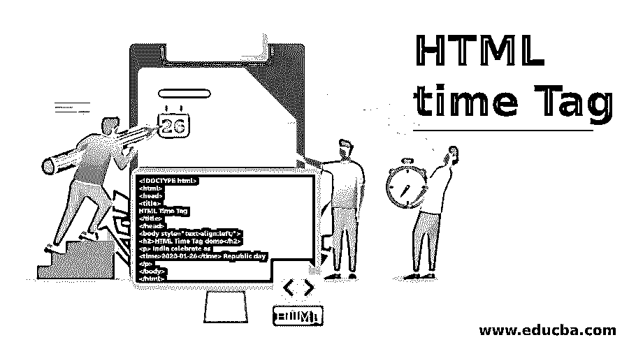
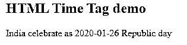
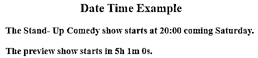
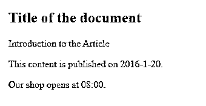
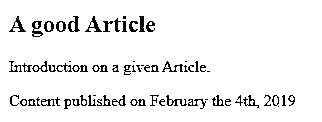

# HTML 时间标签

> 原文：<https://www.educba.com/html-time-tag/>




## HTML 时间标签介绍

众所周知，HTML 在 web 开发领域不断发展，它是一种在全世界都很流行的标记语言。据说 Web 开发人员需要更新和学习 HTML 元素。在这篇文章中，我们将学习几个叫做时间标签的重要标签。事实上，对于人类来说，阅读多种形式的日期/时间很容易，但对于机器来说，很难解析，到那时<时间>就来了。这个< time >标签定义了一个特定的时间段，并为特定的网页指定了日期和时间，因此它们也非常有用，代表了人类可读的标签。这种人类可读的格式是一种有价值的互联网协议。HTML 5 支持<时间>标签[，但 HTML 4.01 版本不支持。](https://www.educba.com/what-is-html5/)

可以通过以下方式定义时间:

<small>网页开发、编程语言、软件测试&其他</small>

*   持续时间
*   24 小时制的正确时间
*   公历上的日期

随着时间的进步，网页变得更加结构化，使得 HTML 代码更容易被搜索引擎读取，以分析网页上的想法，并有利于开发事件调度和任何与时间相关的事件功能。例如，在与当前事件相关的搜索引擎中，它有助于通过视觉时间事件来提高当前网页的排名。

**语法:**

```
<time> 2020-01-28 </time>
```

使用基本的日期-时间属性赋予时间标签独特的特定格式，因为它适用于计算机。

从上面的语法来看，据说<time>标签包含时间、日期或者两者。预期的格式是从最大周期到最小周期年-月-日 hh: mm: ss 时区。如果没有日期时间属性，则使用此格式。</time>

### 属性

属性在 HTML 中起着重要的作用。有了这个 HTML 元素，用户可以灵活地在他们的工作日程上添加日期，在他们各自的日历上添加生日提醒。另一个好处是搜索引擎可以给我们更好的搜索结果。此时间元素支持全局和事件属性；除此之外，一个非常重要的属性是日期时间。为了显示像“星期一”这样的值，表示“星期五”日期时间属性。

下表说明了与此元素相关的属性及其说明:

| **属性名** | **描述** |
| 日期时间 | 它指定元素的机器可读输入时间。 |
| 发布日期 | 它有一个布尔值，指定内容的发布日期。 |

有一些不同的方法来表示日期时间属性。标准在 ISO 8601 的简介中给出。它是用 ABNF 符号定义的。而‘T’和‘Z’下面的字母要用大写来声明。

**1。年和月**

非常简单的格式与前一年。

2019 – 08

**2。单独约会**

1946-08-17

**3。没有年份的日期**

08-21

**4。仅时间显示**

13: 55: 30\. 522

**5。日期和时间**

2014 年 8 月 21 日 15 时 55 分

这里 T 代表日期和时间的分离。

**6。时区格式**

它以加号或减号开始，在某些情况下( : )被大写字母“Z”代替。

+ 08 : 05

**7。年和周**

这里的“W”代表一周，并带有相应的周数。

2017–W 20

**8。持续时间(用两种方法)**

2w 3d 4 h 25 分钟 12.402 秒

此外，它还支持全局属性以及 id、class、style 等元素，并支持 onabort、onfocus、onclick、onmousedown、onmouseout、onkeyup、onchange、ondrag、ondrop、onselect、onmessage、onscroll 等事件属性。

### 实现 HTML 时间标签的例子

也可以在不使用 datetime 属性的情况下使用此标记来显示日期或时间。以下是一些例子:

#### 示例 1–使用<time>标签。</time>

**代码:**

```
<!DOCTYPE html>
<html>
<head>
<title>
HTML Time Tag
</title>
</head>
<body style="text-align:left;">
<h2>HTML Time Tag demo</h2>
<p> India celebrate as
<time>2020-01-26</time> Republic day
</p>
</body>
</html>
```

**输出:**




#### 实施例 2

在 title 属性中加入时间元素，以良好的人类可读格式或机器可读格式显示用户的详细信息。

**代码:**

```
<!DOCTYPE html>
<html>
<body>
<h2> <center> Date Time Example </center> </h2>
<h3>The Stand- Up Comedy show starts at <time datetime="2018-07-04T20:00:00Z">20:00</time> coming Saturday.</h3>
<h3>The preview show starts in <time datetime="PT3H0M3S">5h 1m 0s</time>.</h3>
</body>
</html>
```

在下面的输出中，时间标签指示浏览器在属性之间使用的文本是时间参考(5 h 1m 0s ),但不显示时间属性。

**输出:**




#### 例 3——使用 Css。

**代码:**

```
<!doctype html>
<html>
<body>

<body style="background-color:yellow;">
<h1>Title of the document</h1>
<p>Introduction to the Article</p>


<p>This content is published on <time>2016-1-20</time>.</p>
<p>Our shop opens at <time>08:00</time>.</p>

</body>
</html>
```

**输出:****T3】**




#### 示例 4–使用发布日期属性。

**代码:**

```
<!DOCTYPE html>
<html>
<body>

<h1>A good Article</h1>
<p>Introduction on a given Article.</p>

<p>Content published on <time datetime="2019-02-04" pubdate>February the 4th, 2019</time>


</body>
</html>
```

**输出:**




### 结论

因此，我们已经学会了如何使用<time>标签，也知道了网络爬虫如何解释网页上的日期和时间。随着时间标签在搜索引擎中的使用增加，人们开始在 HTML 文档中使用时间标签。使用日期/时间属性浏览器可以清楚地知道现在是什么时间，一些网站会使用默认的时间主题，如 Reddit、word press 等。</time>

### 推荐文章

这是一个 HTML 时间标签的指南。这里我们讨论 HTML 时间标签的介绍、属性和不同的例子。您也可以看看以下文章，了解更多信息–

1.  [HTML 中标签的类型](https://www.educba.com/types-of-tags-in-html/)
2.  [HTML 中的选项标签](https://www.educba.com/option-tag-in-html/)
3.  [HTML 中的字体标签](https://www.educba.com/font-tag-in-html/)
4.  [HTML 图片标签](https://www.educba.com/html-picture-tag/)


