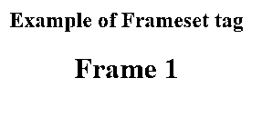
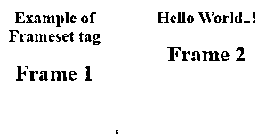
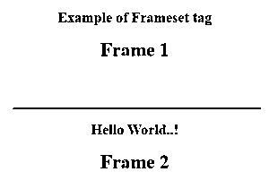

# HTML 框架集标记

> 原文：<https://www.educba.com/html-frameset-tag/>


## HTML 框架集标签简介

HTML 中的标签将多个框架组合在一起，并显示为一个网页。该文档将由框架集中包含的所有框架组成。框架什么都不是，但它们类似于单独的窗口或网站。frameset 标记允许我们形成多列或多行，并在它们下面包含框架。这个特性在 HTML 5 之前就有了，通过将多个文档组合在一起，可以一次显示多个文档。每个框架可以包含自己的内容；通常情况下，这些将是不同的网页文件，如 HTML 或图像。

### 句法

这里起始标签为，结束标签为。标签可能包含一个或多个多帧标签。每个框架标签以标签开始，它将有属性名“src ”,我们将在那里传递我们的框架内容。如前所述，这些内容可以是任何像 web 文件的东西，比如 HTML 或传递的图像。

<small>网页开发、编程语言、软件测试&其他</small>

```
<frameset cols / rows = ", , , " >
<frame src = "source file name. . . " >
. . . . . .
. . . . . .
<frame src = "source file name. . . " >
</frameset>
```

这里，我们有一个包含属性列或行的起始标记框架集。通常，这两个属性将与框架集标签一起使用，因为框架集标签用于组合多个框架。这些标签只是允许形成行或列来定位多个框架。然后，一个简单的框架标签跟随在开始标签之后。这个框架标签有一个名为 src 的属性，我们将在其中传递要在该框架中显示的文件的名称。因为一个框架集可以包含多个框架，所以我们用点来表示。最后，框架集标签被关闭标签关闭。

### 框架集标记的属性

以下是框架集标记支持的属性列表:

**1。cols:** 这个属性用于定位内部的框架。cols 属性将框架集分成多列，框架将垂直显示。该属性还允许设置框架集中每一列的宽度。通过将值传递给这个属性，我们可以为每个帧设置不同的值。可以传递的值可以是百分比、像素或相对长度。该属性的默认值为 100%。

**2。rows:** 这个属性也类似于 cols 属性。rows 属性将框架集分成多行，框架将一个接一个地水平显示。我们可以传递类似于 cols 属性的值来设置每一帧的高度。行和列的组合可以用来实现所需的最终结果。该属性的默认值也是 100%。

**3。border:** 这个属性用在 frameset 标签上，定义框架集中每个框架的宽度。

**4。framespacing:** 这个属性用在 frameset 标签上来声明和定义 frameset 标签中包含的多个框架之间的间距。

### 实现 HTML 框架集标记的示例

以下是 HTML 框架集标签的示例:

#### 示例#1

它包含多个 Html 文件，因为我们在一个父窗口中使用不同的 Html 文件作为框架。

**代码:**

**主文件:**

```
<!DOCTYPE html>
<html>
<head>
<title> frameset tag in HTML </title>
<style>
</style>
</head>
<frameset>
<frame src = "frame1.html" >
</frameset>
</html>
```

我们有一个名为 frame 1 的源文件。

**frame1.html:**

```
<!DOCTYPE html>
<html>
<head>
<title> Frameset Example </title>
<style>
body {
text-align: center ;
background-color: rgb(120, 120, 120, 0.15) ;
}
</style>
</head>
<body>
<h2> Example of Frameset tag </h2>
<h1> Frame 1 </h1>
</body>
</html>
```

**输出**:

因为我们只有一个文件包含在一个框架中，所以该页面将显示整个 frame.html 的内容。框架的宽度和高度默认为 100%，这就是为什么单个框架会占据所有区域。




#### 实施例 2

让我们在示例中再添加一个帧，并使用 cols 属性按列对其进行划分，并传递百分比值。

**代码**:

**frame2.html:**

```
<!DOCTYPE html>
<html>
<head>
<title> Frameset Example </title>
<style>
body {
text-align: center ;
background-color: rgb(120, 120, 120, 0.30 ) ;
}
</style>
</head
<body>
<h2> Hello World..! </h2>
<h1> Frame 2 </h1>
</body>
</html>
```

**主文件:**

```
<!DOCTYPE html>
<html>
<head>
<title> frameset tag in HTML </title>
<style>
</style>
</head>
<frameset cols = "40% , 60 %" >
<frame src = "frame1.html" >
<frame src = "frame2.html" >
</frameset>
</html>
```

**输出**:

这里，我们传递了两个帧，并使用 cols 属性将它们分开，传递的值为 40%和 60%。第一帧的宽度将显示为 40%，第二帧的宽度将显示为 60%。




#### 实施例 3

让我们使用 rows 属性水平分割相同的帧。我们将修改最后一个例子。不同之处在于 rows 属性将替换 cols 属性。rows 属性也采用类似于 cols 属性的值。我们可以根据帧数传递多个值。

**代码**:

**主文件:**

```
<!DOCTYPE html>
<html>
<head>
<title> frameset tag in HTML </title>
<style>
</style>
</head>
<frameset rows = "50% , 50%" >
<frame src = "frame1.html" >
<frame src = "frame2.html" >
</frameset>
</html>
```

**输出:**

这里的输出将是两个相同高度为 50%的水平帧。请注意，这个高度将对应于实际的浏览器窗口。




### 结论

所以，我们已经看到了 HTML 中的 frameset 标签，它的用法以及如何使用。这个标签用于在一个窗口中组合和显示多个框架。我们还可以通过使用可用的属性来定义框架的位置和大小。从 HTML 5 开始，这个标签就被弃用了。

### 推荐文章

这是一个 HTML 框架集标签的指南。这里我们分别讨论 HTML 中框架集标签的基本概念、属性和不同的例子。您也可以看看以下文章，了解更多信息–

1.  [HTML 框架](https://www.educba.com/html-frames/)
2.  [HTML 向左浮动](https://www.educba.com/html-float-left/)
3.  [HTML 中的 SUP 标签](https://www.educba.com/sup-tag-in-html/)
4.  [在 HTML 中嵌入标签](https://www.educba.com/embed-tag-in-html/)


