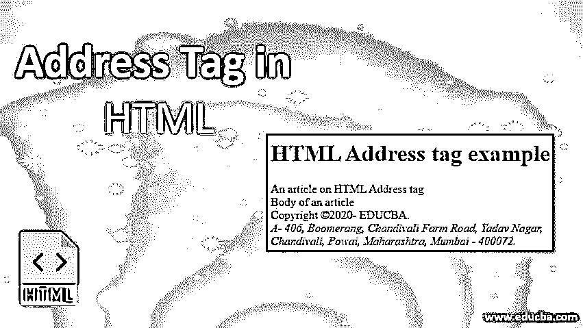
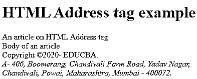
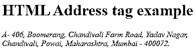

# HTML 中的地址标签

> 原文：<https://www.educba.com/address-tag-in-html/>




## HTML 中的地址标签介绍

HTML 文档的地址标签被符号化，用于提供组织或个人的联系信息。当在 HTML 文档中的不同位置使用时,

<address>标签有不同的含义，就像当它在标签中使用时，那么它将显示文档的联系信息，如果它在

标签中使用，那么它代表文章的联系信息。通常，由

<address>标记表示的文本将以斜体显示。有些浏览器具有在地址标签前后添加换行符的功能。

<address>标签可以用在各种上下文中，例如通过在

标签中包含一个

<address>元素来指示文章的作者，或者在页面标题中提供一个企业的联系信息。</address>


</address>

</address>


</address>

**注意:**html 5 中的地址标签需要有开始和结束标签，即<地址> ……..</页脚>

<small>网页开发、编程语言、软件测试&其他</small>

*   不允许使用地址标签来表示任何任意地址(即与联系信息无关的地址)。
*   地址标签不应该包含除联系信息之外的信息，比如出版日期(使用<time>标签代替)。</time>

**语法**

下面是提到的语法:

**1。HTML/XHTML**

```
<body>
 ... 
<body>
```

**2。CSS**

```
footer{
--your css code—
}
```

### 地址标签中的要点

以下是关于标签的一些要点:

*   一个

    <address>元素被正式放置在当前节的

    元素内，如果有的话。

    </address>

*   以前的情况是，

    <address>元素只能用来表示文档作者的联系信息。然而，现在在最新的 spec 版本中，它的定义已经升级，因为它现在也可以用于标记任意地址。</address>

*   一个

    <address>元素不应该包含比联系信息更多的信息，比如出版日期(为此使用<time>标签)。</time></address>

*   Address 标记唯一允许的内容类型是 flow content means

    <address>标记，作为父标记，不能有嵌套的

    <address>元素，那么相同的

    <address>内容不能有

    <address>标记作为其父标记。</address>

    </address>

    </address>

    </address>

*   大多数浏览器会以斜体显示

    <address>标签中的文本，但是您可以通过 CSS 样式来改变这种行为。</address>

*   地址标签不允许用于表示任意地址(例如邮政地址)，除非这些地址是该部分的联系信息。要显示邮政地址，只需使用

    标签。

*   <address>标签不允许包含

    、

    、

    <nav>、

    、

    、

    <hgroup>、

    # -

    ###### 或其他

    <address>元素。</address>

    </hgroup>

    

    

    </nav>

    

    

    </address>

*   对于 IE 9 之前的 Internet Explorer 浏览器，使用 HTML5，这是一种 JavaScript 变通方法，为新的 HTML5 元素提供支持，例如:

    <main>、

    、

    、

    、

    <nav>、

    、

    </nav>

    

    

    

    </main>

### 特定于标签的属性

没有与

<address>标签一起使用的特定属性。</address>

#### 1.全局属性

与所有其他 HTML 标签相似，

<address>标签也支持 HTML5 中的全局属性。以下是全局属性:</address>

*   accesskey
*   班级
*   内容可编辑
*   上下文菜单
*   目录
*   可拖动的
*   空投区
*   隐藏的
*   身份证明（identification）
*   itemid
*   项目道具
*   itemref
*   项目范围
*   项目类型
*   语言
*   拼写检查
*   风格
*   tab 键索引
*   标题
*   翻译

有关这些属性的完整解释，请访问[https://www.educba.com/html-attributes/](https://www.educba.com/html-attributes/)。

#### 2.事件属性

HTML5 中的

<address>标签也支持所有的事件属性。以下是事件处理程序的内容属性。</address>

*   奥纳博特
*   oncancel
*   onblur
*   在线播放
*   在线播放
*   昂哥
*   onclick
*   oncontextmenu
*   ondblclick(点击鼠标)
*   忍无可忍
*   不可忍受
*   翁德拉贡特
*   ondragexit
*   软骨叶
*   翁德拉戈弗
*   ondragstart
*   ondrop
*   老化变化
*   一个提示
*   统一的
*   不良事件
*   专注
*   论形式变革
*   on form 输入
*   oninput
*   on 无效
*   onkeydown
*   onkeypress
*   onkeyup
*   装载
*   onloadeddata
*   onloadedmetadata
*   onloadstart
*   onmousedown
*   onmousemove
*   onmouseout
*   onmouseover
*   是 mouseup
*   onmousewheel
*   暂停
*   monplay
*   播放中
*   onprogress
*   最新变化
*   onreadystatechange
*   onscroll
*   被发现
*   观察
*   onselect
*   昂秀
*   安装
*   昂松宾
*   暂停
*   按时更新
*   on volume exchange
*   等待中

关于这些属性的完整解释，请访问[https://www.educba.com/html-event-attributes/](https://www.educba.com/html-event-attributes/)

#### 

<address>标签中的 CSS 文本格式属性</address>

*   文本颜色
*   文本对齐
*   文本装饰
*   文本转换
*   行高
*   文本方向
*   文本阴影
*   单词间距

#### 

<address>标签中的 CSS 字体属性</address>

*   字体样式–正常|斜体|倾斜|首字母|继承
*   字体变体–正常|小型大写字母|首字母|继承
*   font-weight–normal | bold | bold | light | number | initial | inherit
*   font-size–medium | xx-small | x-small | small | large | x-large | xx-large | small | large | length | initial | inherit
*   字体系列–系列名称|通用系列|首字母|继承

#### 

<address>标签的 CSS 测试阴影属性</address>

```
<style>
address{
text-shadow: 1px 1px #FF0000;
}
</style>
```

**注意:**如果页脚包含联系方式，您应该将它们放在<地址>标签中。

### HTML 中地址标签的例子

以下是 HTML 中地址标签的示例:

#### 示例#1

**代码:**

```
<!DOCTYPE html>
<html>
<head> . . . </head>
<body>

<h1>HTML Address tag example</h1>

<main>
 An article on HTML Address tag
</main>
 Body of an article 

Copyright &copy;2020- EDUCBA.
<address> A- 406, Boomerang, Chandivali Farm Road,
Yadav Nagar, Chandivali, Powai,
Maharashtra, Mumbai - 400072\. </address>

</body>
</html>
```

**输出:**




#### 实施例 2

**代码:**

```
<!DOCTYPE html>
<html>
<head> . . . </head>
<body>

<h1>HTML Address tag example</h1>

<div>
<address> A- 406, Boomerang, Chandivali Farm Road,
Yadav Nagar, Chandivali, Powai,
Maharashtra, Mumbai - 400072\. </address>
</div>
</body>
</html>
```

**输出:**




#### 实施例 3

**代码:**

```
<!DOCTYPE html>
<html>
<head> . . . </head>
<body>

<h1>HTML Address tag example</h1>

<div>
<address> We are always here to help. If you have a requirement / query about our services; email us at <a href="info@educba.com">info@educba.com</a> and we'll do our best to reply within 24 hours </address>
</div>
</body>
</html>
```

**输出:**


### 结论

下面是一些你应该记住的主题要点:

*   HTML

    <address>元素总是出现在标签中。</address>

*   HTML

    <address>标签提供了 HTML 4.01 中最近的祖先的联系信息。</address>

*   HTML

    <address>标签提供了 HTML5 中最近的

    或祖先的联系信息。

    </address>

*   <address>标签通常放在

    标签内，用于

    或。

    

    </address>

*   不要将出版日期放在

    <address>标签中，因为要使用<time>标签。</time></address>

*   大多数浏览器会以斜体显示

    <address>标签中的文本，但是您可以通过 CSS 样式来改变这种行为。</address>

### 推荐文章

这是一个 HTML 中地址标签的指南。在这里，我们讨论语法、特定于标签的属性，以及带有适当代码和输出的 HTML 中的地址标签示例。您也可以浏览我们的其他相关文章，了解更多信息——

1.  [HTML 中的 Span 标签](https://www.educba.com/span-tag-in-html/)
2.  [HTML 中的前置标签](https://www.educba.com/pre-tag-in-html/)
3.  [HTML 中的 SUP 标签](https://www.educba.com/sup-tag-in-html/)
4.  [HTML 中的内嵌标签](https://www.educba.com/inline-tags-in-html/)


