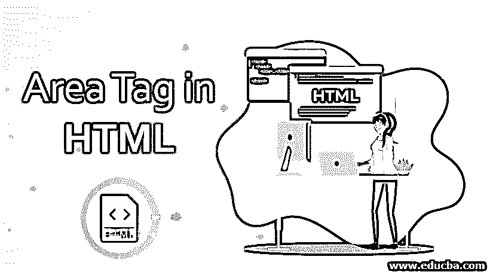
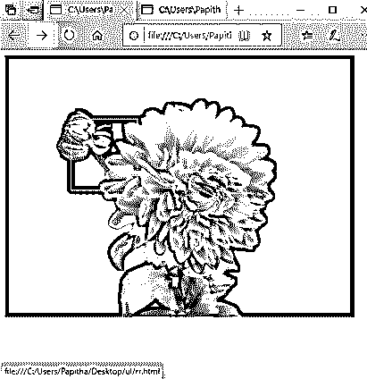
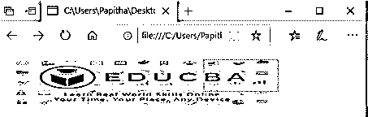
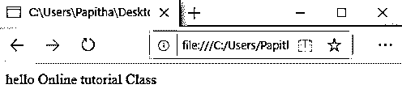
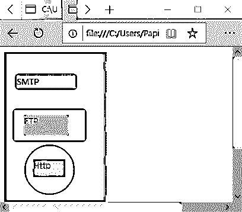
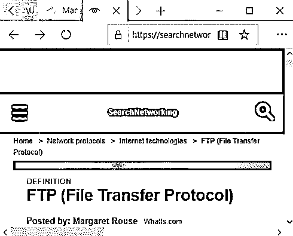

# HTML 中的区域标签

> 原文：<https://www.educba.com/area-tag-in-html/>




## HTML 中的区域标签介绍

在这篇文章中，我们将学习 HTML 中的区域标签。区域标签用于定义图像映射中的热点，并与超文本链接相关联或链接，以允许用户在网页上可点击。它有助于在单击地图部分时链接到不同的页面。当图像上需要多个链接时，标签就变得很有用。

**语法**

<small>网页开发、编程语言、软件测试&其他</small>

基本语法如下所示:

```
<area alt="text" class=" "coords = " " shape " "/> ;
```

此处，如果图像未呈现，alt 用于替代文本。

*   **class:** 定义一个元素的类名。
*   **坐标**:有一组形状值。

对于图像映射，语法是:

```

<map name=" name">
<area shape="shapeName1" coords="x,y coordinates" href="html linkPath">
<area shape="shapeName2" coords=" x,y coordinates " href="htmllinkPath">
</map>
```

**解释:**这是一个没有结束标签的空标签，而在 XHTML 中，它被声明为<区域/ >。并且这个区域标签总是嵌入有<地图>标签(包含在地图容器中)，给出具体图像的坐标值。此外，重叠发生在非活动区域；它是通过优先激活较高的区域来解决的。以下部分通过一个示例介绍了如何使用 area 标签以及浏览器兼容性和它们支持的属性。

### HTML 中的区域标签是如何工作的？

这是制作的过程，最初是图像映射中的图像。

**1。**要将图像插入页面，我们应该使用下面给出的图像标签:

```
 // image from the saved folder. Also, we can get from the web URL directly and map with <map> tag.
```

它带有两个属性 src: Source 和描述图像内容的 alt- text。

**2。**其次，用属性#map 打开地图元素。这个图像标签附带了一个使用贴图，后跟一个“#”符号(使用贴图=" #map ")。Mapname 应该与 usemap 同名。

如何创建影像地图？通过同时使用“使用地图”和“名称”属性将图像和地图放在一起。当鼠标光标在屏幕上变成指针(手形符号)时，浏览器会识别形状的区域。

**3。**声明要用于绘制地图的区域。

```
<area shape="rect" cords=…….href=""  alt ="">
href comes with alt attribute by default.
```

### 属性

一般来说，HTML 标签有一个或多个属性，有助于给浏览器带来视觉上的愉悦。使用了三种属性，即全局属性、事件处理属性和特定于元素的属性。area 标签提供了标签特有的属性及其描述，如下所列，HTML 5 有一些新的属性。

#### 1.特定于标签的属性

| **属性名称** | **描述** | **例子** |
| **alt** | 在指定区域定义替换文字，以提高可访问性。 |  |
| **href** | 定义超级引用意味着链接到下一个页面点/页面的 URL。它将一个区域变成一个超链接。 |  |
| **形状** | 定义要在图像上完成的不同形状。 | <area href=”doc1.html” alt=”First doc” shape=”circle” coords=”40, 40, 20″> |
| **坐标** | Gives the specific values appropriate to the region in the image. The  Coords are specified as follows :默认:不需要跳线。矩形:左、上、右、下圆:x，y，半径聚:x1，y1，x2，y2，x3，y3… |  |
| **目标** | 指定在哪里打开链接页面，或者我可以说是结束目标页面。 |  |
| **Nohref** | 定义了 href 的缺失。意味着该区域没有到下一页的链接 |  |
| **类型** | 指定内容类型(MIME) |  |
| **绿眼人** | 指定语言类型 |  |

#### 2.标准属性

在前一篇文章中已经讨论了这些属性的描述。

*   访问键
*   班级
*   目录
*   身份证明（identification）
*   风格
*   语言
*   身份证明（identification）
*   标签索引
*   标题。

#### 3.全局属性

*   鼠标向下
*   onmouse up
*   onmouse 结束
*   鼠标移动时
*   onmouse out
*   聚焦
*   模糊论
*   按键式印刷机
*   按键按下
*   onkey up.

### 在 HTML 中实现区域标签的例子

下面是在 HTML 中实现区域标签的例子:

#### 示例#1

在下面的例子中，我创建了一个 jpg 图像 diary.jpg。当执行代码时，手形工具以指定的速度在图像上移动；当你点击它时，它会指向 rr.html 页面。

**代码:**

```
<!DOCTYPE html>
<html>
<body>

<map name="Diary">
<area shape="rect" coords="94,91,189,193" href="rr.html">
</map>
</body>
</html>
```

**代号:rr.html**

```
<!DOCTYPE html>
<html>
<head>
hello
</head>
<body> Online tutorial Class</body>
</html>
```

**输出:**




#### 实施例 2

**代码:**

```
<!DOCTYPE html>
<html>
<body>

<map name="ccmap">
<area shape="rect" coords="89,9,294,50" href="sha.html" alt="EDUCBA">
<area shape="rect" coords="297,7,407,54" href="rr.html" alt="Welcome">
</map>
</body>
</html>
```

**代号:rr.html**

```
<!DOCTYPE html>
<html>
<head>
hello
</head>
<body> Online tutorial Class</body>
</html>
```

**代号:sha.html**

```
<!DOCTYPE html>
<html>
<head>
hello
</head>
<body> Welcome to the Page</body>
</html>
```

**输出:**




在下面的输出中显示了 EDUCBA 的徽标；点击单词“BA”会进入“你好”页面。




#### 实施例 3

**代码:**

```
<!DOCTYPE html>
<html>
<body>

<map name="Protocols">
<area shape="Poly"
coords="74,0,113,29,98,72,52,72,38,27"
href=https://www.manageengine.com/network-monitoring/what-is-snmp.html"
alt="SNMP Tutorial"
target="_blank" />
<area shape="rect"
coords="22,83,126,125"
alt="FTP Tutorial"
href="https://www.techtarget.com/searchnetworking/definition/File-Transfer-Protocol-FTP"
target="_blank" />
<area shape="circle"
coords="73,168,32"
alt="http Tutorial"
href="https://www.webopedia.com/TERM/H/HTTP.html"
target="_blank" />
</map>
</body>
</html>
```

**对上述程序的解释:**在这个例子中，我们使用名为 new.png 的图像文件创建了一个图像地图，其中有三个使用<区域>标签声明的可点击区域。第一个可点击区域是一个多边形，链接到名为 www.managengine.com 的 SNMP 页面。第二个可点击区域是一个矩形，链接到名为 www.searchnetworking.com 的 FTP 页面。最后一个可点击区域是一个圆形，链接到名为 www.webopedia.com 的 HTTP 页面。

**输出:**




**输出:**




### 结论

因此，我们已经看到了在切换到包含一条简要信息的页面的活动区域中使用的 area 标签如何通过语法和演示示例解释了如何在可点击区域中使用标签。

### 推荐文章

这是一个 HTML 中区域标签的指南。这里我们讨论介绍、区域标签工作、适当的语法、属性和相应的例子。您也可以浏览我们的其他相关文章，了解更多信息——

1.  [HTML 样本标签](https://www.educba.com/html-samp-tag/)
2.  [HTML 中的前置标签](https://www.educba.com/pre-tag-in-html/)
3.  [HTML 中的 Span 标签](https://www.educba.com/span-tag-in-html/)
4.  [HTML 中的选项标签](https://www.educba.com/option-tag-in-html/)


