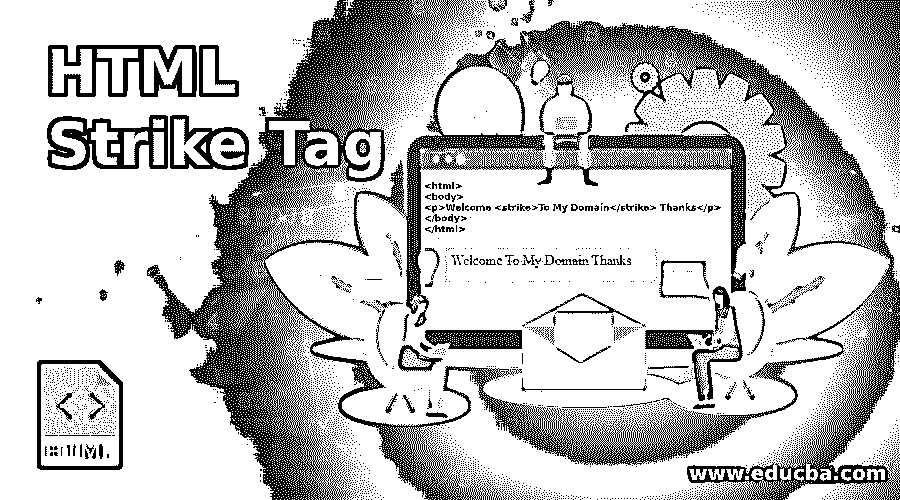
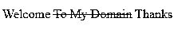
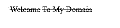
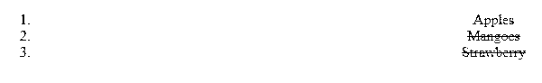

# HTML 删除标记

> 原文：<https://www.educba.com/html-strike-tag/>




## HTML 标记简介

html 有一组不同的标签，用于使用构建得更有吸引力的网页，并且必须满足用户定义的要求。html 的每个版本都有一套不同的功能，其中一些功能在旧版本和新版本之间已经过时了。同样的事情~~是 html 中的一个标签，它通过 html 网页中的删除线文本来指定。现在，这个标签已经被弃用了；现在在 html 中使用了~~标签来代替~~标签。主要在 html5 中，这个标签是不可用的；而是支持~~、~~，或者在文档中使用 CSS 样式。~~~~~~~~~~

**语法:**

<small>网页开发、编程语言、软件测试&其他</small>

strike 标记具有以下将在 html 网页中使用的语法。

```
<html>
<body>
<strike>--content--</strike>
</body>
</html>
```

上面的代码是一个基本语法；它将使用网页中的~~标签中的用户内容。它还将使用 HTML 中的全局属性，并且还使用事件属性。在 HTML 中，~~标签总是成对出现，并且应用相同的一般规则，总是必须使用开始~~和结束~~标签。~~~~

### 如何在 HTML 中使用 Strike 标签？

*   每当使用 strike 标签在 html 中创建删除线文本时，我们也可以[使用一些 CSS 样式](https://www.educba.com/what-is-css/)装饰，如在 Html 的<样式>标签中的“线条”。
*   尽管与其他表示框架相比，CSS 在网页内容的样式方面总是很棒，但它不提供内容的任何确切含义，这就是为什么我们使用 html 语义标签，与 CSS 相比，甚至比使用 html 中删除线内容的~~和~~标签好得多，但这两个标签将以不同的方式传达含义。~~~~
*   如果我们想要表示网页上的内容，将使用~~标签，但是它不再准确或与文本相关。~~
*   在 html 文档或项目需求中，我们不应该用它来编辑文档。如果我们想删除 html 文档中的一些内容就要使用~~标签。~~
*   html ~~标签总是在网页的中心位置使用水平线通过文本给出文本外观。主要用于标记文本的删除线是错误的，否则它会被其他 html 标签自动删除，比如~~。~~~~
*   默认情况下，在网页中，文本以删除线的形式出现，这些删除线位于空闲位置，用于显示给定文本中的更正。它同样适用于表格格式以及其他基于 CSS 样式的格式。
*   和一些短语一样，它依赖于 html 标签；它将与用户一致性难以通过其他方式实现的情况相结合，因为我们知道开始和结束标记在 html 文本中显示为删除线。
*   ~~标签可用于添加带有功能的样式；这些必须通过在开始的~~标签后添加属性来完成。~~~~
*   strike 标记允许所有属性作为包含的类、目录、id、语言、标题和样式。但是，可能大多数情况下，类和 id 的使用类似于~~一些内容~~在所有属性之上，我们将注意到，如果我们使用等号运算符，那么在 strike 标记内容初始化之后有一个空格，然后是属性名称，属性的标识符使用双引号。
*   在 CSS 样式中，class 和 id 属性都被称为元素，就像 CSS 一样，而且，它将被存储在外部文件中的 web 页面的标签中。通常使用 id，它指的是网页的单个实例，但是如果我们主要使用 class 属性，它指的是网页上的重复元素。
*   如果我们使用这些属性中的任何一个，它将在 CSS 样式信息中允许数据在~~标签中被允许。在 html 的 dir 属性中，基本上，它允许读取网页左侧和右侧的文本，lang 属性允许根据用户要求指定网页中标签的语言，如果需要两种以上的语言或多种语言，则允许在网页中使用这些标签。~~
*   如果我们需要 html 页面的标题内容来使用<title>标签，它将允许用户在 html 标签中包含一些额外的信息。</title>

### HTML 标记的示例

下面是 HTML Strike 标签的例子。

#### 示例#1

**代码:**

```
<html>
<body>
<p>Welcome <strike>To My Domain</strike> Thanks</p>
</body>
</html>
```

**输出:**




#### 实施例 2

**代码:**

```
<html>
<head>
<style>
.sample{
color:blue;
}
body {
text-align:center;
}
</style>
</head>
<body>
<div class="sample">
<strike>Welcome</strike>
<strike>To My Domain</strike>
</div>
</body>
</html>
```

**输出:**




#### 实施例 3

**代码:**

```
<html>
<head>
<style>
.sample{
color:red;
}
body {
text-align:center;
}
</style>
</head>
<body>
<div class="sample">
<ol>
<li>Apples</li>
<li><del>Mangoes</del></li>
<li><del>Strawberry</del></li>
</ol>
</div>
</body>
</html>
```

**输出:**




上面的例子展示了 HTML 文档中~~标签的用法。我们看到，第一个示例将在 html 文档中使用~~标记，因为提到的内容将在网页中被否决。同样，第二个示例我们将使用一些应用于网页的 CSS 样式，这些样式将显示在用户屏幕上的网页视图中。最后一个示例我们在文档中使用~~标记，而不是~~标记。出于同样的目的，提到的内容或文本将从网页中删除。同样的标签也会在其他一些框架上使用，比如 [bootstrap 和 jquery](https://www.educba.com/bootstrap-vs-jquery/)libraries；它将用于离子角框架等。~~~~~~~~

### 结论

基于以上概念， ~~HTML 标签的表面将很容易看出它在网页用户中是多么的万能。它将充分利用对 CSS 框架的理解，也将与 jquery、Angular 一起工作，但每种技术的目的会有所不同。~~

### 推荐文章

这是一个 HTML 标记指南。这里我们讨论一下基本概念，各种例子，以及如何在 HTML 中使用 strike 标签？您也可以看看以下文章，了解更多信息–

1.  [HTML 文本格式化标签](https://www.educba.com/html-text-formatting-tags/)
2.  [HTML 文本属性](https://www.educba.com/html-text-attributes/)
3.  [在 HTML 中嵌入标签](https://www.educba.com/embed-tag-in-html/)
4.  [HTML 中的画布标签](https://www.educba.com/canvas-tag-in-html/)


