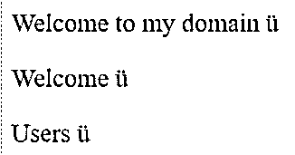
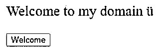
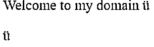
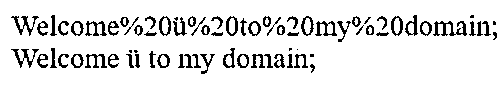

# HTML 元音变音符

> 原文：<https://www.educba.com/html-umlaute/>


## HTML 元音变调简介

元音变音是 html 中的特殊字符之一；它用于 html4 和 html5 版本。在每个 web 项目中，我们使用 html、jsp、angular 等创建一些 UI 页面。一些前端技术会构建前端页面；每种前端技术都可能有一些吸引用户端的特殊字符和特征。在 html 中，我们以 UTF-8 格式编写代码，或者在 HTML 文档的显示区域中使用不同的字符表示 CSS 样式。它有一套不同的字符、货币符号和数学表示。

### HTML 变音的语法

Html 元音字母有一个特性，允许 html 符号代码识别和简化网站设计。

<small>网页开发、编程语言、软件测试&其他</small>

**代码:**

```
<html>
<body>


<p>
---decimal codes and hexa decimal codesfor Umlaute character---
Use decimal code and hexadecimal code like &#220,&#xDC and &#252, &Uuml
</p>
</body>
</html>
```

以上代码是在英语键盘中使用 html 变音的基本语法。如果我们使用德语键盘，很容易理解和识别键盘中的键，以便使用元音字母类型的字符创建 html 文档，因为在正常的英语键盘中，我们使用元音字母的符号，如 U 和字符 U 顶部的两个点，在正常的英语键盘中很难使用，所以我们将字符转换为“Unicode 数字、Html 实体和 Html Unicode 函数调用”,也很容易转换十进制和六进制代码。

html 文档字符编码可能会有所不同，这取决于电脑和键盘制造类型所在国家所使用的语言。一般来说，特殊字符，尤其是 html 中的 UI 前端代码，通常是那些不容易在键盘上键入的字符。即使我们复制并粘贴了文档中的字符，它也会显示一些错误和异常。如果我们在 html 中使用任何特殊字符，我们将遵循 html 实体名称或 HTML 实体编号。我们将确保并检查它是否能在所有类型的用户浏览器中正确显示。

如果我们想使用像**、**这样的版权符号，我们将**、**使用像& #169 或&这样的十进制代码，复制这些符号和字符串将在我们的 html 代码中出现，然后只有我们将它显示在前端网页上。特殊字符是已经预先定义好的，并且用 html 文档的新关键字来指定。它将在后台执行字符操作；它将转换浏览器的 html 解释；因此，我们必须使用 html 实体名称或 html 实体编号来访问网页中特殊字符或保留字符的功能。

当我们在文档中使用这些类型的特殊字符时，我们还执行一些 html 编码和解码操作。一般来说，编码器会将所有给定的字符转换成它们在文件中对应的实体；有些字符有特定的含义。当我们给角色编码时，他们应该验证自己；它不应该改变字符的含义。我们可以将特殊字符转换成 html 代码，以便在 web 浏览器中显示，尽管我们是用普通的十进制和十六进制代码来显示的。GNOME 这是一个字符映射应用程序，它允许特殊字符，不寻常的字符(这是无法在文件中使用的一些字符)。如果我们想要创建 xml 文档，我们将转换 xml dom 解析器来获取用户输入数据；它将被转换成 html 网页。

如果我们想将 xml 转换成 HTML，一些转换将使用 xslt 指令来执行；我们将确保他们在编码步骤中遵循这些说明；这将有助于转换用法。文档的格式化标签将通过不同的 html 属性集(如

标签等)控制不同的行为来执行。一些标签对于用户浏览器来说是不可用和不可接受的，它们与不同种类的网络浏览器不兼容；尽管我们会在搜索引擎模型中找到一些属性内容，但它是基于排名系统的，它会自动计算网页内容的数量，并将其存储在日志中，它基于网站的身份验证目的来创建高质量的内容。

### HTML 元音变音符的示例

下面是一些例子:

#### 示例#1

**代码:**

```
<html>
<style>
body {
font-size: 23px;
}
</style>
<body>

<p>Welcome to my domain ü</p>
<p>Welcome ü</p>
<p>Users &uuml;</p>
</body>
</html>
```

**输出:**




#### 实施例 2

**代码:**

```
<html>
<head>
<style>
body {
font-size: 23px;
}
</style
<script>
function sample()
{
var strings = {
'Welcome': {
'de': '&Uuml;ber'
}, }
document.getElementById("sam").innerHTML="&#xFC";
}
</script>
</head>
<body>

<p>Welcome to my domain ü</p>
<p id="sam"><button type="button" onclick="sample()">Welcome</button></p>
</body>
</html>
```

**输出:**







#### 实施例 3

**代码:**

```
<html>
<head>
<style>
body {
font-size: 23px;
}
</style>
<script>
function sample()
{
var input = "Welcome &#252 to my domain;";
var encrypted = encodeURI(input);
var decrypted = decodeURI(encrypted);
var result=encrypted +"<br>"+ decrypted;
document.getElementById("sam").innerHTML=result;
}
</script>
</head>
<body>

<p id="sam"><button type="button" onclick="sample()">Welcome</button></p>
</body>
</html>
```

**输出:**





在上面的三个例子中，我们讨论了不同类别的基本 html 变音符号；在第一个例子中，我们在 html 网页中显示了基本的 html 变音字符。在第二个例子中，我们讨论了使用 javascript 功能的相同之处；单击按钮后，它将在网页上显示特殊字符。在最后一个示例中，我们使用了相同的脚本来编码和解码使用 var 数据类型的 html 字符串。它将给定的字符串转换为网页中的加密和解密操作。

### 结论

我们已经讨论了一些基本的 html 概念；对于 web 开发来说也是一个漫长的旅程。在 html 中使用了不同技术类别，如 css、引导样式，尽管我们在每组 html 属性中使用了一些 javascript 功能，但这将有助于创建 html 文档的结构化和功能性。

### 推荐文章

这是一个 HTML 变音的指南。这里我们讨论 HTML 变音的介绍和例子。您也可以看看以下文章，了解更多信息–

1.  [HTML 文本属性](https://www.educba.com/html-text-attributes/)
2.  [HTML 图片标签](https://www.educba.com/html-picture-tag/)
3.  html 特殊字符
4.  [HTML 搜索栏](https://www.educba.com/html-search-bar/)


