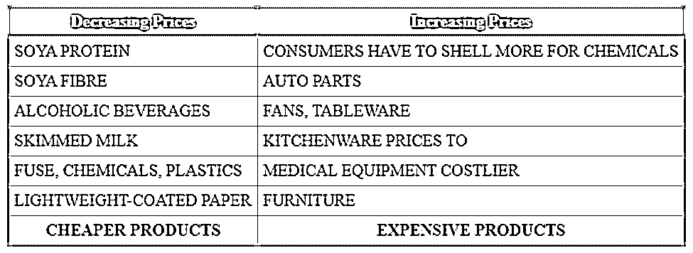
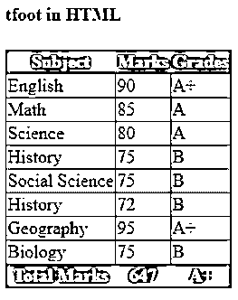
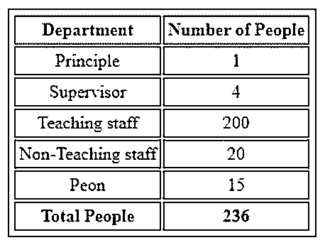

# HTML 中的 tfoot

> 原文：<https://www.educba.com/tfoot-in-html/>


## HTML 中的 tfoot 简介

众所周知，HTML 中的 tfoot 使用称为表格的元素来表示表格数据。这是由、、T0、T1、等元素组成的。其中是表格中的重要元素之一，用于显示表格列的汇总部分。

标记必须放在表格中、、标记之后。可以在之前或者在或者元素之后显示这个标签。每当表格中有多个页面可用时，这些元素帮助用户将表格页脚放在页面的底部，并独立地滚动表格内容。

<small>网页开发、编程语言、软件测试&其他</small>

**语法**

定义标签的语法如下:

```
<table>
<thead>
<tr>….</tr>
</thead>
<tbody>
<tr>….</tr>
<tr>….</tr>
</tbody>
<tfoot>
<tr>
<td>….</td>
</tr>
</tfoot>
</table>
```

根据上面的语法，包含在标签中的文本被视为表尾。标签可能包含一个或多个元素。

标签支持不同的属性，让我们一个一个来看:

**align:** 该属性有助于根据文本内容对齐文本。

**valign:** 这些属性有助于将内容与其文本垂直对齐。

**char:** 关于< tfoot >标签的一个重要属性是用来将标题单元格中的文本对齐到它所对应的字符。

**Charoff** :这是一个比较重要的属性，用于设置 char 属性。这些类型的属性以数字形式定义。

我们可以通过定义值来决定标签的位置，例如向左对齐、居中对齐、向右对齐、在文本内容周围插入或对齐特定空格、使用特殊字符以最小偏移量对齐文本内容的字符等。

此标签可以与不同的 CSS 属性一起使用，如下所示:

**text-align:** 该属性有助于在文本内容的帮助下，将页脚的文本左对齐、右对齐、两端对齐或居中对齐。

**bgcolor:** 为了让表格单元格更有吸引力，这个属性帮助我们将颜色设置为列单元格的背景。

**font-style:** 用户可以给文本赋予样式，样式包含在< tfoot >标签中。可以将字体的值设置为正常、斜体、初始、继承等。

使用这个样式属性，用户可以显示不同大小的文本。

人们可以决定他们的文本应该是粗体还是斜体。

文本转换:这个属性有助于显示文本的大小写或者控制文本的大小写。

**text-decoration:** 如果我们想要装饰包含在< tfoot >标签中的文本，那么我们可以使用这个属性来装饰文本线条、文本装饰样式、文本装饰颜色等等。

文本-阴影:这个属性帮助你给文本添加阴影。

**行高:**帮助设置给定行的高度。

**词间距:**给词之间以特定的间距是重要的性质之一。

### HTML 在 tfoot 上是如何工作的？

元素与和组合使用，定义表格的每个元素，如表头、表尾和表体。这个标记将在元素中使用一个或多个元素，因此它将有助于显示表格内容的摘要。它应该放在桌子的底部。标签的主要工作是维护大型表格数据。这将允许用户独立显示表格的内容，因此用户可以在可用性方面有更好的体验。

让我们看一个例子来说明标签在 HTML 中是如何工作的:

**举例:**

```
<table>
<thead>
<tr>
<th>Emp_ID<th>
<th>Name<th>
<th>Designation<th>
</tr>
</thead>
<tbody>
<tr>
<td>111</td>
<td>John</td>
<td>Developer</td>
</tr>
<tr>
<td>112</td>
<td>Krishna</td>
<td>Tester</td>
</tr>
<tr>
<td>113</td>
<td>Danish</td>
<td>Project Manager</td>
</tr>
</tbody>
<tfoot>
<tr>
<td>Total Employee</td>
<td> 3 </td>
</tr>
</tfoot>
</table>
```

所以在上面的例子中，标记将显示表中雇员的总数。

### HTML 中的 tfoot 示例

HTML 中的 tfoot 示例如下所示:

#### 示例#1

这里显示了一个使用普通标签的 Budget-2020b 示例:

**代码:**

```
<!DOCTYPE html>
<html>
<head>
<style>
thead {
background-color:cadetblue;
color: #fff;
}
tbody {
background-color: lightcyan;
}
table {
border-collapse: collapse;
border: 2px solid rgb(180, 180,180);
}
td,
th {
border: 1px solid rgb(200, 200, 200);
padding: 5px 5px;
}
td {
text-align: left;
}
</style>
</head>
<body>
<table>
<thead>
<tr>
<th>Decreasing Prices</th>
<th >Increasing Prices</th>
</tr>
</thead>
<tbody>
<tr>
<td>SOYA PROTEIN</td>
<td>CONSUMERS HAVE TO SHELL MORE FOR CHEMICALS</td>
</tr>
<tr>
<td >SOYA FIBRE</td>
<td>AUTO PARTS</td>
</tr>
<tr>
<td >ALCOHOLIC BEVERAGES</td>
<td>FANS, TABLEWARE </td>
</tr>
<tr>
<td >SKIMMED MILK </td>
<td>KITCHENWARE PRICES TO </td>
</tr>
<tr>
<td >FUSE, CHEMICALS, PLASTICS</td>
<td>MEDICAL EQUIPMENT COSTLIER</td>
</tr>
<tr>
<td >LIGHTWEIGHT-COATED PAPER </td>
<td>FURNITURE </td>
</tr>
</tbody>
<tfoot>
<tr>
<th>CHEAPER PRODUCTS</th>
<th>EXPENSIVE PRODUCTS</th>
</tr>
</tfoot>
</table>
</body>
</html>
```

#### **输出:**




#### 实施例 2

在这里，一结束，就定义了标签:

**代码:**

```
<!DOCTYPE html>
<html>
<head>
<title>HTML tfoot Tag</title>
<style>
table{
border-collapse: collapse;
}
thead,tfoot{
background-color:darkgoldenrod;
color:white;
padding:5px;
}
tbody{
background-color:azure;
padding:5px;
}
</style>
</head>
<body>
<h4>tfoot in HTML</h4>
<table border="1" >
<thead>
<tr>
<th>Subject</th>
<th>Marks</th>
<th>Grades</th>
</tr>
</thead>
<tfoot>
<tr>
<th>Total Marks</th>
<th>647</th>
<th>A+ </th>
</tr>
</tfoot>
<tbody>
<tr>
<td>English</td>
<td>90</td>
<td>A+</td>
</tr>
<tr>
<td>Math</td>
<td>85</td>
<td>A</td>
</tr>
<tr>
<td>Science</td>
<td>80</td>
<td>A</td>
</tr>
<tr>
<td>History</td>
<td>75</td>
<td>B</td>
</tr>
<tr>
<td>Social Science</td>
<td>75</td>
<td>B</td>
</tr>
<tr>
<td>History</td>
<td>72</td>
<td>B</td>
</tr>
<tr>
<td>Geography</td>
<td>95</td>
<td>A+</td>
</tr>
<tr>
<td>Biology</td>
<td>75</td>
<td>B</td>
</tr>
</tbody>
</table>
</body>
</html>
```

**输出:**




#### 实施例 3

tfoot 标签的一般例子。

**代码:**

```
<!DOCTYPE html>
<title>tfoot tag</title>
<style>
table, td, th {
border: 1px solid black;
padding: 3px;
text-align: center;
}
table {
background-color:lightgray;
}
</style>
<table>
<thead>
<tr><th>Department</th><th>Number of People</th></tr>
</thead>
<tbody>
<tr>
<td>Principle</td>
<td>1</td>
</tr>
<tr>
<td>Supervisor</td>
<td> 4 </td>
</tr>
<tr>
<td>Teaching staff</td>
<td>200</td>
</tr>
<tr>
<td>Non-Teaching staff</td>
<td>20</td>
</tr>
<tr>
<td>Peon</td>
<td>15</td>
</tr>
</tbody>
<tfoot>
<tr><th>Total People</th><th>236</th></tr>
</tfoot></table></html>
```

**输出:**




### 结论

从以上所有信息，我们可以说是表格中的重要标签之一，有助于在表格底部显示表格摘要。总是需要在末端放置标签，这样可以帮助浏览器正确地显示表尾。

### 推荐文章

这是一个 HTML 格式的 tfoot 指南。在这里，我们讨论介绍，HTML 如何在 tfoot 上工作，tfoot 的例子以及语法，代码和输出。您也可以浏览我们推荐的其他文章，了解更多信息——

1.  [HTML 左边距](https://www.educba.com/html-margin-left/)
2.  [HTML 中的 SUP 标签](https://www.educba.com/sup-tag-in-html/)
3.  [HTML 网页图标](https://www.educba.com/html-favicon/)
4.  [HTML 实体](https://www.educba.com/html-entities/)


