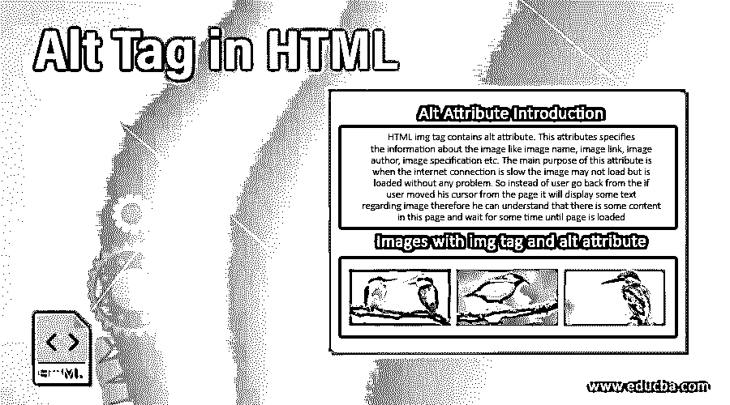
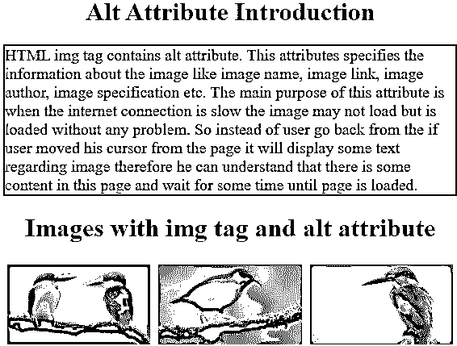
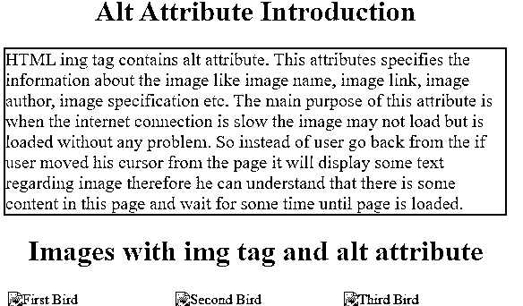
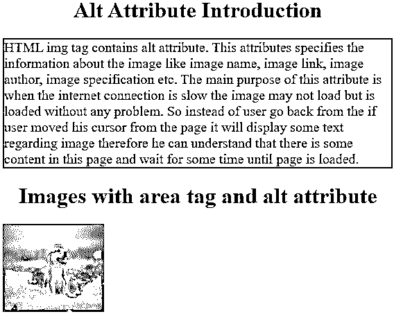
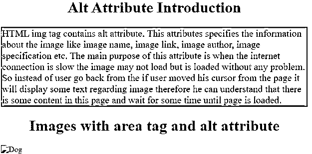
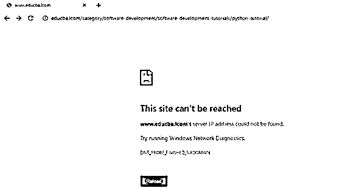
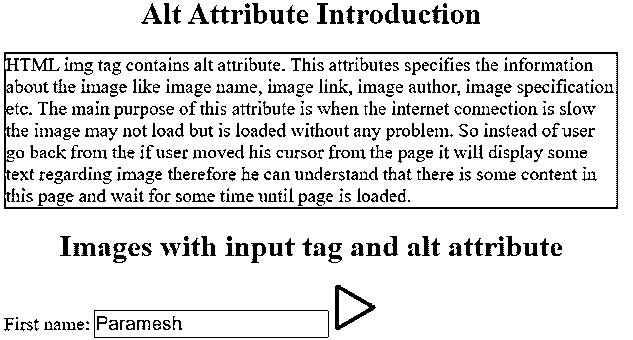
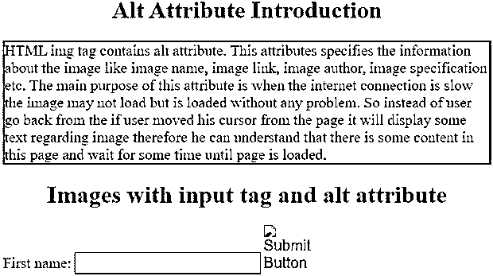

# HTML 中的 Alt 标记

> 原文：<https://www.educba.com/alt-tag-in-html/>




## HTML 中的 Alt 标签介绍

HTML img 标记包含 alt 属性。该属性指定了关于图像的信息，如图像名称、图像链接、图像作者、图像规范等。此属性的主要目的是当互联网连接速度较慢时，图像可能无法加载，但可以顺利加载。因此，如果用户将光标从页面上移开，它会显示一些关于图像的文本，而不是用户从页面上返回；因此，他可以理解这个页面上有一些内容，并等待一段时间，直到加载页面。

**实时场景**:当我们在网上显示任何图像时，如果终端用户不知道图像是关于什么的，这是不公平的。所以我们必须使用 alt 属性为图像指定一些内容。

<small>网页开发、编程语言、软件测试&其他</small>

### HTML 中的 Alt 属性是如何工作的？

Alt 属性为图像提供替代信息，以识别图像的含义。该属性只允许文本。该属性在标签中可用:

这 3 个标签的 alt 属性仅用于在图像顶部显示文本。

**语法# 1-标签**

```

```

**语法# 2-<区域>标签**

```

//usemap name and map name attribute name must be same
<map name="name">
<area coords="specify 4 coordinates" href="file.htm" alt="text">
</map>
<input> tag
```

**语法# 3-<输入>标签**

```
<input type="image" src="image resource" alt="text">
```

### 在 HTML 中实现 Alt 标签的例子

下面是提到的例子:

#### 示例#1

**代码:**

```
<!DOCTYPE html>
<html>
<head>
<meta charset="ISO-8859-1">
<title>Alt Attribute</title>
<style type="text/css">
h1 {
color: blue;
text-align: center;
}
p {
color: fuchsia;
font-size: 20px;
border: 2px solid red;
}
/*Aligning images side by side*/
* {
box-sizing: border-box;
}
.column {
width: 33.33%;
padding: 5px;
float: left;
}
.row::after {
clear: both;
display: table;
content: "";
}
</style>
</head>
<body>
<h1>Alt Attribute Introduction</h1>
<p>HTML img tag contains alt attribute. This attributes specifies
the information about the image like image name, image link, image
author, image specification etc. The main purpose of this attribute is
when the internet connection is slow the image may not load but is
loaded without any problem. So instead of user go back from the if
user moved his cursor from the page it will display some text
regarding image therefore he can understand that there is some content
in this page and wait for some time until page is loaded.</p>
<h1>Images with img tag and alt attribute</h1>
<div class="row">
<div class="column">

</div>
<div class="column">

</div>
<div class="column">

</div>
</div>
</body>
</html>
```

**输出:**

如果图像资源可用:




如果图像资源不可用:




#### 实施例 2

**代码:**

```
<!DOCTYPE html>
<html>
<head>
<meta charset="ISO-8859-1">
<title>Alt Attribute</title>
<style type="text/css">
h1 {
color: green;
text-align: center;
}
p {
color: navy;
font-size: 20px;
border: 2px solid orange;
}
</style>
</head>
<body>
<h1>Alt Attribute Introduction</h1>
<p>HTML img tag contains alt attribute. This attributes specifies
the information about the image like image name, image link, image
author, image specification etc. The main purpose of this attribute is
when the internet connection is slow the image may not load but is
loaded without any problem. So instead of user go back from the if
user moved his cursor from the page it will display some text
regarding image therefore he can understand that there is some content
in this page and wait for some time until page is loaded.</p>
<h1>Images with area tag and alt attribute</h1>

<map name="dog">
<area shape="rect" coords="0,0,81,125"
href="https://www.educba.com/category/software-development/software-development-tutorials/python-tutorial/"
alt="Python">
<area shape="circle" coords="91,59,4"
href="https://www.educba.com/category/software-development/software-development-tutorials/java-tutorial/"
alt="Java">
<area shape="circle" coords="125,59,9"
href="https://www.educba.com/category/software-development/software-development-tutorials/bootstrap-tutorial/"
alt="Bootstrap">
</map>
</body>
</html>
```

**输出:**

如果图像资源可用:




如果图像资源不可用:







#### 实施例 3

**代码:**

```
<!DOCTYPE html>
<html>
<head>
<meta charset="ISO-8859-1">
<title>Alt Attribute</title>
<style type="text/css">
h1 {
color: green;
text-align: center;
}
p {
color: navy;
font-size: 20px;
border: 2px solid orange;
}
label, input {
color: green;
font-size: 20px;
}
</style>
</head>
<body>
<h1>Alt Attribute Introduction</h1>
<p>HTML img tag contains alt attribute. This attributes specifies
the information about the image like image name, image link, image
author, image specification etc. The main purpose of this attribute is
when the internet connection is slow the image may not load but is
loaded without any problem. So instead of user go back from the if
user moved his cursor from the page it will display some text
regarding image therefore he can understand that there is some content
in this page and wait for some time until page is loaded.</p>
<h1>Images with input tag and alt attribute</h1>
<form action="#">
<label for="firstName">First name:</label> <input type="text"
id="firstName" name="firstName"> <input type="image"
src="R1.jpg" alt="Submit Button" width="48" height="48">
</form>
</body>
</html>
```

**输出:**

如果图像资源可用:




如果图像资源不可用:




### 结论

Alt 是 area、img 和 input 标签中可用的属性。这个 alt 属性用于提供关于图像的信息，如什么是图像或图像坐标、图像作者等。

### 推荐文章

这是一个 HTML 中 Alt 标签的指南。这里我们讨论一个 HTML 中的 Alt 标签的介绍，这个标签如何与编程例子一起工作。您也可以浏览我们的其他相关文章，了解更多信息——

1.  [HTML 中的 Fieldset 标签](https://www.educba.com/fieldset-tag-in-html/)
2.  [HTML 中的光标](https://www.educba.com/cursor-in-html/)
3.  [可回答的标签](https://www.educba.com/ansible-tags/)
4.  [HTML 中的 PHP 标签](https://www.educba.com/php-tag-in-html/)


