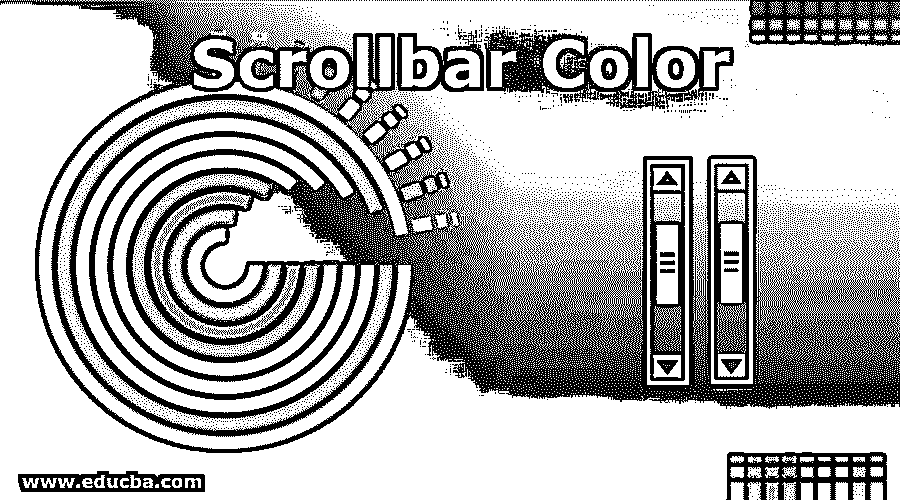
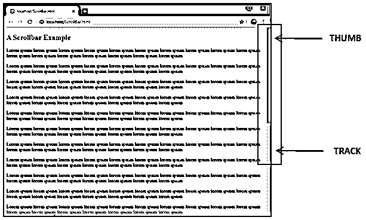
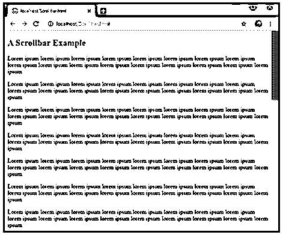
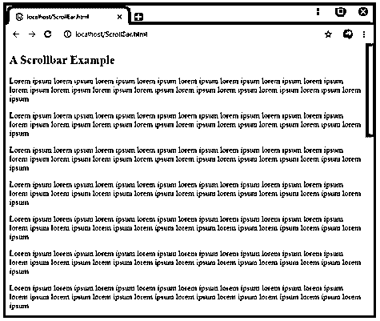
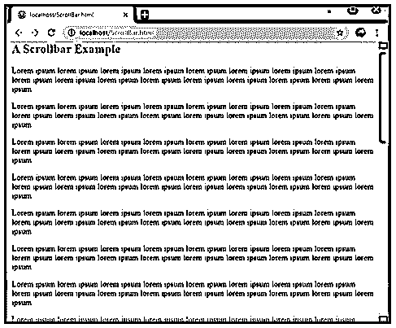
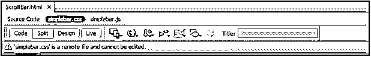
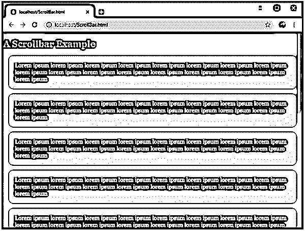

# 滚动条颜色

> 原文：<https://www.educba.com/scrollbar-color/>




## 滚动条颜色介绍

滚动条是一个可移动的条，通常位于屏幕的最右边或底部。滚动条可以水平安装也可以垂直安装，允许用户上下左右移动窗口。换句话说，滚动条是在用户和系统窗口显示之间创建交互的小部件或技术，其滚动连续的图片或文本或任何种类的显示。滚动条包含一个“条”或通常称为“轨道”，这个条有一个“拇指”，用于上下或左右移动窗口内容。在这个主题中，我们将学习滚动条的颜色。

一般你找到的滚动条通常是块状的，颜色是灰色的。但是滚动条的默认颜色和其他属性可以使用 [CSS 或 JavaScript 或者两者都使用](https://www.educba.com/css-vs-javascript/)来操作和定制。

<small>网页开发、编程语言、软件测试&其他</small>

在接下来的部分中，我们将尝试使用 CSS 和 Javascript 创建滚动条。

### 滚动条颜色的自定义

color 属性只是帮助设置一个不同的颜色，而不是默认的“thumb”的灰色和通常的轨迹颜色。我们都知道滚动条的背景区域颜色(通常无论用户向哪个方向滚动都是固定的)被称为“轨迹”。移动的部分，实际上是随着滚动窗口一起滚动，它漂浮在轨道上，被称为“拇指”。

下面是解释轨迹和拇指的直观示例图。




上图是一个信息溢出的网页的简单表示。用户必须点击拇指并上下拖动它来查看完整的信息。

上图中可以看到的滚动条是一个默认的基于浏览器的滚动条，具有其默认值。我们一直在谈论默认值。让我们也看看他们。

*   **< scrollbar-color > :** 定义你的滚动条的颜色和它携带的默认值如下:
*   **auto:**‘auto’是滚动条轨道的默认属性，如果程序员没有给出任何特定的颜色或属性。
*   **深色:**“深色”属性，当提供时，显示一个深色滚动条，可以是浏览器或平台提供的颜色的深色阴影之一，也可以是您自己定义的颜色的深色阴影。
*   **light:**‘light’属性显示平台提供的颜色或您为滚动条设置的颜色的较浅阴影。
*   **<颜色，颜色> :** 第一种颜色表示滚动条的缩略图的颜色，第二种颜色表示轨迹的颜色。

<scrollbar-color>属性缺点有限，仅在特定版本及以上的浏览器上受支持。例如，Chrome 81 及以上版本支持该属性，Firefox 72 及以上版本也支持该属性，等等。为了避免这种情况，我们使用另一个名为'-webkit-'的属性。</scrollbar-color>

Opera、Chrome、Safari 等浏览器都是 webkit 浏览器，因此支持名为“::-webkit-scrollbar”的非标准伪元素，这使得我们可以在不考虑浏览器的情况下轻松更改滚动条。

属性默认设置为“自动”,当操作时，可以创建非常有趣的视觉效果。这些元素被添加到代码顶部的部分，以定制浏览器的默认滚动条属性。

### 滚动条颜色示例

我们创建了下面这个宽度为 18 像素的简单滚动条的例子。我们给它一个黄色的大头钉颜色，带有绿叶色的横条或手柄颜色。




```
<style>
/* width */
::-webkit-scrollbar {
width: 18px;
}
/* Track */
::-webkit-scrollbar-track {
background: #f1f120;
}
/* Handle */
::-webkit-scrollbar-thumb {
background: #881;
}
</style>
```

另外一个属性可以添加到滚动条或句柄中，'::-webkit-scrollbar-thumb:hover '，它可以帮助你在滚动条悬停时设置不同的颜色。

要将“悬停”属性添加到我们的栏或手柄中，我们只需将以下代码行添加到我们的脚本中；

```
/* Handle on hover */
::-webkit-scrollbar-thumb:hover {
background: #520;
}
```

结果可以在下面的截图中看到:




当鼠标悬停在上面时，我们的绿叶色条变成了棕色。

让我们看另一个探索更多属性的例子。在下面的例子中，我们使用边框半径属性平滑了工具条和缩略图。有趣的是为用户创建按钮，通过点击按钮而不是拖动栏来轻松移动轨道上的栏。

我们添加了以下代码来创建我们自己的自定义按钮:

```
/* Custom Button */
::-webkit-scrollbar-button:single-button {
background-color:none;
display: block;
border-style: solid;
height: 13px;
width: 16px;
}
```

上面将简单地显示带有边框的区域，在那里我们的按钮将会出现，如下所示。这也需要一些定制。




在我们的定制(参见添加的代码)完成后，我们得到了最终的结果。亲眼看看结果:


完整的代码如下所示:

```
<head>
<style>
/* Custom width for the Scrollbar */
::-webkit-scrollbar {
width: 18px;
}
/* Custom Track */
::-webkit-scrollbar-track {
box-shadow: inset 0 0 5px grey;
border-radius: 10px;
background: #f1f120;
}
/* Handle */
::-webkit-scrollbar-thumb {
background: #881;
border-radius: 10px;
}
/* Handle on hover */
::-webkit-scrollbar-thumb:hover {
background: #520;
}
/* Custom Button */
::-webkit-scrollbar-button:single-button {
background-color:none;
display: block;
border-style: solid;
height: 13px;
width: 16px;
}
/* Custom Up Direction Button */
::-webkit-scrollbar-button:single-button:vertical:decrement {
border-width: 0px 8px 9px 8px;
border-color: transparent #881;
border-radius: 10px;
}
/* Custom Down Direction Button */
::-webkit-scrollbar-button:single-button:vertical:increment {
border-width: 0px 8px 9px 8px;
border-color: transparent #881;
border-radius: 10px;
}
</style>
</head>
```

### SimpleBar:一个 JavaScript 库

总有另一种方法来实现项目中的元素。在 web 市场上流行的 jquery 插件和 javascript 库的[帮助下，也可以添加自定义滚动条。例如，SimpleBar 是一个新的 Javascript 库，它使作者更容易创建定制的滚动条。](https://www.educba.com/jquery-plugins/)

这是一个独立的库，可以向任何可能有溢出内容的可滚动元素或组件或容器添加滚动条。这个 javascript 库使您的内容动态化，并保持原生滚动行为。下面显示了一个简单的演示。

### 用户化

通过将这些 javascript 库安装并导入到您的项目中，或者直接将它们和它们的 CSS 文件(如果有的话)包含到您的 HTML 页面中，您可以轻松地使用这些 JavaScript 库。在下面的例子中，我们将使用第二个选项，直接在我们的程序中包含一个 javascript 库。

```
<link rel="stylesheet" href="https://unpkg.com/simplebar@latest/dist/simplebar.css" />
<script src="https://unpkg.com/simplebar@latest/dist/simplebar.js"></script>
```

将这两行添加到您的 HTML 页面将包括并附加一个不能像这样编辑到您的 HTML 的远程文件；


Next, we will add, ‘data-simplebar’ attribute to the division or the content, which will be the scrollable container of your HTML page. In our example, we added this attribute to the <body> tag itself. Along with this, we will require a sample text; I have added ‘Lorem Ipsum’ default text to our <body> tag to make the web page scrollable. And that is it. Simple right? When this is all done, your web page will look like this –> 


But it’s still raw and a bit ugly. I have done a few tweaks, as shown below, and see the results for your selves. The full code for CSS is given below, along with the results.

```
<style>
:root {  --primary: #212123;
}
body, html{          height: 100vh;
}
body{      background: var(--primary);
font-family:Georgia, "Times New Roman", Times, serif;
color: #fff;
display:grid;
grid-columns:60% auto;
margin: 0;
}
p{                            margin: 1em;
padding: 1em;
background-color: #333;
border-radius:10px;
color: #99F;
}
h2 {         color: #996;
}
.simplebar-scrollbar:before{background-color:#0F0;
}
.simplebar-scrollbar{margin-right:3px;
}
</style>
```

结果是，正如你在下面看到的。




您也可以手动配置 javascript 库，但是您需要先初始化它们，然后再配置它们；使用了一个名为“override”的选项，将对象作为 Simplebar 函数的参数传递。

因为这个库是轻量级的，所以你可以随意设计。它有一个 simplebar.js 文件，这是一个普通的 javascript 定制滚动条插件，可以确保很好的性能，并适用于所有浏览器。

### 推荐文章

这是滚动条颜色的指南。在这里，我们讨论使用 CSS 和 Javascript 创建滚动条，并给出例子。您也可以看看以下文章，了解更多信息–

1.  [JavaScript 中的导航器](https://www.educba.com/navigator-in-javascript/)
2.  [JavaScript 中的字符串数组](https://www.educba.com/string-array-in-javascript/)
3.  [CSS 选择器的类型](https://www.educba.com/types-of-css-selectors/)
4.  [Java 中的滚动条](https://www.educba.com/scrollbar-in-java/)


