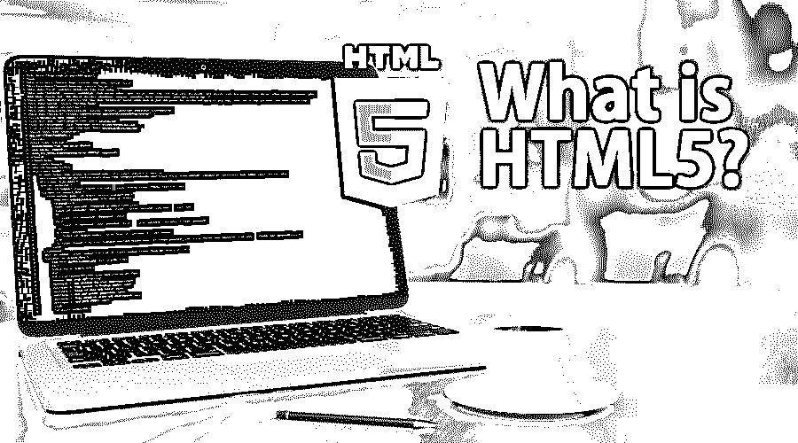

# HTML5 是什么？

> 原文：<https://www.educba.com/what-is-html5/>




## 什么是 HTML？

HTML 的完整形式是超文本标记语言。蒂姆·伯纳斯·李在 1989 年创造了 HTML。HTML 是一种基本的网络编程语言，用于设计基本的网站。HTML 编程帮助人们通过网站向世界传达他们的思想。在这个主题中，我们将学习什么是 HTML5。

*   HTML 是网页的结构。
*   标签代表 HTML 元素。
*   HTML 标签帮助程序员通过“标题”、“段落”、“表格”等来定义内容。
*   [HTML 标签](https://www.educba.com/basic-html-tags/)不在任何浏览器上显示；浏览器只会显示标签之间的内容。

HTML 编程从文档标记开始。

<small>网页开发、编程语言、软件测试&其他</small>

```
<!DOCTYPE html>
```

这个标签表示文档是与 HTML 相关的[。现在让我们进入我们的主题，即 HTML5。](https://www.educba.com/what-is-html/)

```
<html>
Code goes here
</html>
```

### HTML5 是什么？

HTML5 是 HTML 的第 5 个<sup>版本或更新版本。这是最先进的 HTML 编程。在这个版本中，增加了许多标签，使设计者的生活更容易。一个基本的网站包含 3 种类型的代码。</sup>

1.  超文本标记语言
2.  半铸钢ˌ钢性铸铁(Cast Semi-Steel)
3.  java 描述语言

你渴望了解更多吗？来，告诉我，是的；现在让我给你提供一些关于 CSS 的基本信息。

CSS 代表级联样式表。CSS 用于样式化 HTML 文档。基本上，CSS 用来改善网页的外观和方式。css 页面的扩展名是. CSS。

```
<style>
Code goes here.
</style>
```

Javascript 是由 Java 发展而来的。javascript 的语法和结构与 c 类似，Javascript 是一种客户端编程语言。Javascript 由客户端浏览器处理，而不是由服务器端处理。

[Javascript 用于](https://www.educba.com/what-is-javascript/)显示客户端浏览器执行动作时的响应。

### 了解 HTML5

HTML 的开发方式使得从头开始设计一个完整的网站不需要其他软件或浏览器插件。使用 HTML5，我们可以开发运行在浏览器上的大型应用程序、动画和其他复杂的应用程序。它被用在一些最复杂的网络应用中，这些应用是为娱乐、在线流媒体、视频播放器、音频播放器等开发的。

### HTML5 有什么特点？

正如我们所知，技术发展很快，程序员需要提升自己以保持竞争力，如果他们不提升自己，他们将被淘汰，他们将得不到他们梦想的软件包。

可扩展的超文本标记语言

```
<!DOCTYPE html PUBLIC "-//W3C//DTD XHTML 1.0 Transitional//EN"
"<u>http://www.w3.org/TR/xhtml1/DTD/xhtml1-transitional.dtd</u>">
```

看看 XHTML 和 HTML5 的区别。随着一代人的移动，编程将会发展，程序员需要升级以适应当前的趋势。

```
<!DOCTYPE html>
Figure Tag
XHTML

<p>Sample Image. </p>
HTML5


<p>Sample2\. </p>


```

### HTML5 是如何工作的？

要使用 HTML5，我们需要一个[基本文本编辑器](https://www.educba.com/html-text-editors/)；我个人[使用记事本++](https://www.educba.com/notepad-plus-plus-alternatives/) 和崇高的文本编辑器。Sublime text 是用户友好的，并在打字时给你自动建议。现在我将向你详细解释 HTML5 是如何工作的。基本上， [HTML5 包含了所有 3 个组件](https://www.educba.com/html5-elements/)一个网页或网络应用程序所需的。它们是 HTML、CSS 和 JAVASCRIPT。

HTML 用于准备网页上的文本文档，CSS 用于样式化网页上的文本文档，JAVASCRIPT 负责网页上的用户活动和动作。

例如，如果你想在网页上显示一个图像，你需要使用一个 [HTML 图像标签](https://www.educba.com/html-image-tags/)来显示它。

```

```

现在，如果你想减少或增加显示图像的宽度，我们需要使用 css。

```
<style>
Img {
Width : 200px;
Height: 500px ;
}
</style>
```

现在，如果您想在用户点击某个东西时隐藏图像或为图像制作一些动画，您需要使用 javascript。

```
<script>
$ ( document ).  ready ( function ) {
$ ( something ).  click ( function )
$(img).hide();
} ) ;
```

### HTML5 是做什么的？

HTML5 帮助开发人员创建高级 web 应用程序，这些应用程序响应迅速，适合台式机、笔记本电脑或移动设备的屏幕。HTML5 可以通过动画和外观提高网站的可见性。

### HTML5 为什么重要？

这在当今时代非常重要，因为技术发展的方式令人难以置信，所以我们需要更新，我们需要学习 [HTML5 来轻松创建](https://www.educba.com/html5-tags/) web 应用。它可以提供一些以前版本或更新中没有的高级功能。

### HTML5 的优势

1.  它帮助开发人员开发适合不同分辨率、屏幕尺寸、长宽比和指导方针的应用程序。
2.  借助 HTML5，程序员可以在他们的 [web 应用](https://www.educba.com/how-to-build-web-applications-using-mongodb/)中使用一些高级功能，如 GPS、摄像头和加速度计。
3.  应用可以内部使用，无非是 localhost，也可以在浏览器中看到。
4.  移动应用可以使用与原生应用相同的货币化和共享渠道。
5.  JavaScript、HTML 和 CSS 是 web 应用程序的主要编程语言。
6.  我们可以很容易地将 HTML5 网络应用转换成移动应用。这是 HTML 的主要[优势。](https://www.educba.com/advantages-of-html/)
7.  HTML5 应用程序将响应迅速，并自动适合每一个移动和桌面屏幕。
8.  容易写
9.  容易理解
10.  使用方便
11.  每个浏览器都理解 html 语言
12.  您可以开发丰富的图形和动画。

### HTML5 的缺点

1.  HTML5 只能在更新的浏览器上运行。
2.  不如闪存灵活

### 谁应该学习 HTML5？

它是在开始任何高级编程语言之前首先要学习的基础编程语言；开发者应该学习 HTML5。平面设计师要学习 HTML5 这为投资组合增加了优势。想在 IT 行业工作的人。想以开发商身份开运营商的人。对网页设计或开发感兴趣的人。

### 结论

HTML5 是用于开发高级 web 应用程序的标记语言。与其他编程语言相比，HTML5 是一种更容易的编程语言。

### 推荐文章

这是一个什么是 HTML5 的指南。在这里，我们讨论它是如何工作的，HTML5 的特性、优点和缺点。您也可以浏览我们推荐的其他文章，了解更多信息——

1.  [备忘单 HTML](https://www.educba.com/cheat-sheet-html/)
2.  [XHTML vs HTML5](https://www.educba.com/xhtml-vs-html5/)
3.  [HTML 列表样式](https://www.educba.com/html-list-styles/)
4.  [HTML 框架](https://www.educba.com/html-frames/)


