# Html5 新元素

> 原文：<https://www.educba.com/html5-new-elements/>

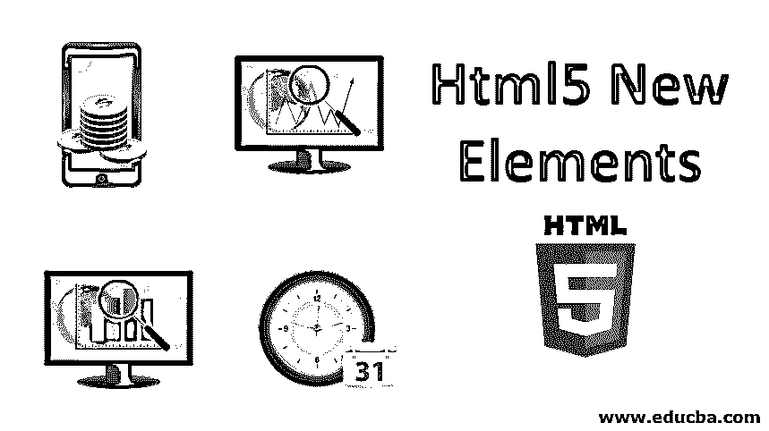


## HTML5 新元素概述

HTML5 是 HTML 4.01 版本的升级版，具有许多新功能、高级功能、更好的页面视图和许多其他改进，以满足不断增长的技术需求。HTML5 中使用最多、最需要的元素有

、

、

、

、

<main>、<mark>、

、

<nav>、

和<summary>。HTML 5 的这些标签/元素支持更加用户友好的界面，具有更高的性能比率、高效的结果、更容易的编码和实现，并且它有助于在整体上改进布局。</summary>

</nav>

</mark> </main>


### 十大 HTML5 新元素

HTML5 提供了新的元素来增强文档的布局。

<small>网页开发、编程语言、软件测试&其他</small>

#### 1.

元素指定了页面的一部分，该部分包括文档、章节或网站中的独立结构，并且推荐广泛分发或使用。这可能是一组帖子、一份期刊或日报、一份在线时事通讯的投稿、一位客户发来的评论或任何其他不含物质的对象。

**举例:**

```
<!DOCTYPE html>
<html>
<head>
<title>Article Element</title>
</head>
<body>

<h2>EDUCBA</h2>
<p>EDUCBA (Corporate Bridge Consultancy Pvt Ltd) is a leading global provider of skill based education addressing the needs 500,000+ members across 40+ Countries. </p>

</body>
</html>
```

**输出:**

*   将上述代码保存在扩展名为. html 的文件中。
*   在浏览器中运行 html 文件，您将得到如下图所示的输出。

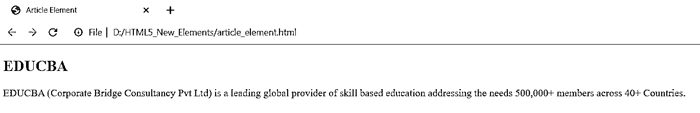


#### 2.

元素以分类、地图、图像、代码文章等多种方式表示个人内容。

**举例:**

```
<!DOCTYPE html>
<html>
<head>
<title>Figure Element</title>
</head>
<body>
<p> EDUCBA is a leading global provider of skill based education addressing the needs 500,000+ members across 40+ Countries.
</p>


</body>
</html>
```

**输出:**

上面的代码将产生如下图所示的输出，

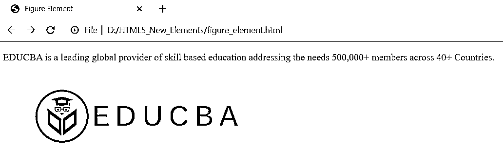


#### 3.


元素用于为图像添加描述。

**举例:**

```
<!DOCTYPE html>
<html>
<head>
<title>Figure Caption Element</title>
</head>
<body>
<p> EDUCBA is a leading global provider of skill based education addressing the needs 500,000+ members across 40+ Countries.
</p>


EDUCBA (Corporate Bridge Consultancy Pvt Ltd)

</body>
</html>
```

**输出:**

上面的代码显示如下图所示的结果，

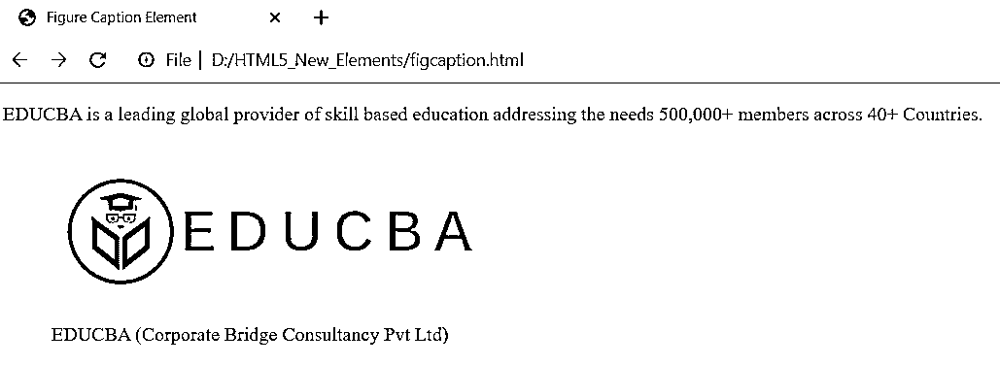


#### 4.


元素用于指定文档或页面上某一部分的标题。您可以在单个文档中定义多个页眉。

**举例:**

```
<!DOCTYPE html>
<html>
<head>
<title>Header Element</title>
</head>
<body>


<h1>Header One</h1>
<h2>Header Two</h2>
<h3>Header Three</h3>

<p>The content of the document goes here...</p>

</body>
</html>
```

**输出:**

上面的代码显示如下图所示的结果，

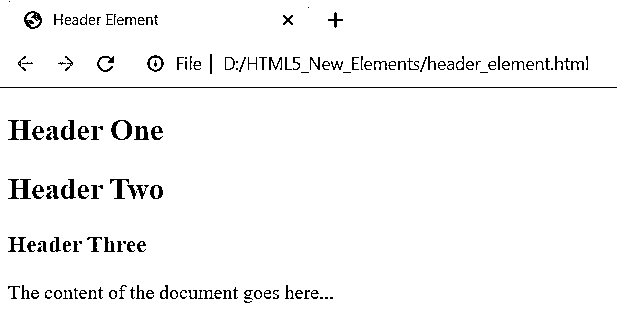


#### 5.

元素用于指定信息，比如作者信息、版权信息、联系人、相关文档的链接、网站地图等等。

**举例:**

```
<!DOCTYPE html>
<html>
<head>
<title>Footer Element</title>
</head>
<body>

<p>Copyright © 2019 www.educba.com</p>
<p>Contact: <a href="mailto:hr@educba.com">hr@educba.com</a>

</body>
</html>
```

**输出:**

上面的代码显示如下图所示的结果，

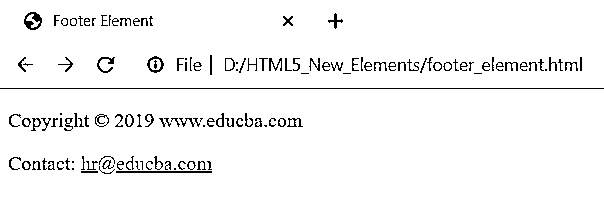


#### 6.

<main></main>

<main>元素用于显示文档的主要信息，即重要信息。</main>

**举例:**

```
<!DOCTYPE html>
<html>
<head>
<title>Main Element</title>
</head>
<body>

<p>Header information</>

<main>
<p>Main Information</p>

<h2>EDUCBA</h2>
<p>EDUCBA is a leading global provider of skill based education...</p>

</main>

<p>Footer Information</>

</body>
</html>
```

**输出:**

上面的代码将产生如下图所示的输出，

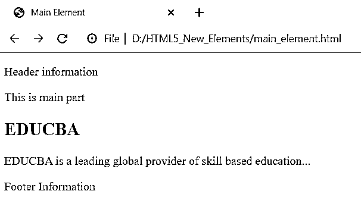


#### 7.<mark></mark>

<mark>元素用于用背景色突出显示或标记文本，以吸引用户注意文档中的特定文本。</mark>

**举例:**

```
<!DOCTYPE html>
<html>
<head>
<title>Mark Element</title>
</head>
<body>

<p><mark>EDUCBA</mark> is a leading global provider of skill based education addressing the needs 500,000+ members across 40+ Countries. </p>

</body>
</html>
```

**输出:**

上面的代码显示如下图所示的结果，

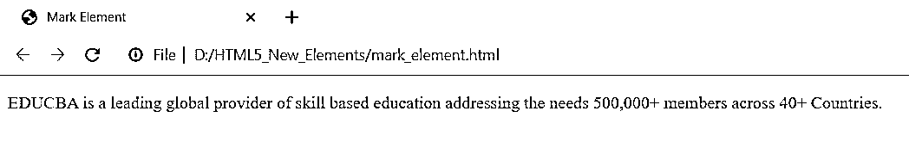


#### 8.

<nav></nav>

元素用于指定页面上的导航链接。这些链接提供了到文档中其他页面的连接。

**举例:**

```
<!DOCTYPE html>
<html>
<head>
<title>Nav Element</title>
</head>
<body>

<nav>
<a href="#">HTML</a> |
<a href="#">CSS</a> |
<a href="#">JAVA</a> |
<a href="#">PHP</a> |
<a href="#">PYTHON</a>
</nav>

</body>
</html>
```

**输出:**

上面的代码将产生如下图所示的输出，

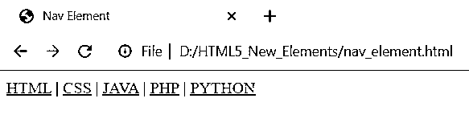


#### 9.

元素用于定义文档中的独立部分或特定区域。

**举例:**

```
<!DOCTYPE html>
<html>
<head>
<title>Section Element</title>
</head>
<body>

<h2> Main Article </h2>
<p>Content of the main header will be displayed here...</p>

<h2>Section One</h2>
<p>Content of the first section will be displayed...</p>


<h2>Section Two</h2>
<p>Content of the second section will be displayed...</p>


</body>
</html>
```

**输出:**

上面的代码显示如下图所示的结果，

**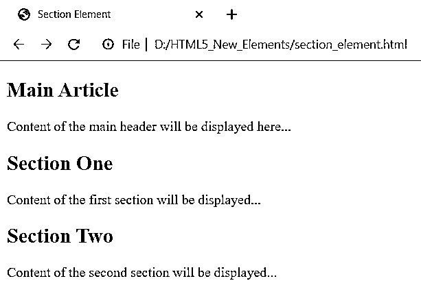

** 

#### 10.<summary></summary>

<summary>标签是<details>标签的一个子部分，它提供了当用户点击标题时可以显示或隐藏的文本。</details></summary>

**举例:**

```
<!DOCTYPE html>
<html>
<head>
<title>Summary Element</title>
</head>
<body>
<details>
<summary>
EDUCBA - Corporate Bridge Consultancy Pvt Ltd
</summary>
<p>It is a leading global provider of skill based education addressing the needs 500,000+ members across 40+ Countries.</p>
</details>
</body>
</html>
```

**输出:**

当您运行上面的代码时，它将显示如下所示的结果，

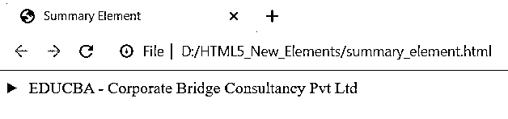


如图所示，点击标题，会显示如下图所示的隐藏文字，

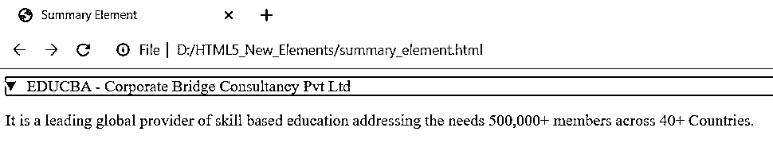


### 结论

到目前为止，我们已经看到了新的 HTML5 元素对于创建网站的各种任务是如何有用的。这些新元素以更准确和符合标准的方式读取文档，并开发更复杂和高效的 web 应用程序。新的 HTML5 元素提供了一些额外的额外功能来生成交互式网站。

### 推荐文章

这是 Html5 新元素的指南。这里我们讨论 Html5 的 10 大新元素，以增强文档的布局。您也可以阅读以下文章，了解更多信息——

1.  [Html 的前 6 个版本](https://www.educba.com/versions-of-html/)
2.  [Html5 vs Html4](https://www.educba.com/html5-vs-html4/)
3.  [XHTML vs HTML5](https://www.educba.com/xhtml-vs-html5/)
4.  [HTML5 标签](https://www.educba.com/html5-tags/)


