# HTML5 标签

> 原文：<https://www.educba.com/html5-tags/>

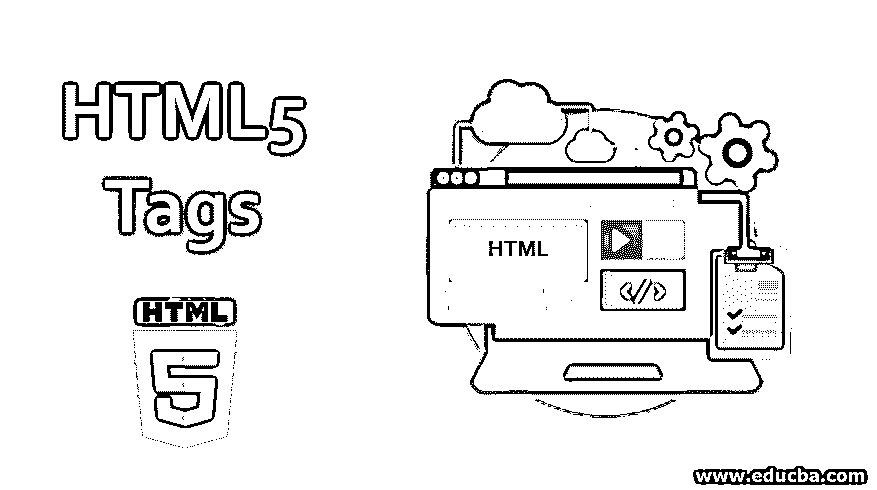


## HTML5 标签简介

我们都知道 HTML 的标准缩写，就是[超文本标记语言](https://www.educba.com/what-is-html/)。所以，HTML5 是 HTML 的最新和新版本。一旦产品被开发出来；显然，HTML 会有很多版本，并且会有很多新的发展。所以，HTML5 有了新的属性和行为。这个 HTML5 标签不再是一种编程语言，但它是一种标记语言。现在，什么是标记语言？在文档中使用标签定义元素属性是一种标记语言。现在，让我们详细了解如何定义标签和创建网页。

### HTML5 的标签

标签是显示内容的规范。通常，会有一个开始和结束标签。此外，很少有标签不需要结束标签，比如<be>，这意味着换行，显示下一行中该标签旁边的数据。在这里，让我们看看 HTML5 中的一些[新元素。](https://www.educba.com/html5-new-elements/)</be>

<small>网页开发、编程语言、软件测试&其他</small>

在 HTML5 中，我们通常可以将标签分为两类。

*   语义元素:这些元素的几个例子是:<主要>、<总结>、<时间>等。
*   **非语义元素:**这里的例子有:<分区>、<跨度>等。

下面讨论的标签是 HTML5 版本中新引入的专有标签。它们是不同类型的标签，都可以分类。

#### 1.结构标签

以下是结构标签的类型及示例:

**a. Article:** 这是一个最常用的标签，类似于 head 标签。主要用于表格，博客，新闻故事和所有的例子。

**代码:**

```
<html>
 <h3>The first one </h3>
<body>
<h2>Welcome Back</h22>
</body>
</html>
```

**输出:**

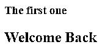


**b .旁白:**类似于普通标签的东西，将内容与周围的内容联系起来，就像文章中的侧边栏。而且这个标签只有在使用 IE 以上版本的时候才有意义。

**c .细节:**这个标签用来给用户提供一些额外的数据。这可以是一个互动平台，可以隐藏或显示细节。我们可以在 summary 标签下看到这个标签的用法。

**d. Header:** 该标签与 Header 部分相关，包含标题信息。它必须有开始和结束标签。

**代码:**

```
<html>

<h1>Happy Hours</h1>
<nav>
<p><a href="#">Morning</a> | <a href="#">Afternoon</a> | <a href="#">Evening</a></p>
</nav>

</html>
```

**输出:**

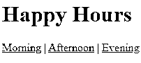


**e. hgroup:** 该标签用于描述一组报头。让我们看看例子。

**代码:**

```
<html>
<body>
<hgroup>
<h1>Let’s check size of this h1 </h1>
<h2> Let’s check size of this h2 </h2>
<h3> Let’s check size of this h3</h3>
<h4> Let’s check size of this h4</h4>
<h5> Let’s check size of this h5</h5>
</hgroup>
</body>
</html>
```

**输出:**

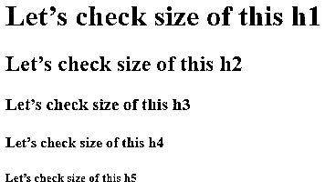


f. Footer: 这个标签就是那个，要放在页面的末尾。它处理像版权、历史相关的信息或数据。下面让我们看一个小例子。

**代码:**

```
<html>
<body>

<nav>
<p><a href="#">Copy Rights</a> | <a href="#">Come back soon</a></p>
</nav>
<p>Please subsribe for more learning content</p>

</body>
</html>
```

**输出:**

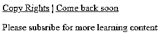


**g. nav:** 该标签用于提供所有链接的一部分，以便导航。

**代码:**

```
<html>
<body>
<nav>
<ul>
<li><a href="https://www.educba.com/">EDUCBA Home</a></li>
<li><a href="https://www.educba.com/about-us/">About EDUCBA</a></li>
<li><a href="https://www.educba.com/courses/">Courses in EDUCBA</a></li>
</ul>
</nav>
</body>
</html>
```

**输出:**

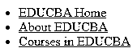


练习时编写代码，点击链接进行检查。

**h. Section:** 顾名思义，这个标签定义了代码的一部分，如主体、页眉、页脚等。这里，开始和结束标记都是必需的。下面让我们看一个小例子:

**代码:**

```
<html>

<h1> Welcome </h1>
<h4> See you soon </h4>
<p>Thank You.</p>

</html>
```

**输出:**

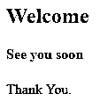


**一、概要:**此标签与详细页签并行使用。在 details 标签下，我们有一个 summary 标签来总结概念。下面的例子:

**代码:**

```
<html>
<body>
<details>
<summary>How is this Summary tag defined?</summary>
<p>By clicking the arrow beside the Summary question I got displayed</p>
</details>
<p> The data after the display tag is displayed like this.</p>
</body>
</html>
```

**输出:**

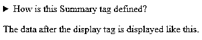


现在扩展摘要标记数据，我们得到下面的。

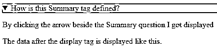


#### 2.表单标签

下面举例说明不同类型的表单标签:

**a. Datalist:** 这个标签就像一个下拉菜单，有预定义的值供用户选择。让我们看看下面的小例子:

**代码:**

```
<html>
<body>
<p>Enter your favorite browser name:</p>
<input type="text" list="browsers">
<datalist id="browsers">
<option value="Firefox">
<option value="Chrome">
<option value="Internet Explorer">
<option value="Opera">
<option value="Safari">
</datalist>
</body>
</html>
```

**输出:**

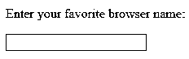


鼠标悬停时会弹出下拉菜单。

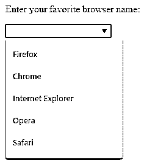


**b. Keygen:** [这是为了加密](https://www.educba.com/what-is-encryption/)。它用于生成以加密格式传递数据的加密密钥。对于这个元素，只有开始标签是足够的/必需的，而结束标签不是必需的。

**c. Meter:** 该标签将给出给定范围内数据的测量值。

**代码:**

```
<html>
<body>
<meter value="25" min="0" max="100">25 out of 100</meter><p> This is 25 out of 100 </p><br>
<meter value="0.7">70%</meter><p> This is the range for 70%</p>
</body>
</html>
```

**输出:**

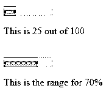


#### 3.格式化标签

以下是格式化标签的类型及示例:

BDI: 这是双向隔离。顾名思义，这个标签可以用来隔离文本的一部分，并赋予它不同于其他文本的样式。

**b .标记:**这个标记可以帮助我们突出显示一段特定的文字。

**代码:**

```
<html>
<body>
<p>This is how you can <mark>mark or highlight</mark> a text.</p>
</body>
</html>
```

**输出:**


**c. Output:** 顾名思义，它给出任何计算的结果。

**代码:**

```
<html>
<body>
<form oninput="sum.value=parseInt(x.value)+parseInt(y.value)">
<input type="number" id="x”> +
<input type="number" id="y" value="350"> =
<output name="sum" for="x y"></output>
</form>
</body>
</html>
```

**输出:**

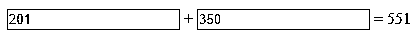


请务必注意 oninput 的 form 属性。一旦输入了属性‘x’值，就会显示输出。

**d .进度:**这个标签给我们一个特定任务的进度。

**代码:**

```
<html>
<body>
<progress value="80" max="100"></progress><p> This progress bar is 80% completed</p>
</body>
</html>
```

**输出:**

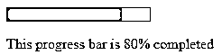


**e. Rp:** 不支持 ruby 标签时使用。

**f. Rt:** 与标签 ruby 一起使用。大多数情况下，这在日语和汉语的发音中都会用到。

g. Ruby: 这个标签与 rt 和 rp 标签一起使用，在这两种语言中，中文和日文的注释是发音的。

这个标签用于单词 break。它主要用于检查在调整窗口大小时一个单词是如何断的。

#### 4.嵌入式内容标签

下面举例说明了嵌入内容标签的类型:

**a. Audio:** 顾名思义，这个标签可以帮助我们将音频文件合并到 HTML 文档中。

**b. Canvas:** 定义网页上的一个地方，在这里图形或形状，或图形被呈现或可以被定义。这里有一个例子。

**代码:**

```
<html>
<body>
<canvas id="run" ></canvas>
<script type="text/javascript">
window.onload = function(){
var can = document.getElementById("run");
var context = can.getContext("2d");
context.moveTo(30, 60);
context.lineTo(150, 30);
context.stroke();
};
</script>
</body>
</html>
```

**输出:**

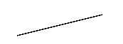


c. Dialog: 这个标签给了我们一个默认的盒子，特别是当我们想把数据放在一个盒子里的时候。

**代码:**

```
<html>
<body>
<p> Trying dialog here <dialog open>How does dialog box come up?</dialog> </p>
</body>
</html>
```

**输出:**

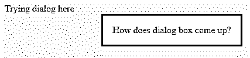


**d. Embed:** 这个标签可以用来获取任何外部文件到 HTML 文件。我们只能有开始标记，结束标记在这里不是必需的。这个标签有不同的属性，即宽度、高度、src 和类型。

图片和图片说明:这就像它的名字一样，可以合并图片并给图片添加说明。

**f. Source:** 这个标签可以通过使用这个 Source 标签提供文件的位置来实现多个音视频文件。

**g. Time:** 这个标签，顾名思义，就是显示时间的标签。请注意，此标记在 internet explorer 版本 8 和更低版本中不起作用。

**h .视频:**有了标签的名字，我们就可以很明显的知道这个标签用在什么地方了。为了指定视频文件，我们有这个标签。在这个音频/视频标签中，我们定义了指定文件及其位置的源标签。

### HTML5 标签的输入元素

以下是我们在 HTML5 标签中使用的一些输入元素:

**1。Email:** 这是 HTML5 中的输入元素之一。该元素只接受电子邮件地址作为输入。

**2。Number:** 这个输入元素只接受数字。

**3。Range:** 顾名思义，这个标签包含一个数字范围。

**4。URL:** 这个输入标签接受 URL 地址的输入字段。在这种输入类型中，我们只能输入 URL。

**5。占位符:**这是文本、文本区域或任何数字等输入类型的属性之一。这个占位符值显示了作为输入给出的值。

**代码:**

```
<html>
<body>
Enter Date of birth : <input type = "text" name = "dob"
placeholder = "dd/mm/yyyy"/>
</body>
</html>
```

**输出:**

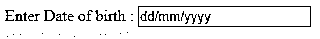


**6。Autofocus:** 该属性自动聚焦于输入标签中声明了该元素的特定字段。仅最新版本的 Chrome、Safari 和 Mozilla 支持此属性。语法如下:

```
<input type = “textarea” name=”focus” autofocus/>
Tag <dd>: This tag represents a description of a definition.
Tag <del>: This tag deletes a specified text.
Tag <marquee>: This tag helps to display data in a scrolling manner.
<html>
<body>
<marquee> This texxt is in a scrolling manner </marquee>
</body>
</html>
```

**输出:**

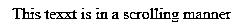


7 .**。<！DOCTYPE > :** 这是帮助浏览器理解编写程序的 HTML 版本的基本标签之一。这个标签的声明应该写在 HTML 标签之前。

**8。< meta > :** 这个 meta 标签描述了 HTML 文档的描述。它包含作者姓名、日期和修改等内容。

在这个 HTML5 中，我们甚至有机会[获得设备](https://www.educba.com/html-geolocation/)的地理位置。有不同的方法有助于轻松标记位置。HTML5 中也有不同的字体和颜色。以下是从这个 HTML5 版本的 HTML 用法中删除的几个标签。

缩略词、小程序、大、目录、字体、框架集、居中、tt(电传文本)、基本字体、居中、删除、框架、u(下划线文本)、isindex、noframes 等。下面是一些被删除的属性:

对齐、背景颜色、单元格填充、单元格间距、边框、链接、形状、字符集、存档、基本代码、范围、alink、vlink、链接、背景、边框、清除、滚动、大小、宽度等。

**9。< noscript > :** 该标签用于显示 JavaScript 的[使用被禁用的内容。任何写在这个标签中的内容都可以用来代替 javascript 使用的内容。作为一个练习，你能试着执行不同的标签吗？](https://www.educba.com/uses-of-javascript/)

### 结论

所以，是的，有 HTML5 的基本标签和参考。HTML5 的初始版本于 2014 年 10 月 28 日发布。我们已经看到了 HTML5 中引入的不同的新标签，并经历了一些属性。最后，我们甚至提到了不仅引入了新的元素，而且一些现有的元素和属性在 HTML5 的新版本中被限制使用。

有许多属性都有示例，有些只有数据和属性或元素的用途。尝试练习所有这些不同的元素和属性，并不断学习。

### 推荐文章

这是 HTML5 标签的指南。在这里，我们将详细讨论 4 个 HTML5 标签及其输入元素，以及示例和代码实现。你也可以看看下面的文章来了解更多-

1.  [HTML 事件](https://www.educba.com/html-events/)
2.  [HTML 布局](https://www.educba.com/html-layout/)
3.  [HTML 框架](https://www.educba.com/html-frames/)
4.  [HTML 表格标签](https://www.educba.com/html-table-tags/)


