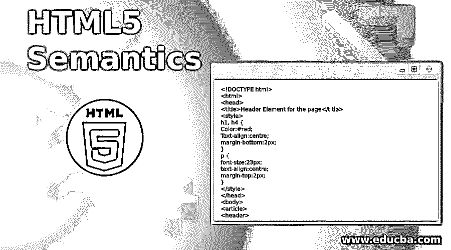
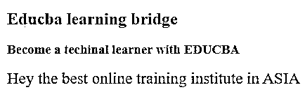
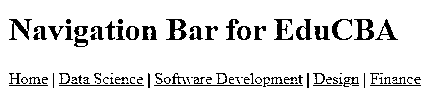
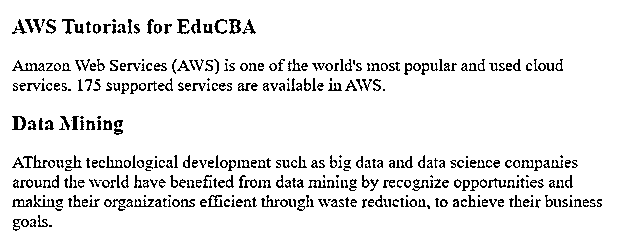
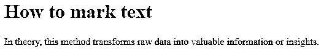
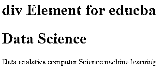
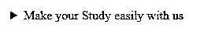
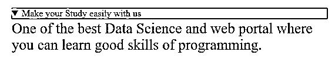
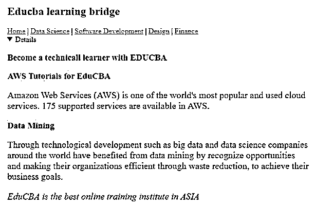

# HTML5 语义

> 原文：<https://www.educba.com/html5-semantics/>




## HTML5 语义概述

HTML5 语义元素有反映组件类型的重要名称。让我们以表格、页眉、页脚等为例。

*   <summary></summary>
*   <main></main>

*   

*   <details></details>
*   <mark></mark>
*   <nav></nav>

对于 HTML4，开发人员使用他们自己的 id/类名来设计元素，如顶部、标题、底部、菜单、页脚、主要、导航、材料、对象、顶部导航、侧边栏等。，等等。然而，正因为如此，搜索引擎无法识别网页的正确内容。

<small>网页开发、编程语言、软件测试&其他</small>

### HTML5 语义的例子

现在让我们看一些 HTML5 语义元素的例子:

#### 例# 1-**<标题>**

顾名思义，它是指页面介绍部分的标题。在一页上可以找到许多标题。

**代码:**

```
<!DOCTYPE html>
<html>
<head>
<title>Header Element for the page</title>
<style>
h1, h4 {
Color:#red;
Text-align:centre;
margin-bottom:2px;
}
p {
font-size:23px;
text-align:centre;
margin-top:2px;
}
</style>
</head>
<body>


<h1>Educba learning bridge</h1>
<h3>Become a techinal learner with EDUCBA</h3>
<p>Hey the best online training institute in ASIA </p>


</body>
</html>
```

**输出:**




#### 例 2-

<nav></nav>

导航链接的集合用于描述导航菜单或导航栏。

**代码:**

```
<!DOCTYPE html>
<html>
<head>
<title>Navigation Element</title>
<style>
h1 {
color:#Grey;
}
</style>
</head>
<body>
<h1>Navigation Bar for EduCBA</h1>
<nav>
<a href="https://www.educba.com/">Home</a> |
<a href="https://www.educba.com/data-science/">Data Science</a> |
<a href="https://www.educba.com/software-development/">Software Development</a> |
<a href="https://www.educba.com/design/">Design</a> |
<a href="https://www.educba.com/finance/">Finance</a>
</nav>
</body>
</html>
```

**输出:**




#### 例 3-

一个页面可以分成几个部分，如介绍、联系、细节等。，每个部分都有一个元素。

**代码:**

```
<!DOCTYPE html>
<html>
<head>
<title>Have a look for Section Element in EduCBA</title>
<style>
h1 {
color:#Grey;
}
p {
font-size:20px;
text-align:left;
margin-top:2px;
}
</style>
</head>
<body>

<h1>AWS Tutorials for EduCBA</h1>
<p>Amazon Web Services (AWS) is one of the world's most popular and used cloud services. 175 supported services are available in AWS. </p>


<h1>Data Mining</h1>
<p>AThrough technological development such as big data and data science companies around the world have benefited from data mining by recognize opportunities and making their organizations efficient through waste reduction, to achieve their business goals.
</p>

</body>
</html>
```

**输出:**




#### **例 4-**<标记>

这个标记元素用于突出显示文本。

**代码:**

```
<!DOCTYPE html>
<html>
<head>
<title>EduCBA mark Element</title>
<style>
h2 {
color:#Grey;
}
</style>
</head>
<body>
<h1>How to mark text </h1>
<p> In theory, this method transforms <mark>raw data into valuable information</mark> or insights.</p>
</body>
</html>
```

**输出:**




#### 例 5-

它是块或段划分的一个方面。它被用作一个包。

**代码:**

```
<!DOCTYPE html>
<html>
<head>
<title>div Element</title>
<style>
.edu {
color:#grey;
}
</style>
</head>
<body>
<h1>div Element for educba </h1>
<div class="EduCBA">
<h1>Data Science</h1>
<p>Data analatics computer Science nachine learning </p>
</div>
</body>
</html>
```

**输出:**




#### 例 6—**<细节>和** <概要>

*   该元素用于定义用户可以查看或隐藏的附加细节。
*   这个元素用来定义一个<details>元素的可见标题</details>

执行

<details>和<summary>的程序</summary></details>

**代码:**

```
<!DOCTYPE html>
<html>
<head>
<title>Details for the EduCBA Summery</title>
<style>
.GFG {
Color:#red;
font-size:60px;
Text-align:left;
margin-bottom:0px;
}
p {
font-size:25px;
text-align:left;
margin-top:3px;
}
</style>
</head>
<body>
<details>
<summary class="EDUCBA">Make your Study easily with us</summary>
<p>One of the best Data Science and web portal
where you can learn good skills of programming.
</p>
</details>
</body>
</html>
```

**输出:**







7.  **<>:**该元素用于指定页面内容之外的内容。
8.  **<时间> :** 该元素用于指定时间或日期。
9.  **< main > :** 该元素用于指定文档的主要内容。

### 如何在一个例子中实现所有的元素代码？

这里我们看一下如何在一个例子中实现元素代码。

**代码:**

```
<!DOCTYPE html>
<html>
<head>
<title>Header Element for the page</title>
<style>
color:red;
h1, h4 {
Color:#red;
Text-align:centre;
margin-bottom:2px;
}
p {
font-size:20px;
text-align:centre;
margin-top:2px;
}
</style>
</head>
<body style="background-color:LightCyan;">


<h1>Educba learning bridge</h1>
<nav>
<a href="https://www.educba.com/">Home</a> |
<a href="https://www.educba.com/data-science/">Data Science</a> |
<a href="https://www.educba.com/software-development/">Software Development</a> |
<a href="https://www.educba.com/design/">Design</a> |
<a href="https://www.educba.com/finance/">Finance</a>
</nav>
<details>
<h3>Become a technicall learner with EDUCBA</h3>

<h1><mark>AWS Tutorials for EduCBA</mark></h1>
<p>Amazon Web Services (AWS) is one of the world's most popular and used cloud services. 175 supported services are available in AWS. </p>


<h1><mark>Data Mining</mark></h1>
<p>Through technological development such as big data and data science companies around the world have benefited from data mining by recognize opportunities and making their organizations efficient through waste reduction, to achieve their business goals.
</p>

<p><em>EduCBA is the best online training institute in ASIA</em></p>
</details>

</body>
</html>
```

**输出:**




### 推荐文章

这是 HTML5 语义的指南。这里我们讨论 HTML5 语义和代码实现的简要概述和例子。您也可以看看以下文章，了解更多信息–

1.  [HTML 中的光标](https://www.educba.com/cursor-in-html/)
2.  [Html5 新元素](https://www.educba.com/html5-new-elements/)
3.  [HTML 中标签的类型](https://www.educba.com/types-of-tags-in-html/)
4.  [HTML 中的 Span 标签](https://www.educba.com/span-tag-in-html/)


