# HTML5 语义元素

> 原文：<https://www.educba.com/html5-semantic-elements/>

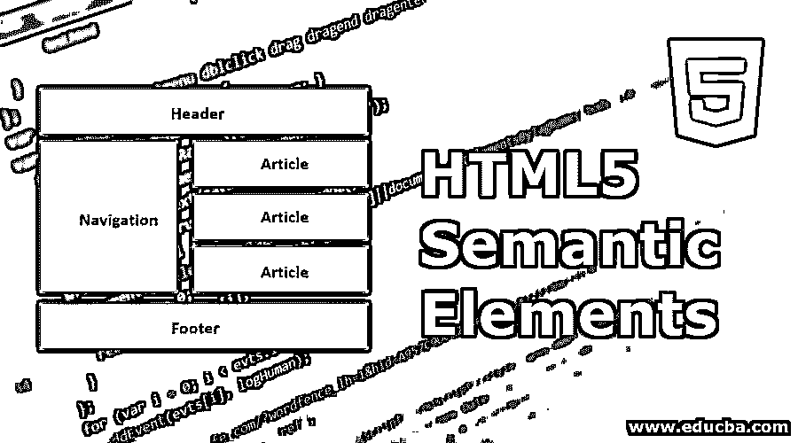


## HTML5 语义元素介绍

以下文章将为您提供 HTML5 中的各种语义元素。语义是关于不同类型的标签，其功能将根据标签名称描述和执行相同的功能。标签的功能将很容易通过其名称来理解，该名称是用户可理解的名称/格式。HTML 中的[元素一般都是语义元素。](https://www.educba.com/html-form-elements/)

### HTML5 中语义元素的优势

语义元素的优点如下:

<small>网页开发、编程语言、软件测试&其他</small>

*   代码理解简单。
*   维护可以快速而恰当地完成。
*   不需要专门为任何标签添加任何描述。

### HTML5 中的各种语义元素

现在让我们进入语义元素:

#### 1.

这个标记让我们知道这个标记中的数据是专门用于相似内容的。这也取决于我们通常拥有的不同类型的文章。可以是博客、论坛、报纸上的专栏文章等。

**代码:**

```
<html>
<body>

<h2>HTML5</h2>
<p>New Updated version of HTML</p>


<h2>Learning HTML</h2>
<p> We are learning through EDUCBA</p>

</body>
</html>
```

**输出:**

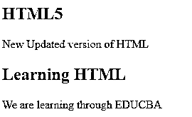


#### 2.

这个标签是关于提供总数据的分段内容的。在了解了如何使用文章和章节标签后，这些标签可以在每个标签中使用。也就是说，部分标签可以在文章标签中使用，反之亦然。

**代码:**

```
<html>
<body>
The section here is about:
<p><h4> Learning and practising</h4> </p>

</body>
</html>
```

**输出:**

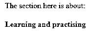


#### 3.


这个标签给出了所有的头数据。我们想要放入标题格式的任何数据都在这个标题标签下使用。这个标签可以在整个 HTML 脚本中多次使用。

**代码:**

```
<html>
<body>

<h3>This is header #1</h3>
<p> First one</p>

<p> next one ...</p>

<h3>This is header #2</h3>
<p> Second one </p>

</body>
</html>
```

**输出:**

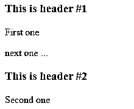


#### 4.

这是我们 HTML 脚本中的页脚部分。一般来说，我们会看到所有的版权数据和我们在任何报价下找到的一小部分，如任何报价上的“条件适用”。所以这些东西是在页脚标签下定义的。

**代码:**

```
<html>
<body>
<p> Inside Body and above footer tag</p>

<p> Inside footer tag.</p>


<p><h4> Another footer tag</h4></p>
<p><h6>Conditions Apply</h6> </p>

</body>
</html>
```

**输出:**

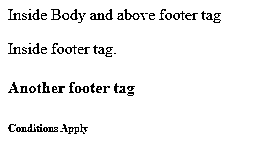


#### 5.

<nav></nav>

这个标签为我们提供了导航元素。任何 HTML 文档脚本中的 URL，我们通常希望通过这个标签从一个页面导航到另一个页面。此标签下给出的任何数据都可以作为超链接获得。这些[超链接在从一个部分导航到另一个部分时很有用](https://www.educba.com/asp-dot-net-hyperlink/)。

**代码:**

```
<html>
<body>
<h4> About </h4>
<nav><a href="#"> About link 1</a>
<a href="#"> About link 1</a>
</nav>
<h4> Contact </h4>
<nav>
<a href="#"> Contact Link 1</a>
<a href="#"> Contact Link 2</a>
</nav>
</body>
</html>
```

**输出:**

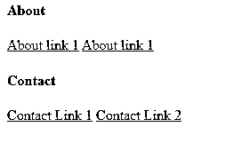


练习时，单击这些链接，并检查单击时超链接的颜色如何变化。

#### 6.

这是一个标签，用于在 HTML 文档的侧面显示数据。在许多网站上，我们可以找到存在于侧边栏中的内容，这些内容使用这个侧边标签显示[。此内容应与文档中的其他数据一致。](https://www.educba.com/aside-tag-in-html/)

**代码:**

```
<html>
<body>
<p>How aside tag is used </p>

<h4>Inside aside tag</h4>
<p>Content inside aside tag</p>

</body>
</html>
```

**输出:**

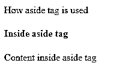


确切的内容不能以同样的方式完全指定；只有在使用整个 HTML 页面的时候才能被记录和理解清楚。

#### 7.

这个标签指定我们将要附加一个图像。这个标签可以用来指定一个图像源并显示一个 gif 或图像。

**代码:**

```
<html>
<body>


</body>
</html>
```

如上所述，这就是我们如何定义图形标签。在 figure 标记中，我们可以用 source 标记指定我们的 image 命令。在这个图标签中，我们可以依次使用图标题标签。

#### 8.


该标签用于在所提供的图像下给出标题。可以在图形标签内使用[。在下面的例子中可以看到它的用法。](https://www.educba.com/html-figure-tag/)

```
<html>
<body>


This is description of the image attached.

</body>
</html>
```

您可以通过给出一个图像源来尝试执行同样的操作，并检查输出是如何显示的。

#### 9.

<main></main>

这个标签指定了 HTML 站点的所有属性和完整内容。它包含了所有独特的内容。对于这个特殊的标记，需要注意的一件重要事情是，这个标记在整个页面创建过程中只能使用一次。我们发现，在创建网页时，其他标签可以多次使用，但这个主标签是一次性使用标签。

**代码:**

```
<html>
<body>
<main>
<h1>Learning HTML Semantic Tags</h1>

<h4>Studying</h4>
<p> Reading would help to understand different topics</p>


<h4>Practising</h4>
<p> With Studying , Practising is a must thing to do in learning</p>

</main>
</body>
</html>
```

**输出:**

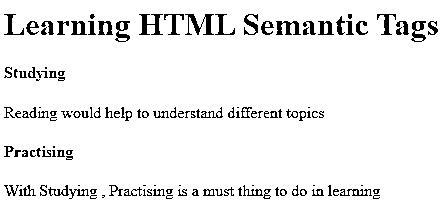


#### 10.<mark></mark>

此标签用于突出显示特定的内容或数据。换句话说，这个标签有助于标记数据。

**代码:**

```
<html>
<body>
<p> In this whole text which I am writing now, <mark> I want to mark this text </mark></p>
</body>
</html>
```

**输出:**

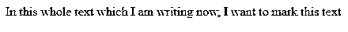


#### 11.<details></details>

这个标签包含额外的细节，用户可以隐藏他们想要的任何细节。通过这个标签，用户可以打开/关闭任何他们需要的内容。如果我们想让标签在一开始就公开它的细节，那么可以使用属性“open”。

**代码:**

```
<html>
<body>
<details open="true">
<p>Is this displayed?</p>
</details>
</body>
</html>
```

**输出:**

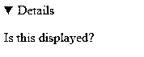


现在，如果我们不使用 open 属性，输出会是什么呢？

**代码:**

```
<html>
<body>
<details>
<p>Is this displayed?</p>
</details>
</body>
</html>
```

**输出 1:**

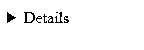


**输出 2:**

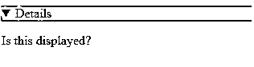


#### 12.<summary></summary>

这个标签用在细节标签中。在 details 标签下，我们可以有一个 summary 标签来指定 web 页面或 HTML 文档的整个摘要。这里需要注意的一点是，summary 标记是 details 标记下的第一个子标记。

**代码:**

```
<html>
<body>
<details>
<summary> Have written this inside summary tag which is inside details tag</summary>
<p>This text only comes under details tag</p>
</details>
<p> This text data is written after completion of details tag</p>
</body>
</html>
```

**输出 1:**

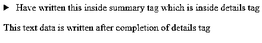


我们突出显示了上面输出中的箭头，因为一旦展开它，我们将得到输出 2。

**输出 2:**

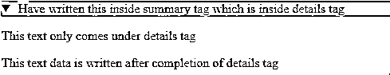


这个标签可能不会给出任何区别

#### 13.

该标签以用户易于理解的格式定义日期/时间。但是需要注意的是，在许多浏览器中，这个标签可能不会给我们一个改变的输出。

**代码:**

```
<html>
<body>
<p>At present time is <time>11:00</time> pm in the night.</p>
</body>
</html>
```

**输出:**

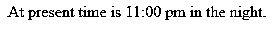


#### 14.<dialog></dialog>

顾名思义，这个标签是用来在盒子里写任何内容的。这个标记应该有一个 open 属性，用于在源代码执行后显示对话框。

**代码:**

```
<html>
<body>
<dialog open=true>
<p> The data written here gets displayed in a dialog box </p>
</dialog>
</body>
</html>
```

**输出:**

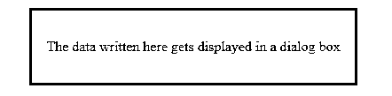


#### 15.

这个标签以图形化的方式给出了某个任务的进度。我们在这里需要有最大的数字来代表进程。这个标签主要由两个属性组成。最大值和值是两个属性。Max 表示必须完成的总计数，Value 给出相对于最大计数值已完成的计数百分比。

**代码:**

```
<html>
<body>
<h1 style="color:red;">EDUCBA</h1>
Your learning progress is:
<progress value="72" max="100">
</progress>
</body>
</html>
```

**输出:**

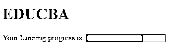


#### 16.

这个标签是用来测量的。这也可以用于查询占用的空间或磁盘空间的使用。这个标签有几个属性。这些属性是最大值、最小值和值。根据它们的用法，我们肯定能搞清楚它们的用途和用法。

**代码:**

```
<html>
<body>
<h2>EDCUBA</h2>
<p>Usage of Meter tag</p>
In a 6 floors apartment, I live in 2nd floor:
<meter value="2" min="0" max="6">2 out of 6</meter>
</body>
</html>
```

**输出:**

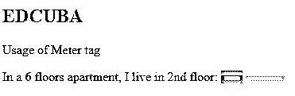


#### 17.

这是一个标签，用于将视频文件添加到我们的 HTML 页面中。在引入这个标签之前，开发人员使用插件将视频文件引入 HTML 页面内容。有一些属性可以和标签一起使用。自动播放，预加载，静音就是其中的一些。

**代码:**

```
<html>
<body>
<video>
<source src="video_name.mp4" type="video/mp4">
</video>
</body>
</html>
```

我们只需要一个源标签来给出我们需要上传视频内容到页面的来源。

#### 18.

这个标签用于向我们的 Html 页面添加音频文件。使用和源标签将与视频标签相同。作为练习，尝试使用所有的语义元素并创建 e HTML 5 版本的网页，以便更好更快地学习。

### 结论

在这篇文章中，我们已经看到了许多语义元素以及它们在 HTML5 中的[用法。这里要注意的一件重要事情是，这些标签中的许多标签都受高于 9 的 internet explorer 版本和高于 3 的 chrome 版本的支持。](https://www.educba.com/what-is-html5/)

### 推荐文章

这是 HTML5 语义元素的指南。这里我们讨论 HTML5 中的介绍和各种语义元素以及它的代码实现。您也可以阅读以下文章，了解更多信息——

1.  [HTML5 新元素](https://www.educba.com/html5-new-elements/)
2.  [HTML5 Web Workers](https://www.educba.com/html5-web-workers/)
3.  [HTML5 元素](https://www.educba.com/html5-elements/)
4.  [HTML5 语义](https://www.educba.com/html5-semantics/)


