# 用 HTML 创建表格

> 原文：<https://www.educba.com/create-tables-in-html/>

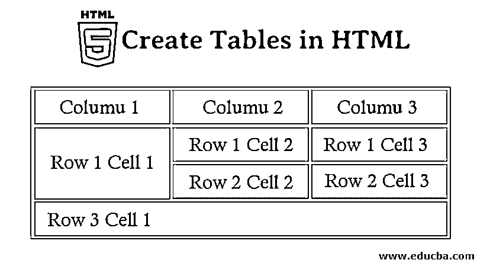


## 在 HTML 中创建表格的介绍

表格是最有用的结构之一。表格遍布[web 应用](https://www.educba.com/what-is-web-application/)。表格的主要用途是用来组织信息片段和网页上的信息。HTML 表格是基于表格的页面布局。表格不应被用作布局辅助工具。在本文中，我们将讨论在 HTML 中创建表格。

**HTML 表格**

<small>网页开发、编程语言、软件测试&其他</small>

*   **<表格>** 标签用于创建表格。
*   在 HTML 中，表格被认为是包含每组单元格的一组行。
*   一行中可以有多列。
*   HTML 表格应该只用于表格数据，但它们也用于创建布局网页。
*   如果我们在浏览器中构建没有任何样式或属性的 HTML 表格，它们将显示为没有任何边框。
*   表格标签:

*   我们在这些标签之间写入的内容将显示在表格中。

### HTML 中使用的标签

下面是表格中使用的一些标签。

#### 1.标签

*   标签用来定义 HTML 表格中的一行。
*   我们将从开头的 by 行标记开始行，然后通过创建每个单元格来构建行，当我们完成一行的所有单元格时，我们将使用结尾的行标记来关闭该行。
*   行标签:

#### 2.label

*   标签用来定义 HTML 表格中单元格[的数据。](https://www.educba.com/html-text-editors/)
*   我们将用开始单元格标签创建每个单元格，然后将内容或数据添加到单元格中，然后用结束单元格标签关闭单元格。
*   单元格标签:

#### 3.label

*   标签用来定义 HTML 表格中的标题单元格。
*   表格中的标题单元格用于为该列的其余单元格提供信息。
*   表头标签:
*   通常，它被放置在单元格的顶部。

#### 4.<bgcolor>标签</bgcolor>

*   标签用来指定表格的背景颜色。

**语法:**

```
<table bgcolor  = "color_name|hex_number|rgb_number">
```

*   对于颜色名称，我们可以直接[为背景提供颜色名称](https://www.educba.com/color-name-in-html/)。例如，我们可以指定<表格 bgcolor ="Red" >
*   对于 hex_number，我们必须指定背景的十六进制代码。例如*   对于 rgb_number，我们必须指定背景的 rgb(红、绿、蓝)代码。例如

    *   在 rgb_number 中，如果我们提供所有像 255 这样的值，那么输出的背景色就是白色。

    #### 5.

    *   标签用来给表格提供标题。
    *   它紧接在

    <caption>标签</caption>

    标签之后被放置或使用。

*   默认情况下，表格标题将在表格上方居中对齐。
*   标题标签:

#### 6.细胞跨越

*   跨越只不过是将表格中两个或多个相邻的单元格组合在一起。
*   它由列跨度和行跨度组成。
*   **Col span**:Col span 属性指定一个表格单元格应该跨越的列数。

*   它总是取整数值。
*   **行跨度:**行跨度属性指定表格单元格应该跨越的行数。

*   它总是取整数值。

#### 7.标签

*   **< thead >** 定义了一组定义表格列头的行。

**语法:**

```
<thead></thead>
```

#### 8.标签

*   标签用于对 HTML 表格中的主体内容进行分组。
*   表格可以包含多个正文；在另一种情况下，有些表格只能包含一个主体；在这些情况下，可以删除。
*   只有一个表体的表将有一个隐式表体。

**语法:**

```
<tbody> </tbody>
```

#### 9.标签

*   标签包含代表页脚或摘要的行。

**语法:**

```
<tfoot> </tfoot>
```

#### 10.标签

*   表格的列可以用元素组合在一起。
*   块中声明的每个元素将在 span 属性的帮助下定义一个组，该属性将指示属于该组的列数。
*   这对于对整列应用样式而不是对每行或每个单元格重复应用样式非常有用。

**语法:**

```
<colgroup> </colgroup>
```

### HTML 标签的例子

以下是不同的例子:

#### 1.桌子

**语法:**

```
<table> </table>
```

**举例:**

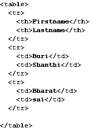


**输出:**

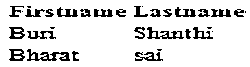


*   在本例中，我们创建了一个包含三行的表格，从输出中可以看出，它不包含任何边框。所以每当我们创建一个没有 CSS 或者没有使用任何样式的表格时，它将显示没有边框的输出。

**举例:**

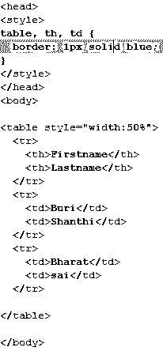


**输出:**

**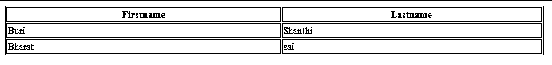

** 

*   这个例子显示，通过在 style 部分给出 border 属性，并在 table 标签中使用它，我们的输出有了一个边框。

#### 2.标签和label

**语法:**

```
<tr><td>........ </td> </tr>
```

**举例:**

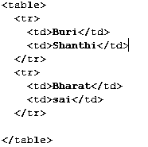


**输出:**

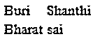


*   在这个例子中，我们简单地用标签创建了两行，并使用标签输入数据。

#### 3.label

**语法:**

```
<th> </th>
```

**举例:**


**输出:**

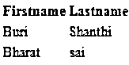


*   在这个例子中，我们可以看到名字和姓氏与其他名字相比是粗体的，因为它们是通过使用标签声明为单元格的标题的。

#### 4.

**语法:**

```
table bgcolor  = “color_name|hex_number|rgb_number”&gt*;*
```

**举例:**

**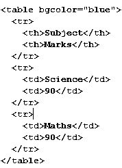

** 

**输出:**

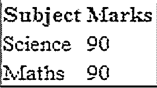


#### 5.

**语法:**

```
<caption> </caption>
```

**举例:**

***

*** 

**输出:**

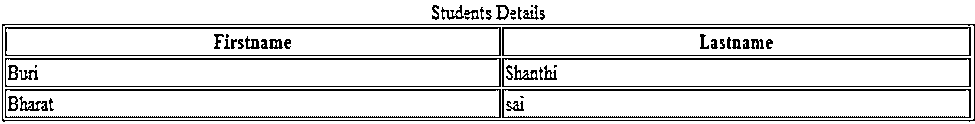


*   在本例中，我们通过使用标题标签[向表中添加了一个标题作为学生详细信息。](https://www.educba.com/caption-tag-in-html/)

#### 6.列跨度和行跨度

**列跨度的语法:**

```
<td col span = “number”>
```

**行跨度的语法:**

```
<td row span = “number”>
```

**列跨度示例:**

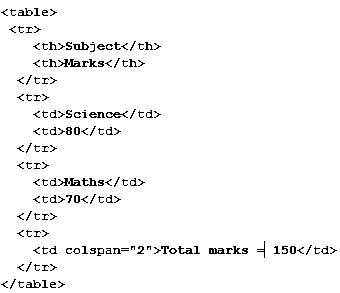


**输出:**

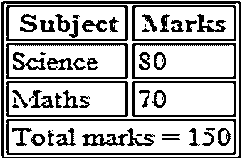


**行跨度示例:**

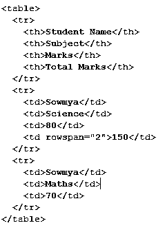


**输出:**

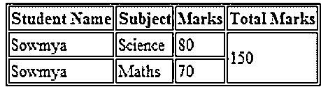


#### 7.

**语法:**

```
<thead> </thead></'code>
```

#### 8.

**语法:**

```
<tbody> </tbody>
```

#### 9.

**语法:**

```
<tfooter> </tfooter>
```

**举例:**

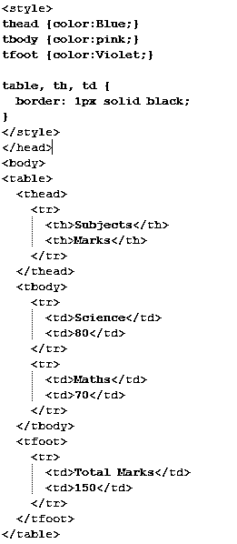


**输出:**

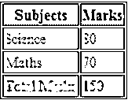


#### 10.Colgroup

**语法:**

```
<Colgroup> </Colgroup>
```

**举例:**

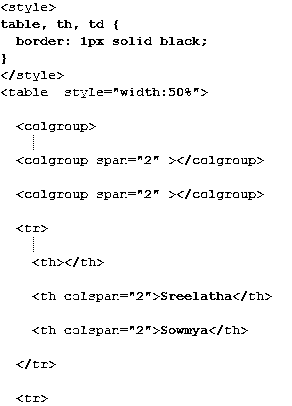


**输出:**

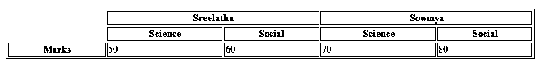


### 结论–用 HTML 创建表格

在 HTML 中，我们可以通过使用标签创建多个表格，甚至可以对行和列进行分组。我们甚至可以通过使用 CSS 对表格进行更多的样式化处理。

### 推荐文章

这是一个用 HTML 创建表格的指南。这里我们讨论如何用 HTML 创建一个表格，并举例说明如何使用 HTML 标签。您还可以浏览我们推荐的其他文章——

1.  [HTML 文本编辑器](https://www.educba.com/html-text-editors/)
2.  [HTML 表单元素](https://www.educba.com/html-form-elements/)
3.  [HTML 图像标签](https://www.educba.com/html-image-tags/)
4.  [HTML](https://www.educba.com/html-attributes/)T2】属性 T4】es


