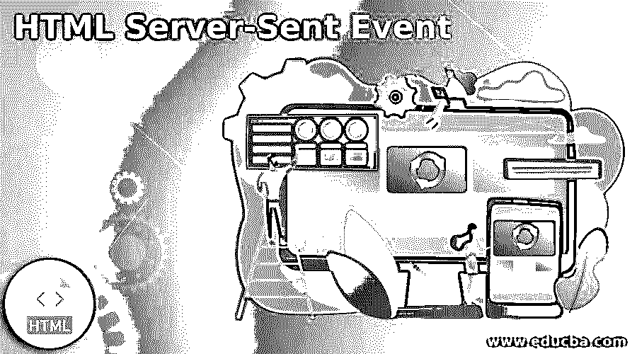
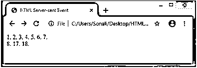
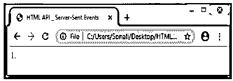
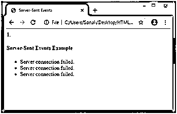

# HTML 服务器发送的事件

> 原文：<https://www.educba.com/html-server-sent-event/>




## HTML 服务器发送事件简介

HTML 服务器发送事件是 HTML API 中包含的场景之一，用于使用网页从服务器自动获取更新。这个概念包括一种在 web 服务器和 web 浏览器之间工作的事件，称为服务器发送事件。

我们首先要添加一些代码来检查我们的浏览器是否支持服务器发送的事件；之后，我们将处理其他代码以获得准确的输出。与 WebSockets 不同，开发使用服务器发送的事件的 web 应用程序总是更容易。

<small>网页开发、编程语言、软件测试&其他</small>

### 服务器发送的事件如何在 HTML 中工作？

*   作为一个用户，当我们试图做一些事件并将其传递给服务器时，比如在登录按钮上点击，登录详细信息将被发送给服务器。因此，当执行这种类型的事件(从 web 浏览器传递到 web 服务器)时，该事件被称为客户端事件。
*   但是我们正在做与上述过程相反的事情，这意味着从服务器向 web 浏览器发送数据或事件被称为服务器发送事件。因此，当浏览器从服务器自动更新时，这些类型的事件就会在系统中发生。
*   服务器发送的事件总是被视为单向的，因为它只在一个方向上处理，从服务器到客户端。因此，该流程的主要属性之一是 EventSource 属性及其对象。
*   因此，这个对象附加了 url、请求、重新连接时间和最后事件 ID 字符串等术语。让我们一个一个来看。
    *   **Url:** 将在构建过程中设置。
    *   **请求:**我们必须一开始就将其初始化为 null。
    *   **重新连接时间:**这是以毫秒为单位测量的时间戳。
    *   **最后一个事件 ID 字符串:**我们还必须将字符串值初始化为空字符串。

### 接收服务器发送的事件通知

前面，我们讨论了 EventSource 属性；它还与其对象一起用于接收服务器事件通知。

#### 例子

EventSource 属性的实际用法如下所示:

**代码:**

```
<!DOCTYPE html>
<html>
<body>
<h1>Receive Sever-sent Event</h1>
<div id="demo"></div>
<script>
if(typeof(EventSource) !== "undefined") {
var source = new EventSource("ssedemo.html");
source.onmessage = function(event) {
document.getElementById("demo").innerHTML += event.data + "<br>";
};
} else {
document.getElementById("demo").innerHTML = "Oops, your browser is not going to support Secure-sent event";
}
</script>
</body>
</html>
```

*   在上面的例子中，我们定义了 EventSource 属性的对象，包括我们用来发送更新的页面的 url 所有更新都是在一个名为 on message 的事件上接收的，这有助于定义名为 demo 的 id。

**语法:**

*   第一步是检查我们的浏览器是否支持服务器发送的事件。所以我们会在程序中放一小段代码，检查它的浏览器是否受支持。

```
if(typeof(EventSource) !== "undefined") {
// Server-sent event supported code
// Program code
}
else {
//Oops! Server-sent event is not supported code
}
```

*   现在我们将看到从服务器发送的事件接收事件的语法如下:

**语法:**

```
if(typeof(EventSource) !== "undefined") {
var object = new EventSource("File_URL");
source.onmessage = function(event) {
document.getElementById("output").innerHTML += event.data + "<br>";
}
```

*   如上面的语法所示，首先，我们必须创建一个 EventSource 属性的新对象，同时定义文件的 url。这将有助于我们向网络浏览器发送更新。
*   因此，无论何时来自服务器的任何更新，事件都将在 onmessage 上发生，并且它将在 web 文档上打印一条所需的消息。

### HTML 服务器发送事件的示例

html 服务器发送事件的示例如下:

#### 示例#1

在第一个例子中，我们将检查我们的浏览器是否支持服务器发送事件。如果一切正常，它将在输出窗口中显示时间，如果它不支持浏览器，它将在浏览器窗口中打印一条错误消息。**代码:**

```
<!DOCTYPE html>
<html>
<head>
<title>HTML Server-sent Event</title>
</head>
<body>
<div id="sse_demo">
</div>
<script type="text/javascript">
if(typeof(EventSource)!=="undefined")
{
alert("Yes Your browser is going to support Server-Sent Event");
}
else
{
alert("Sorry! Yes Your browser is not going to support Server-
Sent Event");
}
</script>
</body>
</html>
```

**输出:**

我们在输出屏幕上看到数字时间，这意味着我们的浏览器将支持 HTML 服务器发送事件。




#### 实施例 2

这个例子是针对服务器发送事件的，我们计算了在浏览器上加载服务器发送事件所需的时间。这个时间戳以秒为单位。

**代码:**

```
<!DOCTYPE html>
<html lang="en">
<head>
<title>HTML API _ Server-Sent Events</title>
<script>
window.onload = function()
{
var path = new EventSource("server_time.html");
path.onmessage = function(event)
{
document.getElementById("sse_output").innerHTML += "Required
timestamp   received from web server: " + event.data + "<br>";
};
};
</script>
</head>
<body>
<div id="sse_output">
<!--This will display required time of server to load contents-->
</div>
</body>
</html>
```

**输出:**

如下面的输出屏幕所示，它显示 1 秒的加载时间。




#### 实施例 3

在这个例子中，我们试图展示连接的建立。让我们运行代码，看看输出是什么:

**代码:**

```
<!DOCTYPE html>
<html>
<head>
<meta charset="utf-8" />
<meta name="viewport" content="width=device-width, height=device-height" />
<title> Server-Sent Events </title>
<style type="text/css">
font-family: ‘Times new Roman’;
</style>
</head>
<body>
<h4> Server-Sent Events Example </h4>
<ul></ul>
<script>
(function()
{ "use strict";
var ev_check = document.querySelector('ul');
var ssl = new EventSource('/events');
function li(text) {
var li = document.createElement('li');
li.innerText = text;
ev_check.appendChild(li);
}
ssl.addEventListener('open', function()
{
li('Server connection done succussfully.');
});
ssl.addEventListener('my-custom-event', function(event)
{
li(event.data);
});
ssl.addEventListener('error', function()
{
li('Server connection failed.');
});
})();
</script>
</body>
</html>
```

**输出:**

一旦上述代码在浏览器窗口上运行，它将在服务器连接失败的地方生成输出。




### 结论

从以上所有信息来看，HTML Server-send 事件是一个新的 API，用作单向事件过程，用户可以在其中创建从 web 服务器到 web 浏览器的事件。它使用属性 EventSource。人们可以使用它来查看事件加载时间。这是用在脸书，新闻饲料，股票价格更新等。

### 推荐文章

这是一个 HTML 服务器发送事件的指南。在这里，我们讨论介绍和服务器发送的事件如何在 html？以及不同的示例及其代码实现。您也可以看看以下文章，了解更多信息–

1.  [HTML Tooltip](https://www.educba.com/html-tooltip/)
2.  [HTML 中的小标签](https://www.educba.com/small-tag-in-html/)
3.  [HTML 文本属性](https://www.educba.com/html-text-attributes/)
4.  [HTML 图片标签](https://www.educba.com/html-picture-tag/)


