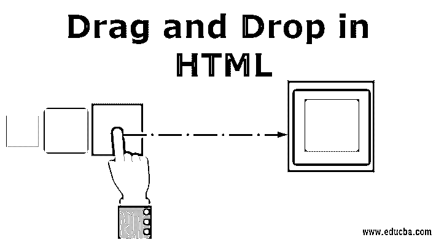
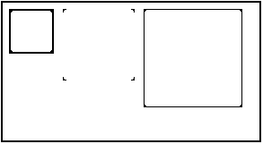
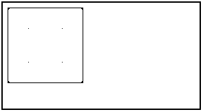
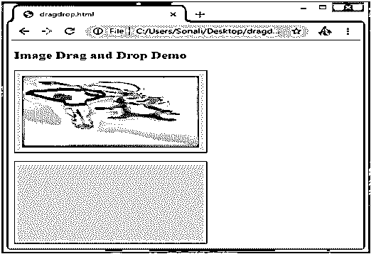
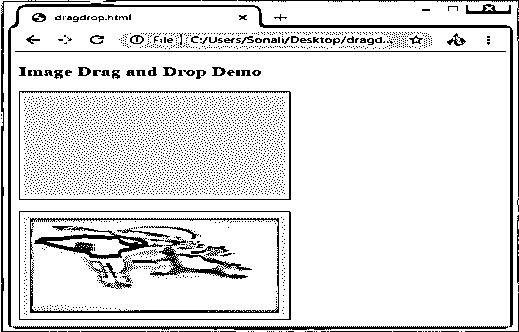
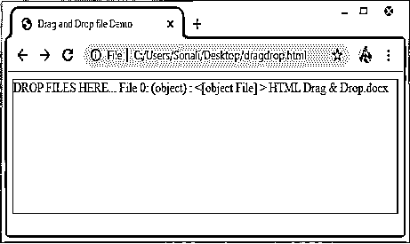

# 在 HTML 中拖放

> 原文：<https://www.educba.com/drag-and-drop-in-html/>




## HTML 中拖放的介绍

由于其方便的功能模式，拖放是在网页中手动提供输入的最新功能。拖放方法可以描述为用户从源字段的项目列表中选择特定数据/选项，拖动该数据/选项，并将其放入目标字段的过程。它是使用文档对象模型以及来自 HTML 网页的多个鼠标事件实现的。此功能中使用的各种事件是拖动、拖动开始、拖动离开、拖动输入、拖动结束、放下、拖动结束和拖动退出。

### 拖放事件

最新的拖放(dnd)功能中包含多个事件；下面我们逐一来看:

<small>网页开发、编程语言、软件测试&其他</small>

| **服务请求编号** | **事件** | **详细描述** |
| One | 拖 | 当鼠标与要拖动的元素一起移动时，拖动实体(元素或文本)。 |
| Two | Dragstart | 拖放的第一步是 dragstart。当用户开始拖动对象到需要的位置时，它被执行。 |
| Three | 龙怪 | 当鼠标悬停在目标元素上时，使用 Dragenter 事件。 |
| Four | 休假 | 当用户从元素上释放鼠标时，使用此事件。 |
| Five | 德拉戈夫 | 当鼠标用于元素上时，会发生此事件。 |
| Six | 滴 | 此事件在拖放过程结束时用于拖放元素操作。 |
| Seven | 德拉戈 | 这是这个过程中最重要的一点，即使是从元素上释放鼠标按钮来完成拖动过程。 |
| Eight | 拖拽退出 | 此事件状态表明元素不再被拖到元素的紧急目标选择过程中。 |

让我们来看看将要发生拖放操作的一些数据属性:

**1。data transfer . drop effect[= value]:**该属性用于显示当前正在进行的操作。用户可以设置它来替换已经选择的操作。其中包含的值有复制、链接、无或移动。

**2。data transfer . effect allowed[= value]:**允许的任何操作都将通过该属性返回。也可以设置更改已经选择的操作。

**3。dataTransfer.files:** 这个数据属性用来获取将要被拖动的文件的文件列表。

**4。data transfer . add element(element):**用于将已经存在的元素插入到其他元素列表中，这些元素对于呈现拖动反馈很有用。

**5。data transfer . setdragimage(element，x，y):** 这个属性与上面的有点相同，用于更新拖动反馈并帮助更改已经存在的反馈

**6。data transfer . cleardata([format]):**帮助用户从已经定义好的格式中删除数据。如果用户省略了参数，它将删除所有数据。

**7。dataTransfer.setData(format，data):** 这是用来添加指定数据的常用属性之一。

**8。data = data transfer . get data(format):**该属性在拖拽和拖拽操作中用来提取指定的数据。如果没有与它相同的数据，它将返回空字符串。

### HTML 中拖放的语法

以下是定义拖放语法的几个步骤:

**选择要拖动的对象:**为其设置属性 true。

```
<element draggable="true">
```

**开始拖动对象:**

```
function dragStart(ev){}
```

**放下物体:**

```
function dragDrop(ev){}
```

### HTML 中的拖放示例

下面的例子将展示在 HTML 中拖放操作是如何执行的:

#### 示例#1

**代码:**

```
<html>
<head>
<title>Drag and Drop Demo</title>
<script>
function allowDrop(ev) {
ev.preventDefault();
}
function dragStart(ev) {
ev.dataTransfer.setData("text", ev.target.id);
}
function dragDrop(ev) {
ev.preventDefault();
var data = ev.dataTransfer.getData("text");
ev.target.appendChild(document.getElementById(data));
}
</script>
<style>
#box {
margin: auto;
width: 30%;
width: 21%;
height:150px;
border: 2px solid blue;
padding: 2px;
}
#square1, #square2, #square3 {
float: left;
margin: 5px;
padding: 10px;
}
#square1 {
width: 30px;
height: 30px;
background-color: #BEA7CC;
}
#square2 {
width: 60px;
height: 60px;
background-color: #B5D5F5;
}
#square3 {
width: 90px;
height: 90px;
background-color:#F5B5C5 ;
}
h2 {
font-size:20px;
font-weight:bold;
text-align:center;
}
</style>
</head>
<body>
<h2>HTML DRAG AND DROP DEMO</h2>
<div id = "box">
<div id="square1" draggable="true"ondragstart="dragStart(event)"></div>
<div id="square2" draggable="true"ondragstart="dragStart(event)"></div>
<div id="square3" ondrop="dragDrop(event)" ondragover="allowDrop(event)"></div>
</div>
</body>
</html>
```

**输出:**拖拽前，选项输出如下图所示:




执行拖放操作后，输出将如下所示:




#### 实施例 2

在这里，我们将看到另一个示例，我们将图像从一个位置移动到另一个指定的位置，如下面的代码所示:

**代码:**

```
<!DOCTYPE HTML>
<html>
<head>
<script>
function allowDrop(ev) {
ev.preventDefault();
}
function dragStart(ev) {
ev.dataTransfer.setData("text", ev.target.id);
}
function dragDrop(ev) {
ev.preventDefault();
var data = ev.dataTransfer.getData("text");
ev.target.appendChild(document.getElementById(data));
}
</script>
<style>
.divfirst {
width: 250px;
height: 150px;
padding: 10px;
border: 1px solid black;
background-color: #F5F5F5;
}
p {
font-size:20px;
font-weight:bold;
}
</style>
</head>
<body>
<p>Image Drag and Drop Demo</p>
<div class="divfirst" ondrop="dragDrop(event)" ondragover="allowDrop(event)">
</div>
<br>
<div     class= "divfirst"ondrop="dragDrop(event)"
ondragover="allowDrop(event)"></div>
</body>
</html>
```

**输出:**拖拽操作前，输出为:




拖放操作完成后，它将如下所示:




#### 实施例 3

在本例中，我们将了解如何将文件拖放到指定位置:

**代码:**

```
<body>
<div id="filedemo" style="min-height: 150px; border: 1px solid black;"
ondragenter="document.getElementById('output').textContent = ''; event.stopPropagation(); event.preventDefault();"
ondragover="event.stopPropagation(); event.preventDefault();"
ondrop="event.stopPropagation(); event.preventDefault();
dodrop(event);">
DROP FILES HERE...
</div>
<script>
function dodrop(event)
{
var dt = event.dataTransfer;
var files = dt.files;
for (var i = 0; i < files.length; i++) {
output(" File " + i + ":\n(" + (typeof files[i]) + ") : <" + files[i] + " > " +
files[i].name + " " );
}
}
function output(text)
{
document.getElementById("filedemo").textContent += text;
}
</script>
</body>
```

**输出:**




### 结论

HTML 拖放是最重要的用户界面实体之一，将用于不同的目的，如复制、删除或记录。它作用于不同的事件和属性，如上所列。当你选择一个对象，然后把它放到一个指定的位置时，它执行这个操作。

### 推荐文章

这是一个在 HTML 中拖放的指南。在这里，我们讨论拖放操作在 HTML 中是如何执行的，并给出了相应的例子。您也可以阅读以下文章，了解更多信息——

1.  [Tableau 中的树形图](https://www.educba.com/treemap-in-tableau/)
2.  [在 HTML 中创建表格](https://www.educba.com/create-tables-in-html/)
3.  [HTML 表格标签](https://www.educba.com/html-table-tags/)
4.  [HTML 列表样式](https://www.educba.com/html-list-styles/)


