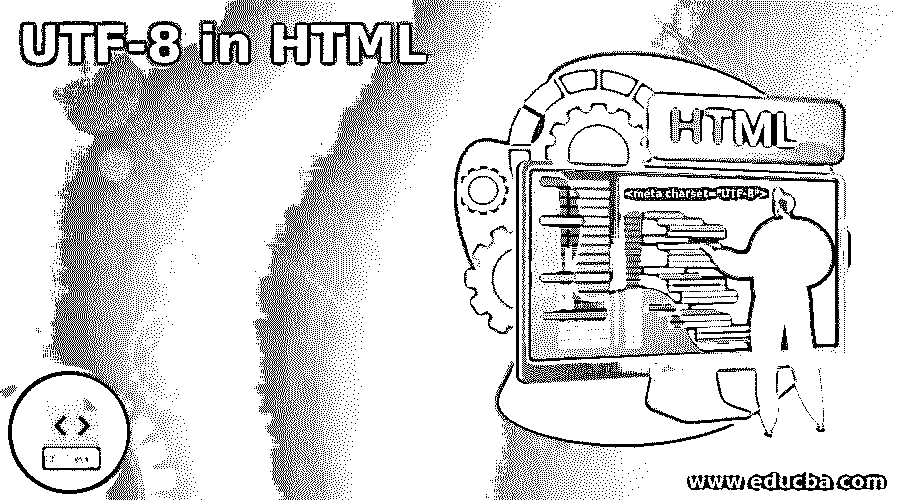
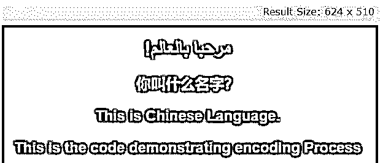
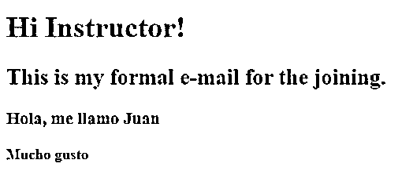
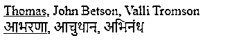

# HTML 格式的 UTF-8

> 原文：<https://www.educba.com/utf-8-in-html/>




## HTML 格式的 UTF-8 简介

UTF-8 被定义为 HTML5 的默认字符编码，用于完美地显示 HTML 页面。它鼓励 web 开发人员使用 UTF-8，因为它涵盖了实体中的所有字符和符号，使用一个字节，在所有浏览器中都能很好地工作。Unicode 转换格式–8 位是一种将键入的字符转换为机器可读代码的方法。charset 属性用于执行 HTML 的字符编码。

**HTML 中 UTF-8 的语法**

<small>网页开发、编程语言、软件测试&其他</small>

标签中的 UTF-8 字符编码规范如下:

```
<meta charset="UTF-8">
```

这里 meta 给出了关于 HTML 文档的数据，但是是机器可读的。并且它们的元素指定了关键字、最后修改时间等。这个 meta 标记包含字符集，它在访问页面时告诉 web 浏览器。

编码是如何将给定的数字转换成机器能够理解的二进制数。这里每个字符分别由一个或多个字节组成。

### UTF-8 在 HTML 中是如何工作的？

*   最流行的编码字符是 ASCII 随着互联网在全球范围内成长，唯一支持的拉丁语是没有效率的；这就是为什么一个行业将 Unicode 作为最佳选择。UTF-8 是 Unicode 的编码，它为所有字符和表情符号分配了一个唯一的值，称为代码点。这种编码系统解决了 ASCII 空间中的问题，被认为是 W3C 的主流编码。并建议所有电子邮件信息都可以使用 UTF-8 来创建。这将检查页面是否在文档开头使用 meta 标记显式声明为 UTF-8。UTF-8 的有效位被定义为 8、16、24 或 32 位，因为它们被编码为一到四个字节。UTF-8 被认为是现有应用的全球标准，因为它理解更多的应用。这种编码有助于编码文本和传输数据。在大多数网站上，UTF 8 编码是最可取的。这个标准涵盖了全世界所有的字符、符号、标点符号。
*   UTF-8 将 0-127 的范围视为 ASCII 码，之后直到 192 的范围视为 shift 键。接下来的字符，224-239，必须双移位。因此，它被称为多字节变量编码。
*   Unicode 为人类语言中的每个字符分配唯一的代码。字符集(将所有可用的字符组合成一个特定的集合)可以使用 lang 属性覆盖。这种 Unicode 转换成二进制，反之亦然。它可以防止表单提交应用程序期间出现意外结果。当我们发现网页滞后于过多的空间时，应该考虑 UTF-8。将 UTF-8 文本存储为二进制，同时 char 变为二进制，varchar 在 SQL 中显示为 VARBINARY。

以课文 Hi，EDUCBA 为例！

UTF 8 字符编码如下所示:

01001000 01101001 00101100 01100101 01000100 01010101 01000011 01000010 01000001 00100001

它转换成机器可读的二进制结构。

### 使用 UTF-8 的关键重要性

*   它特意与编码标准 ASCII 兼容。
*   这种首选的 HTML 编码使用较少的空间，并支持多种语言。
*   这有利于搜索引擎优化。假设你使用两个标准，那么它会导致错误地影响 SEO 的解码问题。这意味着我们需要正确地实现字符，以帮助搜索引擎优化的努力。

接下来，我们将看到在内容中使用外语时 Unicode 表示是多么重要。

### HTML 中的 UTF-8 示例

下面给出了 HTML 中 UTF-8 的例子:

#### 示例#1

段落内容的简单例子。

**代码:**

new.html

```
<!DOCTYPE html>
<html>
<head>
<meta charset="UTF-8">
<title>Page Title</title>
<style>
body {
background-color: red;
text-align: center;
color: yellow;
font-family: Arial, Helvetica, sans-serif;
}
</style>
</head>
<body>
<h1>!مرحبا بالعالم</h1>
<h2>你叫什么名字？<h2>
<p>This is Chinese Language.</p>
<p>This is the code demonstrating encoding Process</p>
</body>
</html>
```

**说明:**

*   下面的屏幕截图显示了以中文和英文显示的内容。这是因为当上述 HTML 代码在现代浏览器中执行时，它通常指的是 Unicode。

**输出:**




#### 实施例 2

使用按钮输入文本。

**代码:**

lang.html

```
<!DOCTYPE HTML >
<html>
<head>
<title>HTML sample -buttons</title>
<meta http-equiv="Content-Type" content="text/html; charset=utf-8">
</head>
<body>
<form action="addressing" method="post">
<fieldset>
<legend>Selection list</legend>
Checkbox: <input type="checkbox" name="King" value="one"><br>
RadioButton1: <input type="radio" name="Queen" value="two"><br>
RadioButton2: <input type="radio" name="Jack" value="three"
checked="checked"><br>
</fieldset>
<fieldset>
<legend>Give Input</legend>
Login Id: <input type="text" name="Login name"><br>
Password: <input type="password" name="Strong Password"><br>
</fieldset>
<fieldset>
<legend>Designation</legend>
<p><input type="checkbox" name=" Software Engineer"> Software Engineer</p>
<p><input type="checkbox" name="Data Analyst"> Data Analyst</p>
<p><input type="checkbox" name="Web Developer"> Web Developer</p>
<p><input type="checkbox" name=" Senior Analyst"> Senior Analyst</p>
</fieldset>
<p><input type="submit" value="press"> <input type="reset"></p>
</form>
</body>
</html>
```

**说明:**

*   下面的屏幕截图显示了以中文和英文显示的输入内容。这是因为当上述 HTML 代码在现代浏览器中执行时，它通常指的是 Unicode。

**输出:**


#### 实施例 3

使用外语内容的代码。

**代码:**

mett.html

```
<!DOCTYPE html>
<html>
<head>
<title>
HTML UTF-8 Charset
</title>
<meta name="keywords"
charset="UTF-8"
content="Meta Tags, Metadata" />
</head>
<body style="text-align:left">
<H1>Hi Instructor!</H1>
<h2>
This is my formal e-mail for the joining.
</h2>
<h3>Hola, me llamo Juan </h3>
<b>Mucho gusto </b>
</body>
</html>
```

**说明:**

*   上面的代码使用西班牙语来检查 web 浏览器中的兼容性。

**输出:**




#### 实施例 4

使用 JavaScript。

**代码:**

name.js

```
<!doctype html>
<html lang="en">
<head>
<meta charset="utf-8">
<title>UTF-8 Charset</title>
<style>
span {
color: blue;
}
span.name {
color: red;
font-weight: bolder;
}
</style>
<script src="https://code.jquery.com/jquery-3.5.0.js"></script>
</head>
<body>
<div>
Thomas,
John Betson,
Valli Tromson
</div>
<div>
आभरणा,
आचुथान,
अभिनंध
</div>
<script>
$( "div span:first-child" )
.css( "text-decoration", "Underline" )
.hover(function() {
$( this ).addClass( "name" );
});
</script>
</body>
</html>
```

**说明:**

*   上面的代码使用函数对相应的类进行分类。在此之前，我们已经为编码过程声明了元数据。这里我们用另一种语言分配了一个元素。不幸的是，ASCII 不兼容 access。因此，我们已经声明 UTF-8 支持该类型。

**输出:**




### 结论

这就是 HTML 中 UTF 8 编码的全部内容。我们已经简单介绍了 Unicode 和 HTML 编码，以及 HTML 和 JavaScript 的实现。在这个新兴的软件世界中，字符集变得不那么可行；因此，出现了用 HTML 和其他编程语言完成的字符编码方案。因此，据说在不需要任何转换编码的地方最好使用 UTF-8。

### 推荐文章

这是一个 HTML 格式的 UTF 8 指南。在这里，我们讨论的介绍，工作，关键重要性，使用 UTF-8 和例子，分别。您也可以看看以下文章，了解更多信息–

1.  [HTML 重置按钮](https://www.educba.com/html-reset-button/)
2.  [HTML 搜索栏](https://www.educba.com/html-search-bar/)
3.  [HTML 中的画布标签](https://www.educba.com/canvas-tag-in-html/)
4.  [HTML 字体](https://www.educba.com/html-schriftart/)


