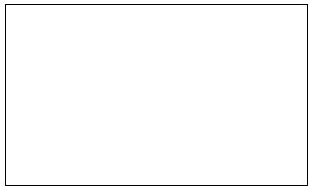
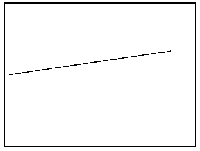
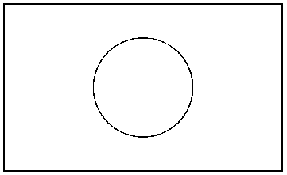
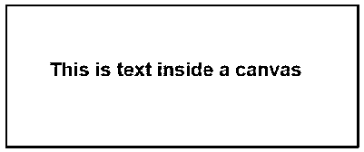
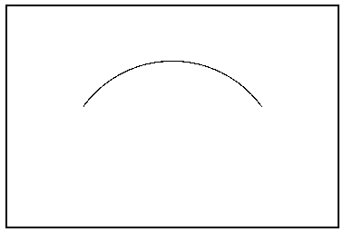
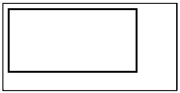
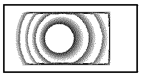

# HTML 画布

> 原文：<https://www.educba.com/html-canvas/>


## HTML 画布介绍

本文将在 HTML 画布上看到一个轮廓；众所周知，HTML 是一种标记语言。为了向访问者展示信息，你可以编写 HTML 来显示文本以及如何显示，例如字体大小、颜色、方向等。当涉及到为页面添加视觉效果时，您需要将图像链接并嵌入到页面中，这些图像与主机上的 HTML 文件分开存储。

但是如果你需要在页面上画点什么呢？

<small>网页开发、编程语言、软件测试&其他</small>

### 什么是 HTML 画布？

HTML canvas(通过

<canvas>标签使用)是一个 HTML 元素，用于绘制图形(线条、条形图、图表等)。)在用户计算机屏幕上快速显示。不过，canvas 元素只是一个信息容器；绘图是通过 JavaScript 完成的。所有支持 HTML5 的现代 web 浏览器都支持它，并且可以呈现 JavaScript。创建一个 HTML 画布非常简单，您可以通过下面的方法将它添加到任何 HTML 页面的中。</canvas>

**语法:**

```
<canvas id="example" width="200" height="200">
*Content here*
</canvas>
```

您可以通过宽度和高度属性定义画布大小；元素 ID 也可以在标签中定义，这使得在 canvas 元素上使用 CSS 样式成为可能。以下是如何使用 Canvas 元素绘制矩形的示例:

**代码:**

```
<html>
<head>
<style>
#examplecanvas{border:2px solid green;}
</style>
</head>
<body>
<canvas id = "examplecanvas" width = "500" height = "300"></canvas>
</body>
</html>
```

**输出:**




### HTML 画布绘制示例

现在，您已经看到了如何使用 canvas 元素绘制矩形，让我们来看看可以在浏览器输出屏幕上使用该元素绘制的其他一些对象。

#### 1.在纸上画一条线

moveTo()、stroke()和 lineTo()是可用于在网页上绘制直线的方法。可以猜到，moveTo()告诉光标在元素空间中的位置，lineTo()是告诉线条端点的方法。笔画()使线条可见。以下是代码供您参考:

**代码:**

```
<!DOCTYPE html>
<html lang="en">
<head>
<title>Canvas Line Example</title>
<style>
canvas {
border: 2px solid black;
}
</style>
<script>
window.onload = function() {
var canvas = document.getElementById("examplecanvas");
var context = canvas.getContext("2d");
context.moveTo(10, 150);
context.lineTo(350, 100);
context.stroke();
};
</script>
</head>
<body>
<canvas id="examplecanvas" width="400" height="300"></canvas>
</body>
</html>
```

**输出:**




#### 2.在 HTML 画布上画一个圆

与矩形不同，JavaScript 中没有特定的方法来画圆。相反，我们可以使用 arc()方法，该方法用于绘制圆弧，以在画布中绘制一个圆。要获得一个上面有一个圆的画布，可以使用下面的方法:

**语法:**

```
context.arc(centerX, centerY, radius, 0, 2 * Math.PI, false);
```

以下是一个带有圆圈的页面示例:

**代码:**

```
<html lang="en">
<head>
<meta charset="utf-8">
<title>Canvas with a circle</title>
<style>
canvas {
border: 3px solid red;
}
</style>
<script>
window.onload = function() {
var canvas = document.getElementById("examplecanvas");
var context = canvas.getContext("2d");
context.arc(250, 150, 90, 0, 2 * Math.PI, false);
context.stroke();
};
</script>
</head>
<body>
<canvas id="examplecanvas" width="500" height="300"></canvas>
</body>
</html>
```

**输出:**




#### 3.在 HTML 画布中绘制文本

文本也可以在 HTML 画布中绘制。要将文本放到画布上，可以使用 filltext()方法。下面是一个在 canvas 元素中包含文本的 HTML 页面示例:

**代码:**

```
<html lang="en">
<head>
<meta charset="utf-8">
<title>canvas with text inside the element</title>
<style>
canvas {
border: 3px solid red;
}
</style>
<script>
window.onload = function() {
var canvas = document.getElementById("examplecanvas");
var context = canvas.getContext("2d");
context.font = "bold 28px Arial";
context.fillText("This is text inside a canvas", 60, 100);
};
</script>
</head>
<body>
<canvas id="examplecanvas" width="500" height="200"></canvas>
</body>
</html>
```

**输出:**




#### 4.在 HTML 画布中绘制弧线

正如我们在讨论圆形时所讨论的，有一个名为 arc()的方法用于在 HTML Canvas 中绘制弧线。下面是该方法的语法，您只需添加变量:

```
context.arc(centerX, centerY, radiusOfArc, startAngle, endAngle, counterclockwise);
```

下面是一个在 canvas 元素中有一条弧线的 HTML 页面:

**代码:**

```
<html lang="en">
<head>
<meta charset="utf-8">
<title>Arc inside an HTML Canvas</title>
<style>
canvas {
border: 3px solid red;
}
</style>
<script>
window.onload = function() {
var canvas = document.getElementById("examplecanvas");
var context = canvas.getContext("2d");
context.arc(300, 300, 200, 1.2 * Math.PI, 1.8 * Math.PI, false);
context.stroke();
};
</script>
</head>
<body>
<canvas id="examplecanvas" width="600" height="400"></canvas>
</body>
</html>
```

**输出:**




#### 5.绘制线性或圆形颜色渐变

您可以使用此方法创建 LienearGradient()来在 canvas 元素中绘制您选择的渐变。使用这种方法，您必须使用 addColorStop()来表示渐变颜色。

**语法:**

```
var gradient = context.createLinearGradient(startX, startY, endX, endY);
```

这是一个具有线性渐变的页面:

**代码:**

```
<html>
<body>
<canvas id="examplecanvas" width="400" height="200" style="border:2px solid red;">
If you are seeing this. the browser does not support the HTML5 canvas.</canvas>
<script>
var c = document.getElementById("examplecanvas");
var ctx = c.getContext("2d");
var gradient = ctx.createLinearGradient(0,0,200,0);
gradient.addColorStop(0,"green");
gradient.addColorStop(1,"red");
ctx.fillStyle = gradient;
ctx.fillRect(10,10,300,150);
</script>
</body>
</html>
```

**输出:**




同样，绘制圆形渐变的方法是 createRadialGradient()。

**语法:**

```
var gradient = context.createRadialGradient(startX, startY, startingRadius, endX, endY, endingRadius);
```

**代码:**

```
<html>
<body>
<canvas id="examplecanvas" width="200" height="100" style="border:2px solid red;">
If you are seeing this. the browser does not support the HTML5 canvas. </canvas>
<script>
var c = document.getElementById("examplecanvas");
var ctx = c.getContext("2d");
var gradient = ctx.createRadialGradient(80,50,10,100,50,90);
gradient.addColorStop(0,"blue");
gradient.addColorStop(1,"yellow");
ctx.fillStyle = gradient;
ctx.fillRect(10,10,150,80);
</script>
</body>
</html>
```

**输出:**




### 结论

现在你已经熟悉了它是什么，以及如何在网页中使用它，你应该对你的网页设计技巧更有信心了。虽然在某些情况下可以使用图像，但 HTML canvas 的好处是它是可伸缩的，并且在大小和处理能力方面更轻便。

### 推荐文章

这是一个 HTML 画布指南。这里我们讨论什么是 HTML Canvas 及其示例，以及代码实现和输出。您也可以浏览我们推荐的文章，了解更多信息——

1.  [HTML 样式属性](https://www.educba.com/html-style-attribute/)
2.  [HTML vs HTML5](https://www.educba.com/html-vs-html5/)
3.  [HTML 面试问题](https://www.educba.com/html-interview-questions/)
4.  [HTML 音频标签](https://www.educba.com/html-audio-tag/)


