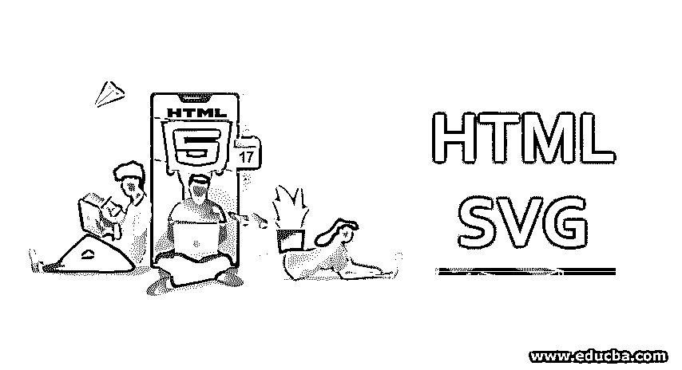
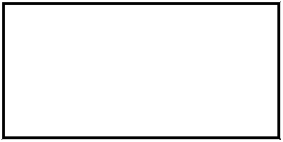
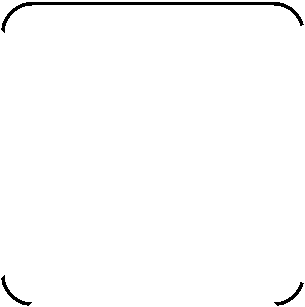
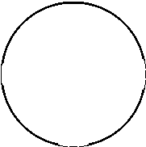
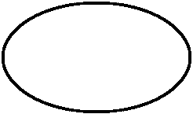
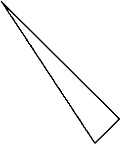
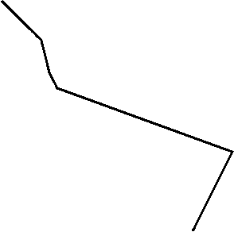
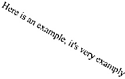
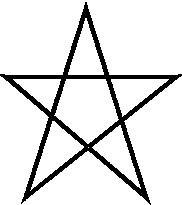
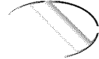

# HTML SVG

> 原文：<https://www.educba.com/html-svg/>




## HTML SVG 简介

在 HTML 中使用图像对于多媒体丰富的网站来说是很棒的。你所要做的就是在 HTML 代码中添加一个标签，viola，你的浏览器会显示甚至添加一个链接到你选择的图片。当您知道图像或图表将被放大时，这有点麻烦，因为一旦放大超过分辨率，JPG 或 PNG 将不会显示任何进一步的细节。SVG 是这个问题的解决方案。SVG 代表可缩放矢量图形。顾名思义，这些可以根据需要放大，细节永远不会消失。SVG 并不是 web 技术的专利，但是在 HTML 中使用它们真的很棒。

SVG 对于浏览器中的图表、向量、图表和图形非常有用。

<small>网页开发、编程语言、软件测试&其他</small>

**在 HTML 中嵌入 SVG 的语法:**

类似于在 HTML5 中使用 [canvas，有一个简单的标签可以用来在 HTML5 页面中嵌入 SVG。](https://www.educba.com/what-is-html5/)

语法如下:

```
<svg width="width here" height="height here ">
…. …. …. ….
</svg>
```

### HTML 中的 SVG 示例

让我们来看一些可以在 HTML5 中创建和嵌入的示例向量:

#### 示例 1——通过 HTML 中的 SVG 绘制一个矩形

**代码:**

```
<!DOCTYPE html>
<html>
<body>
<svg width="500" height="600">
<rect width="400" height="200" style="fill:rgb(0,0,200);stroke-width:5;stroke:rgb(255,0,0)"/>
Sorry but this browser does not support inline SVG.
</svg>
</body>
</html>
```

**输出:**




#### 示例 2——在 SVG 中画一个圆角正方形

对于带圆角的正方形，除了正方形的大小和尺寸之外，我们还必须使用 rx，ry 来定义角的半径。

**代码:**

```
<!DOCTYPE html>
<html>
<body>
<svg width="500" height="500">
<rect x="100" y="100" rx="30" ry="30" width="300" height="300" style= "fill:green stroke:blue; stroke-width:5 ; opacity:0.5" />
Sorry but this browser does not support inline SVG.
</svg>
</body>
</html>
```

**输出:**




#### 例 3——用 SVG 画一个圆，里面有轮廓和颜色填充

**代码:**

```
<!DOCTYPE html>
<html>
<body>
<svg width= "400" height= "400">
<circle cx= "100" cy= "100" r="90" stroke= "red" stroke-width="1" fill="grey" />
Sorry but this browser does not support inline SVG.
</svg>
</body>
</html>
```

**输出:**




#### 示例# 4–在 HTML5 中用 SVG 画一条直线

我们可以用<line>标签在 HTML5 SVGs 中画一条直线；可以定义颜色、线条粗细和位置。</line>

**代码:**

```
<html>
<body>
<svg width= "400" height= "400">
<line x1 = "5" y1 = "5" x2 = "300" y2 = "300" style = "stroke:yellow; stroke-width:3"/>
</svg>
</body>
</html>
```

**输出:**


#### 示例 5——在 HTML5 中通过 SVG 绘制 eclipse

我们可以使用<eclipse>标签在 HTML5 SVGs 中画一个日蚀；它的颜色和位置可以用它的半径来定义。</eclipse>

**代码:**

```
<!DOCTYPE html>
<html>
<body>
<svg height="300" width="300">
<ellipse cx="150" cy="100" rx="120" ry="70" style="fill:brown; stroke:green; stroke-width:3" />
Sorry but this browser does not support inline SVG.</svg>
</body>
</html>
```

**输出:**




#### 示例# 6–在 HTML5 中使用 SVG 创建多边形

标签<polygon>可以在 SVG 中用来创建多边形。在标签中，我们需要提到每个点的位置。填充颜色、轮廓粗细等。，也可以在代码中定义。</polygon>

**代码:**

```
<!DOCTYPE html>
<html>
<body>
<svg height="300" width="600" >
<polygon points="10,10 250,250 200,300" style="fill: red; stroke: black; stroke-width: 2" />
Sorry but this browser does not support inline SVG. </svg>
</body>
</html>
```

**输出:**




#### 示例# 7-**在 HTML5 中用 SVG 创建折线**

折线用于绘制仅由直线组成的形状。请记住，这些线路也必须连接。下面是 HTML5 中折线实现的一个例子。

**代码:**

```
<!DOCTYPE html>
<html>
<body>
<svg height="300" width="600">
<polyline points="10,10 60,60 70,100 80,120 300,200 250,300" style="fill: none; stroke: black; stroke-width: 3" />
Sorry but this browser does not support inline SVG. </svg>
</body>
</html>
```

**输出:**




#### 示例# 8–在 HTML5 中用 SVG 绘制文本

在许多情况下，文本对于任何 SVG 都是必需的，比如标记图表等。幸运的是，SVG 中存在一个可以使用的<text>标签。文本可以设置在 SVG 中的任何位置，您也可以定制它的颜色和其他细节。</text>

**代码:**

```
<!DOCTYPE html>
<html>
<body>
<svg height="300" width="500">
<text x="10" y="20" fill="purple" transform="rotate(30 20,40)">Here is an example, it's very examply </text>
Sorry but this browser does not support inline SVG. </svg>
</body>
</html>
```

**输出:**




#### 示例# 9–在 HTML5 中用 SVG 绘制星形

现在我们已经完成了基本的工作，让我们在 SVG 的帮助下创建一个星星。

**代码:**

```
<!DOCTYPE html>
<html>
<body>
<svg width="400" height="400">
<polygon points="110,10 50,198 200,78 30,78 170,198"
style="fill:orange; stroke:green; stroke-width:5; fill-rule:evenodd;" />
Sorry but this browser does not support inline SVG. </svg>
</body>
</html>
```

**输出:**




#### 示例# 10–在 SVG 中使用线性渐变

你可以在 SVG 多线 HTML 画布中使用线性和径向渐变。渐变必须嵌套在<defs>标签中。然后在 SVG 标签中标记这个标签，以表示它的用法。让我们看一个在 eclipse 中使用渐变的例子。</defs>

**代码:**

```
<!DOCTYPE html>
<html>
<body>
<svg height="300" width="400">
<defs>
<linearGradient id="gr1" x1="0%" y1="60%" x2="100%" y2="0%">
<stop offset="5%" style="stop-color:rgb(255,255,3);stop-opacity:1" />
<stop offset="100%" style="stop-color:rgb(255,0,0);stop-opacity:1" />
</linearGradient>
</defs>
<ellipse cx="125" cy="150" rx="100" ry="60" fill="url(#gr1)" />
Sorry but this browser does not support inline SVG. </svg>
</body>
</html>
```

**输出:**




### 结论

在需要使用图表的网站中，SVG 是救星。除了可伸缩性之外，大多数现代 web 浏览器也支持 SVG。使用 SVG 的另一个好处是它的文件大小。因为它只是一点代码，所以与传统图像相比，SVGs 占用的内存和带宽非常少。

### 推荐文章

这是一个 HTML SVG 的指南。在这里，我们讨论了 HTML SVG 的基本概念和前 10 个例子，并给出了解释和代码实现。您也可以阅读以下文章，了解更多信息——

1.  [Html5 新元素](https://www.educba.com/html5-new-elements/)
2.  [HTML 块](https://www.educba.com/html-blocks/)
3.  [HTML 框架](https://www.educba.com/html-frames/)
4.  [HTML 中的光标](https://www.educba.com/cursor-in-html/)


