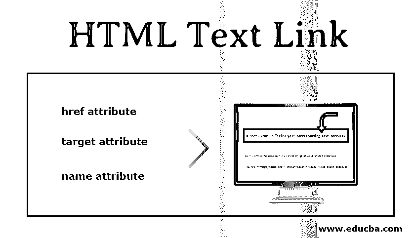

# HTML 文本链接

> 原文：<https://www.educba.com/html-text-link/>




## HTML 文本链接简介

HTML 链接可以是链接，也可以是超链接。这用于重定向到另一个页面、图像、网站；它可以是任何东西。他们还习惯于在同一页面上浏览特定部分。他们过去只需点击就能呈现数据和文档。我们只是将文档、图像、url 或数据包装在文本中。它还可以指向同一页面或不同页面上的文件、对象或任何内容，这取决于需求。当我们将鼠标悬停在 [HTML 链接上时，它会将](https://www.educba.com/what-is-html/)光标变为某个不同的图标。我们可以在文章的下一部分讨论它们是如何工作的以及如何创建它们。在这个主题中，我们将学习 HTML 文本链接。

【HTML 链接的语法

<small>网页开发、编程语言、软件测试&其他</small>

我们可以按照下面的语法创建我们的第一个 HTML 链接。在下面给定的语法中，我们将使用不同的标签、属性以及它们相应的属性。

```
<a href="your url">Link your corresponding text here</a>
```

在上面的语法中，我们使用 anchor 标签来创建一个 html 链接或超链接。我们将详细讨论这个锚标记。

锚定标签是一种标签，通过它我们可以附加或链接我们的文本、短语或单词来创建外部或内部链接。通过使用锚定标签，我们在页面中创建 URL，可用于导航到任何其他页面、网站或页面上的同一部分。

通过使用 anchor 标签，我们有下面提到的许多优点。

*   组织:它有助于组织我们的数据。我们不需要制作几个网页，也不需要为了管理的目的把我们的数据分成块；我们可以很容易地将数据组织在一个地方。
*   **无滚动:**通过使用 html 链接或 html 内部链接，我们不需要担心在非常长的页面上滚动；我们只需点击该链接即可找到所需的页面。因此，很容易在页面上找到任何数据或部分。

### 如何创建锚点标签？

你可以在上面的语法中看到，我们现在已经在那边使用了这么多东西；我们将进一步了解如何创建以及它是如何工作的。

基本上，它由三个不同的部分(属性)组成:

1.  href 属性
2.  目标属性
3.  名称属性

#### 1.href 属性

Href 属性代表超文本参考。假设我们想要创建一个超链接，那么第一个要求是一个文档地址，可以是任何像另一个网站，任何文件，如 PDF 等。

比如说:

```
<a href="http://www.google.com">Google</a>
```

在这个 http://www.google.com 中，是我们赋予 href 属性的值。因此，每当我们点击谷歌，它会将我们重定向到谷歌主页链接。因此，href 属性包含文档地址。我们也可以提到我们自己的 HTML 链接到 href。

例如

```
<a href="demo.html">My page</a>
```

#### 2.目标属性

目标属性定义文档将如何打开。它有很多种类型，我们可以根据自己的需要来使用。

*   _parent:它只是在父框架中打开附加的文档。
*   _blank:在新标签页或窗口中打开文档。
*   _top:在整个窗口中打开附件。
*   _self:它在单击文档的同一窗口或同一选项卡中打开文档。默认情况下，此目标处于启用状态。我们可以修改如下:

```
<a href="http://www.demo.com" target="_blank" rel="noopener">Your Link text</a>
```

这里 target="_blank "是使用它的语法。

#### 3.名称属性

name 属性用于跳转或导航到页面上的某个点；当我们有一个包含如此多内容的 VRU 大页面时，这是非常有用的。这有助于在不滚动的情况下保存用户发现和时间。语法如下:

```
<a name="to end"></a> or
```

在这种情况下，只需点击进入页面末尾，无需向下滚动。

```
<a href="#SomeSection">Section</a>
```

这个浏览器将识别这个部分，但是我们需要在 name 属性中使用(#)。

```
<a href="otherpage.html#title">Link your text</a>
```

由此，我们可以在内部引用另一个页面的“标题”。这里也需要在页面地址的末尾使用(#)。

### HTML 链接颜色

我们还可以为我们的 html 链接提供颜色。默认情况下，链接颜色有三种状态:这将出现在所有浏览器中。

*   **活动链接:**当我们点击任何链接时，它会变成一个带下划线的红色活动链接。
*   **未访问的链接:**未访问的链接的标准浏览器默认颜色是蓝色并带下划线。
*   **访问过的链接:**这些是紫色带下划线的。

但是我们也可以使用下面的语法为链接提供自定义颜色。我们可以按照这种不同的类型为我们的链接提供颜色。但是我们在这里使用的是内联 CSS 如果您愿意，也可以创建外部 CSS。

*   直接提供颜色的名称。
*   通过使用十六进制颜色代码。
*   通过使用 rgb()和 rgba()值。
*   通过使用 hsl 和 hsla()值。

```
<a href="http://demo.com/" style="color:blue;">Red Link</a> In this, we can directly specify the color name into the style attribute. This is an inline CSS.
```

```
<a href="http://demo.com/" style="color:#FF0000;">Red color code</a>
```

这里我们使用颜色代码来指定颜色。(十六进制颜色代码)

```
<a href="http://demo.com/" style="color:rgb(255,0,0);">Red color</a>
```

我们还可以使用 RGB()值来指定链接的颜色。我们可以通过使用 rgb()来控制颜色的不透明度。

```
<a href="http://demo.com/" style="color:rgba(255,0,0,0.4);">Red color</a>
```

我们可以用 rgba()替换 rbg()，但是我们需要为 transparency 和 opaque 指定第四个值。

```
<a href="http://demo.com/" style="color:hsl(0,10%,50%);">Red color</a>
```

我们也可以使用 HSL t 颜色我们的链接。HSL 基本上代表色调、饱和度和亮度。我们也可以使用指定颜色的 hsla，但是我们需要在 HSLA()中再提供一个参数。

### 结论–HTML 文本链接

所以在排序中，我们使用锚标签及其属性来创建 HTML 中的超链接或链接。HREF 包含文档的地址，即负责处理文档的目标。我们也可以使用内联或外部 CSS 给链接着色。

### 推荐文章

这是一个 HTML 文本链接的指南。这里我们讨论如何创建一个带有 HTML 链接颜色和 HTML 链接语法的锚标签。您也可以看看以下文章，了解更多信息–

1.  [HTML 文本编辑器](https://www.educba.com/html-text-editors/)
2.  [HTML 中的图片链接](https://www.educba.com/image-link-in-html/)
3.  [HTML 表单控件](https://www.educba.com/html-form-controls/)
4.  [Html 版本](https://www.educba.com/versions-of-html/)


