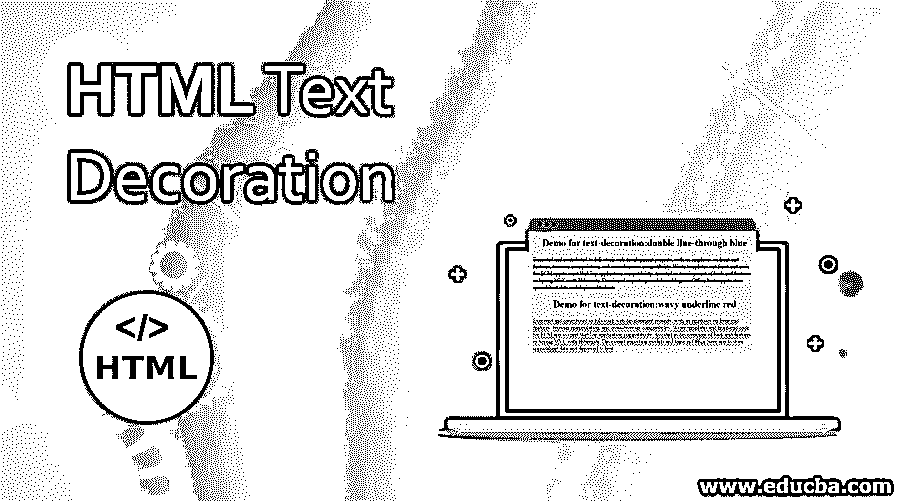
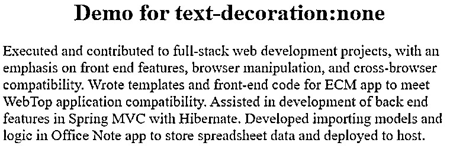
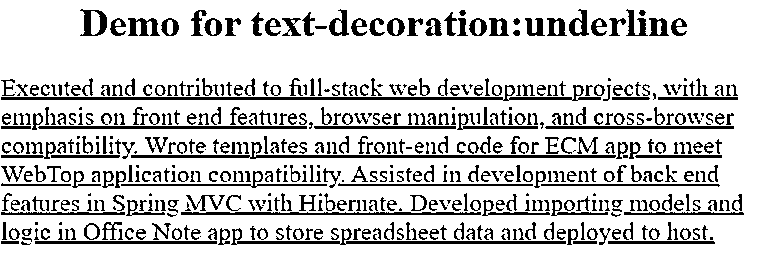
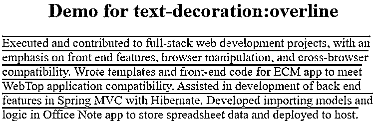
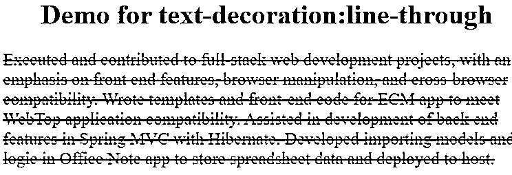
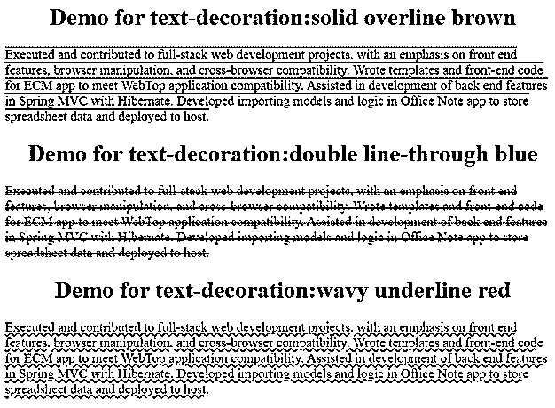

# HTML 文本装饰

> 原文：<https://www.educba.com/html-text-decoration/>




## HTML 文本装饰介绍

HTML 中的文本装饰，用于以不同的方式装饰文本。文本装饰是用于文本装饰的属性。text-decoration 属性采用下划线、上划线、划线、下划线上划线值来以不同的方式修饰文本。

**实时示例:**在确认登录用户是人类还是机器人时，使用文本修饰的上划线、下划线、划线值来生成验证码。因为如果文本上方的线条不能被机器人完美识别。

<small>网页开发、编程语言、软件测试&其他</small>

**类型:**

*   文字-装饰:无；
*   文本-装饰:上划线；
*   文本-装饰:线条-通过；
*   文本装饰:下划线；

### HTML 中的文本修饰是如何工作的？

文本装饰属性基于无、上划线、划线和下划线

**1。无**

**语法:**

```
text-decoration: none;
```

**说明:**不会给文字任何修饰。它就像一个普通的文本。

**2。上划线**

**语法:**

```
text-decoration: overline;
```

**解释:**它会在文本上方给出一条 1px 大小的线。

**3。直通线**

**语法:**

```
text-decoration: line-through;
```

**说明:**它会给出从文本中间开始的行，大小为 1px。

**4。下划线**

**语法:**

```
text-decoration: underline;
```

**说明:**会在文字底部给出一条 1px 大小的线。

**5。闪烁**

**语法:**

```
text-decoration: blink;
```

**说明:**会让文字从不透明度 0%到 100%用不同颜色闪烁。

**Note:** The recent browser’s blink feature is deprecated. Now it is not used at all.

文本装饰属性还可以用不同于默认样式(如虚线、波浪线、实线、凹槽等)来制作上划线、划线、下划线。，带颜色。你可以看到下面的语法。

**语法:**

```
text-decoration: underline dotted red;
```

### HTML 文本修饰的例子

以下是 HTML 文本修饰的示例:

#### 示例 1–无

**代码:**

```
<!DOCTYPE html>
<html>
<head>
<style>
h1 {
text-align:center;
color:green;
}
.none {
text-decoration: none;
font-size:20px;
}
}
</style>
</head>
<body>
<h1>Demo for text-decoration:none</h1>
<p class="none">
Executed and contributed to full-stack web development projects, with an emphasis on front end
features, browser manipulation, and cross-browser compatibility. Wrote templates and front-end code for ECM app to meet WebTop application compatibility.
Assisted in the development of back end features in Spring MVC with Hibernate. Developed importing models and logic in the Office Note app to store spreadsheet data and deployed
to host.
</p>
</body>
</html>
```

**输出:**




**说明:**如你所见，text-decoration: none 不能对段落文本进行任何线条修饰。

#### 示例 2–下划线

**代码:**

```
<!DOCTYPE html>
<html>
<head>
<style>
h1 {
text-align:center;
color:green;
}
.underline {
text-decoration: underline;
font-size:20px;
}
}
</style>
</head>
<body>
<h1>Demo for text-decoration:underline</h1>
<p class="underline">
Executed and contributed to full-stack web development projects, with an emphasis on front end
features, browser manipulation, and cross-browser compatibility. Wrote templates and front-end code for ECM app to meet WebTop application compatibility.
Assisted in development of back end features in Spring MVC with Hibernate. Developed importing models and logic in Office Note app to store spreadsheet data and deployed
to host.
</p>
</body>
</html>
```

**输出:**




**解释:**如你所见，文本修饰:下划线给出文本下面的线条。

#### 示例 3–上划线

文本装饰:上划线示例:

**代码:**

```
<!DOCTYPE html>
<html>
<head>
<style>
h1 {
text-align:center;
color:green;
}
.overline{
text-decoration: overline;
font-size:20px;
}
}
</style>
</head>
<body>
<h1>Demo for text-decoration:overline</h1>
<p class="overline">
Executed and contributed to full-stack web development projects, with an emphasis on front end
features, browser manipulation, and cross-browser compatibility. Wrote templates and front-end code for ECM app to meet WebTop application compatibility.
Assisted in development of back end features in Spring MVC with Hibernate. Developed importing models and logic in Office Note app to store spreadsheet data and deployed
to host.
</p>
</body>
</html>
```

**输出:**




**解释:**如你所见，text-decoration: overline 在文本上方给出线条。

#### 示例# 4–线路直通

文本装饰:划线示例:

**代码:**

```
<!DOCTYPE html>
<html>
<head>
<style>
h1 {
text-align:center;
color:green;
}
.through {
text-decoration: line-through;
font-size:20px;
}
}
</style>
</head>
<body>
<h1>Demo for text-decoration:line-through</h1>
<p class="through">
Executed and contributed to full-stack web development projects, with an emphasis on front end
features, browser manipulation, and cross-browser compatibility. Wrote templates and front-end code for ECM app to meet WebTop application compatibility.
Assisted in development of back end features in Spring MVC with Hibernate. Developed importing models and logic in Office Note app to store spreadsheet data and deployed
to host.
</p>
</body>
</html>
```

**输出:**




**解释:**如你所见，text-decoration: line-through 从文本中间给出线条。

#### 实施例 5

带有实线、双线、带下划线的波浪线、划线、上划线的文本装饰示例:

**代码:**

```
<!DOCTYPE html>
<html>
<head>
<style>
h1 {
text-align:center;
color:green;
}
.p1 {
text-decoration:solid overline brown;
font-size:18px;
}
.p2 {
text-decoration:double line-through blue;
font-size:18px;
}
.p3 {
text-decoration:wavy underline red;
font-size:18px;
}
}
</style>
</head>
<body>
<h1>Demo for text-decoration:solid overline brown</h1>
<p class="p1">
Executed and contributed to full-stack web development projects, with an emphasis on front end
features, browser manipulation, and cross-browser compatibility. Wrote templates and front-end code for ECM app to meet WebTop application compatibility.
Assisted in development of back end features in Spring MVC with Hibernate. Developed importing models and logic in Office Note app to store spreadsheet data and deployed
to host.
</p>
<h1>Demo for text-decoration:double line-through blue</h1>
<p class="p2">
Executed and contributed to full-stack web development projects, with an emphasis on front end
features, browser manipulation, and cross-browser compatibility. Wrote templates and front-end code for ECM app to meet WebTop application compatibility.
Assisted in development of back end features in Spring MVC with Hibernate. Developed importing models and logic in Office Note app to store spreadsheet data and deployed
to host.
</p>
<h1>Demo for text-decoration:wavy underline red</h1>
<p class="p3">
Executed and contributed to full-stack web development projects, with an emphasis on front end
features, browser manipulation, and cross-browser compatibility. Wrote templates and front-end code for ECM app to meet WebTop application compatibility.
Assisted in development of back end features in Spring MVC with Hibernate. Developed importing models and logic in Office Note app to store spreadsheet data and deployed
to host.
</p>
</body>
</html>
```

**输出:**




**解释:**如你所见，第一段有实线上划线，第二段有双线，第三段有波浪下划线文本修饰样式。

### 结论

文本装饰可以通过上划线、下划线、线条属性值以及任何颜色的不同线条样式来设置样式。

### 推荐文章

这是一个 HTML 文本修饰的指南。在这里，我们讨论介绍，文本装饰如何在 HTML 中工作，类型和例子，以及语法，代码和输出。您也可以浏览我们推荐的其他文章，了解更多信息——

1.  [HTML 块元素](https://www.educba.com/html-block-elements/)
2.  [HTML 网页图标](https://www.educba.com/html-favicon/)
3.  [HTML 内嵌块](https://www.educba.com/html-inline-block/)
4.  [HTML 隐藏元素](https://www.educba.com/html-hide-element/)


