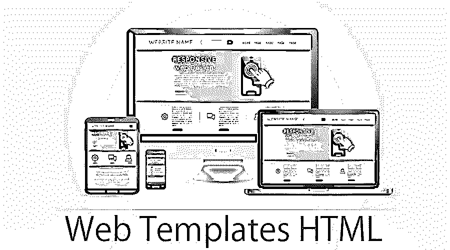
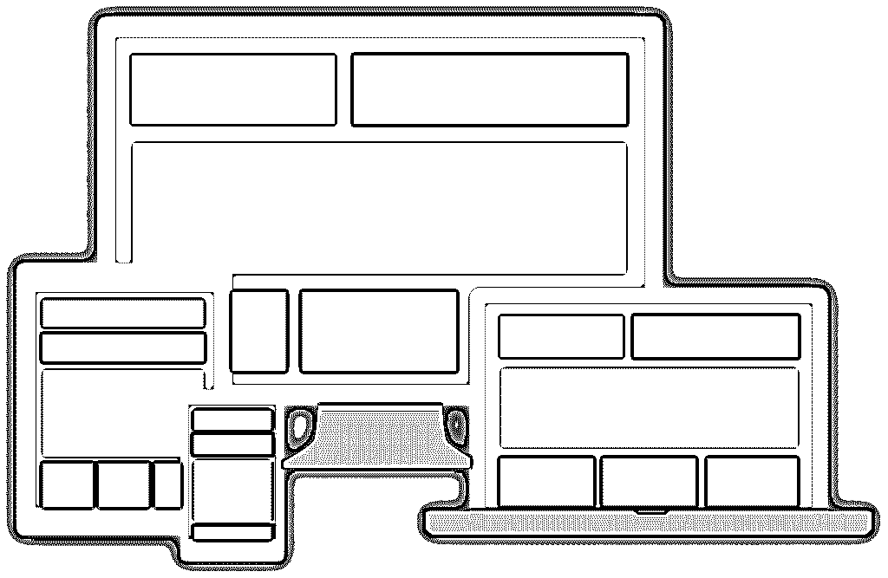
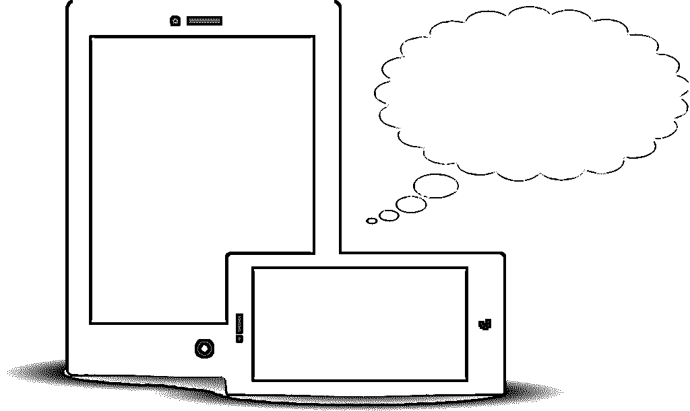

# Web 模板 HTML

> 原文：<https://www.educba.com/web-templates-html/>

## Web 模板简介 HTML

作为一个初学网页设计的人，网页模板 HTML 是必不可少的。但不是免费的模板；如果你对[网页设计](https://www.educba.com/web-designing-tools/)很认真的话，网页模板 HTML 最好买，因为免费的模板太普通了，而且范围有限。

但是为什么要使用网页模板呢？毕竟，一个网页设计师必须能够从头开始，一段一段地创建一个网站。

<small>网页开发、编程语言、软件测试&其他</small>

虽然这是一个专业的、有经验的网页设计者所期望的，初学者和学习者最好从网页模板 HTML 开始，原因如下:

*   **你通过调整模板来学习:**你可以通过调整 web 模板代码来学习很多关于编码的知识。模板必须改变，以适应你的网站，这样做可以让你很好地了解代码是如何工作的。
*   **你可以做一个质量很好的网站:**从[从头开始编码](https://www.educba.com/scratch-programming-examples/)对于一个初学者来说是一项雄心勃勃的任务，很有可能最终的结果不会像专业制作的网站那样像样。另一方面，使用模板构建网站给了你一个良好的开端，最终，你会拥有一个像样的、值得你骄傲的网站。此外，它给你未来的项目带来了良好的势头。
*   **你接触到真实世界的编码:**如果你只是从编码的理论和基本实践环节跳到你的第一个网站项目，你可能会惊讶地发现模板中的一些真实世界的编码方面。假设你购买了一个高质量的模板，你将会看到一个编码良好的高质量标记和高度组织化的 CSS。它是一个 g0，体验前端设计的真实世界。

### 网站模板到底是什么？

网站模板或网页模板 HTML 本质上是预先设计好的网页，任何人都可以使用。只需将您自己的 web 模板图像和文本添加到模板中，并将其保存为您自己的网页。模板通常是用 CSS 和 HTML 代码构建的，允许你建立一个专业级的网站，而不需要雇佣专业的网页设计公司或开发者。

CSS 和 HTML 是纯文本代码语言，用于 web 浏览器呈现网站和页面。当前的 web 标准是 CSS3 和 HTML5，由万维网联盟(W3C)更新和维护。

### 模板包括什么？

模板可以包含许多元素。您可以添加文本、CSS3 和 jQuery 动画、PNG、GIF 和 JPG 图像、联系表单、购物车、幻灯片等等。设计和代码因供应商而异。一般来说，查看模板是否已经包含了网站所需的应用程序、脚本和功能是很好的。这使您更容易调整模板，而不是编写自己的代码，这些代码可能无法使用或不适合 web 模板代码。

多页模板通常带有主页、联系我们页面、产品详情页面、产品列表页面和/或更多页面，例如展示页面、电子商务页面和博客页面。您也可以根据需要下载单页模板。

### 什么是不同类型的网页模板？

他们的源网站模板可以分为包含在专有 web builder 界面中的模板，包含在 HTML 编辑程序中的模板，或者在单独的 zip 文件下载中可用的模板。根据设计和配置，模板可以分为自适应、静态或响应型。最后，根据文件扩展名类型，它们可能是 PHP、ASP、HTML 或 HTM。然而，在所有情况下，它们都是用 HTML 和 CSS 构建的，这是关键，因为这意味着您可以调整它们，而不考虑它们的分类。

**推荐课程**

*   [免费 Python 培训课程](https://www.educba.com/software-development/courses/python-certification-course/)
*   [在线免费软件测试课程](https://www.educba.com/software-development/courses/selenium-training-certification/)
*   [免费 Java 培训](https://www.educba.com/software-development/courses/java-course/)

#### 1.移动/响应 Web 模板移动

Web 模板 HTML 有多种形状和大小，最好选择一种可以在移动设备上查看的模板。随着每年越来越多的人使用移动设备浏览互联网，创建一个移动友好、响应迅速的网站已经成为一种需要，而不是奢侈品。要制作一个，选择一个具有响应设计的模板，并通过谷歌手机友好测试。

有不同类型的移动网站模板:

*   响应式设计
*   适应性设计
*   移动和移动优化
*   旧网站的移动升级

#### 2.适应性设计

这种 web 模板类型类似于 web 模板响应式，通常包括媒体查询 CSS 代码，很像响应式设计模板。然而，两者之间的主要区别在于，自适应设计专门针对移动设备、平板电脑和桌面设备，分别采用一套新的网站或全新的设计。该设备在被检测时使用，ASP、PHP、jQuery 或 CSS 将用于将查看者重定向到为其设备配置的单独页面。

#### 3.网站建设计划

GoDaddy、Squarespace、Weebly、Wix 等服务都提供了自己专有的网站编辑程序，供用户通过网络浏览器在线编辑自己的网站。这些程序也有自己的网站模板库，你可以利用。选择这些程序既方便又容易，因为你把所有的东西都放在一个地方。

但是，请记住，除非通过该程序，否则您无法访问您在其他任何地方创建的网站和页面，并且您也无法单独备份您的工作。另一方面，如果你选择下载单独的网页模板 HTML 并在你的电脑上使用它们，你可以更自由地选择你想要使用的程序，并且你可以使用你选择的托管服务在云上备份你的项目。

#### 4.自含模板还是网站建设者？

网站建设者，网站模板建设者或内容管理系统(CMS)基本上是所有在一个专有程序，通过它你可以添加，编辑和发布你的网站。你有一个单一的界面，通过它你可以通过网络浏览器管理你的整个网站。

很多主机公司提供专有的 web builder 系统和 CMS，但是你会被锁定在主机包提供的 web 模板设计上。如果你想随时更换托管公司，你会发现迁移真的很难。搜索引擎优化也可能更难设置，以及添加动画，应用程序和其他元素，可以在没有 CMS 的其他网站上看到。事实上，您可以修改的 web 模板代码很可能是有限的。

由于这些原因，大型定制网站通常更难以通过 CMS 进行管理，在这种情况下，最好使用自包含网页模板。这些模板带有下载中包含的所有源代码和文件。此外，您可以从设计中删除或添加任何内容，这为您的网站提供了更多的可扩展性和灵活性。

#### 5.原创性问题

毫无疑问，每个人都可以下载网页模板 HTML。免费模板是公开可用的，任何有足够资金的人都可以购买他们想要的付费模板。然而，考虑到目前网站的数量，web 开发人员普遍担心，如果他们选择 web 模板，他们的网站会与其他网站过于相似。这也是一个值得关注的问题，但前提是你选择一个免费的模板或者决定不要对你的模板做太多的改动。

事实是，有数千家公司提供了数千种模板。一个浏览者偶然发现两个使用相同付费网页模板设计的网站的几率非常低。当你调整和编辑你的模板以赋予它你自己独特的风格时，它们会降得更低。选择使用全局 CSS 代码的模板，以便轻松更改布局、设计、字体和颜色。

您也不必限制自己只使用一个模板。您可以在像 Dreamweaver 这样的 HTML 程序中编辑 web 模板，并创建更多独特的页面。例如，如果你有一个主页模板，你可以在一个编辑程序中打开它，修改代码，把它变成一个博客页面或产品列表页面。然后，您可以根据需要复制该页面，创建子页面，或者创建其他页面类型并适当地命名它们。当你做这些的时候，你会越来越熟悉一个好网站的编码和代码结构。

#### 6.查找和下载模板

找到一个模板很容易。你可以在网上找到很多网页模板 HTML。即使网站建设程序或 CMS 限制了你，你也有可能至少有几百个模板可供选择，不管是免费的还是其他的。模板通常下载在包含多个文件的单个 ZIP 存档中。下载文件，打开或解压到一个单独的文件夹。根据需要重命名文件夹，然后打开它。

您可能会发现三种特定类型的文件 web 应用程序模板:

*   **一个 HTML 文件:**这是一个包含实际内容的文件，包括标题、头、文本和表示内容和图像的代码。它还包含通用模板结构。
*   CSS 文件:也称为样式表，这个文件定义了实际 HTML 文件的内容在 web 浏览器中的呈现方式。
*   **图像文件:**模板文件夹也可能包括要在网页上显示的图像文件。您可以添加或删除要显示的其他媒体文件，方法是将它们编码到 HTML 文件 web 模板中。

将模板解压缩到您的计算机上后，您可以使用 web 浏览器浏览它。当您开始处理模板时，您将编辑这些文件并通过 web 浏览器预览更改。只是在后来，该模板将被修改，以形成一个完整的网站的一部分，以在线发布。在此之前，您可以使用计算机上的本地文件通过浏览器查看和编辑模板。

#### 7.选择编辑模板的软件

有很多方法可以建立一个网站，即使你选择从一个网站模板开始。在计算机上编辑模板时，可以在两种不同类型的 web 模板编辑器之间进行选择。

第一种类型的编辑器是可视化 HTML 编辑器，它打开一个类似于 web 浏览器的模板，同时还允许您编辑内容。可视化编辑器也被称为“所见即所得”或“所见即所得”编辑器。这意味着当您键入代码、形成设计和创建内容结构时，您可以看到完整的 web 模板设计。可视化编辑器是一种编辑 web 模板的简单方法，可以给初学 web 开发的人一个好的开始。可视化编辑器的一些例子是 Style Master，它是付费的，带有几个模板，免费的 NVU 编辑器也可以在 Linux 上工作。

第二种类型的编辑器是代码编辑器，它不同于可视化编辑器，因为它显示组成网站的 CSS 和 HTML 代码，而不是向您显示模板的设计。代码本质上只是纯文本，所以理想情况下您可以使用记事本或任何基本的文本编辑器来编辑它。然而，专门的代码编辑器有工具使编辑变得更容易。例如，它为代码的不同部分赋予不同的颜色，以便您更容易识别正在编辑的内容。现在，一个网站可以有一行又一行的代码，所以编辑代码并不像使用可视化编辑器那样容易。然而，它确实让你完全控制网站设计，并帮助你理解如何在移动网站模板编码工作。

从代码编辑器开始也是学习如何编写网站代码并成为更好的 web 开发人员的好方法。Notepad++是一个很好的免费代码编辑器，它只在 Windows 上运行，但是你可以找到更多其他操作系统的具有类似功能的编辑器，比如分别用于 Linux 和 Mac 的免费 BlueFish 和 Smultron。

### 推荐文章

这是一个网站模板的 HTML 指南。在这里，我们讨论的介绍和什么是不同类型的网页模板 HTML？您可以阅读以下文章了解更多信息——

1.  [HTML 和 XML](https://www.educba.com/html-vs-xml/)
2.  [HTML 颜色名称](https://www.educba.com/html-color-names/)
3.  [自定义 Html 元素](https://www.educba.com/custom-html-element/)
4.  [HTML5 vs JavaScript](https://www.educba.com/html5-vs-javascript/)

