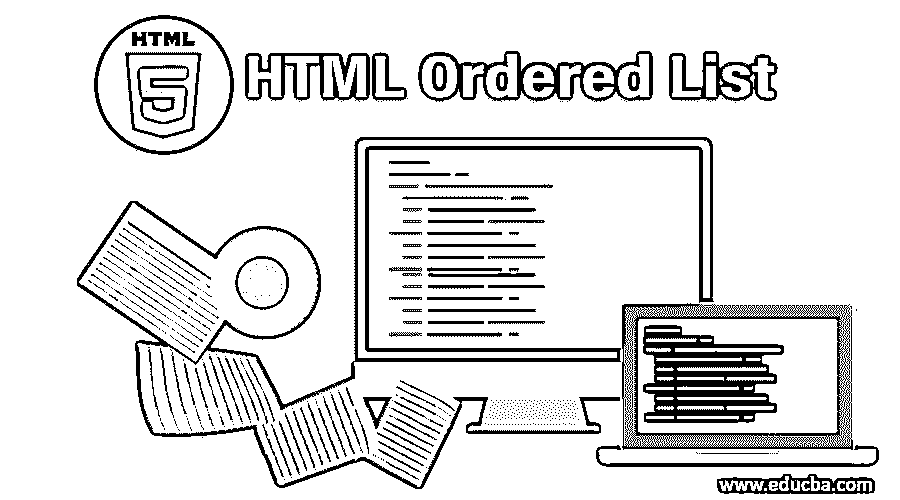
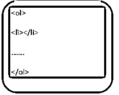
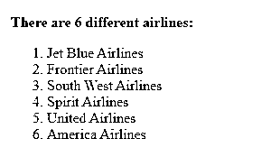
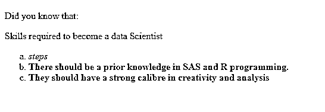
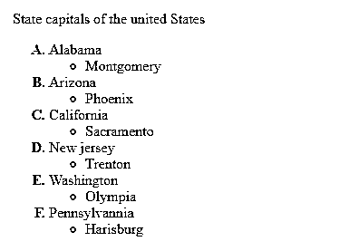
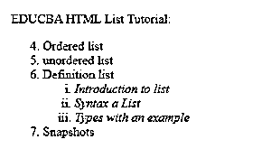
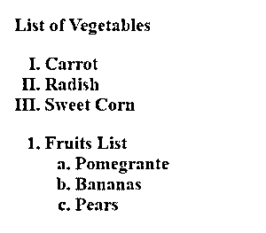
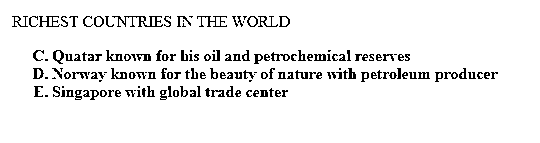
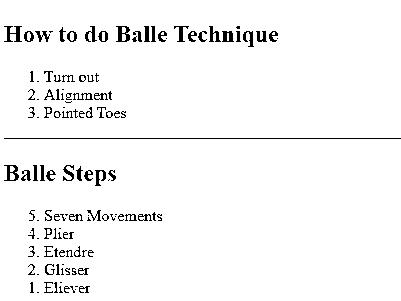

# HTML 有序列表

> 原文：<https://www.educba.com/html-ordered-list/>




## HTML 有序列表简介

在这一节中，我们将学习如何在 HTML 中实现有序列表。如何描述或显示有序列表？非常简单容易；它们用于描述内容中的信息列表。另一种技术是一个列表可以包含多个列表元素。

HTML 中的列表可以分为三种类型，它们是:

<small>网页开发、编程语言、软件测试&其他</small>

1.  有序列表
2.  无序列表
3.  定义列表

在本文中，我们将通过一个例子来研究有序列表规范。有序列表定义了创建列表时的特定有序信息；例如，它显示纵坐标信息或信息编号。

### 有序列表的语法

使用名为

标签结束。




#### 有序列表的示例

让我们看看下面提到一些例子:

**例#1**

```
<!DOCTYPE html>
<html lang="en">
<head>
<title>HTML Ordered List</title>
</head>
<body>
<p><strong>There are 6 different airlines:</strong></p>
<ol type="1">
<li>Jet Blue Airlines</li>
<li>Frontier Airlines</li>
<li>South West Airlines</li>
<li> Spirit Airlines</li>
<li> United Airlines</li>
<li>America Airlines</li> </ol>
</body>
</html>
```

**输出:**

这会给你这样的结果




**例 2**

带颜色的有序列表。在下面的例子中，我们使用了某个计数器属性，定义了自动计数列表中的

*   Item. It is just an internal [variable of CSS, which is used to enable the counting function.](https://www.educba.com/what-is-css/)

```
<!DOCTYPE html>
<html lang="en">
<head>
<title>HTML Ordered List with colors</title>
</head>
<body>
<style>
ol li {
counter-increment: list;
list-style-type: none;
position: relative;
}
ol li:before {
color: #ff0000;
content: counter(list) ".";
left: -22px;
position: absolute;
text-align: center;
width: 24px;
}</style>
<ol>
<li> Norway is a Scandinavian Country</li>
<li>Oslo is the capital city</li>
<li>norway is known for its beauty , hiking, fishing</li>
<li>Ranked among the toppest country in europe</li>
</ol><br/>
</body></html>
```

**输出:** T3】


### HTML 有序列表的属性类型

为了表示有序列表，这个标记有五种重要的属性类型。由于 HTML

#### 1.类型属性

此属性给出了列表中要使用的编号类型。

*   type = ' a '–按字母顺序排列
*   type ='A'-给出大写字母顺序
*   type = ' I '–给罗马数字小写
*   type =' I'-给出大写罗马数字

这些编号类型如下所述:

**一、属性类型='a.'**

要用小写字母列表，使用这种类型。下面的例子用小写显示了有序列表，并用斜体显示。

**举例:**

```
<!DOCTYPE html>
<html lang="en">
<head>
<title>HTML Ordered List types</title>
</head>
<body>
<style>
ol li span {
font-weight: normal;
}
</style>
<p>Did you know that:</p>
<p>Skills required to become a data Scientist</p>
<ol type="a" >
<li><i> steps</i></li>
<li><b>There should be a prior knowledge in SAS and R programming.</b></li>
<li><b>They should have a strong calibre in creativity and analysis<b></li>
</ol>
</body>
</html>
```

**输出:**




**二。属性类型='A.'**

有序列表可以具有小写字母的属性类型。下面的例子演示了如何在列表结构中使用这个属性，以及如何用粗体显示字母。要让有序列表以粗体显示，需要使用

**举例:**

```
<!DOCTYPE html>
<html>
<head>
<title> Example for Nested list</title>
</head>
<body>
<p> State capitals of the united States</p>
<style>
ol {
font-weight:bolder;
}
ol li span {
font-weight: normal;
}
</style>
<ol type="A">
<li> Alabama
<ul>
<li>Montgomery</li>
</ul>

</li>
<li>Arizona
<ul>
<li>Phoenix</li>
</ul>

</li>
<li> California
<ul>
<li>Sacramento</li>
</ul>

</li>
<li> New jersey
<ul>
<li>Trenton</li>
</ul>

</li>
<li>Washington
<ul>
<li>Olympia</li>
</ul>
</li>
<li> Pennsylvannia
<ul>
 <li>Harisburg</li></ul>
</li>
</ol>
</body>
</html>
```

**输出:**




**三世。属性类型='i.'**

该功能表示小写罗马字母。

**举例:**

```
<!DOCTYPE html>
<html lang="en">
<head>
<title>HTML Ordered List types</title>
</head>
<body>
<p> EDUCBA HTML List Tutorial:</p>
<ol>
<li value="4" >Ordered list</li>
<li>unordered list</li>
<li>Definition list
<ol type="i" >
<li> <i>Introduction to list </i></li>
<li><i>Syntax a List</i></li>
<li><i> Types with an example</i>
</ol>
</li>
<li>Snapshots</li>
</ol>
</body>
```

**输出:**




**四。属性类型=' I.'**

该功能以大写罗马数字给出输出。

**举例:**

```
<!DOCTYPE html>
<html lang="en">
<head>
<title>HTML Ordered List Demo</title>
</head>
<body>
<h2> List of Vegetables</li>
<ol type="I">
<li>Carrot</li>
<li> Radish</li>
<li> Sweet Corn</li>
</ol>
<ol>
<li>Fruits List
<ol type="a">
<li>Pomegrante</li>
<li>Bananas</li>
<li>Pears</li>
</ol>
</li>
</body>
</html>
```

**输出:**




#### 2.开始属性

start 属性定义有序列表编号的起始值。您可以从任何数字开始，而不只是从默认数字“1”开始。例如:start=6。现在已经在 HTML5 中使用了[。](https://www.educba.com/what-is-html5/)

**举例:**

在下面的例子中，我使用了 style type to upper_alpha 和 start from = 3；因此，输出显示为“C”。

```
<!DOCTYPE html>
<html>
<head>
<title> Example for Nested list</title>
</head>
<body>
<p> RICHEST COUNTRIES IN THE WORLD</p>
<style>
ol { list-style-type: upper-alpha;
font-weight:bolder;
}
ol li span {
font-weight: normal;}
</style>
<ol start="3">
<li>Quatar known for his oil and petrochemical reserves</li>
<li>Norway known for the beauty of nature with petroleum producer</li>
<li>Singapore with global trade center</li>
</ol>
</body>
</html>
```

**输出:**

#### 


#### 3.反向属性

这是 HTML5 中引入的新属性，它指示项目在 web 浏览器中以相反的顺序显示。要使用，

**举例:**

```
<!DOCTYPE html>
<html lang="en">
<head>
<title>HTML Ordered List</title>
</head>
<body>
<h2>How to do Balle Technique</h2>
<ol>
<li>Turn out</li>
<li>Alignment</li>
<li>Pointed Toes</li>
</ol>
<hr>
<h2> Balle Steps</h2>
<ol reversed="True">
<li>Seven Movements</li>
<li>Plier</li>
<li>Etendre </li>
<li>Glisser</li>
<li>Eliever</li>
</ol>
</body>
</html>
```

**输出:**




### 结论

所以我总结了一下有序列表到底做了什么，几乎所有浏览器都支持。当然，您可以在 HTML 标记元素中创建任意数量的列表；在本文中，我们只关注选定的例子来理解基本的实现。因此，学习这个主题可能不是最困难的工作，因为这里使用的

1.  Marks are easy to remember.

### 推荐文章

这是 HTML 有序列表的指南。在这里，我们用 HTML 的不同属性和例子来讨论它们的类型。您也可以看看以下文章，了解更多信息–

1.  [HTML 框架](https://www.educba.com/html-frames/)
2.  [HTML 样式属性](https://www.educba.com/html-style-attribute/)
3.  [html 5 是什么？](https://www.educba.com/what-is-html5/)
4.  [HTML 文本编辑器](https://www.educba.com/html-text-editors/)


