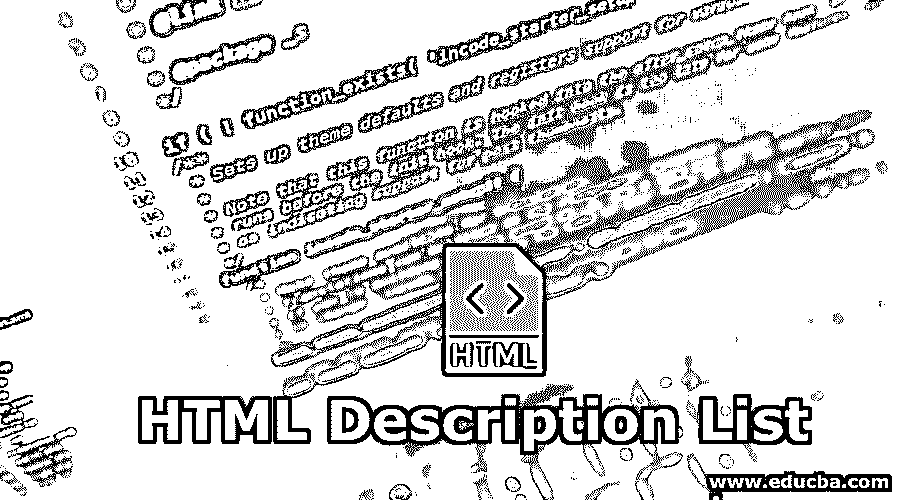
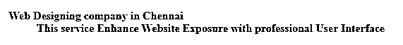
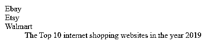
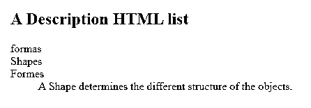
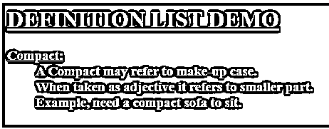
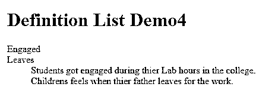
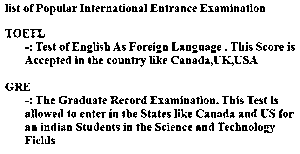
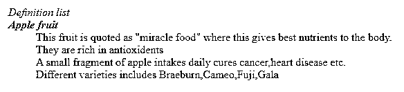

# HTML 描述列表

> 原文：<https://www.educba.com/html-description-list/>




## HTML 描述列表简介

本文描述了描述列表或定义列表，以及它在 HTML 文档中的作用。那么如何定义一个描述列表呢？简单来说，我们可以说它是一个定义列表(例如，在互联网/网页上呈现信息的词汇表)。然而，描述列表的用法较少但有一定的用途。同时，这个定义列表给网页增加了价值；例如，网页上给出的文本解释了上下文，换句话说，有助于语义标记上下文。通过这样做，我们可以很容易地提取结构化信息。定义列表是描述术语、值和另一个词汇表的完美术语。

**语法:**

<small>网页开发、编程语言、软件测试&其他</small>

```
<dl>
<dt>
……
</dt>
<dd>
………..
</dd>
</dl
```

描述列表中有三个元素，分别是

、

、

。

1.  **定义列表<dl>**——用于描述列表信息中的多个术语，形成一个外层标签。它像普通文档一样传达信息，或者经常用作术语表。
2.  **定义术语<dt>**——该元素目前已经在定义列表下使用，具有行内数据或 dl 元素的值。
3.  **定义描述<DD>**-该元素定义了该元素下的数据是块级的还是内联的。

### HTML 描述列表标签

描述列表是列表的一种类型；它们被认为是有序项目符号列表的一般形式。唯一的区别是没有项目符号图标。

**Note:** Any definition list comprises of sequence of <dt><dd> combinations/ one-to-many relationships’ combinations. These description tags are supported in HTML4 and enhanced with new terms in HTML5 as more name-value pairs. It makes an association link between question and answers.

#### 类型 1:单一定义术语和定义在一起

**例#1**

```
<!DOCTYPE html>
<html>
<body>
<dl>
<dt><b>Web Designing company in Chennai<b></dt>
<dd>This service Enhance Website Exposure with professional User Interface </dd>
</dl>
</body>
</html>
```

**输出:**




**例 2**

```
<html>
<head>
<title>Page Title</title>
<style>
body {
background-color: pink;
text-align: center;
color: blue;
font-family: Arial, italic;
}
</style>
</head>
<body>
<h1>HTML Demo 2</h1>
<p>This is Networking Protocol Abbreviation.</p>
<dl>
<dt>FTP
<dd>File Transfer Protocol
<dt>TCP/IP
<dd>Transmission Control Protocol/IP address
<dt>SNMP
<dd>Simple Network Management Protocol
</dl>
</body>
</html>
```

**输出:**
T3】


#### 类型 2:单个描述和多个术语

**例# 1**

```
<!DOCTYPE html>
<html>
<body>
<dl>
<dt> Ebay</dt>
<dt>Etsy</dt>
<dt>Walmart</dt>
<dd>The Top 10 internet shopping websites in the year 2019</dd>
</dl>
</body>
</html>
```

**输出:**




接下来，我们将在

中使用‘lang’属性，这里的术语使用不同的语言。这些属性将 ISO 语言代码作为其两个字母的值输出。

**例 2**

```
<!DOCTYPE html>
<html>
<body>
<h2>A Description HTML list</h2>
<dl lang="es">
<dt>formas</dt>
<dt lang="en-us">Shapes</dt>
<dt lang="fr">Formes</dt>
<dd>A Shape determines the different structure of the objects. </dd>
</dl>
</body>
</html>
```

**输出:**




#### 类型 3:描述多个描述的单个术语

**例子**

```
<html>
<head>
<title>DEFINITION LIST</title>
</head>
<body bgcolor=" brown" text="pink">
<h1><u>DEFINITION LIST DEMO</u></h1>
<h3>
<dl>
<dt lang="es"><u>Compact:</u></dt>
<dd>A Compact may refer to make-up case.
</dd>
<dd>When taken as adjective it refers to smaller part. Example, need a compact sofa to sit.</dd>
</dl>
<h3>
</body>
</html>
```

**输出:**




#### 类型 4:多个术语和多个描述

**例子**

```
<!DOCTYPE html>
<html lang="en">
<head>
<meta charset="UTF-8">
<meta name="viewport" content="width=device-width, initial-scale=1.1">
<title>Definition List example</title>
</head>
<body>
<h1>Definition List Demo4</h1>
<dl>
<dt> Engaged</dt>
<dt>Leaves</dt>
<dd>Students got engaged during their Lab hours in the college.</dd>
<dd>Childrens feels when their father leaves for the work.</dd>
</dl>
</body>
</html>
```

**输出:**




#### 类型 5:使用样式属性的定义列表

这里为颜色指示了样式属性，以突出显示描述术语。

**例#1**

```
<html>
<head> HTML Definition Lists </head>
<body>
<h2> list of Popular International Entrance Examination <h2>
<dl>
<dt style="color:Blue"> TOEFL </dt>
<dd> -: Test of English As Foreign Language . This Score is Accepted in the country like Canada,UK,USA</dd>
<br>
<dt style="color:Magenta"> GRE </dt>
<dd> -: The Graduate Record Examination. This Test is allowed to enter in the States like Canada and US foran indian Students in the Science and Technology Fields  </dd>
</dl>
</body>
</html>
```

**输出**:




使用<dfn>标签，可以理解附近的文本被指定为术语的定义。</dfn>

**例 2**

```
<!DOCTYPE html>
<html>
<head>
<title> Demo</title>
<dl>
<dt lang="en-GB"><dfn> Definition list</dfn></dt>
<dt><dfn><b>Apple fruit </b></dfn></dt>
<dd>This fruit is quoted as "miracle food" where this gives best nutrients to the body. They are rich in antioxidents</dd>
<dd>A small fragment of apple intakes daily cures cancer,heart disease etc.</dd>
<dd> Different varieties includes Braeburn,Cameo,Fuji,Gala </dd>
</dl>
</html>
```

**输出:**




#### 类型 6:为描述列表放置背景色

以下示例通过使用属性“bgcolor”显示了带有背景色的内容。

**例子**

```
<html>
<head>
<title>DEFINITION LIST</title>
</head>
<body bgcolor="Green" text="pink">
<h1><u>DEFINITION LIST DEMO</u></h1>
<h3>
<dl>
<dt lang="en-GB"><u>PYTHON:</u></dt>
<dd>Python is a progranning Language originally developed by Guido van. Its an Open Source and Cross-Platform. Applications include Web development, Data Machine Learning
</dd>
</dl>
<h3>
</body>
</html>
</dl>
</html>
```

**输出:**


### 结论–HTML 描述列表

我们希望这篇关于定义列表的文章，或者可以说是术语表，能够展示定义列表的一些可用用途。我们已经看到了如何利用这些技术在信息片段之间发展有用的合作的基本理解。例如，google glossary 给出了如何标记有意义的信息，以及如何在网页上以多种方式使用这些信息。他们有未来的功能，一些网站使用语义来展示他们的数据的美，并重复使用给定的信息，如此简单和灵活。

### 推荐文章

这是一个 HTML 描述列表指南。这里我们还讨论了 HTML 描述列表的介绍，它们的语法，以及不同的 HTML 描述列表标签类型。您也可以看看以下文章，了解更多信息–

1.  [HTML 颜色](https://www.educba.com/html-colors/)
2.  [HTML 事件属性](https://www.educba.com/html-event-attributes/)
3.  [HTML 布局](https://www.educba.com/html-layout/)
4.  [HTML onclick 按钮](https://www.educba.com/html-onclick-button/)


