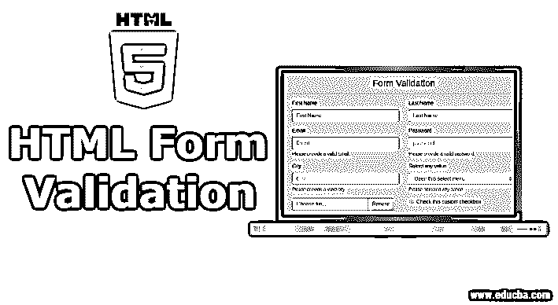
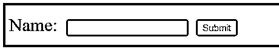
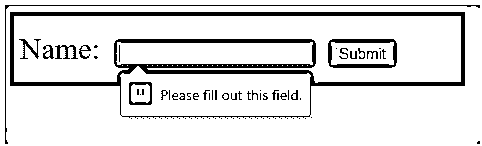
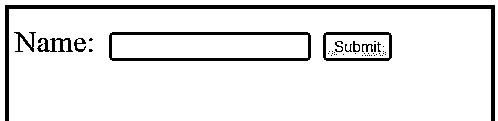
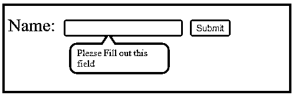

# HTML 表单验证

> 原文：<https://www.educba.com/html-form-validation/>




## HTML 表单验证概述

HTML 表单验证是检查 HTML 表单页面内容的过程，以避免将出错的数据发送到服务器。这个过程是开发基于 HTML 的 web 应用程序的重要一步，因为它可以很容易地提高网页或 web 应用程序的质量。执行 HTML 表单验证有两种方法，一种是使用 HTML5 内置功能，另一种是使用 JavaScript。

### HTML 表单验证

主要有两种方法可以执行 HTML 表单验证，

<small>网页开发、编程语言、软件测试&其他</small>

*   使用 HTML5 内置功能
*   使用 JavaScript

#### 1.使用 HTML5 内置功能

[HTML5 提供了](https://www.educba.com/what-is-html5/)这种不使用 JavaScript 的表单验证功能。表单元素将添加验证属性，这将自动为我们启用表单验证。验证属性允许我们在表单元素上指定各种规则。它们允许我们设置数据的长度，设置数据值的限制，等等。

让我们看一个使用内置表单验证元素的 HTML 表单验证的简单例子，然后将进一步使用 JavaScript 进行 HTML 表单验证。

**例子**

使用 HTML5 验证属性的表单验证——在本例中，我们将使用表单验证标记 required，这将导致该字段中的数据必须输入；否则，将不会提交该表单。下面是相同的代码片段，以及 web 表单的一些样式。

```
<!DOCTYPE html>
<html>
<head>
<style>
.formData {
padding-top: 20px;
padding-bottom: 20px;
padding-left: 10px;
background-color: darkcyan;
}
form {
font-size: 30px;
}
form input {
margin-left: 10px;
font-size: 15px;
}
</style>
</head>
<body>
<div class = "formData" >
<form action = "#" >
Name: <input type = "text" name = "name" required>
<input type = "submit" >
</form>
</div>
</body>
</html>
```

所以我们有一个非常简单的 web 表单，只有一个输入数据字段“Name”。请注意，我们在输入标记元素中使用了 required 关键字。

**输出**:




让我们尝试不在 name 字段中输入任何值就提交表单。提交时，您将得到错误消息“请填写此字段”，并且表单将不会被提交。

**输出空白数据:**




所以可以看出错误信息不是我们添加的，是 HTML 自己提供的。

像 HTML 提供的 [required 属性一样，有各种各样的表单标签可供使用。下面是一些表单验证标签的列表，](https://www.educba.com/html-required-attribute/)

*   **minlength:** 用于设置一个元素所需的最小长度
*   **maxlength:** 用于设置一个元素需要的最大长度
*   **模式:**用于定义一个[正则表达式](https://www.educba.com/regular-expression-in-python/)

#### 2.使用 JavaScript

JavaScript 广泛用于 HTML 表单验证，因为它提供了更多自定义和设置验证规则的方法；此外，HTML5 中提供的一些标记在旧版本的 Internet Explorer 中不受支持。JavaScript 被用于表单验证已经有很长时间了。

在 JavaScript 表单验证中，基本上，我们定义函数在将数据提交给服务器之前验证数据。我们可以实现实现验证规则所需的任何逻辑。JavaScript 在这方面更加灵活，因为在定义规则方面没有限制。但是与使用内置标签的表单验证相比，有必要了解实现这一点的 JavaScript。

让我们看看使用 JavaScript 进行表单验证的例子。我们将实现同样的表单示例，只有一个输入作为 name 元素。

**例子**

```
<!DOCTYPE html>
<html>
<head>
<style>
.formData {
padding-top: 20px;
padding-bottom: 20px;
padding-left: 10px;
background-color: darkcyan;
position: absolute;
width: 100%;
}
form {
font-size: 30px;
}
form input {
margin-left: 10px;
font-size: 15px;
}
.errorMessage {
background-color: white;
width: 143px;
padding-left: 10px;
padding-right: 10px;
padding-top: 5px;
padding-bottom: 5px;
margin-left: 107px;
visibility: hidden;
border-radius: 10px;
position: relative;
float: left;
}
.errorMessage.top-arrow:after {
content: " ";
position: absolute;
right: 90px;
top: -15px;
border-top: none;
border-right: 10px solid transparent;
border-left: 10px solid transparent;
border-bottom: 15px solid white;
}
</style>
</head>
<body>
<div class = "formData" >
<form name = "simpleForm" action = "#" onsubmit = "return validateForm()" >
Name: <input type = "text" name = "name">
<input type = "submit" >
</form>
<p class = "errorMessage top-arrow" > </p>
</div>
<script>
function validateForm() {
var nameVal = document.forms["simpleForm"]["name"].value;
if(nameVal == null || nameVal == "") {
document.getElementsByClassName( "errorMessage" )[0].style.visibility = "visible";
document.getElementsByClassName( "errorMessage" )[0].innerHTML = "Please Fill out this field";
return false;
} else {
return true;
}
}
</script>
</body>
</html>
```

在前面的例子中，我们已经从表单元素“name”中删除了必需的标记。相反，我们在表单元素中添加了一个关于 submit 的标签。如前所述，我们将为添加了

我们已经编写了一个名为 validateForm()的函数来进行验证。我们实现了相同的规则，即检查 name 字段中输入的数据是否为空。检查这一点的逻辑是在单击 submit 按钮时，将调用该函数，并且将检查输入的值是 null 还是空白。如果数据不为 null 或空白，函数将返回 true，但是如果数据为空白或 null，则向用户显示错误消息。

**输出:**




如果我们试图在不输入任何数据的情况下提交表单，我们应该会在屏幕上看到错误消息。从示例中可以看出，我们尽可能以同样的方式设计了错误消息。

**输出空白数据:**




### 结论- HTML 表单验证

我们已经看到了一个非常简单的客户端表单验证的例子。主要有两种方法来执行 HTML 表单验证。第一种是使用 HTML5 中提供的内置功能，第二种是使用 JavaScript。使用第一种方法，我们不需要编写额外的代码。

### 推荐文章

这是一个 HTML 表单验证的指南。在这里，我们讨论了 HTML 表单验证的概述和两种方法，通过这两种方法可以执行表单验证。您也可以看看以下文章，了解更多信息–

1.  [HTML 事件](https://www.educba.com/html-events/)
2.  [Html 版本](https://www.educba.com/versions-of-html/)
3.  [HTML5 元素](https://www.educba.com/html5-elements/)
4.  [jQuery 表单验证](https://www.educba.com/jquery-form-validation/)


