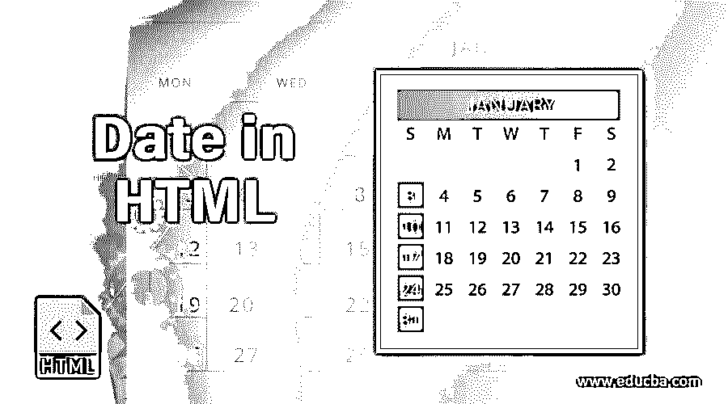
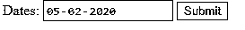
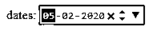
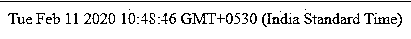

# HTML 格式的日期

> 原文：<https://www.educba.com/date-in-html/>




## HTML 中的日期简介

在 HTML 中，我们可以很容易地在 web 表单中找到一些字段，比如时间、日期字段。我们已经在预订系统中使用了这些字段，如在线订票、订单预订等。大多数情况下，我们在一些脚本语言中使用公共字段，如“日期”,如使用日期选择器函数的 javascript。它主要是用于日历的[用于选择日期进入文本框列的](https://www.educba.com/calendar-in-asp-net/)。[在 html5 中，我们](https://www.educba.com/what-is-html5/)选择了一些特定的浏览器，如 opera 和 google chrome 版本，它们完全支持用户浏览器屏幕。有时，html5 版本接受使用有效日期和时间格式的文本框列，如日期值。

****语法:****

<small>网页开发、编程语言、软件测试&其他</small>

一般来说，我们有一些遵循 HTML dtd 模型的语法，以便根据用户要求正确显示网页。

```
<html>
<body>
<input type="date" id="1" name="first" value="yyyy-month-date">
-----some codes---
</body>
</html>
```

以上代码是网页中带有日期格式字段的基本 HTML 代码。标签是 HTML 中的标签之一，用于创建输入字段，如用户输入或网页的定制输入。

### Html 中日期的特性

[日期输入类型是表单元素](https://www.educba.com/html-form-elements/)；它允许用户使用日期选择器从用户屏幕上捕捉数据。使用日期选择器的实现取决于浏览器等供应商，但是没有任何供应商指定 html5 如何在屏幕上实现用户输入。我们可以使用<标签>标签在浏览器中使用它的任何属性来声明名称；我们可以在最小和最大格式属性中指定日期值，如 min 和 max，但是用户应该知道范围内的特定日期。

我们还可以指定一些属性，比如一天一步的格式，来验证日期是如何递增的。默认值为 1。我们还可以验证浏览器对日期输入类型的支持。同样，HTML 的每个标签和属性都有一些特性；某些日期对于 HTML 中的输入类型有一些特性。

#### 输入字段

它是 HTML 中的一种输入类型，将被视为没有特定格式和特殊交互的简单文本字段，但 firefox 或 Safari 浏览器将支持此功能。在微软，edge 浏览器没有特殊的功能或交互，即使输入字段在用户浏览器屏幕上显示为只读格式。与 chrome 和 opera 一样，其他一些浏览器也有相同类型的实现，这些实现将显示在日期占位符中，值将在用户浏览器屏幕应用程序中设置，使用一些系统设置，如日期格式等。在应用程序中，通常会为用户设置一些控件，以允许清晰的输入文本字段和一些其他格式，如箭头，以在值之间上下循环，并使用将被选取的箭头。还有一些其他 web 引擎，如“WebKit 前缀伪选择器”工具，用于允许更改浏览器屏幕中出现的视图。

#### 最小和最大属性

所有浏览器都支持使用最小和最大属性的输入类型，如日期。当我们使用 chrome 和 opera 浏览器时，它将支持那些启用设置的属性，但如果用户只设置了一个属性的值，前端屏幕将无法正常显示。这些浏览器将支持日期输入类型，支持使用向上和向下箭头来更改使用 d-m-year 等格式的文本框中的值。如果日期具有在日期、月份、年份格式中设置的最小值输入(例如，今天的日期)，如果指定用户在年份侧突出显示光标，然后单击向下箭头，则年份将自动变为值列表，该列表将在列表框中的箭头循环中显示其所需的有效值，如果没有设置最大值，将使用默认值。当我们使用像 android 这样的移动应用程序时，它会改变日期选择器中的值。

#### 约会挑选者

它是 HTML 中最重要的输入类型之一；它会给用户输入具有日期格式的内容。甚至我们使用 chrome 和 opera 这样的浏览器来满足用户桌面上的日期选择器条件，但是 CSS 这样的样式并不满足条件。在网页上看起来很正常；当我们在文档中使用一些 CSS 样式元素时，它会根据用户的感觉调整和设计视图。我们也可以在用户浏览器中禁用日期选择器；如果我们想启用和实现我们自己的，我们将在网络上做，但移动设备将有一些限制访问。

### HTML 中的日期示例

以下是 HTML 中日期的不同例子。

#### 示例#1

**代码:**

```
<html>
<body>
<form action="sample.html">
Dates: <input type="date" name="first">
<input type="submit">
</form>
</body>
</html>
```

**输出:**




#### 实施例 2

**代码:**

```
<html>
<head>
<style>
sample {
display: block;
font: 3rem;
}
sample2 {
margin: .7rem 2;
}
</style>
</head>
<body>
<div class="sample">
<label for="first">dates:</label>
<input type="date" id="names" name="first"
value="2020-02-26"
min="2020-01-01" max="2020-12-31">
</div>
</body>
</html>
```

**输出:**




#### 实施例 3

**代码:**

```
<html>
<body>
<p id="sample"></p>
<script>
var dates = new Date();
document.getElementById("sample").innerHTML = dates;
</script>
</body>
</html>
```

****输出:****




前两个示例将使用标签和文本框在网页中显示日期内容。最后一个示例将使用 javascript 函数自动调用截止日期的日期函数；如果我们在函数中使用一些其他样式，我们用它来突出显示网页。当我们使用其他一些名为 jquery 等的库时，我们将使用日期函数作为 mm-dd-yy 或 dd-mm-yy 或 yy-mm-dd 或 yy-dd-mm，这是基于用户要求的格式。库既用于用户端(前端)，也用于后端。

### 结论

在 HTML 中，自定义输入元素将使用称为“日期”的日期类型。它将在文本框或其他一些称为“日期选择器”的功能中创建作为日期格式的用户输入。如果我们使用文本框，它需要一些验证，无论给定的日期是否是有效的格式，它还会检查浏览器的兼容性，但在日期选择器中，不需要验证，只需在 HTML 代码中使用即可。

### 推荐文章

这是一份最新的 HTML 指南。这里我们讨论 HTML 中的 Date 的介绍和特性，以及不同的例子和代码实现。您也可以阅读以下文章，了解更多信息——

1.  [HTML 布局](https://www.educba.com/html-layout/)
2.  [HTML 样本标签](https://www.educba.com/html-samp-tag/)
3.  [html 中的 SUP 标签](https://www.educba.com/sup-tag-in-html/)
4.  [HTML 居中对齐](https://www.educba.com/html-align-center/)


