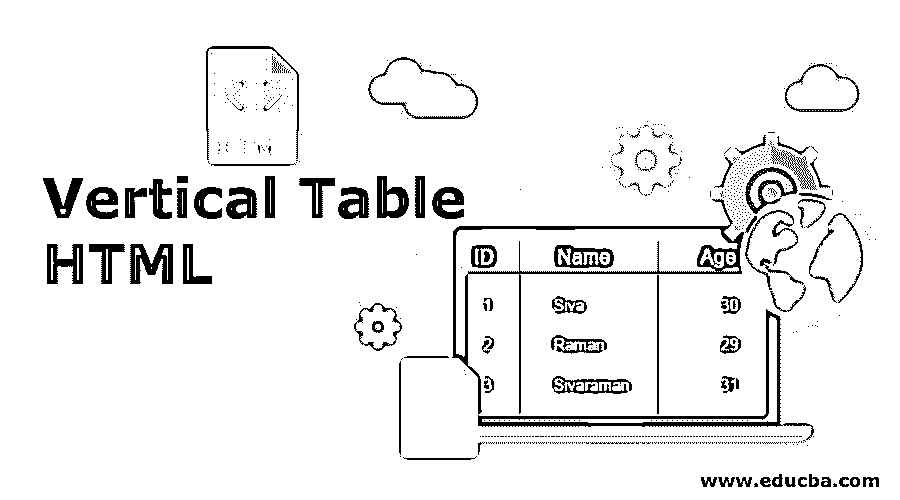
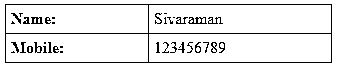
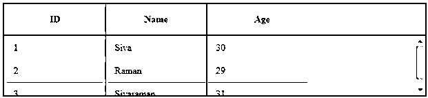
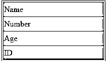
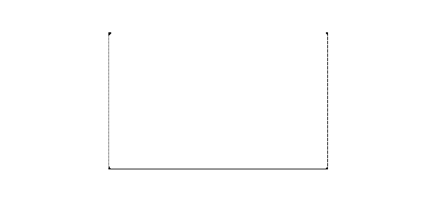

# 垂直表格 HTML

> 原文：<https://www.educba.com/vertical-table-html/>




## 垂直表格 HTML 简介

下面的文章提供了垂直表格 HTML 的概要。在 HTML 表中，每个新记录都以行和列的形式插入到数据库中。在 DB 中，行被认为是水平的，列是垂直的。HTML 表格实际上是用来为 Bootstrap 这样的[框架提供信息的；我们能够轻松地增强桌子的外观和感觉。表格用于大多数应用程序，如网络、桌面或移动应用程序；向最终用户提供信息也很重要。使用 bootstrap 框架和许多其他特性来为不同的元素(如表格)提供样式和优化表示的功能。](https://www.educba.com/what-is-bootstrap/)

### 如何在 HTML 中创建垂直表格？

一般来说，我们已经借助于、、指定了行，

| 、 | The tag creates a table. because |
| A table title is specified, | The value in HTML is specified. We have seen some examples below: |

<small>网页开发、编程语言、软件测试&其他</small>

#### 示例 **#1**

**代码:**

```
<!DOCTYPE html>
<html>
<head>
<style>
table, th, td {
border: 1px solid black;
border-collapse: collapse;
}
th, td {
padding: 5px;
text-align: left;
}
</style>
</head>
<body>
<table style="width:75%">
<tr>
<th>Name:</th>
<td>Sivaraman</td>
</tr>
<tr>
<th>Mobile:</th>
<td>123456789</td>
</tr>
<tr>
</table>
</body>
</html>
```

**输出:**




在上面的例子中，我们看到两个标题显示在垂直的一边；它们以列格式显示。这是 HTML 表格中垂直数据显示的基本例子之一。

#### 实施例 2

**代码:**

```
<html>
<head>
<style>
table {
border-collapse: collapse;
}
th,
td {
border: 1px solid #c6c7cc;
padding: 10px 15px;
}
th {
font-weight: bold;
}
table.scroll {
width: 716px; /* 140px * 5 column + 16px scrollbar width */
border-spacing: 0;
border: 2px solid black;
}
table.scroll tbody,
table.scroll thead tr { display: block; }
table.scroll tbody {
height: 100px;
overflow-y: auto;
overflow-x: hidden;
}
table.scroll tbody td,
table.scroll thead th {
width: 140px;
border-right: 1px solid black;
}
table.scroll thead th:last-child {
width: 156px; /* 140px + 16px scrollbar width */
}
thead tr th {
height: 30px;
line-height: 30px;
/*text-align: left;*/
}
tbody { border-top: 2px solid black; }
tbody td:last-child, thead th:last-child {
border-right: none !important;
}
</style>
</head>
<table class="scroll">
<thead>
<tr>
<th scope="col" colspan="1">ID</th>
<th scope="col">Name</th>
<th scope="col">Age</th>
</tr>
</thead>
<tbody>
<tr>
<td>1</td>
<td>Siva</td>
<td>30</td>
</tr>
<tr>
<td>2</td>
<td>Raman</td>
<td>29</td>
</tr>
<tr>
<td>3</td>
<td>Sivaraman</td>
<td>31</td>
</tr>
</tbody>
</table>
</html>
```

**输出:**




在上面的例子中，我们将使用滚动选项。默认情况下，为表格数据启用垂直滚动选项。如果需要，我们还启用了水平滚动选项。

#### 实施例 3

**代码:**

```
<style>
table { border-collapse: separate; line-height:25px; }
tr { display: block; float: left; width:200px;}
th,  td { display: block; }
</style>
<form >
<table border="1" class="variant-table" >
<tr>
<td style="background-color: #53B3AE;">Name</td>
<td style="background-color: #53B3AE;">Number</td>
<td style="background-color: #53B3AE;">Age</td>
<td style="background-color: #53B3AE;">ID</td>
</tr>
</table>
</form>
```

**输出:**




在上面的例子中，我们使用背景色样式突出显示了列。我们也使用前景色来突出显示需要的部分。

### 不同部分的表格

我们还在 HTML 表格中使用了一组不同的表格格式。在上面的例子中，我们使用了垂直表格对齐的基础；我们为突出显示的表格设置了不同的格式:

**边框和规则:**使用边框，它将突出显示表格周围的框架。

```
<TABLE border="1"
summary="Welcome to My Domain.">
<CAPTION>IT</CAPTION>
<TR>
<TH>Name</TH>
<TH>Age</TH>
<TH>Number</TH>
<TR>
<TD>Sivaraman</TD>
<TD>30</TD>
<TD>8220244056</TD>
<TR>
<TD>Raman</TD>
<TD>31</TD>
<TD>123456789</TD>
</TABLE>
```


我们已经看到了上述例子的边界；这是一条被统治的边界。我们也使用一些其他的边界，如虚线等。

### 如何在 HTML 中将图片垂直居中？

我们也为 HTML 垂直对齐图像；使用 [CSS 样式](https://www.educba.com/what-is-css/)，我们必须在样式标签中分配[设置，我们以垂直模式显示图像。](https://www.educba.com/style-tag-in-html/)

**代码:**

```
<html>
<body bgcolor="#ffffff">
<center>
<table width="100%" height="100%" bgcolor="#a3ddc4">
<tr>
<td align="center">
<table width="800" height="500" bgcolor="#ff6f6f">
<tr>
<td>&nbsp;</td>
</tr>
</table>
</td>
</tr>
</table>
<!-- For Internet Explorer 3-->
<center>
</body>
</html>
```

**输出:**




上述示例显示图像处于垂直模式；如果需要，我们还会改变方向。与水平模式相比，使用垂直模式将减少空间，并且页面的其他内容显示在单个页面中。外部 Html 表格使网页浏览器区域，除了边框，一个 HTML 表格，整个区域将是 HTML 表格单元格。

外部和内部 HTML 表格单元格继承默认值，用于对齐父表行和子表行的属性。它还使用标记在外部 HTML 表中使用 valign 属性的默认值，甚至有时 body 标记也不使用，并且时间值在中间，因此如果外部 HTML 表的单元格内被阻止的内容将自动对齐，在 web 浏览器区域垂直居中。

使用 HTML 表格单元格的<align center="">使其中的一块内容在 web 浏览器区域中水平居中，内部表格是 HTML 表格单元格的另一种类型，它构成了一个给定大小的框，正如我们在前面的示例中提到的，图像在一定范围内显示，一些浏览器不接受页面本身的图像方向。</align>

如果我们对 HTML 使用内部表格，它就是外部 HTML 表格单元格内部的表格。它不能设置表格的高度和宽度。然后，无论我们设置什么尺寸，大小都会自动调整以适应内容。如果宽度和高度较大，则意味着网页浏览器区域会自动显示在中央。

在上面的例子中，有时它会突出显示标签，这样它就不会在 IE 版本 3 中显示图像。尽管我们也在 HTML 表中设置了浏览器兼容性。

### 结论

在 HTML 表格中，我们已经组织了数据，我们知道如何在 HTML 中对表格数据进行语义布局，并使用 CSS 样式来制定计划[。我们还使用了 bootstrap 函数、使用 Javascript 的 Jquery 库来突出显示和改变表的顺序。如果我们不得不](https://www.educba.com/what-is-css/)[使用 Jquery 插件](https://www.educba.com/uses-of-jquery/)，它有许多表格的高级功能，比如如果你将光标放在表格单元格中，它会自动高亮显示颜色。同样，如果我们使用一些高级概念，它可能会改变表格格式并对齐数据。

### 推荐文章

这是一个垂直表格 HTML 的指南。在这里，我们讨论基本的概念，并在 HTML 中创建一个垂直表格中的中心图像。您也可以看看以下文章，了解更多信息–

1.  [HTML 中的下拉列表](https://www.educba.com/dropdown-list-in-html/)
2.  [HTML 表格中的滚动条](https://www.educba.com/scrollbar-in-html-table/)
3.  [HTML 中的表格边框](https://www.educba.com/table-border-in-html/)
4.  [HTML 中的 THead 标签](https://www.educba.com/thead-tag-in-html/)


