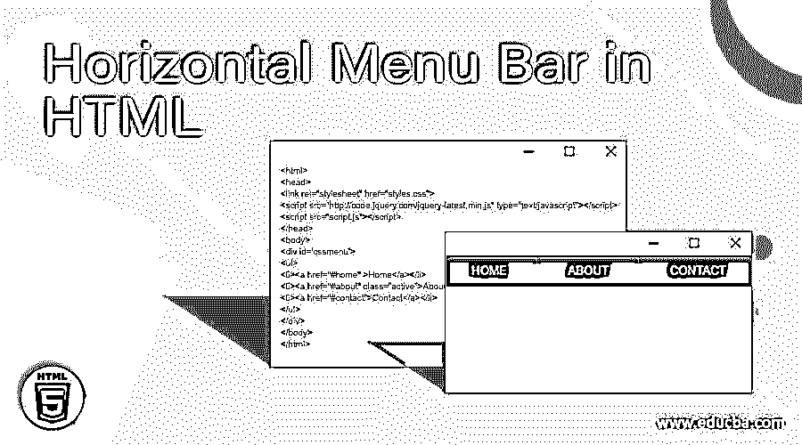
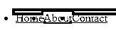
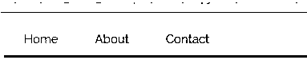

# HTML 中的水平菜单栏

> 原文：<https://www.educba.com/horizontal-menu-bar-in-html/>




## HTML 中水平菜单栏的介绍

在 Html 中，我们有一套不同的特性，用于突出显示和对用户端更有吸引力。我们已经在上一篇文章中讨论了滚动条，菜单栏中同样的东西也有更多的功能提供给用户。通常，菜单栏有助于对内容进行分类，并增加网页的可读性。以最简单的方式在用户端菜单栏中获得更多的交互性。滚动条有水平和垂直两种类型，就像菜单栏一样，也是开发者必须使用的东西。我们将在下面的概念中看到更多的细节。

**语法:**

<small>网页开发、编程语言、软件测试&其他</small>

当使用水平/垂直菜单栏时，我们必须使用 CSS 来反映 HTML 页面所有部分的样式。通常，导航条需要一些标准的 HTML 作为实现子文档或子文档的基础。导航栏或水平栏基本上有一个链接列表，所以使用

*   and

```
<style>
ul{
}
li variablename:hover{
}
</style>
<body>
<ul>
<li>
</li>
</ul>
</body>
```

上面的代码是水平菜单栏的基本语法。

### HTML 中水平菜单栏的示例

为了更好地理解这些概念，我们已经看到了一些例子。

#### 示例#1

**代码:**

```
<html>
<head>
<style>
ul {
margin: 5;
padding: 5;
background-color: green;
}
li {
float: left;
}
li v {
color: white;
text-align: center;
padding: 5;
}
li v:hover {
background-color: #111;
}
.active {
background-color: green;
}
</style>
</head>
<body>
<ul>
<li><a href="#home" class="active">Home</a></li>
<li><a href="#about">About</a></li>
<li><a href="#contact">Contact</a></li>
</ul>
</body>
</html>
```

**样本输出:**


在上面的例子中，当我们创建网页时，我们将在水平视图中显示菜单项。通常，我们将在水平面板中只看到菜单项，因为这里的用户自定义视图是按行显示的，所以我们将使用水平显示。相同的 CSS 样式类可用于所有的 HTML 文档。

#### 实施例 2

**代码:**

```
<html>
<body>
<p style="font-family:Comic Sans MS">
<a href="#home">Home</a>
<a href="#about">About</a>
<a href="#contact">Contact</a>
</p>
</body>
</html>
```

**样本输出:**


第二个例子和第一个一样，但是这里我们不会在 HTML 文档中使用任何 CSS 样式。我们将使用一些 CSS 样式，如字体系列、宽度、高度等

#### 实施例 3

**代码:**

```
<html>
<head>
<style>
ul {
margin: 5;
padding: 5;
background-color: #333;
}
li {
float: left;
}
li v {
color: white;
text-align: center;
padding: 5;
}
li v:hover:not(.active) {
background-color: #111;
}
.active {
background-color: #4CAF50;
}
</style>
</head>
<body>
<ul>
<li><a href="#home" >Home</a></li>
<li><a href="#about" class="active">About</a></li>
<li><a href="#contact">Contact</a></li>
</ul>
</body>
</html>
```

**样本输出:**




**一些免费的水平菜单类型:**

每个特性都是针对不同场景的一些集合。水平菜单中的一些东西是纯 CSS，此外，他们将使用 javascript 来确保他们的响应和移动工作。

一些水平导航运行良好，一些功能在脚本中不受支持，还有浏览器兼容性问题。在网站设计中，水平栏是极简外观的绝佳选择，也能给用户一个简单的导航界面空间。

**橙色水平导航菜单:**

它是水平菜单中的一种，这是一个轻量级的极简菜单，具有完全纯 CSS 风格。该菜单还响应并转换成移动设备上的垂直菜单类型，支持观看小屏幕以使用移动设备。在桌面上，他们不会改变任何东西，它只会在网络浏览器屏幕上工作，在手机上也一样。

**举例:**

```
<html>
<head>
<link rel="stylesheet" href="styles.css">
<script src="http://code.jquery.com/jquery-latest.min.js" type="text/javascript"></script>
<script src="script.js"></script>
</head>
<body>
<div id='cssmenu'>
<ul>
<li><a href="#home" >Home</a></li>
<li><a href="#about" class="active">About</a></li>
<li><a href="#contact">Contact</a></li>
</ul>
</div>
</body>
</html>
```

**输出:**


**绿色选项卡式水平菜单类型:**

该菜单是选项卡式界面中水平面板的设计模式之一。它将使用庞大而昂贵的应用程序，如采购/销售产品商品应用程序。它将有助于最终用户快速轻松地单击不同的菜单项，以从数据库中获得结果给用户。在上面的类型中，我们将使用一些像 jquery 这样的脚本，但是这里我们将只使用 HTML 和 CSS，这样它就可以快速地将数据加载到用户屏幕上。让我们举上一个话题中的同一个例子

**举例:**

```
<html>
<head>
<link rel="stylesheet" href="styles.css">
<script src="http://code.jquery.com/jquery-latest.min.js" type="text/javascript"></script>
<script src="script.js"></script>
</head>
<body>
<div id='cssmenu'>
<ul>
<li><a href="#home" >Home</a></li>
<li><a href="#about" class="active">About</a></li>
<li><a href="#contact">Contact</a></li>
</ul>
</div>
</body>
</html>
```

**输出:**




同样的例子，我们已经采取了，但一些 CSS 样式，我们已经修改和更新了 HTML 文件。每当我们将鼠标光标放在选项卡中时，它会自动突出显示所提到的绿色文本，因此当鼠标光标移动到另一个选项卡时，它会根据用户的选择而改变。

**气泡包装在横条:**

在这个菜单栏中，和前面的类型一样，我们将在 HTML 中使用 CSS 样式。此外，我们将添加边界半径属性应启用，然后它将看起来像气泡类型。我们将看到具有不同 CSS 样式的同一个示例，输出如下所示。

**举例:**

```
<html>
<head>
<link rel="stylesheet" href="styles.css">
<script src="http://code.jquery.com/jquery-latest.min.js" type="text/javascript"></script>
<script src="script.js"></script>
</head>
<body>
<div id='cssmenu'>
<ul>
<li><a href="#home" >Home</a></li>
<li><a href="#about" class="active">About</a></li>
<li><a href="#contact">Contact</a></li>
</ul>
</div>
</body>
</html>
```

**输出:**


我们在前面的水平类型中讨论了一些示例，但是另外，我们在样式表中添加了边框半径。

### 结论

最后，我们结束了本次会议，就像我们在以前的主题中讨论的那样，每个 HTML 概念都有更多的附加功能，这将取决于版本。以及从一个版本到另一个版本的浏览器兼容性问题。在上面的水平菜单栏中，不仅有上面的概念，它还会有更多的概念，同样的水平菜单带有纹理标签，如果我们需要，我们还使用 jquery 插件来进一步吸引用户的功能。如果我们不在网页输出中使用 chrome 浏览器，那么我们可以在 CSS 样式中添加选项卡和蓝屏类型。与 HTML 相比，jquery 插件有一些额外的特性。

### 推荐文章

这是一个 HTML 水平菜单栏的指南。在这里，我们讨论的介绍，语法，代码实现的例子。您也可以看看以下文章，了解更多信息–

1.  [HTML 对象标签](https://www.educba.com/html-object-tag/)
2.  [HTML 中的 href 标签](https://www.educba.com/href-tag-in-html/)
3.  [HTML 重置按钮](https://www.educba.com/html-reset-button/)
4.  [HTML 音频标签](https://www.educba.com/html-audio-tag/)


